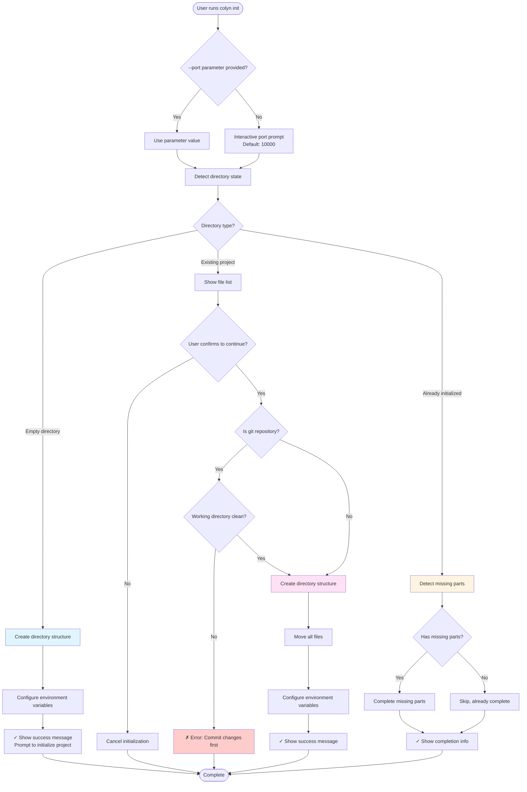
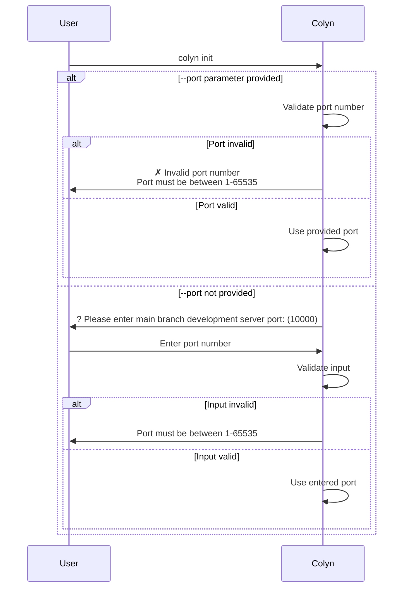
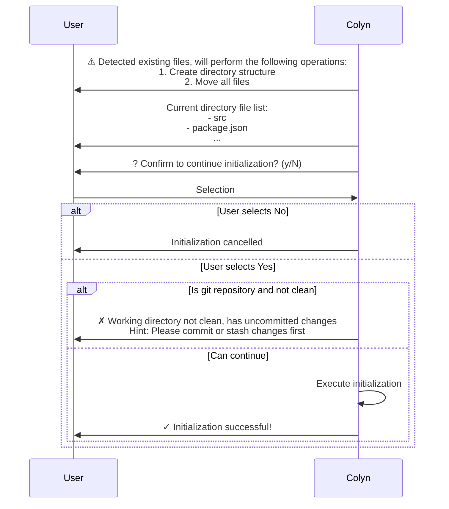
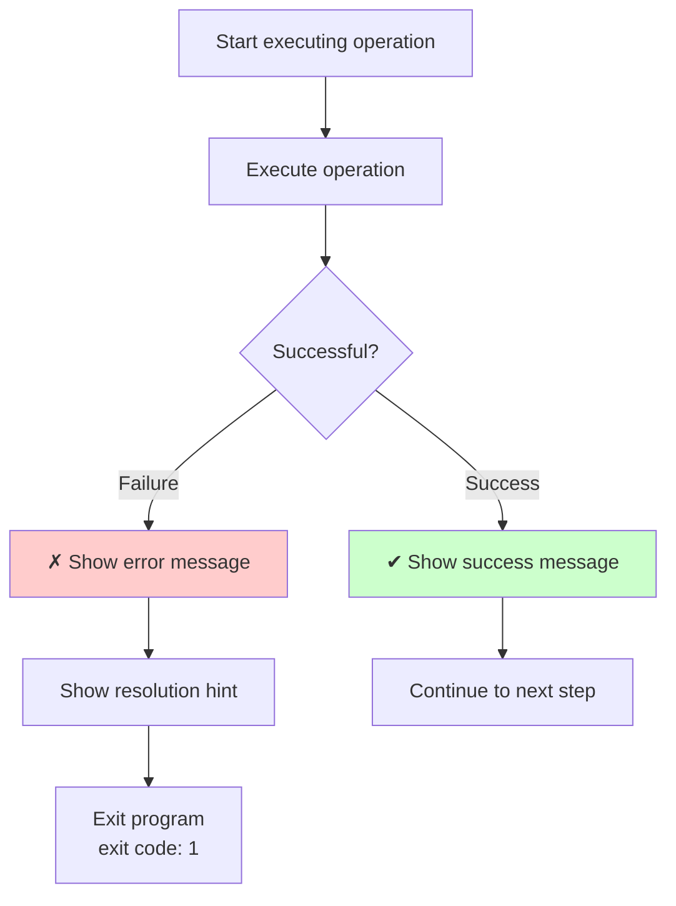
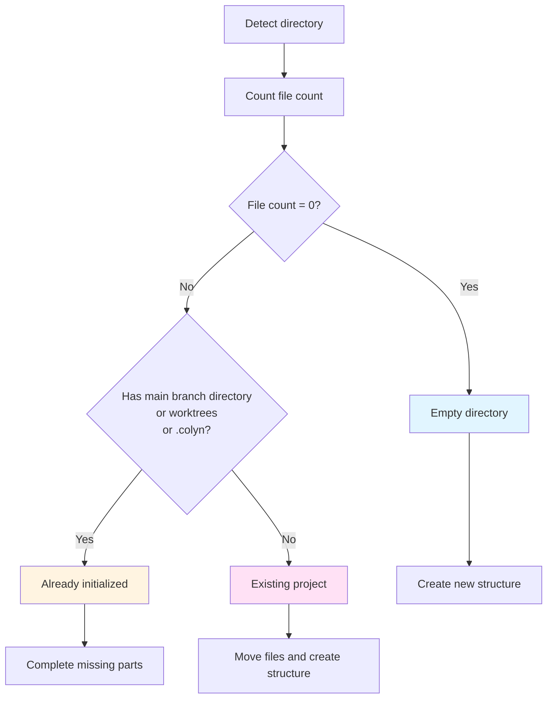
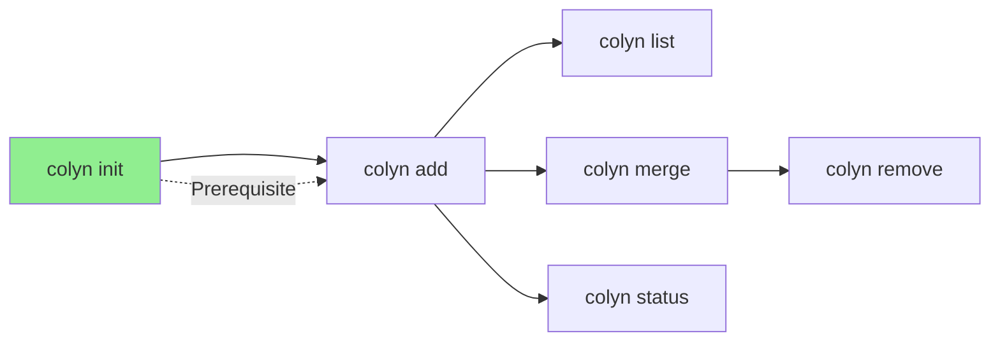

# Init Command Design Document (User Interaction Perspective)

**Created**: 2026-01-14
**Last Updated**: 2026-01-15
**Command Name**: `colyn init`
**Status**: Implemented

---

## 1. Command Overview

### 1.1 User Goal

Users want to convert an existing project to a Colyn project structure that supports parallel development, or create a Colyn project in a new directory.

### 1.2 Command Usage

```bash
# Interactive port prompt (recommended)
colyn init

# Specify port directly
colyn init --port 10000
colyn init -p 3000
```

### 1.3 Execution Result

After execution, project directory will be reorganized to the following structure:

```
project-root/
├── project-name/      # Main branch directory (original files are here)
│   ├── .env.local    # PORT=10000, WORKTREE=main
│   ├── .gitignore    # Contains .env.local rule
│   └── ...           # All original project files
├── worktrees/        # Future worktree directory
└── .colyn/           # Colyn configuration directory
    └── config.json   # Project configuration file
```

---

## 2. User Scenarios

`colyn init` intelligently recognizes three different directory states and takes different approaches.

### 2.1 Scenario 1: Empty Directory

**User Situation**: Running `colyn init` in a completely empty directory

**System Behavior**:
1. Create basic directory structure (main branch directory, worktrees, config directory)
2. Configure environment variable file
3. Prompt user to initialize project in main branch directory

**User Sees**:

```
✔ Creating directory structure
✔ Environment variables configured
✔ .gitignore configured
✔ Configuration file saved

✓ Initialization successful!

Directory structure:
  .
  ├── my-project/          # Main branch directory (please initialize project here)
  ├── worktrees/           # Worktree directory
  └── .colyn/              # Configuration directory

Next steps:
  1. Enter main branch directory:
     cd my-project

  2. Initialize git repository (if not already):
     git init

  3. Initialize your project (e.g., npm/yarn init)

  4. Create worktree:
     colyn add <branch-name>
```

---

### 2.2 Scenario 2: Existing Project

**User Situation**: Running `colyn init` in a directory containing project files

**System Behavior**:
1. Display current file list
2. Ask user for confirmation (explain that all files will be moved)
3. If git repository, check if working directory is clean
4. Create directory structure and move files
5. Configure environment variables

**User Sees**:

```
⚠ Detected existing files, will perform the following operations:
  1. Create main branch directory and worktrees directory
  2. Move all files in current directory to my-project/ directory

Current directory file list:
  - src
  - package.json
  - tsconfig.json
  - .git
  - README.md
  ... and 15 more files

? Confirm to continue initialization? (y/N) › No
```

**After User Selects Yes**:

```
✔ Creating directory structure
✔ Moving project files
✔ Environment variables configured
✔ .gitignore configured
✔ Configuration file saved

✓ Initialization successful!

Configuration info:
  Main branch: main
  Port: 10000

Next steps:
  1. Create worktree:
     colyn add <branch-name>

  2. View worktree list:
     colyn list
```

---

### 2.3 Scenario 3: Already Initialized (Completion Mode)

**User Situation**: Running `colyn init` again in an already initialized directory

**System Behavior**:
1. Detect missing parts
2. Complete missing directories or configurations
3. If everything is complete, prompt no action needed

**User Sees (Has Missing Parts)**:

```
⚠ Detected already initialized, entering completion mode...

✔ Creating worktrees directory
✔ Checking and updating configuration file
✔ Checking and configuring .env.local
✔ Checking and configuring .gitignore

✓ Completion done!
```

**User Sees (Nothing Missing)**:

```
⚠ Detected already initialized, entering completion mode...

✓ Completion done!

All configurations are complete, no completion needed.
```

---

## 3. User Interaction Flow

### 3.1 Overall Flow Diagram



### 3.2 Port Configuration Interaction



### 3.3 Existing Project Confirmation Flow



---

## 4. Input and Output

### 4.1 User Input

| Input | Method | Required | Default | Validation Rules |
|-------|--------|----------|---------|------------------|
| Port number | `--port` parameter or interactive input | Yes | 10000 | Integer between 1-65535 |
| Confirm continue (for existing project) | Interactive selection | Yes | No | Yes/No |

### 4.2 System Output

**Progress Info** (using spinner):
- ✔ Creating directory structure
- ✔ Moving project files
- ✔ Environment variables configured
- ✔ .gitignore configured
- ✔ Configuration file saved

**Success Info**:
- Directory structure description
- Configuration info (main branch, port)
- Next step suggestions

**Error Info** (see Section 5)

---

## 5. Error Handling

### 5.1 Common Errors and Solutions

| Error Scenario | User Sees | How to Resolve |
|----------------|-----------|----------------|
| Working directory not clean<br/>(has uncommitted changes) | ✗ Working directory not clean, has uncommitted changes<br/>Hint: Please commit or stash changes before running init command | Run `git add .` and `git commit` to commit changes,<br/>or run `git stash` to stash changes |
| Directory name conflict<br/>(main branch directory name already used by file) | ✗ Main branch directory name "my-project" conflicts with existing file<br/>Hint: Please rename that file before running init command | Rename or delete file with same name as main branch directory |
| Invalid port number | ✗ Invalid port number<br/>Hint: Port must be between 1-65535 | Enter port number between 1-65535 |
| File move failed | ✗ Error occurred while moving files<br/>Hint: Please check file permissions or manually restore directory structure | Check file permissions, manually operate if necessary |

### 5.2 Error Handling Flow



**Important**: Operations won't auto-rollback on failure, user needs to manually recover based on hints.

---

## 6. Directory State Detection Logic

How system determines which type a directory belongs to:



### 6.1 Detection Criteria

| Directory Type | Criteria | Description |
|----------------|----------|-------------|
| Empty directory | No files (including hidden files) | Completely empty directory |
| Already initialized | Has main branch directory, worktrees, or .colyn | Already ran `colyn init` |
| Existing project | Has files but doesn't match above two | Regular project directory |

---

## 7. Project State After Success

### 7.1 Directory Structure

```
my-project/                 # Project root directory
├── my-project/             # Main branch directory
│   ├── .git/              # Git repository (if git project)
│   ├── src/               # Source code
│   ├── .env.local         # Environment variables: PORT=10000, WORKTREE=main
│   ├── .gitignore         # Contains .env.local ignore rule
│   └── ...                # Other project files
├── worktrees/             # Worktree directory (initially empty)
└── .colyn/                # Colyn configuration directory (project identifier only)
```

### 7.2 Data Sources

Project info obtained dynamically from filesystem, no config file needed:

| Data | Source |
|------|--------|
| Main branch name | `git branch --show-current` in main branch directory |
| Main port | `PORT` in main branch directory's `.env.local` |
| Next Worktree ID | Scan `worktrees/task-*` directories, take max ID + 1 |
| Worktree list | `git worktree list` + `.env.local` in each directory |

**`my-project/.env.local`**:
```env
# Environment variables for this worktree
# Auto-generated by colyn

PORT=10000
WORKTREE=main
```

### 7.3 What User Can Do

After successful initialization, user can:

1. **Create worktree**:
   ```bash
   colyn add feature/login
   ```

2. **View worktree list**:
   ```bash
   colyn list
   ```

3. **Develop in main branch directory**:
   ```bash
   cd my-project
   npm run dev  # Port will be 10000
   ```

---

## 8. Special Case Handling

### 8.1 Main Branch Name Detection

- If git repository: Use current branch name as main branch name
- If not git repository or detection fails: Default to "main"

### 8.2 Environment Variable Smart Merge

If main branch directory already has `.env.local` file:

**Original Content**:
```env
# My custom env
API_URL=http://localhost:3000
DEBUG=true
```

**After Merge**:
```env
# My custom env
API_URL=http://localhost:3000
DEBUG=true

# Environment variables for this worktree
# Auto-generated by colyn

PORT=10000
WORKTREE=main
```

**Rules**:
- Preserve all original content and comments
- Add Colyn-required environment variables at the end
- If PORT or WORKTREE already exists, update their values

### 8.3 .gitignore Smart Update

Check if ignore rule already exists:
- If contains `.env.local`: Skip
- If contains `*.local`: Skip (broader rule)
- Neither: Add `.env.local` ignore rule

---

## 9. User Experience Highlights

### 9.1 Clear Progress Prompts

Use spinner to show real-time progress of each step, letting user know what's happening.

### 9.2 Safe Confirmation Mechanism

Before executing destructive operations (moving files), must:
1. Show operations to be performed
2. Show affected files
3. Ask user for confirmation
4. Default to "No", requires user to actively confirm

### 9.3 Detailed Error Prompts

Error messages include:
- What exactly the error is
- Why it happened
- How to resolve

### 9.4 Next Step Suggestions

After success, clearly tell user:
- What they can do
- How to do it
- Provide specific command examples

---

## 10. Relationship with Other Commands



**Notes**:
- `init` is prerequisite for all other commands
- Only after initialization can worktrees be created (`add`)
- After creating worktrees, other management commands can be used

---

## 11. FAQ

### Q1: Where are my original files after initialization?

A: All files are in the main branch directory (directory with same name as project). For example, if project is called "my-project", files are in `my-project/my-project/`.

### Q2: Can I initialize in an existing project?

A: Yes. System will move all files to main branch directory. If it's a git repository, must commit or stash all changes first.

### Q3: What if initialization fails?

A: System won't auto-rollback, manually recover based on error hints or re-run. In most cases, you can directly re-run `colyn init`.

### Q4: Can I modify port configuration?

A: Yes, directly edit `PORT` value in main branch directory's `.env.local`. Since config info is obtained dynamically from filesystem, changes take effect immediately.

### Q5: Will completion mode overwrite my configuration?

A: No. Completion mode only adds missing parts, won't overwrite existing configuration. Environment variables are smartly merged, preserving original content.

---

## 12. Summary

`colyn init` command design highlights:

1. **Intelligent Recognition**: Auto-recognize three directory states, take different strategies
2. **Safety First**: Destructive operations require user confirmation
3. **Clear Feedback**: Each step has clear progress and result prompts
4. **Fault Tolerance**: Detailed error messages and resolution suggestions
5. **User Friendly**: Provide next step suggestions and FAQ
