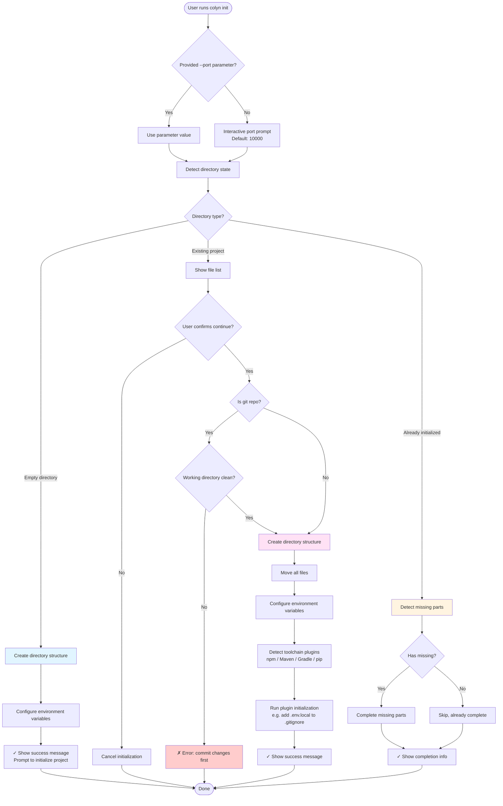
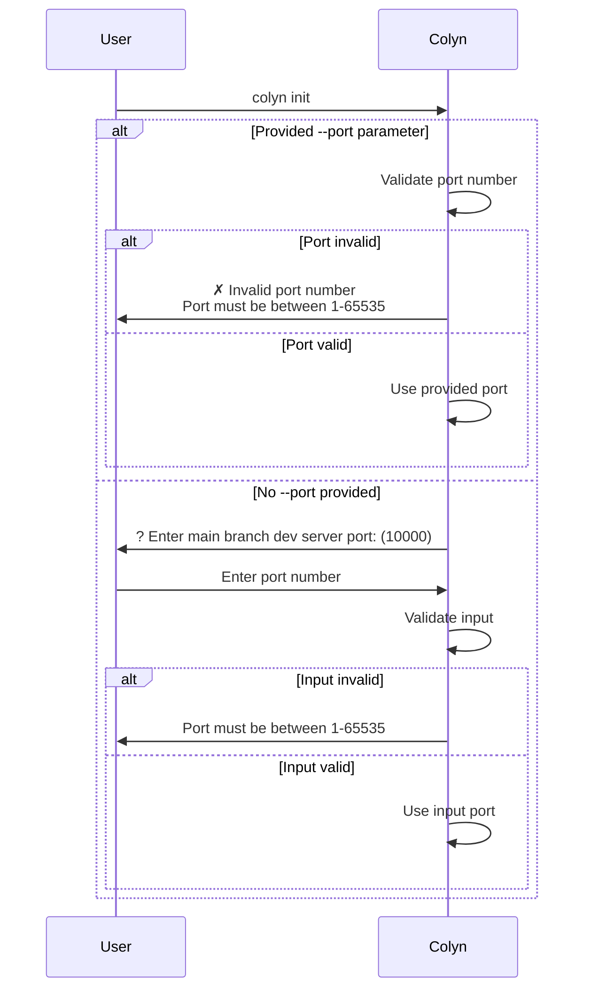
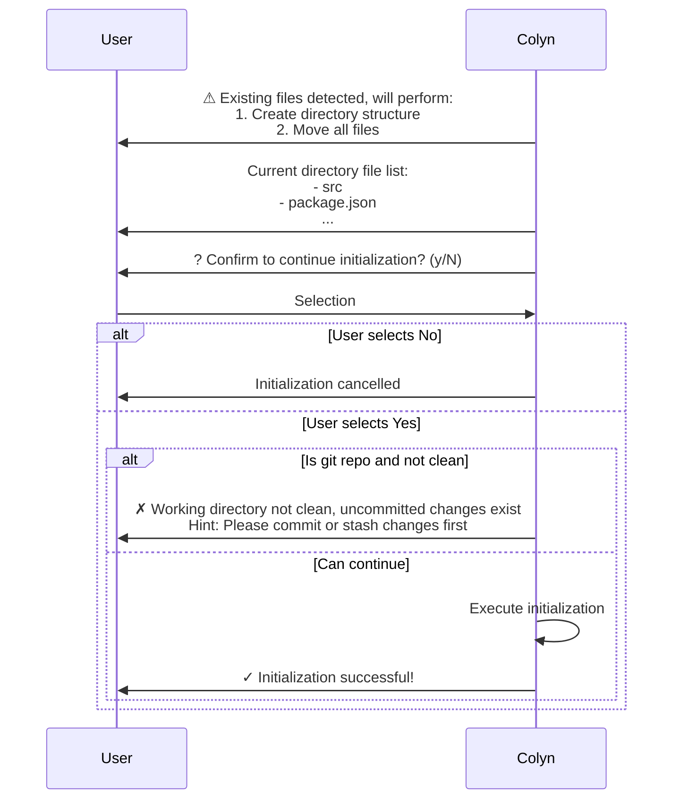
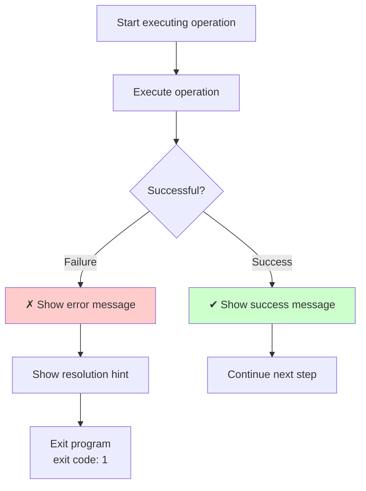
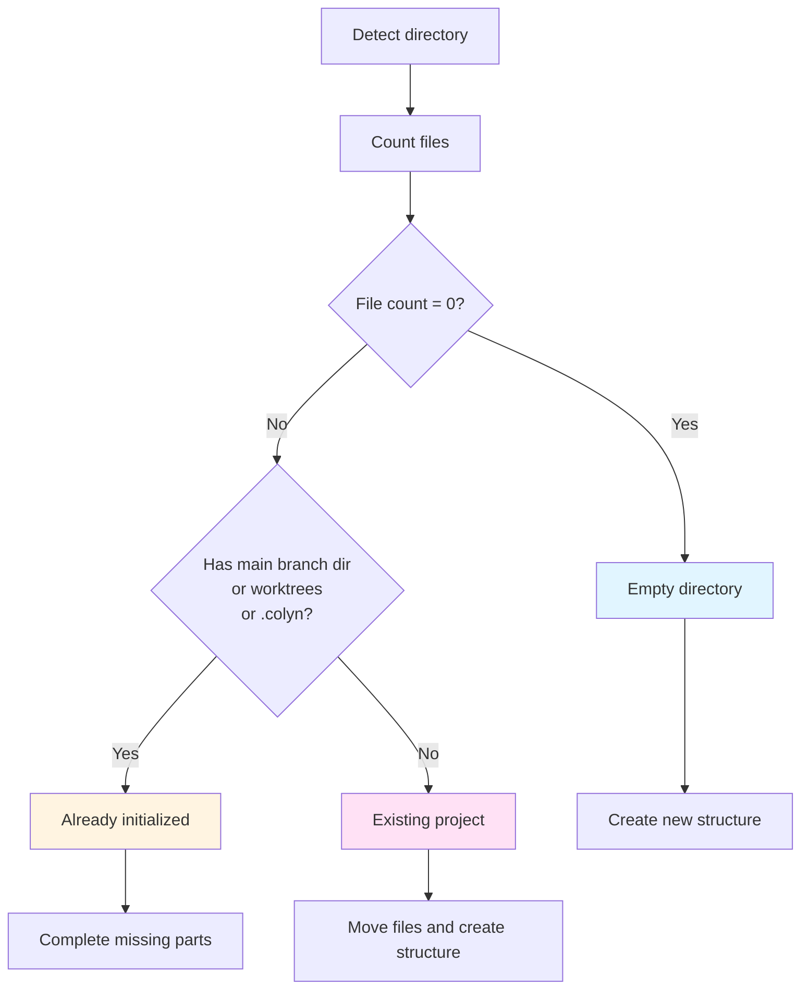
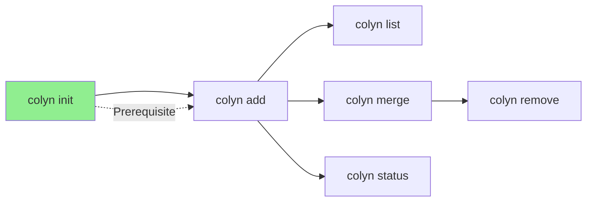

# Init Command Design Document (User Interaction Perspective)

**Created**: 2026-01-14
**Last Updated**: 2026-02-21
**Command Name**: `colyn init`
**Status**: ✅ Implemented

---

## 1. Command Overview

### 1.1 User Goals

Users want to convert an existing project into a Colyn project structure that supports parallel development, or create a Colyn project in a new directory.

### 1.2 Command Usage

```bash
# Interactive port prompt (recommended)
colyn init

# Specify port directly
colyn init --port 10000
colyn init -p 3000
```

### 1.3 Execution Result

After execution, the project directory will be reorganized into the following structure:

```
project-root/
├── project-name/      # Main branch directory (original files here)
│   ├── .env.local    # PORT=10000, WORKTREE=main
│   ├── .gitignore    # Contains .env.local rule
│   └── ...           # All original project files
├── worktrees/        # Future worktree directory
└── .colyn/           # Colyn config directory
    └── settings.json # Project config (plugins, language, etc.)
```

---

## 2. User Scenarios

`colyn init` intelligently identifies three different directory states and handles them differently.

### 2.1 Scenario 1: Empty Directory

**User situation**: Running `colyn init` in a completely empty directory

**System behavior**:
1. Create basic directory structure (main branch directory, worktrees, config directory)
2. Configure environment variables file
3. Prompt user to initialize project in main branch directory

**User sees**:

```
✔ Create directory structure
✔ Environment variables configured
✔ .gitignore configured
✔ Config file saved

✓ Initialization successful!

Directory structure:
  .
  ├── my-project/          # Main branch directory (initialize project here)
  ├── worktrees/           # Worktree directory
  └── .colyn/              # Config directory

Next steps:
  1. Enter main branch directory:
     cd my-project

  2. Initialize git repository (if not already):
     git init

  3. Initialize your project (e.g., npm/yarn init)

  4. Create worktree:
     colyn add <branch-name>
```

---

### 2.2 Scenario 2: Existing Project

**User situation**: Running `colyn init` in a directory containing project files

**System behavior**:
1. Display current file list
2. Ask user for confirmation (explain files will be moved)
3. If git repository, check if working directory is clean
4. Create directory structure and move files
5. Configure environment variables

**User sees**:

```
⚠ Existing files detected, the following will be performed:
  1. Create main branch directory and worktrees directory
  2. Move all files from current directory to my-project/ directory

Current directory file list:
  - src
  - package.json
  - tsconfig.json
  - .git
  - README.md
  ... 15 more files

? Confirm to continue initialization? (y/N) › No
```

**After user selects Yes**:

```
✔ Create directory structure
✔ Move project files
✔ Environment variables configured
✔ .gitignore configured
✔ Detected toolchain: npm
✔ Plugin initialization complete
✔ Config file saved

✓ Initialization successful!

Configuration info:
  Main branch: main
  Port: 10000

Next steps:
  1. Create worktree:
     colyn add <branch-name>

  2. View worktree list:
     colyn list
```

---

### 2.3 Scenario 3: Already Initialized (Completion Mode)

**User situation**: Running `colyn init` again in an already initialized directory

**System behavior**:
1. Detect missing parts
2. Complete missing directories or configurations
3. If everything is complete, indicate no action needed

**User sees (has missing parts)**:

```
⚠ Detected already initialized, entering completion mode...

✔ Create worktrees directory
✔ Check and update config file
✔ Check and configure .env.local
✔ Check and configure .gitignore

✓ Completion done!
```

**User sees (nothing missing)**:

```
⚠ Detected already initialized, entering completion mode...

✓ Completion done!

All configurations are complete, no completion needed.
```

---

## 3. User Interaction Flow

### 3.1 Overall Flow Diagram



### 3.2 Port Configuration Interaction



### 3.3 Existing Project Confirmation Flow



---

## 4. Input and Output

### 4.1 User Input

| Input | Method | Required | Default | Validation Rules |
|-------|--------|----------|---------|-----------------|
| Port number | `--port` parameter or interactive | Yes | 10000 | Integer between 1-65535 |
| Confirm continue (for existing project) | Interactive selection | Yes | No | Yes/No |

### 4.2 System Output

**Progress information** (using spinner):
- ✔ Create directory structure
- ✔ Move project files
- ✔ Environment variables configured
- ✔ .gitignore configured
- ✔ Detected toolchain: npm (or maven / gradle / pip)
- ✔ Plugin initialization complete
- ✔ Config file saved

**Success information**:
- Directory structure description
- Configuration info (main branch, port)
- Next steps suggestions

**Error information** (see section 5)

---

## 5. Error Handling

### 5.1 Common Errors and Solutions

| Error Scenario | User Sees | How to Resolve |
|---------------|-----------|----------------|
| Working directory not clean<br/>(uncommitted changes) | ✗ Working directory not clean, uncommitted changes exist<br/>Hint: Please commit or stash changes before running init | Run `git add .` and `git commit` to commit changes,<br/>or run `git stash` to stash changes |
| Directory name conflict<br/>(main branch dir name taken by file) | ✗ Main branch directory name "my-project" conflicts with existing file<br/>Hint: Please rename that file before running init | Rename or delete file with same name as main branch directory |
| Invalid port number | ✗ Invalid port number<br/>Hint: Port must be between 1-65535 | Enter port number between 1-65535 |
| File move failed | ✗ Error occurred while moving files<br/>Hint: Please check file permissions or manually restore directory structure | Check file permissions, manually operate if necessary |

### 5.2 Error Handling Flow



**Important**: Operations don't auto-rollback on failure, users need to manually recover based on hints.

---

## 6. Directory State Detection Logic

How the system determines which type a directory belongs to:



### 6.1 Detection Criteria

| Directory Type | Criteria | Description |
|---------------|----------|-------------|
| Empty directory | No files (including hidden files) | Completely empty directory |
| Already initialized | Has main branch dir, worktrees, or .colyn | Already ran `colyn init` |
| Existing project | Has files but not above two types | Regular project directory |

---

## 7. Project State After Success

### 7.1 Directory Structure

```
my-project/                 # Project root directory
├── my-project/             # Main branch directory
│   ├── .git/              # Git repository (if git project)
│   ├── src/               # Source code
│   ├── .env.local         # Environment variables: PORT=10000, WORKTREE=main
│   ├── .gitignore         # Contains .env.local ignore rule
│   └── ...                # Other project files
├── worktrees/             # Worktree directory (initially empty)
└── .colyn/                # Colyn config directory
    └── settings.json      # Project config: plugins, language, etc.
```

### 7.2 Data Sources

Project info is preferentially inferred from the filesystem; only necessary config is persisted to `settings.json`:

| Data | Source |
|------|--------|
| Main branch name | `git branch --show-current` in main branch directory |
| Main port | `PORT` in main branch directory's `.env.local` |
| Next Worktree ID | Scan `worktrees/task-*` directories, take max ID + 1 |
| Worktree list | `git worktree list` + each directory's `.env.local` |
| Toolchain plugins | `plugins` field in `.colyn/settings.json` (persisted) |

**`my-project/.env.local`**:
```env
# Environment variables for this worktree
# Auto-generated by colyn

PORT=10000
WORKTREE=main
```

### 7.3 What Users Can Do

After successful initialization, users can:

1. **Create worktree**:
   ```bash
   colyn add feature/login
   ```

2. **View worktree list**:
   ```bash
   colyn list
   ```

3. **Develop in main branch directory**:
   ```bash
   cd my-project
   npm run dev  # Port will be 10000
   ```

---

## 8. Special Case Handling

### 8.1 Main Branch Name Detection

- If git repository: Use current branch name as main branch name
- If not git repository or detection fails: Default to "main"

### 8.2 Environment Variables Smart Merge

If main branch directory already has `.env.local` file:

**Original content**:
```env
# My custom env
API_URL=http://localhost:3000
DEBUG=true
```

**After merge**:
```env
# My custom env
API_URL=http://localhost:3000
DEBUG=true

# Environment variables for this worktree
# Auto-generated by colyn

PORT=10000
WORKTREE=main
```

**Rules**:
- Preserve all original content and comments
- Add Colyn-required environment variables at end
- If PORT or WORKTREE already exists, update their values

### 8.3 .gitignore Smart Update

Check if ignore rule already exists:
- If contains `.env.local`: Skip
- If contains `*.local`: Skip (broader rule)
- Neither: Add `.env.local` ignore rule

---

## 9. User Experience Points

### 9.1 Clear Progress Prompts

Use spinner to show real-time progress of each step, letting users know what's happening.

### 9.2 Safe Confirmation Mechanism

Before executing destructive operations (moving files), must:
1. Show what operations will be performed
2. Show affected files
3. Ask for user confirmation
4. Default to "No", requires user to actively confirm

### 9.3 Detailed Error Prompts

Error messages contain:
- What the error is specifically
- Why it happened
- How to resolve

### 9.4 Next Steps Suggestions

After success, clearly tell users:
- What they can do
- How to do it
- Provide specific command examples

---

## 10. Relationship with Other Commands



**Description**:
- `init` is a prerequisite for all other commands
- Can only create worktree (`add`) after initialization
- Can use other management commands after creating worktree

---

## 11. FAQ

### Q1: Where are the original files after initialization?

A: All files are in the main branch directory (directory named same as project). For example, if project is called "my-project", files are in `my-project/my-project/`.

### Q2: Can I initialize in an existing project?

A: Yes. System will move all files to main branch directory. If it's a git repository, you must commit or stash all changes first.

### Q3: What if initialization fails?

A: System won't auto-rollback, manually recover based on error hints or re-run. In most cases, you can just re-run `colyn init`.

### Q4: Can I modify the port configuration?

A: Yes, directly edit the `PORT` value in main branch directory's `.env.local`. Since configuration is dynamically obtained from filesystem, changes take effect immediately.

### Q5: Will completion mode overwrite my configuration?

A: No. Completion mode only adds missing parts, won't overwrite existing configuration. Environment variables are smartly merged, preserving original content.

---

## 12. Summary

`colyn init` command design priorities:

1. **Smart identification**: Auto-identify three directory states, take different strategies
2. **Safety first**: User confirmation required before destructive operations
3. **Toolchain auto-configuration**: Auto-detect npm / Maven / Gradle / pip and write `settings.json`
4. **Clear feedback**: Each operation has clear progress and result prompts
5. **Error tolerance**: Detailed error messages and resolution suggestions
6. **User friendly**: Provide next steps suggestions and FAQ
