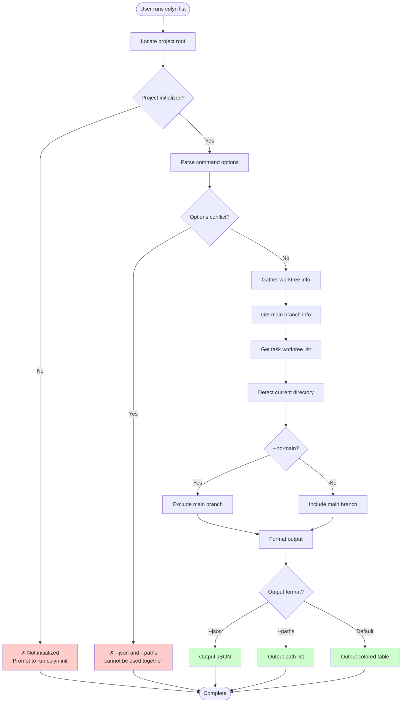
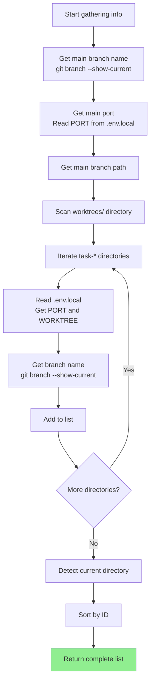
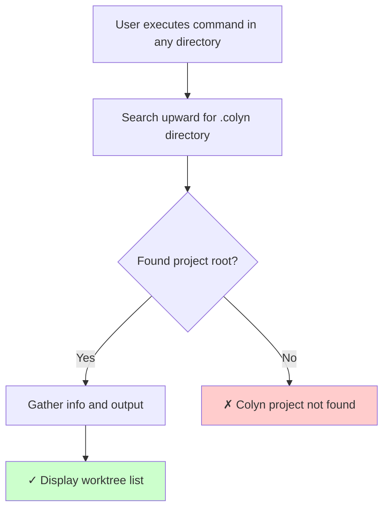
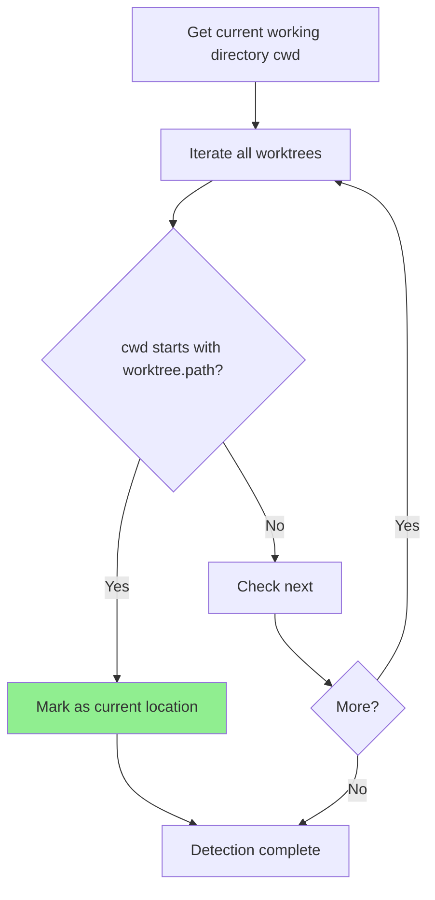
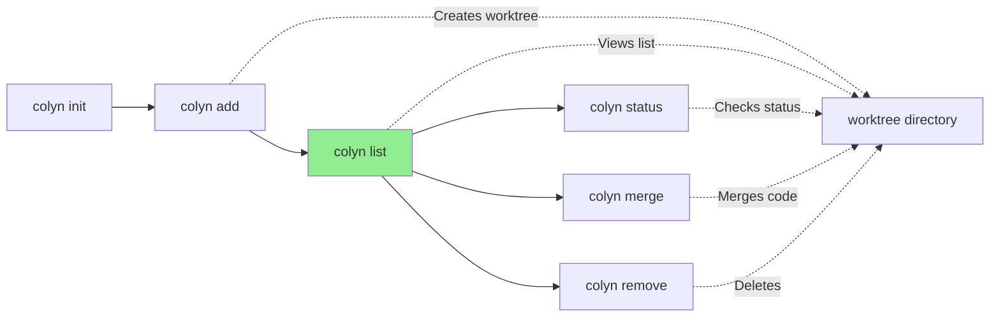

# List Command Design Document (User Interaction Perspective)

**Created**: 2026-01-15
**Last Updated**: 2026-01-15
**Command Name**: `colyn list`
**Status**: Implemented

---

## 1. Command Overview

### 1.1 User Goal

Users want to quickly view information about all worktrees in the current project to:
- Understand what parallel development environments currently exist
- View branch, port, and path for each worktree
- Quickly locate a worktree's directory
- Get worktree information in scripts for automation

### 1.2 Command Usage

```bash
# Basic usage: Show all worktrees (including main branch)
colyn list

# Don't show main branch
colyn list --no-main

# JSON format output (for script processing)
colyn list --json

# Output paths only (for pipe operations)
colyn list --paths

# Combined usage
colyn list --paths --no-main
colyn list --json --no-main
```

### 1.3 Execution Result

Display information about all worktrees in the project, including main branch and task worktrees.

**Example Output** (default table format):

```
ID    Branch            Port   Status      Diff   Path
  -   main              10000              -      my-app
  1   feature/login     10001  M:3         ↑2 ↓1  worktrees/task-1
→ 2   feature/dashboard 10002              ↑5     worktrees/task-2
```

**Notes**:
- `→` arrow indicates current worktree, entire row highlighted in cyan
- `Path` shows relative path from project root
- `Status`: Uncommitted changes count, `M:3` means 3 files modified, `S:` staged, `?:` untracked
- `Diff`: Commit difference from main branch, `↑` ahead, `↓` behind, `✓` synced

---

## 2. User Scenarios

### 2.1 Scenario 1: View All Development Environments

**User Need**: Understand what worktrees exist in current project and their status

**Workflow**:

```bash
$ colyn list

ID    Branch            Port   Status      Diff   Path
  -   main              10000              -      my-app
  1   feature/login     10001  M:3         ↑2 ↓1  worktrees/task-1
→ 2   feature/dashboard 10002              ↑5     worktrees/task-2
```

**Result**: User can clearly see all worktree info, git status, and difference from main branch.

---

### 2.2 Scenario 2: Get Worktree Paths for Scripts

**User Need**: Batch process all worktrees in scripts

**Workflow**:

```bash
# Run npm install in all worktrees
$ colyn list --paths --no-main | xargs -I {} sh -c 'cd {} && npm install'

# Get all worktree paths (relative paths)
$ colyn list --paths
my-app
worktrees/task-1
worktrees/task-2
```

**Result**: Concise relative path output convenient for pipe operations.

---

### 2.3 Scenario 3: Programmatic Processing of Worktree Info

**User Need**: Get structured worktree information in scripts or tools

**Workflow**:

```bash
$ colyn list --json
```

**Output**:
```json
[
  {
    "id": null,
    "branch": "main",
    "port": 10000,
    "path": "my-app",
    "isMain": true,
    "isCurrent": false,
    "status": { "modified": 0, "staged": 0, "untracked": 0 },
    "diff": { "ahead": 0, "behind": 0 }
  },
  {
    "id": 1,
    "branch": "feature/login",
    "port": 10001,
    "path": "worktrees/task-1",
    "isMain": false,
    "isCurrent": false,
    "status": { "modified": 3, "staged": 1, "untracked": 2 },
    "diff": { "ahead": 2, "behind": 1 }
  }
]
```

**Result**: JSON format convenient for program parsing and processing.

---

### 2.4 Scenario 4: View Only Task Worktrees

**User Need**: Only care about task worktrees, don't need to see main branch

**Workflow**:

```bash
$ colyn list --no-main

ID    Branch            Port   Status      Diff   Path
  1   feature/login     10001  M:3         ↑2 ↓1  worktrees/task-1
→ 2   feature/dashboard 10002              ↑5     worktrees/task-2
```

**Result**: Output doesn't include main branch info.

---

## 3. Input and Output

### 3.1 Command Options

| Option | Short | Description | Default |
|--------|-------|-------------|---------|
| `--json` | - | Output in JSON format | No |
| `--paths` | `-p` | Output paths only (one per line) | No |
| `--no-main` | - | Don't show main branch | No (show main branch) |

**Option Mutual Exclusion Rules**:
- `--json` and `--paths` are mutually exclusive, cannot be used together
- `--no-main` can be combined with any format option

### 3.2 Output Formats

#### 3.2.1 Table Format (Default)

**Features**:
- Colored output, beautiful and readable
- Current worktree marked with `→` arrow, entire row highlighted
- Main branch ID shown as `-`
- Path shown as relative path from project root
- **Responsive layout**: Auto-adjust displayed columns based on terminal width

**Output Example**:
```
ID    Branch            Port   Status      Diff   Path
  -   main              10000              -      my-app
  1   feature/login     10001  M:3         ↑2 ↓1  worktrees/task-1
→ 2   feature/dashboard 10002              ↑5     worktrees/task-2
```

**Color Scheme**:
| Element | Color |
|---------|-------|
| Header | White bold |
| Main branch row | Gray (dim) |
| Normal row | Default color |
| Current row | Cyan |
| Status with changes | Yellow |
| Diff synced (✓) | Green |
| Diff with difference | Cyan |

**Responsive Layout**:

When terminal width is insufficient, columns are hidden in the following order to ensure no line wrapping:

| Mode | Displayed Columns | Applicable Width |
|------|-------------------|------------------|
| full | ID, Branch, Port, Status, Diff, Path | Wide screen |
| no-port | ID, Branch, Status, Diff, Path | Wider |
| no-path | ID, Branch, Status, Diff | Medium |
| simple-status | ID, Branch, S(●), Diff | Narrower |
| no-status | ID, Branch, Diff | Narrow |
| minimal | ID, Branch | Very narrow |

---

#### 3.2.2 JSON Format (`--json`)

**Features**:
- Machine-readable, convenient for script processing
- Contains complete info, including `isMain` and `isCurrent` fields
- Contains git status info
- Array format, can be directly processed by JSON parsers

**Output Example**:
```json
[
  {
    "id": null,
    "branch": "main",
    "port": 10000,
    "path": "my-app",
    "isMain": true,
    "isCurrent": false,
    "status": {
      "modified": 0,
      "staged": 0,
      "untracked": 0
    },
    "diff": {
      "ahead": 0,
      "behind": 0
    }
  },
  {
    "id": 1,
    "branch": "feature/login",
    "port": 10001,
    "path": "worktrees/task-1",
    "isMain": false,
    "isCurrent": false,
    "status": {
      "modified": 3,
      "staged": 1,
      "untracked": 2
    },
    "diff": {
      "ahead": 2,
      "behind": 1
    }
  }
]
```

**Field Description**:
| Field | Type | Description |
|-------|------|-------------|
| `id` | `number \| null` | Worktree ID, `null` for main branch |
| `branch` | `string` | Branch name |
| `port` | `number` | Port number |
| `path` | `string` | Relative path from project root |
| `isMain` | `boolean` | Whether it's main branch |
| `isCurrent` | `boolean` | Whether it's current directory |
| `status.modified` | `number` | Number of modified but unstaged files |
| `status.staged` | `number` | Number of staged files |
| `status.untracked` | `number` | Number of untracked files |
| `diff.ahead` | `number` | Number of commits ahead of main branch |
| `diff.behind` | `number` | Number of commits behind main branch |

---

#### 3.2.3 Path Format (`--paths`)

**Features**:
- One path per line (relative paths)
- No colors, no extra info
- Convenient for pipe operations and script processing

**Output Example**:
```
my-app
worktrees/task-1
worktrees/task-2
```

**Use Cases**:
```bash
# Execute command in all worktrees
colyn list --paths | xargs -I {} sh -c 'cd {} && git status'

# Count worktree count
colyn list --paths --no-main | wc -l

# Find worktrees containing specific file
colyn list --paths | xargs -I {} sh -c '[ -f {}/package.json ] && echo {}'
```

---

## 4. User Interaction Flow

### 4.1 Overall Flow Diagram



### 4.2 Info Gathering Flow



---

## 5. Error Handling

### 5.1 Project Not Initialized

```
✗ Current directory not initialized as Colyn project
  Hint: Please run colyn init command first
```

### 5.2 Options Conflict

```
✗ Options conflict: --json and --paths cannot be used together
  Hint: Please choose one output format
```

### 5.3 No Worktrees

When there are no task worktrees and `--no-main` is used:

```
No worktrees

Hint: Use colyn add <branch> to create a new worktree
```

---

## 6. Running from Anywhere in Project

`colyn list` supports running from anywhere in the project:



**Example**:
```bash
# Run from worktree subdirectory
$ cd worktrees/task-1/src/components
$ colyn list

ID    Branch            Port   Status   Diff   Path
  -   main              10000           -      my-app
→ 1   feature/login     10001           ✓      worktrees/task-1
  2   feature/dashboard 10002           ↑5     worktrees/task-2
```

---

## 7. Current Location Detection

### 7.1 Detection Logic

System determines user location by comparing current working directory with each worktree path:



### 7.2 Display Style

**Table Format**:
- Current row ID prefixed with `→` arrow
- Entire row highlighted in cyan

**JSON Format**:
- `isCurrent` field is `true`

**Path Format**:
- No special marking (keep it simple)

---

## 8. Empty State Handling

### 8.1 Only Main Branch

```bash
$ colyn list

ID    Branch  Port   Status   Diff   Path
→ -   main    10000           -      my-app

Hint: Use colyn add <branch> to create a new worktree
```

### 8.2 Using --no-main with No Task Worktrees

```bash
$ colyn list --no-main

No worktrees

Hint: Use colyn add <branch> to create a new worktree
```

### 8.3 JSON Format Empty State

```bash
$ colyn list --json --no-main
[]
```

### 8.4 Path Format Empty State

```bash
$ colyn list --paths --no-main
# No output (empty)
```

---

## 9. Sorting Rules

Worktree list sorted by the following rules:

1. **Main branch always first** (if included)
2. **Task worktrees sorted by ID ascending**

```
ID    Branch            Port   Status   Diff   Path
  -   main              10000           -      my-app              # Main branch first
  1   feature/login     10001           ✓      worktrees/task-1
  2   feature/dashboard 10002  M:2      ↑3     worktrees/task-2
  5   feature/payment   10005           ↑1     worktrees/task-5    # Sorted by ID
```

---

## 10. FAQ

### Q1: How to output only paths for script use?

A: Use `--paths` option:
```bash
colyn list --paths
```

### Q2: How to parse worktree info in scripts?

A: Use `--json` option to get JSON format output:
```bash
colyn list --json | jq '.[] | select(.isMain == false) | .path'
```

### Q3: Why does main branch ID show as `-`?

A: Main branch is not a task worktree created via `colyn add`, has no assigned ID. `-` indicates "no ID".

### Q4: How do I know which worktree I'm currently in?

A: In default table output, current worktree's ID is prefixed with `→` arrow, entire row highlighted in cyan.

### Q5: Can --json and --paths be used together?

A: No, these two options are mutually exclusive. Please choose one output format.

### Q6: Are output paths relative or absolute?

A: Output is relative path from project root, more concise and readable.

### Q7: What if table doesn't display fully when terminal is narrow?

A: list command supports responsive layout, will auto-hide less important columns based on terminal width (in order: Port → Path → Status → Diff), ensuring no line wrapping.

---

## 11. Relationship with Other Commands



**Notes**:
- `list` is a view command, doesn't modify any state
- Recommended to run `list` after `add` to confirm
- Other management commands may need to `list` first to get info

---

## 12. Implementation Notes

### 12.1 Data Sources

Utilize existing `src/core/discovery.ts` module:
- `getProjectInfo()` to get complete project info
- `WorktreeInfo` interface contains all required fields

### 12.2 Dependencies

- `cli-table3`: Table output
- `chalk`: Colored output

### 12.3 Exit Codes

| Exit Code | Meaning |
|-----------|---------|
| 0 | Success |
| 1 | Project not initialized or other error |

---

## 13. Summary

`colyn list` command design highlights:

1. **Multiple Output Formats**: Table (default), JSON, paths, meeting different use cases
2. **Current Location Highlighting**: Help users quickly locate their position
3. **Flexible Filtering**: `--no-main` can exclude main branch
4. **Script Friendly**: `--json` and `--paths` convenient for automation
5. **Run from Anywhere**: Auto-locate project root
6. **Clear Empty State Handling**: Give clear prompts
