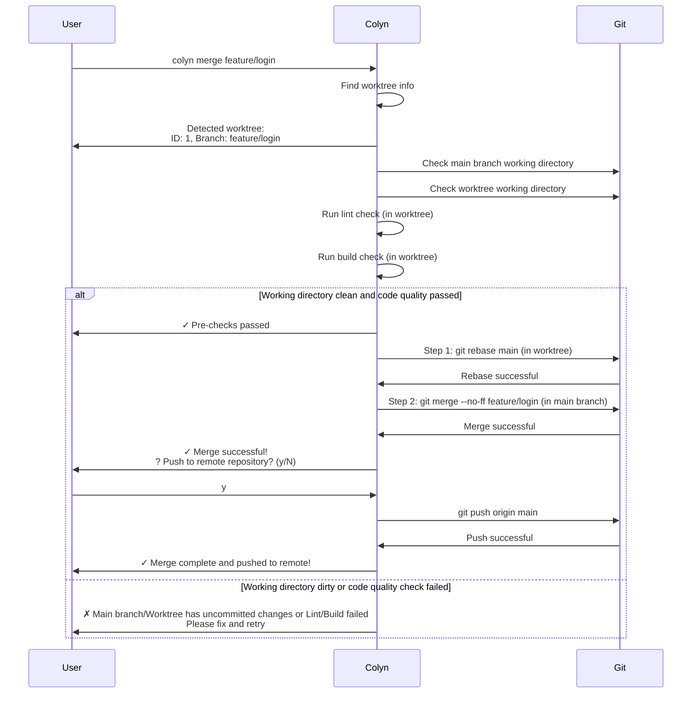
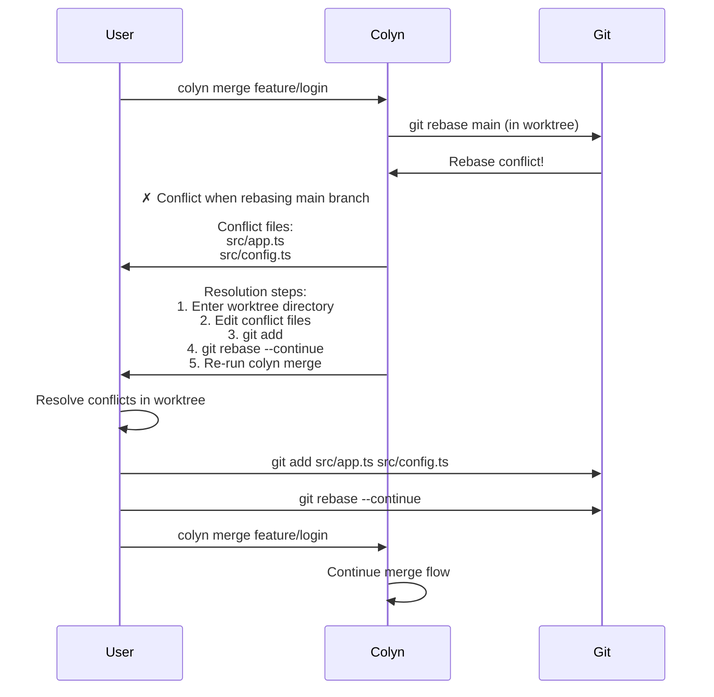
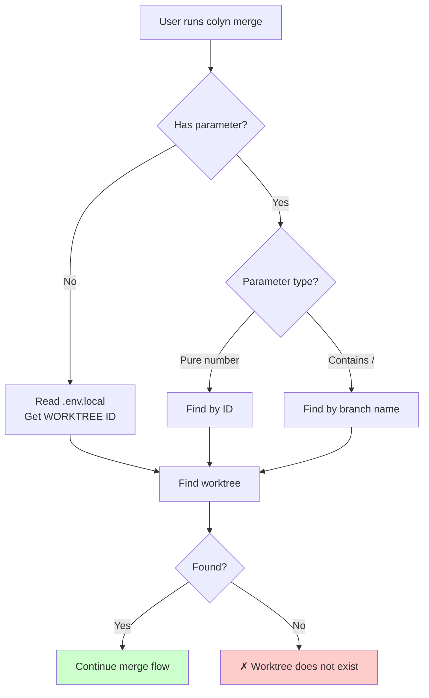
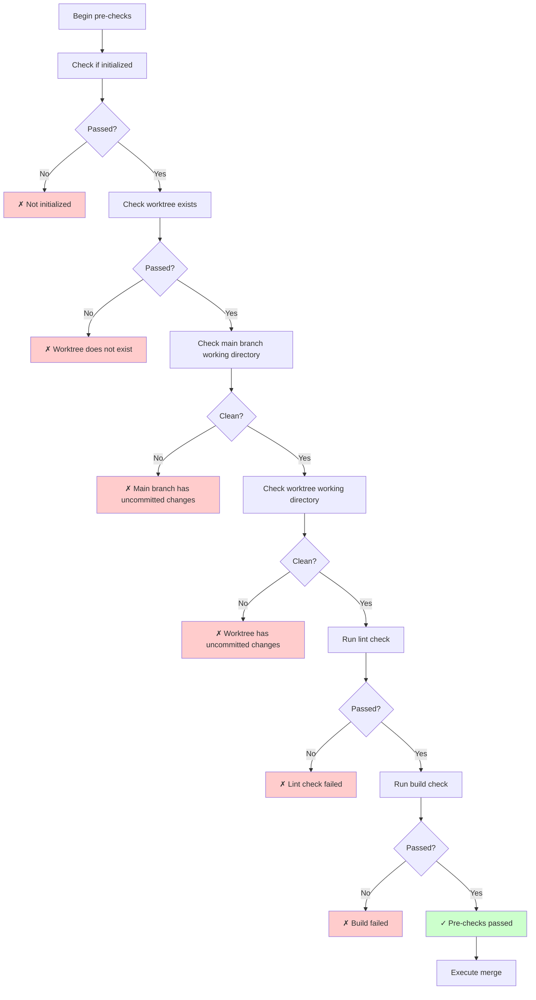
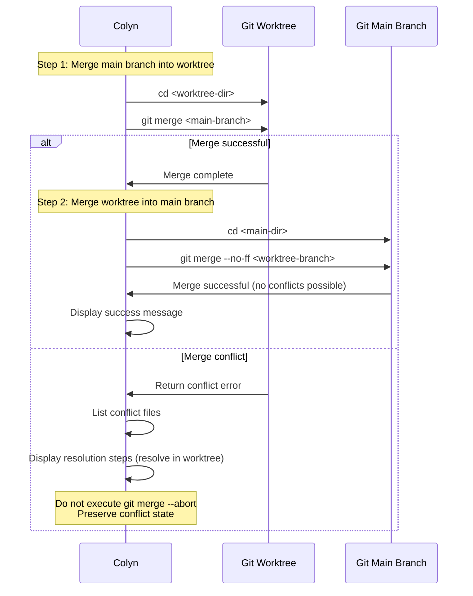
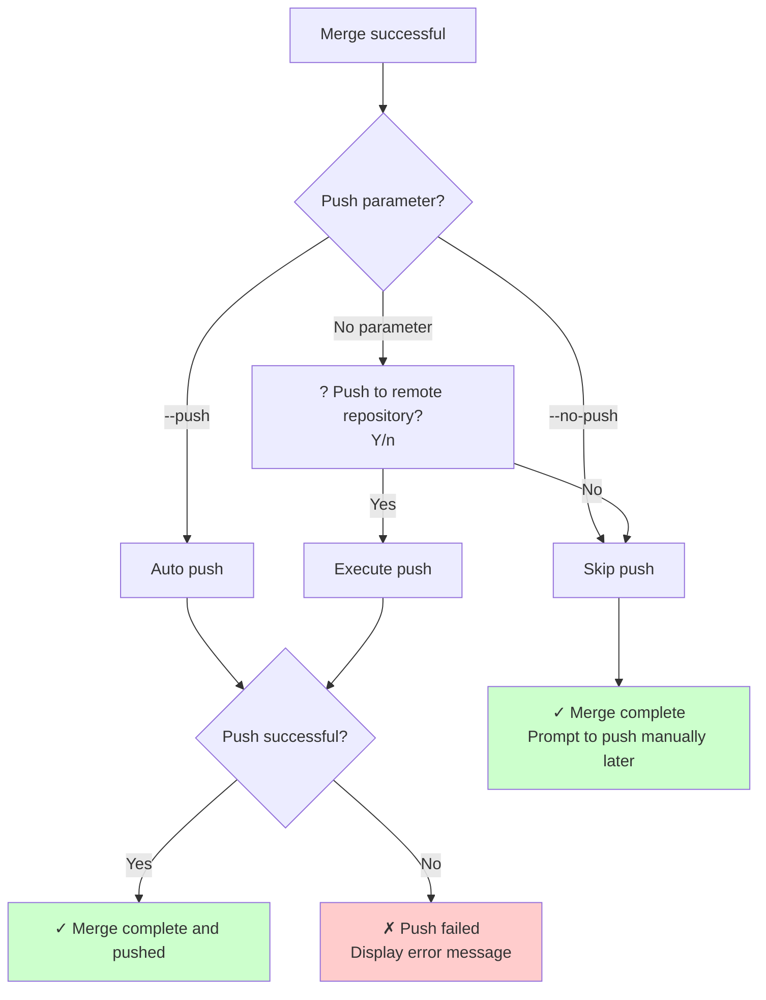

# Merge Command Design Document (User Interaction Perspective)

**Created**: 2026-01-15
**Last Updated**: 2026-02-21
**Command**: `colyn merge`
**Status**: ✅ Implemented

---

## 1. Requirement Overview

### 1.1 Background

After completing feature development in a worktree, users need to merge their code back to the main branch. The traditional workflow requires:
1. Manually switching to the main branch directory
2. Executing git merge command
3. Handling potential conflicts
4. Pushing to the remote repository
5. Manually cleaning up the worktree

This process is cumbersome and error-prone.

### 1.2 User Goal

Provide a simple command that automatically completes all steps of the worktree merge, allowing users to focus on development rather than git operations.

### 1.3 Core Value

- ✅ **Simplified Operations**: Complete merge workflow with one command
- ✅ **Smart Detection**: Support ID, branch name, auto-detection
- ✅ **Safety Checks**: Prevent erroneous operations
- ✅ **Code Quality Checks**: Automatically run lint and build before merging to ensure code quality
- ✅ **Linear History**: Use rebase by default to produce linear commit history
- ✅ **Clear History**: Use --no-ff to maintain clear branch history
- ✅ **Flexible Push**: Optional auto-push or manual push
- ✅ **Preserve Worktree**: Retain after merge, let user decide on deletion

---

## 2. User Scenarios

### 2.1 Scenario 1: Basic Merge Workflow

**User Situation**: Completed `feature/login` development, wants to merge back to main branch



**User sees**:
```bash
$ colyn merge feature/login

Detected worktree:
  ID: 1
  Branch: feature/login
  Path: /path/to/worktrees/task-1

✓ Pre-checks passed
✓ Main branch working directory clean
✓ Worktree working directory clean
✔ Lint check passed
✔ Build succeeded

Step 1/2: Update main branch code in worktree
  Directory: /path/to/worktrees/task-1
  Executing: git rebase main
✔ Main branch rebased onto worktree

Step 2/2: Merge worktree branch into main
  Directory: /path/to/my-project
  Executing: git merge --no-ff feature/login
✔ Worktree merged into main branch
✓ Merge complete!

Merge info:
  Main branch: main
  Merged branch: feature/login
  Commit: a1b2c3d Merge branch 'feature/login'

? Push to remote repository? (y/N) › Yes

✓ Merge complete and pushed to remote!

Next steps:
  1. View merged code:
     cd my-project

  2. To continue using worktree:
     cd worktrees/task-1

  3. To delete worktree:
     colyn remove 1  (to be implemented)
```

---

### 2.2 Scenario 2: Merge from Worktree Directory

**User Situation**: Currently in worktree directory, wants quick merge

```bash
$ cd worktrees/task-1
$ colyn merge

# Auto-detects current worktree (reads .env.local)
Detected worktree:
  ID: 1
  Branch: feature/login
  ...

# Subsequent flow same as Scenario 1
```

**System Behavior**:
1. Read `.env.local` file in current directory
2. Get ID from `WORKTREE` variable
3. Find corresponding worktree info
4. Execute merge flow

---

### 2.3 Scenario 3: Quick Merge and Push

**User Situation**: Certain about pushing, don't want to be prompted

```bash
$ colyn merge feature/login --push

# Auto-push after merge, no prompt
✓ Merge complete and pushed to remote!
```

---

### 2.4 Scenario 4: Handling Merge Conflicts

**User Situation**: Main branch and worktree modified the same files



**User sees**:
```bash
$ colyn merge feature/login

✗ Conflict when rebasing main branch

Conflict files:
  src/app.ts
  src/config.ts

Resolution steps:
  1. Enter worktree directory to resolve conflicts:
     cd worktrees/task-1
  2. Edit conflict files, resolve conflict markers
  3. Add resolved files:
     git add <file>
  4. Continue rebase:
     git rebase --continue
  5. To abort rebase:
     git rebase --abort
  5. Re-run merge command:
     colyn merge feature/login
```

**Advantage**: Conflicts are resolved in the worktree directory, users can handle them in the development environment without affecting the main branch.

---

### 2.5 Scenario 5: Using Merge Strategy

**User Situation**: Doesn't want to use rebase, wants to preserve complete branch history

```bash
$ colyn merge feature/login --no-rebase

Step 1/2: Update main branch code in worktree
  Directory: /path/to/worktrees/task-1
  Executing: git merge main
✔ Main branch merged into worktree

# Continue with the same flow as Scenario 1
```

---

## 3. Functional Requirements

### 3.1 Parameter Recognition

Supports three invocation methods:



**Examples**:
| Command | Recognition | Description |
|---------|------------|-------------|
| `colyn merge 1` | By ID | Find worktree with ID 1 |
| `colyn merge feature/login` | By branch name | Find worktree with branch feature/login |
| `colyn merge` (in worktree) | Auto-detect | Read WORKTREE value from .env.local |

---

### 3.2 Pre-checks



**Check Items**:

| Check Item | Description | Failure Message |
|-----------|-------------|-----------------|
| Initialized | Check for `.colyn` directory | Please run `colyn init` first |
| Worktree exists | Find through discovery module | ID or branch name doesn't exist, run `colyn list` |
| Main directory status | Is `git status` clean | Please commit or stash main branch changes first |
| Worktree directory status | Is `git status` clean | Please commit worktree changes first |
| Lint check | Run lint in worktree directory | Please fix lint errors before merging |
| Build check | Run build in worktree directory | Please fix build errors before merging |

---

### 3.3 Merge Execution

Uses two-step merge strategy to ensure conflicts are resolved in worktree:



**Step 1: Merge main branch into worktree** (allow fast-forward)
```bash
cd <worktree-dir>
git merge <main-branch>
```

**Step 2: Merge worktree branch into main** (use --no-ff)
```bash
cd <main-dir>
git merge --no-ff <worktree-branch> -m "Merge branch '<worktree-branch>'"
```

**Why two-step merge**:
- If there are conflicts, they occur in the worktree directory where users can resolve them in the development environment
- After resolving conflicts, re-run `colyn merge` to complete the merge
- Avoids handling conflicts in main branch, maintaining main branch stability

**Why use `--no-ff`**:
- Forces creation of merge commit even if fast-forward is possible
- Maintains clear branch history
- Easy to track complete feature development cycle

---

### 3.4 Push Strategy



**Three modes**:

| Mode | Command | Behavior |
|------|---------|----------|
| Auto push | `colyn merge <target> --push` | Auto push after merge, no prompt |
| Skip push | `colyn merge <target> --no-push` | Don't push after merge, no prompt |
| Ask user | `colyn merge <target>` | Prompt user whether to push (default) |

---

### 3.5 Worktree Retention

Worktree is **not deleted** after successful merge:

**Reasons**:
- ✅ User may need to continue working on that branch
- ✅ User may need to reference files in the worktree
- ✅ Deletion is irreversible, safer for user to decide
- ✅ Deletion functionality left to separate `colyn remove` command

**User subsequent choices**:
1. Continue using worktree for development
2. Run `colyn remove <id>` later to delete
3. Keep worktree for reference

---

## 4. Input and Output

### 4.1 User Input

| Input | Required | Description | Validation |
|-------|----------|-------------|------------|
| ID or branch name | No | Specify worktree to merge<br/>Auto-detect if no parameter | - Numbers treated as ID<br/>- Contains `/` treated as branch name |
| `--push` | No | Auto push after merge | Mutually exclusive with `--no-push` |
| `--no-push` | No | Don't push after merge (skip prompt) | Mutually exclusive with `--push` |

### 4.2 System Output

**Progress info**:
```
Detected worktree: ...
✓ Pre-checks passed
✓ Main branch working directory clean
✓ Worktree working directory clean
✔ Lint check passed
✔ Build succeeded
Switching to main branch directory: ...
Executing merge: git merge --no-ff ...
✓ Merge successful!
```

**Success info**:
```
✓ Merge complete and pushed to remote!

Next steps:
  1. View merged code: cd my-project
  2. To continue using worktree: cd worktrees/task-1
  3. To delete worktree: colyn remove 1
```

---

## 5. Error Handling

### 5.1 Common Errors

| Error Scenario | User Sees | Resolution |
|----------------|-----------|------------|
| **Not initialized** | ✗ Current directory not initialized<br/>Hint: Please run colyn init first | Run `colyn init` |
| **Worktree doesn't exist** | ✗ Cannot find worktree<br/>ID "1" or branch "feature/login" doesn't exist<br/>View existing worktrees: colyn list | Check ID or branch name<br/>Run `colyn list` |
| **Main branch dirty** | ✗ Main branch directory has uncommitted changes<br/>Main branch directory: /path/to/my-project<br/>View status: cd my-project && git status | Commit or stash main branch changes |
| **Worktree dirty** | ✗ Worktree directory has uncommitted changes<br/>Worktree directory: /path/to/worktrees/task-1<br/>View status: cd worktrees/task-1 && git status | Commit worktree changes |
| **Lint check failed** | ✗ Lint check failed<br/>Error: ... | Fix lint errors and retry<br/>cd worktrees/task-1 && yarn lint |
| **Build failed** | ✗ Build failed<br/>Error: ... | Fix build errors and retry<br/>cd worktrees/task-1 && yarn build |
| **Merge conflict** | ✗ Conflict during merge<br/>Conflict files: ...<br/>Resolution steps: ... | Manually resolve conflicts<br/>Won't auto-rollback |
| **Push failed** | ✗ Failed to push to remote repository<br/>Error message: ...<br/>Local merge complete, can push manually later | Check network and permissions<br/>Manual push: cd my-project && git push |

---

## 6. Non-functional Requirements

### 6.1 Performance Requirements

- Pre-checks should complete within 1 second
- Merge operation performance depends on git

### 6.2 Usability Requirements

- Error messages are clear and include resolution suggestions
- Support calling from any directory
- Support auto-detection within worktree directory

### 6.3 Compatibility Requirements

- Support macOS, Linux, Windows
- Compatible with git 2.5+ (minimum version for worktree feature)

---

## 7. Acceptance Criteria

### 7.1 Basic Functionality

- [ ] Support specifying worktree by ID for merge
- [ ] Support specifying worktree by branch name for merge
- [ ] Support no-parameter invocation in worktree directory (auto-detect)
- [ ] Use `git merge --no-ff` for merge
- [ ] Retain worktree after merge (don't delete)

### 7.2 Pre-checks

- [ ] Check if initialized, provide clear message on failure
- [ ] Check if worktree exists, provide clear message on failure
- [ ] Check main branch directory status, refuse merge if dirty
- [ ] Check worktree directory status, refuse merge if dirty
- [x] Run lint check, refuse merge on failure and display error details
- [x] Run build check, refuse merge on failure and display error details

### 7.3 Push Functionality

- [x] `--push` parameter: auto push after merge
- [x] `--no-push` parameter: don't push after merge (skip prompt)
- [x] No parameter: prompt user whether to push (default behavior)
- [x] Provide clear error message on push failure

### 7.4 Conflict Handling

- [ ] Detect conflicts and display conflict file list
- [ ] Provide detailed conflict resolution steps
- [ ] Don't auto-rollback merge (preserve conflict state)

### 7.5 User Experience

- [ ] Display clear progress info (use spinner)
- [ ] Show merge info and next step suggestions on success
- [ ] Error messages include specific resolution suggestions
- [ ] Support colored output (success, error, hints)

---

## 8. Out of Scope

The following features are not in this requirement scope:

- ❌ Auto delete worktree (reserved for `remove` command)
- ❌ Auto resolve merge conflicts
- ❌ Support other merge strategies (only use `--no-ff`)
- ❌ Auto update main branch before merge
- ❌ Auto delete remote branch after merge
- ❌ Merge rollback functionality (conflicts handled manually by user)
- ❌ Batch merge multiple worktrees

---

## 9. FAQ

### Q1: Why not auto-delete worktree after merge?

A: Deletion is irreversible. User may still need to:
- Continue working on that branch
- Reference files in the worktree
- Decide deletion timing themselves

Deletion functionality is provided by separate `colyn remove` command.

### Q2: Why use `--no-ff` for merge?

A: Maintains clear branch history. Even if fast-forward is possible, creates merge commit for:
- Tracking complete feature development cycle
- Understanding branch purpose
- Rolling back entire feature

### Q3: What if I forget to commit worktree changes?

A: System detects and refuses merge, prompting:
```
✗ Worktree directory has uncommitted changes
  Please commit worktree changes first
```

### Q4: How to continue after merge conflict?

A: System preserves conflict state, user needs to:
1. Enter main branch directory
2. Manually resolve conflict files
3. `git add <file>`
4. `git commit`
5. Optional: `git push`

### Q5: Can I merge without pushing?

A: Yes. Two ways:
1. Use `--no-push` parameter to skip prompt and complete merge without pushing
2. Don't specify parameter, select No when prompted

Local merge is complete, can push manually later.

### Q6: What if push fails?

A: Local merge is already complete, system prompts to push manually later:
```bash
cd my-project && git push origin main
```

---

## 10. Future Work

Related commands (to be implemented):

1. **`colyn remove <id|branch>`** - Delete worktree
2. **`colyn checkout <id> <branch>`** - Switch branch in worktree
3. **`colyn list`** - List all worktrees
4. **`colyn status <id>`** - View worktree status

---

## 11. Summary

`colyn merge` command core values:

✅ **Simplified Operations**: Complete merge with one command
✅ **Smart Detection**: Support three detection methods
✅ **Safety Checks**: Prevent erroneous operations
✅ **Code Quality**: Automatically run lint and build checks before merging
✅ **Clear History**: Use --no-ff to maintain branch history
✅ **Flexible Push**: Support three push modes
✅ **Preserve Worktree**: User decides deletion timing
✅ **Friendly Messages**: Clear error messages and resolution suggestions

With this command, users can focus on development instead of cumbersome git operations.
