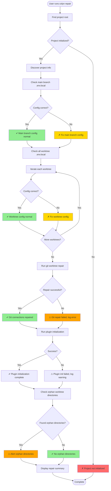
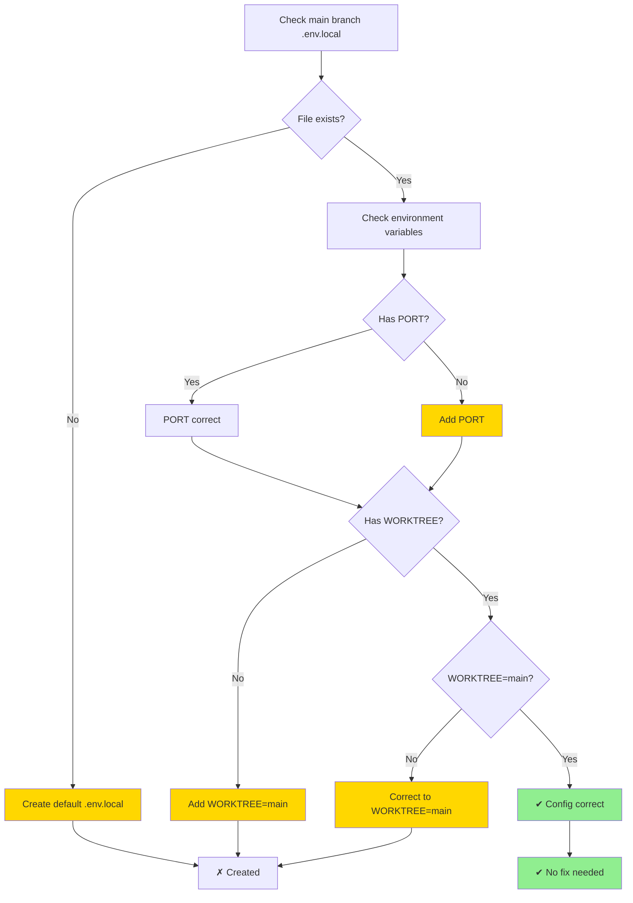
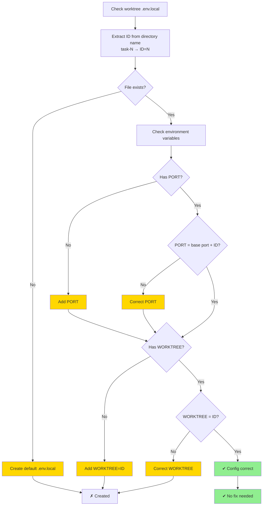
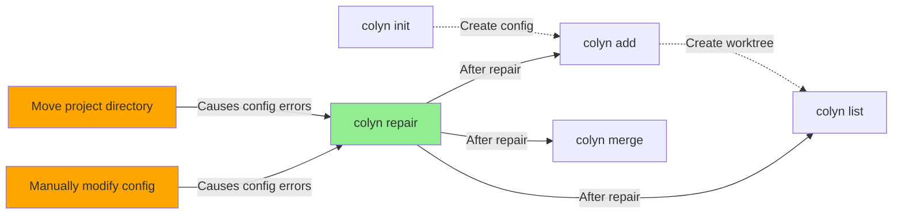

# Repair Command Design Document (User Interaction Perspective)

**Created**: 2026-01-17
**Last Updated**: 2026-02-21
**Command**: `colyn repair`
**Status**: ✅ Implemented

---

## 1. Command Overview

### 1.1 User Goal

Users want to quickly check and fix project configuration errors after moving the entire project directory, ensuring all worktrees work properly.

### 1.2 Command Usage

```bash
# Basic usage (auto-fix all issues)
colyn repair
```

### 1.3 Execution Result

After execution, the system will:
1. Check and fix the main branch directory's `.env.local` file
2. Check and fix all worktree `.env.local` files
3. Run `git worktree repair` to fix git connections
4. Run plugin initialization (non-fatal — only shows a warning on failure)
5. Detect and report orphan worktree directories (directories that exist but git doesn't recognize)

---

## 2. User Scenarios

### 2.1 Scenario 1: Fix After Moving Project Directory

**User Situation**: Moved entire project from `/Users/user/project` to `/Users/user/Desktop/project`

**Problem Symptoms**:
- Git worktree cannot recognize individual worktrees
- Git commands fail with worktree not found errors

**Operation Flow**:

```bash
# After moving directory
$ cd /Users/user/Desktop/project

# Run repair command
$ colyn repair

✔ Check main branch .env.local
✔ Check worktree task-1 .env.local
✔ Check worktree task-2 .env.local
✔ Repair git worktree connections
✔ Plugin initialization complete
✔ Check orphan worktree directories

✓ Repair complete!

Repair summary:
  ✓ Git worktree connections repaired
  ✓ Checked 3 .env.local files, no issues
  ✓ No orphan worktree directories found
```

**Result**: All worktrees restored to normal operation

---

### 2.2 Scenario 2: .env.local File Accidentally Modified

**User Situation**: Manually modified some worktree `.env.local` files, causing configuration inconsistency

**Problem Symptoms**:
- task-1's PORT=10005, but should be 10001
- task-2's WORKTREE=3, but directory name is task-2

**Operation Flow**:

```bash
$ colyn repair

✔ Check main branch .env.local
✗ Fix worktree task-1 .env.local
  - PORT: 10005 → 10001
✗ Fix worktree task-2 .env.local
  - WORKTREE: 3 → 2
✔ Repair git worktree connections
✔ Check orphan worktree directories

✓ Repair complete!

Repair summary:
  ✓ Fixed 2 .env.local files
  ✓ Git worktree connections normal
  ✓ No orphan worktree directories found
```

**Result**: All configurations restored to correct values

---

### 2.3 Scenario 3: Orphan Worktree Directories Exist

**User Situation**: Manually deleted git worktree but directory still exists

**Problem Symptoms**:
- `worktrees/task-3` directory exists
- But `git worktree list` doesn't show this worktree

**Operation Flow**:

```bash
$ colyn repair

✔ Check main branch .env.local
✔ Check worktree task-1 .env.local
✔ Check worktree task-2 .env.local
✔ Repair git worktree connections
⚠ Found orphan worktree directories

✓ Repair complete!

Repair summary:
  ✓ Checked 3 .env.local files, no issues
  ✓ Git worktree connections normal
  ⚠ Found 1 orphan worktree directory:
    - worktrees/task-3 (directory exists but git doesn't recognize)

Suggested action:
  Run colyn remove command to clean up, or manually delete directory
```

**Result**: Alert user about orphan directories that need manual cleanup

---

## 3. User Interaction Flow

### 3.1 Overall Flow Diagram



### 3.2 Check and Fix Logic

#### Main Branch .env.local Check



#### Worktree .env.local Check



---

## 4. Input and Output

### 4.1 User Input

| Input | Description | Required |
|-------|-------------|----------|
| None | repair command needs no parameters, auto-checks and fixes | - |

### 4.2 System Output

**Check progress** (using spinner):
```
✔ Check main branch .env.local
✔ Check worktree task-1 .env.local
✗ Fix worktree task-2 .env.local
  - PORT: 10005 → 10002
  - WORKTREE: 3 → 2
✔ Repair git worktree connections
✔ Plugin initialization complete
✔ Check orphan worktree directories
```

**Repair summary**:
```
✓ Repair complete!

Repair summary:
  ✓ Fixed 1 .env.local file
  ✓ Git worktree connections repaired
  ✓ No orphan worktree directories found

Details:
  Main branch:
    ✓ .env.local config correct

  Worktree task-1:
    ✓ .env.local config correct

  Worktree task-2:
    ✗ PORT error: 10005 → 10002
    ✗ WORKTREE error: 3 → 2
```

---

## 5. Error Handling

### 5.1 Common Errors and Handling

| Error Scenario | System Behavior | User Sees |
|----------------|-----------------|-----------|
| **Project not initialized** | Error and exit | ✗ Project not initialized<br/>Hint: Please run colyn init first |
| **Not a git repository** | Error and exit | ✗ Main branch directory is not a git repository<br/>Hint: Please run in a git project |
| **git worktree repair failed** | Log error, continue other checks | ⚠ Git worktree repair failed<br/>Error: [git error]<br/>Suggestion: Manually run git worktree repair |
| **Plugin initialization failed** | Log warning, continue other checks | ⚠ Plugin initialization failed (non-fatal)<br/>Error: [error message] |
| **Cannot read .env.local** | Try to create new file | ⚠ Cannot read .env.local, created new file |
| **Cannot write .env.local** | Log error, continue other checks | ⚠ Cannot fix worktree task-1 .env.local<br/>Error: Permission denied |

### 5.2 Error Handling Principles

- **Best effort**: Single error doesn't stop, continue checking other items
- **Detailed logging**: All errors logged and displayed in summary
- **Provide suggestions**: Tell user how to manually resolve unfixable issues

---

## 6. Check Rules Explained

### 6.1 Main Branch .env.local Check Rules

**Required environment variables**:
- `PORT`: Keep existing value (don't modify)
- `WORKTREE`: Must be `"main"`

**Fix strategy**:
- If file doesn't exist: Create file, use default PORT (from user config)
- If missing variables: Add missing variables
- If WORKTREE is not "main": Correct to "main"

### 6.2 Worktree .env.local Check Rules

**Directory name parsing**:
- Extract ID from directory name: `task-1` → ID = 1

**Required environment variables**:
- `PORT`: Must be `base port + ID`
- `WORKTREE`: Must be `ID` (numeric string)

**Fix strategy**:
- If file doesn't exist: Copy `.env.local` from main branch and update PORT and WORKTREE
- If PORT is wrong: Correct to `base port + ID`
- If WORKTREE is wrong: Correct to `ID`

**Example**:
```
Base port = 10000
worktrees/task-1/.env.local:
  PORT=10001  ✓ Correct (10000 + 1)
  WORKTREE=1  ✓ Correct

worktrees/task-2/.env.local:
  PORT=10005  ✗ Wrong → Correct to 10002 (10000 + 2)
  WORKTREE=3  ✗ Wrong → Correct to 2
```

### 6.3 Git Worktree Connection Repair

**Execute command**:
```bash
cd <main-branch-directory>
git worktree repair
```

**Git automatically repairs**:
- Bidirectional connection between main branch and worktree
- Path in worktree's `.git` file
- Management files in `.git/worktrees/`

### 6.4 Orphan Worktree Directory Detection and Repair

**Detection logic**:
1. Use `git worktree list --porcelain` to get all worktrees (including those with invalid paths)
2. Scan all `task-*` directories under `worktrees/`
3. Smart matching: Match git records and actual directories by branch name

**Types of orphan directories**:

1. **Invalid path type** (repairable):
   - Cause: Project directory was moved or renamed
   - Symptom: Path in git worktree list doesn't exist, but branch name matches
   - Handling: Use `git worktree repair <new-path>` to repair path

2. **True orphan type** (report only):
   - Cause: Manually deleted worktree, or git data corrupted
   - Symptom: Directory exists but git completely doesn't recognize
   - Handling: Report only, suggest user cleanup manually

**Repair strategy**:
```bash
# For worktree with invalid path
git worktree repair /new/path/to/worktrees/task-1

# Updates the worktree path recorded in git
```

**Matching logic**:
- Read branch name from actual directory's `.git` file or `.env.local`
- Match with branch name in git worktree list
- Successful match means invalid path type, can be repaired

---

## 7. Project State After Success

### 7.1 Before and After Comparison

**Before repair (after moving directory)**:
```
# Git worktree status
$ git worktree list
fatal: 'worktree' does not point back to '/old/path/project'

# task-1 .env.local
PORT=10005      # Wrong
WORKTREE=3      # Wrong
```

**After repair**:
```
# Git worktree status
$ git worktree list
/new/path/project/my-project         (main)
/new/path/project/worktrees/task-1   (feature/login)
/new/path/project/worktrees/task-2   (feature/dashboard)

# task-1 .env.local
PORT=10001      # Correct
WORKTREE=1      # Correct
```

---

## 8. Relationship with Other Commands



**Description**:
- `repair` is a maintenance command for fixing configuration errors
- Usually run after moving directory or manually modifying configuration
- After repair, other commands can work normally

---

## 9. Special Case Handling

### 9.1 Cannot Determine Base Port

**Scenario**: Main branch `.env.local` file doesn't exist or PORT is missing

**Handling**:
- Try to infer from `git worktree list` (if there are worktrees)
- Otherwise use default value 10000

### 9.2 Non-standard Worktree Directory Names

**Scenario**: Directories under `worktrees/` that don't follow `task-*` format

**Handling**:
- Skip directories that don't match format
- Warn in summary

### 9.3 Git worktree repair Unavailable

**Scenario**: Git version too old, doesn't support `repair` subcommand

**Handling**:
- Detect git version
- If not supported, skip git repair, prompt user to upgrade git

---

## 10. FAQ

### Q1: When do I need to run the repair command?

A: Run in these situations:
- Moved the entire project directory
- Manually modified `.env.local` files causing configuration errors
- Git worktree connection issues
- Suspect configuration inconsistency

### Q2: What files does repair modify?

A: Only modifies PORT and WORKTREE variables in `.env.local` files, doesn't modify other environment variables or project files.

### Q3: Does repair delete files?

A: No. Even if orphan worktree directories are found, it only reports, doesn't auto-delete.

### Q4: What if repair fails?

A: repair uses "best effort" strategy, single error doesn't cause entire command to fail. Check error info in summary, manually handle based on suggestions.

### Q5: Where do I run the repair command?

A: Can run from anywhere in the project, system automatically finds project root.

### Q6: Does repair affect git history?

A: No. repair only fixes management files and environment variable configuration, doesn't involve git commit history.

---

## 11. Implementation Notes

### 11.1 Technical Requirements

- Run from anywhere in project (use `findProjectRoot`)
- Use ora spinner to show progress for each check item
- Errors don't interrupt flow, log and continue
- Display all repairs and errors in summary at end

### 11.2 Key Functions

| Function Name | Purpose | Input | Output |
|---------------|---------|-------|--------|
| `repairProject` | Main function | None | void |
| `checkMainEnv` | Check main branch .env.local | mainDir, mainPort | RepairResult |
| `checkWorktreeEnv` | Check worktree .env.local | wtPath, wtId, mainPort | RepairResult |
| `repairGitWorktree` | Repair git worktree connections | mainDir | RepairResult |
| `findOrphanWorktrees` | Find orphan worktree directories | worktreesDir, gitWorktrees | string[] |
| `displayRepairSummary` | Display repair summary | results[] | void |

### 11.3 Data Structures

```typescript
interface RepairResult {
  /** Check item name */
  item: string;
  /** Whether successful */
  success: boolean;
  /** Whether fixed */
  fixed: boolean;
  /** Fix details */
  details?: string[];
  /** Error message */
  error?: string;
}
```

---

## 12. Summary

`colyn repair` command design priorities:

1. **Automation**: No parameters needed, auto-checks and fixes all issues
2. **Fault tolerance**: Single error doesn't interrupt flow, fix as many issues as possible
3. **Safety**: Only fix clear configuration errors, don't delete files
4. **Transparency**: Display each check item and repair result in detail
5. **Practicality**: Solve common issues after moving directory

**Best practices**:
- Run `colyn repair` immediately after moving project directory
- Run periodically to check configuration consistency
- Run when git worktree issues occur
