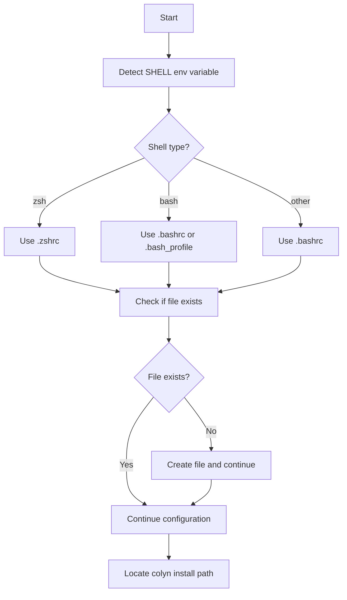
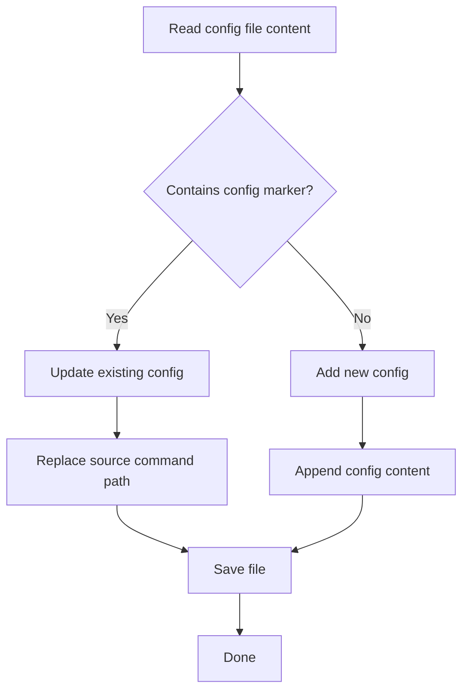

# System Integration Command Design Document

**Created**: 2026-01-24
**Last Updated**: 2026-01-24
**Command Name**: `colyn system-integration`
**Status**: ✅ Implemented (with completion script support)

---

## 1. Requirements Overview

### 1.1 Background

After users install colyn globally via `npm install -g colyn`, the colyn command is available but lacks the following features:
- Shell function wrapper (supporting `cd` directory switching)
- Command auto-completion (Tab key completion)

Users need to manually configure their shell to use full functionality, which is tedious.

### 1.2 User Goals

Provide a simple command that automatically completes shell integration and completion script configuration, allowing users to quickly start using colyn's full functionality.

### 1.3 Core Value

- ✅ **One-click configuration**: No manual editing of shell config files
- ✅ **Smart detection**: Automatically detect shell type and config file
- ✅ **Completion support**: Auto-configure corresponding completion script (bash/zsh)
- ✅ **Safe updates**: Won't add duplicate configs, supports updating existing configs
- ✅ **Clear prompts**: Inform users of configuration results and next steps

---

## 2. User Scenarios

### 2.1 Scenario 1: First-time Installation Configuration

**User situation**: Just installed colyn globally via npm

```bash
# Install colyn
$ npm install -g colyn

# Configure shell integration
$ colyn system-integration

Detecting system environment...
✓ Shell type: zsh
✓ Config file: /Users/username/.zshrc
✓ Colyn install path: /Users/username/.volta/tools/image/packages/colyn/lib/node_modules/colyn

Configuring shell integration...
✓ Added shell integration to ~/.zshrc
✓ Added completion script to ~/.zshrc

✓ Installation complete!

To apply configuration:
  Option 1 (recommended): Reopen terminal
  Option 2: Run command: source ~/.zshrc

Features enabled:
  ✓ colyn command supports automatic directory switching
  ✓ Use Tab key to auto-complete commands and arguments
```

### 2.2 Scenario 2: Updating Existing Configuration

**User situation**: Previously configured, need to update after colyn upgrade

```bash
$ colyn system-integration

Detecting system environment...
✓ Shell type: zsh
✓ Config file: /Users/username/.zshrc
✓ Colyn install path: /Users/username/.volta/tools/image/packages/colyn/lib/node_modules/colyn

Configuring shell integration...
✓ Updated shell integration config in ~/.zshrc
✓ Updated completion script config

✓ Update complete!

To apply configuration:
  Run command: source ~/.zshrc
```

### 2.3 Scenario 3: Config File Doesn't Exist

**User situation**: First time using shell, config file doesn't exist yet

```bash
$ colyn system-integration

Detecting system environment...
✓ Shell type: bash
⚠ Config file doesn't exist: /Users/username/.bashrc

Configuring shell integration...
✓ Created ~/.bashrc
✓ Added shell integration to ~/.bashrc

✓ Installation complete!

To apply configuration:
  Run command: source ~/.bashrc
```

---

## 3. Feature Requirements

### 3.1 Environment Detection



**Detection Logic**:

1. **Shell Type Detection**:
   - Read `process.env.SHELL`
   - If contains `zsh` → `.zshrc`
   - If contains `bash` → `.bashrc` or `.bash_profile` (by priority)
   - Default → `.bashrc`

2. **Config File Detection**:
   - Detect multiple candidate files by priority
   - Use the first existing file
   - If none exist, create default file

3. **Colyn Path Detection**:
   - Get current module path via `__dirname` or `import.meta.url`
   - Locate `shell/colyn.sh` file

### 3.2 Configuration Update Logic



**Config Marker**: `# Colyn shell integration`

**Config Content**:
```bash
# Colyn shell integration
source "/path/to/colyn/shell/colyn.sh"
```

**Update Strategy**:
- If contains marker: Update `source` line path
- If doesn't contain marker: Append new config to end of file
- Keep other content unchanged

### 3.3 Output Information

Three phases:

1. **Detection Phase**:
   ```
   Detecting system environment...
   ✓ Shell type: zsh
   ✓ Config file: ~/.zshrc
   ✓ Colyn install path: /path/to/colyn
   ```

2. **Configuration Phase**:
   ```
   Configuring shell integration...
   ✓ Added shell integration to ~/.zshrc
   ```

3. **Completion Phase**:
   ```
   ✓ Installation complete!

   To apply configuration:
     Run command: source ~/.zshrc

   Features enabled:
     ✓ colyn command supports automatic directory switching
     ✓ Use Tab key to auto-complete commands and arguments
   ```

---

## 4. Input and Output

### 4.1 User Input

| Input | Required | Description |
|-------|----------|-------------|
| No parameters | - | Command accepts no parameters or options |

### 4.2 System Output

**Standard output (stderr)**:
- Detection information
- Configuration progress
- Success/error prompts
- Next steps guidance

**JSON output (stdout)**:
```json
{
  "success": true
}
```

---

## 5. Error Handling

### 5.1 Common Errors

| Error Scenario | User Sees | How to Resolve |
|---------------|-----------|----------------|
| **Cannot find colyn.sh** | ✗ Cannot find shell integration script<br/>Path: /path/to/shell/colyn.sh | Check if colyn installation is complete<br/>Reinstall: npm install -g colyn |
| **Cannot write config file** | ✗ Cannot write config file<br/>File: ~/.zshrc<br/>Error: Permission denied | Check file permissions<br/>Or manually add configuration |
| **Windows platform** | ⚠ Windows platform auto-configuration not yet supported<br/>Please refer to documentation for manual configuration | See Windows configuration instructions in README.md |

---

## 6. Non-functional Requirements

### 6.1 Performance Requirements

- Configuration process should complete within 1 second
- Should not modify original formatting of config file (keep line breaks, indentation)

### 6.2 Compatibility Requirements

- Support macOS, Linux
- Support bash, zsh
- Windows platform shows prompt, auto-configuration not yet supported

### 6.3 Security Requirements

- Don't overwrite other content in user's config file
- Only modify colyn-related configuration when updating
- Backup mechanism (optional): Create `.bak` backup before configuration

---

## 7. Acceptance Criteria

### 7.1 Basic Functionality

- [x] Detect user's shell type (bash/zsh)
- [x] Detect shell config file path
- [x] Locate colyn.sh file path
- [x] First-time configuration: Add source command to config file
- [x] Update configuration: Replace existing source command path
- [x] Auto-create config file when it doesn't exist

### 7.2 Output Information

- [x] Display detected environment information
- [x] Display configuration progress (using ✓/✗ icons)
- [x] Provide guidance on applying configuration on success
- [x] Provide clear error messages and solutions on failure

### 7.3 Error Handling

- [x] Show error prompt when colyn.sh not found
- [x] Show error prompt when cannot write config file
- [x] Show not-yet-supported prompt on Windows platform

---

## 8. Out of Scope

The following features are not included in this requirement:

- ❌ Windows platform auto-configuration
- ❌ Fish shell support
- ❌ Uninstall feature (removing config from config file)
- ❌ Custom config file path
- ❌ Interactive config file selection

---

## 9. FAQ

### Q1: Why doesn't it support Windows?

A: Windows shell environments (PowerShell/CMD) are significantly different from Unix shells and require separate configuration design. Current version supports macOS and Linux first.

### Q2: What if I have multiple shell config files?

A: The command will select the first existing config file by priority. If you use multiple shells, you can run `colyn system-integration` multiple times, or manually add configuration to other files.

### Q3: Will configuration break my existing shell config?

A: No. The command only:
- Adds colyn-related config (if doesn't exist)
- Updates colyn config path (if exists)
- Won't modify any other configuration

### Q4: How do I uninstall the configuration?

A: Current version doesn't provide automatic uninstall. You can manually edit the config file and delete lines containing the `# Colyn shell integration` marker.

### Q5: Why doesn't it work after configuration?

A: You need to reload the config file. You can:
1. Reopen terminal (recommended)
2. Run `source ~/.zshrc` (or corresponding config file)

---

## 10. Implementation Details

### 10.1 File Structure

```
src/commands/
  install.ts              # install command main file
  install.helpers.ts      # helper functions
```

### 10.2 Core Functions

```typescript
// Detect shell config file
async function detectShellConfig(): Promise<string>

// Locate colyn.sh path
function getColynShellPath(): string

// Add/update configuration
async function updateShellConfig(
  configPath: string,
  colynShellPath: string
): Promise<'added' | 'updated'>
```

---

## 11. Summary

`colyn system-integration` command core value:

✅ **One-click configuration**: Automatically complete shell integration
✅ **Smart detection**: Auto-identify shell type and config file
✅ **Safe updates**: Support updating config without affecting other content
✅ **Clear prompts**: Provide clear guidance for next steps

Through this command, users can quickly start using colyn's full functionality without manual configuration.
