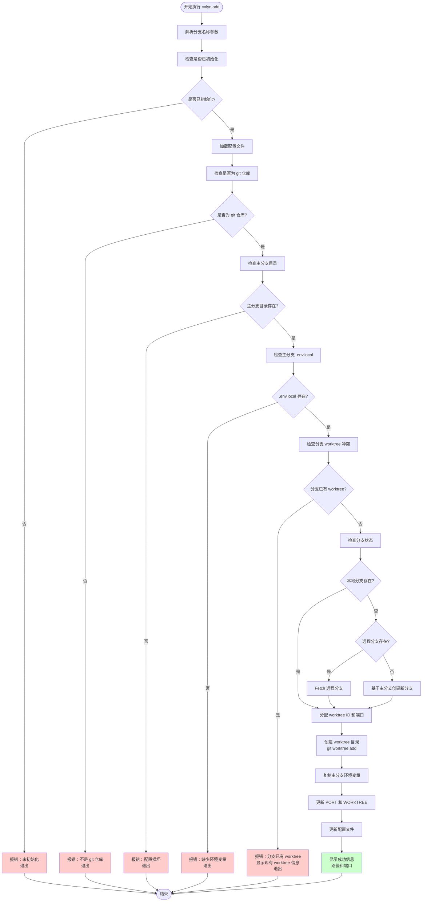

# Add 命令详细设计文档

**创建时间**：2026-01-14
**命令名称**：`colyn add`
**状态**：设计阶段

---

## 1. 命令概述

`colyn add` 命令用于创建新的 worktree，用于并行开发不同的分支。每个 worktree 会：

1. 创建独立的工作目录（`worktrees/task-{id}/`）
2. 切换到指定分支（如果分支不存在则创建）
3. 配置独立的环境变量文件（.env.local）
4. 自动分配端口号（mainPort + id）

**核心特性：**

- ✅ 自动分配 worktree ID 和端口
- ✅ 智能处理本地/远程分支
- ✅ 复制主分支的所有环境变量
- ✅ 自动配置 PORT 和 WORKTREE 变量
- ✅ 完善的前置检查和错误处理

---

## 2. 命令参数

### 2.1 命令格式

```bash
colyn add <branch-name>
```

### 2.2 位置参数

| 参数 | 类型 | 必填 | 说明 |
|------|------|------|------|
| `<branch-name>` | string | 是 | 要创建 worktree 的分支名称 |

### 2.3 参数说明

- **branch-name**: Git 分支名称
  - 如果本地不存在该分支，则基于主分支创建
  - 如果远程存在该分支但本地不存在，则自动 fetch 远程分支
  - 分支名必须符合 Git 分支命名规范

### 2.4 使用示例

```bash
# 创建新分支的 worktree
colyn add feature/login

# 基于已有分支创建 worktree
colyn add bugfix/auth-error

# Fetch 远程分支并创建 worktree
colyn add origin/feature/payment
```

---

## 3. 前置检查

在创建 worktree 之前，需要进行一系列检查以确保环境正确。

### 3.1 检查列表

| 检查项 | 检查内容 | 失败处理 |
|--------|----------|----------|
| 是否已初始化 | 检查 `.colyn/config.json` 是否存在 | 报错退出，提示先运行 `colyn init` |
| 是否为 git 仓库 | 检查 `.git` 目录是否存在 | 报错退出，提示需要在 git 仓库中运行 |
| 主分支目录是否存在 | 检查主分支目录 | 报错退出，提示配置损坏 |
| 主分支 .env.local 是否存在 | 检查主分支目录下的 .env.local | 报错退出，提示先在主分支配置环境变量 |
| 分支是否已有 worktree | 检查配置中是否已存在该分支的 worktree | 报错退出，显示已有 worktree 的路径和 ID |

### 3.2 检查逻辑详解

#### 3.2.1 检查是否已初始化

```typescript
async function checkInitialized(rootDir: string): Promise<void> {
  const configPath = path.join(rootDir, '.colyn', 'config.json');

  try {
    await fs.access(configPath);
  } catch {
    throw new ColynError(
      '当前目录未初始化',
      '请先运行 colyn init 命令初始化项目'
    );
  }
}
```

#### 3.2.2 检查是否为 git 仓库

```typescript
async function checkIsGitRepo(): Promise<void> {
  const git = simpleGit();
  const isRepo = await git.checkIsRepo();

  if (!isRepo) {
    throw new ColynError(
      '当前目录不是 git 仓库',
      '请在 git 仓库中运行此命令'
    );
  }
}
```

#### 3.2.3 检查主分支 .env.local

```typescript
async function checkMainEnvFile(rootDir: string, mainDirName: string): Promise<void> {
  const mainDirPath = path.join(rootDir, mainDirName);
  const envFilePath = path.join(mainDirPath, '.env.local');

  try {
    await fs.access(envFilePath);
  } catch {
    throw new ColynError(
      '主分支目录缺少 .env.local 文件',
      '请先在主分支目录配置环境变量'
    );
  }
}
```

#### 3.2.4 检查分支是否已有 worktree

```typescript
async function checkBranchWorktreeConflict(
  config: ColynConfig,
  branch: string
): Promise<void> {
  const existingWorktree = config.worktrees.find(w => w.branch === branch);

  if (existingWorktree) {
    throw new ColynError(
      `分支 "${branch}" 已存在 worktree`,
      `ID: ${existingWorktree.id}, 路径: ${existingWorktree.path}`
    );
  }
}
```

---

## 4. 执行流程

### 4.1 整体流程图



### 4.2 详细步骤

#### 步骤 1: 解析分支名称

```typescript
async function addCommand(branchName: string): Promise<void> {
  if (!branchName || branchName.trim() === '') {
    throw new ColynError('分支名称不能为空', '请提供分支名称参数');
  }

  // 清理分支名称（去除 origin/ 等前缀）
  const cleanBranchName = branchName.replace(/^origin\//, '');

  // 验证分支名称格式
  if (!isValidBranchName(cleanBranchName)) {
    throw new ColynError(
      '无效的分支名称',
      '分支名称只能包含字母、数字、下划线、连字符和斜杠'
    );
  }

  // ...
}
```

#### 步骤 2: 执行前置检查

```typescript
const rootDir = process.cwd();

// 检查是否已初始化
await checkInitialized(rootDir);

// 加载配置
const config = await loadConfig(rootDir);

// 检查是否为 git 仓库
await checkIsGitRepo();

// 检查主分支目录
const mainDirName = path.basename(rootDir);
const mainDirPath = path.join(rootDir, mainDirName);
const mainDirExists = await fs.access(mainDirPath)
  .then(() => true)
  .catch(() => false);

if (!mainDirExists) {
  throw new ColynError('主分支目录不存在', '配置文件可能已损坏');
}

// 检查主分支 .env.local
await checkMainEnvFile(rootDir, mainDirName);

// 检查分支冲突
await checkBranchWorktreeConflict(config, cleanBranchName);
```

#### 步骤 3: 处理分支（本地/远程/新建）

```typescript
async function handleBranch(branchName: string, mainBranch: string): Promise<void> {
  const git = simpleGit();

  // 检查本地分支是否存在
  const branches = await git.branchLocal();
  const branchExists = branches.all.includes(branchName);

  if (branchExists) {
    // 本地分支存在，直接使用
    console.log(chalk.gray(`使用本地分支: ${branchName}`));
    return;
  }

  // 本地分支不存在，检查远程
  const spinner = ora('检查远程分支...').start();

  try {
    // Fetch 最新的远程分支信息
    await git.fetch();

    // 检查远程分支是否存在
    const remoteBranches = await git.branch(['-r']);
    const remoteBranchName = `origin/${branchName}`;
    const remoteExists = remoteBranches.all.includes(remoteBranchName);

    if (remoteExists) {
      // 远程分支存在，创建跟踪分支
      spinner.text = `从远程创建分支: ${branchName}`;
      await git.checkoutBranch(branchName, remoteBranchName);
      spinner.succeed(`已从远程创建分支: ${branchName}`);
    } else {
      // 远程也不存在，基于主分支创建新分支
      spinner.text = `基于主分支创建新分支: ${branchName}`;
      await git.checkoutLocalBranch(branchName);
      spinner.succeed(`已创建新分支: ${branchName}`);
    }
  } catch (error) {
    spinner.fail('分支处理失败');
    throw error;
  }
}
```

#### 步骤 4: 分配 ID 和端口

```typescript
function assignWorktreeIdAndPort(config: ColynConfig): { id: number; port: number } {
  const id = config.nextWorktreeId;
  const port = config.mainPort + id;

  return { id, port };
}
```

#### 步骤 5: 创建 Worktree

```typescript
async function createWorktree(
  rootDir: string,
  branchName: string,
  id: number
): Promise<string> {
  const spinner = ora('创建 worktree...').start();

  try {
    const worktreePath = path.join(rootDir, 'worktrees', `task-${id}`);
    const git = simpleGit();

    // 使用 git worktree add 命令
    await git.raw(['worktree', 'add', worktreePath, branchName]);

    spinner.succeed(`Worktree 创建完成: task-${id}`);
    return worktreePath;
  } catch (error) {
    spinner.fail('创建 worktree 失败');
    throw new ColynError(
      '创建 worktree 时发生错误',
      '请检查分支是否存在或 worktree 目录是否可写'
    );
  }
}
```

#### 步骤 6: 配置环境变量

```typescript
async function configureWorktreeEnv(
  mainDirPath: string,
  worktreePath: string,
  id: number,
  port: number
): Promise<void> {
  const spinner = ora('配置环境变量...').start();

  try {
    // 读取主分支的 .env.local
    const mainEnvPath = path.join(mainDirPath, '.env.local');
    const mainEnv = await readEnvFile(mainEnvPath);

    // 复制所有环境变量
    const worktreeEnv = { ...mainEnv };

    // 更新 PORT 和 WORKTREE
    worktreeEnv.PORT = port.toString();
    worktreeEnv.WORKTREE = id.toString();

    // 写入 worktree 的 .env.local
    const worktreeEnvPath = path.join(worktreePath, '.env.local');
    await writeEnvFile(worktreeEnvPath, worktreeEnv);

    spinner.succeed('环境变量配置完成');
  } catch (error) {
    spinner.fail('配置环境变量失败');
    throw error;
  }
}
```

#### 步骤 7: 更新配置文件

```typescript
async function updateConfigWithWorktree(
  rootDir: string,
  config: ColynConfig,
  worktreeInfo: WorktreeInfo
): Promise<void> {
  const spinner = ora('更新配置文件...').start();

  try {
    // 添加 worktree 信息
    config.worktrees.push(worktreeInfo);

    // 递增 nextWorktreeId
    config.nextWorktreeId += 1;

    // 保存配置
    await saveConfig(rootDir, config);

    spinner.succeed('配置文件更新完成');
  } catch (error) {
    spinner.fail('更新配置文件失败');
    throw error;
  }
}
```

#### 步骤 8: 显示成功信息

```typescript
function displayAddSuccess(
  id: number,
  branch: string,
  worktreePath: string,
  port: number
): void {
  console.log('');
  console.log(chalk.green(`✓ Worktree 创建成功！\n`));

  console.log(chalk.bold('Worktree 信息：'));
  console.log(`  ID: ${id}`);
  console.log(`  分支: ${branch}`);
  console.log(`  路径: ${worktreePath}`);
  console.log(`  端口: ${port}`);
  console.log('');

  console.log(chalk.bold('后续操作：'));
  console.log(chalk.cyan('  1. 进入 worktree 目录：'));
  console.log(`     cd ${worktreePath}`);
  console.log('');
  console.log(chalk.cyan('  2. 启动开发服务器（端口已自动配置）：'));
  console.log('     npm run dev');
  console.log('');
  console.log(chalk.cyan('  3. 查看所有 worktree：'));
  console.log('     colyn list');
  console.log('');
}
```

---

## 5. 主命令入口

```typescript
export async function addCommand(branchName: string): Promise<void> {
  try {
    // 步骤1: 验证和清理分支名称
    if (!branchName || branchName.trim() === '') {
      throw new ColynError('分支名称不能为空', '请提供分支名称参数');
    }

    const cleanBranchName = branchName.replace(/^origin\//, '');

    if (!isValidBranchName(cleanBranchName)) {
      throw new ColynError(
        '无效的分支名称',
        '分支名称只能包含字母、数字、下划线、连字符和斜杠'
      );
    }

    const rootDir = process.cwd();

    // 步骤2: 前置检查
    await checkInitialized(rootDir);
    const config = await loadConfig(rootDir);
    await checkIsGitRepo();

    const mainDirName = path.basename(rootDir);
    const mainDirPath = path.join(rootDir, mainDirName);

    const mainDirExists = await fs.access(mainDirPath)
      .then(() => true)
      .catch(() => false);

    if (!mainDirExists) {
      throw new ColynError('主分支目录不存在', '配置文件可能已损坏');
    }

    await checkMainEnvFile(rootDir, mainDirName);
    await checkBranchWorktreeConflict(config, cleanBranchName);

    // 步骤3: 处理分支（本地/远程/新建）
    await handleBranch(cleanBranchName, config.mainBranch);

    // 步骤4: 分配 ID 和端口
    const { id, port } = assignWorktreeIdAndPort(config);

    // 步骤5: 创建 worktree
    const worktreePath = await createWorktree(rootDir, cleanBranchName, id);

    // 步骤6: 配置环境变量
    await configureWorktreeEnv(mainDirPath, worktreePath, id, port);

    // 步骤7: 更新配置文件
    const worktreeInfo: WorktreeInfo = {
      id,
      branch: cleanBranchName,
      path: worktreePath,
      port,
      createdAt: new Date().toISOString()
    };

    await updateConfigWithWorktree(rootDir, config, worktreeInfo);

    // 步骤8: 显示成功信息
    displayAddSuccess(id, cleanBranchName, worktreePath, port);

  } catch (error) {
    if (error instanceof ColynError) {
      console.error(chalk.red(`\n✗ ${error.message}`));
      if (error.hint) {
        console.error(chalk.yellow(`  提示: ${error.hint}\n`));
      }
    } else if (error instanceof Error) {
      console.error(chalk.red(`\n✗ 错误: ${error.message}\n`));
    } else {
      console.error(chalk.red('\n✗ 未知错误\n'));
    }
    process.exit(1);
  }
}
```

---

## 6. 错误处理

### 6.1 错误类型

| 错误类型 | 触发条件 | 错误消息 | 处理方式 |
|---------|---------|---------|---------|
| 未初始化 | `.colyn/config.json` 不存在 | "当前目录未初始化" | 退出，提示运行 init |
| 不是 git 仓库 | 不是 git 仓库 | "当前目录不是 git 仓库" | 退出，提示需要 git |
| 主分支目录不存在 | 主分支目录缺失 | "主分支目录不存在" | 退出，提示配置损坏 |
| 缺少环境变量文件 | .env.local 不存在 | "主分支目录缺少 .env.local 文件" | 退出，提示配置环境变量 |
| 分支已有 worktree（当前项目） | 分支在配置中已存在 worktree | "分支已关联到现有 worktree" | 退出，显示 worktree 信息和操作建议 |
| 分支已有 worktree（其他项目） | 分支被其他项目使用 | "分支已被其他 worktree 使用" | 退出，显示使用路径和删除命令 |
| 无效的分支名称 | 分支名称格式错误 | "无效的分支名称" | 退出，提示格式要求 |
| 创建 worktree 失败 | git worktree add 失败 | "创建 worktree 时发生错误" | 退出，提示检查分支或目录权限 |
| 配置环境变量失败 | 写入 .env.local 失败 | "配置环境变量失败" | 退出，显示错误详情 |

### 6.2 分支冲突错误的详细处理

#### 6.2.1 当前项目中的分支冲突

如果分支在当前项目配置中已有 worktree：

```
✗ 分支 "feature/login" 已关联到现有 worktree
  提示: Worktree 信息：
  ID: 1
  路径: /Users/user/project/worktrees/task-1
  端口: 10001

提示：
  - 如果要切换到该 worktree，请使用: cd /Users/user/project/worktrees/task-1
  - 如果要删除该 worktree，请使用: colyn remove 1
  - 如果要使用不同的分支名，请重新运行 add 命令
```

#### 6.2.2 其他项目或手动创建的 worktree

如果分支被其他 colyn 项目或手动创建的 worktree 使用：

```
✗ 分支 "feature/login" 已被其他 worktree 使用
  提示: 该分支当前被以下 worktree 使用：
  /Users/user/other-project/worktrees/task-1

提示：
  - 这可能是其他 colyn 项目或手动创建的 worktree
  - 如果不再需要，请手动删除: git worktree remove "/Users/user/other-project/worktrees/task-1"
  - 或者使用不同的分支名
```

#### 6.2.3 无法确定路径的分支冲突

如果无法从错误信息中提取路径：

```
✗ 分支 "feature/login" 已被其他 worktree 使用
  提示：
  - 运行 "git worktree list" 查看所有 worktree
  - 删除不需要的 worktree: git worktree remove <path>
  - 或者使用不同的分支名
```

### 6.3 失败不回滚

根据需求，如果执行失败，**不进行自动回滚**：

1. 如果 worktree 创建成功但后续步骤失败，worktree 会保留
2. 用户可以手动删除失败的 worktree：`git worktree remove worktrees/task-X`
3. 或者重新运行 `colyn add` 命令（需要确保分支冲突已解决）

---

## 7. 输出格式

### 7.1 执行过程输出

```
使用本地分支: feature/login
✔ 创建 worktree: task-1
✔ 环境变量配置完成
✔ 配置文件更新完成
```

### 7.2 成功输出

```
✓ Worktree 创建成功！

Worktree 信息：
  ID: 1
  分支: feature/login
  路径: /Users/user/project/worktrees/task-1
  端口: 10001

后续操作：
  1. 进入 worktree 目录：
     cd /Users/user/project/worktrees/task-1

  2. 启动开发服务器（端口已自动配置）：
     npm run dev

  3. 查看所有 worktree：
     colyn list
```

### 7.3 错误输出示例

#### 未初始化错误

```
✗ 当前目录未初始化
  提示: 请先运行 colyn init 命令初始化项目
```

#### 分支冲突错误

```
✗ 分支 "feature/login" 已存在 worktree
  提示: ID: 1, 路径: /Users/user/project/worktrees/task-1
```

#### 缺少环境变量错误

```
✗ 主分支目录缺少 .env.local 文件
  提示: 请先在主分支目录配置环境变量
```

---

## 8. 辅助函数

### 8.1 分支名称验证

```typescript
function isValidBranchName(branchName: string): boolean {
  // Git 分支名称规则
  // 允许: 字母、数字、下划线、连字符、斜杠
  // 不允许: 空格、特殊字符、连续的点
  const branchNameRegex = /^[a-zA-Z0-9_\-\/]+$/;

  if (!branchNameRegex.test(branchName)) {
    return false;
  }

  // 不能以 / 开头或结尾
  if (branchName.startsWith('/') || branchName.endsWith('/')) {
    return false;
  }

  // 不能包含连续的斜杠
  if (branchName.includes('//')) {
    return false;
  }

  return true;
}
```

### 8.2 环境变量文件读取

```typescript
async function readEnvFile(filePath: string): Promise<Record<string, string>> {
  const content = await fs.readFile(filePath, 'utf-8');
  const env: Record<string, string> = {};

  const lines = content.split('\n');
  for (const line of lines) {
    const trimmed = line.trim();

    // 跳过注释和空行
    if (trimmed.startsWith('#') || trimmed === '') {
      continue;
    }

    // 解析环境变量
    const match = trimmed.match(/^([^=]+)=(.*)$/);
    if (match) {
      const key = match[1].trim();
      const value = match[2].trim();
      env[key] = value;
    }
  }

  return env;
}
```

### 8.3 环境变量文件写入

```typescript
async function writeEnvFile(
  filePath: string,
  env: Record<string, string>
): Promise<void> {
  const lines: string[] = [];

  // 添加注释
  lines.push('# Environment variables for this worktree');
  lines.push('# Auto-generated by colyn');
  lines.push('');

  // 写入环境变量
  for (const [key, value] of Object.entries(env)) {
    lines.push(`${key}=${value}`);
  }

  lines.push(''); // 末尾空行

  await fs.writeFile(filePath, lines.join('\n'), 'utf-8');
}
```

---

## 9. 测试用例

### 9.1 单元测试

#### 测试 1: 分支名称验证

```typescript
describe('isValidBranchName', () => {
  it('应该接受有效的分支名称', () => {
    expect(isValidBranchName('feature/login')).toBe(true);
    expect(isValidBranchName('bugfix/auth-error')).toBe(true);
    expect(isValidBranchName('hotfix_123')).toBe(true);
  });

  it('应该拒绝无效的分支名称', () => {
    expect(isValidBranchName('/feature/login')).toBe(false); // 以 / 开头
    expect(isValidBranchName('feature/login/')).toBe(false); // 以 / 结尾
    expect(isValidBranchName('feature//login')).toBe(false); // 连续的 /
    expect(isValidBranchName('feature login')).toBe(false); // 包含空格
  });
});
```

#### 测试 2: ID 和端口分配

```typescript
describe('assignWorktreeIdAndPort', () => {
  it('应该基于配置分配正确的 ID 和端口', () => {
    const config: ColynConfig = {
      version: '1.0.0',
      mainBranch: 'main',
      mainPort: 10000,
      nextWorktreeId: 3,
      worktrees: []
    };

    const { id, port } = assignWorktreeIdAndPort(config);

    expect(id).toBe(3);
    expect(port).toBe(10003);
  });
});
```

#### 测试 3: 环境变量读取和写入

```typescript
describe('readEnvFile and writeEnvFile', () => {
  it('应该正确读取环境变量文件', async () => {
    const testFile = '/tmp/test.env';
    await fs.writeFile(testFile, 'PORT=3000\nWORKTREE=main\n', 'utf-8');

    const env = await readEnvFile(testFile);

    expect(env.PORT).toBe('3000');
    expect(env.WORKTREE).toBe('main');
  });

  it('应该正确写入环境变量文件', async () => {
    const testFile = '/tmp/test-write.env';
    const env = { PORT: '10001', WORKTREE: '1' };

    await writeEnvFile(testFile, env);

    const content = await fs.readFile(testFile, 'utf-8');
    expect(content).toContain('PORT=10001');
    expect(content).toContain('WORKTREE=1');
  });
});
```

### 9.2 集成测试

#### 测试场景 1: 创建新分支的 worktree

```typescript
describe('add command - create new branch', () => {
  it('应该成功创建新分支的 worktree', async () => {
    // 准备：初始化项目，配置主分支环境变量
    // 执行：运行 colyn add feature/test
    // 验证：
    // 1. worktree 目录存在
    // 2. 分支已创建
    // 3. .env.local 存在且内容正确
    // 4. 配置文件已更新
    // 5. ID 和端口正确分配
  });
});
```

#### 测试场景 2: 基于已有本地分支创建 worktree

```typescript
describe('add command - existing local branch', () => {
  it('应该使用已有本地分支创建 worktree', async () => {
    // 准备：创建一个本地分支
    // 执行：运行 colyn add <existing-branch>
    // 验证：使用已有分支，不创建新分支
  });
});
```

#### 测试场景 3: Fetch 远程分支

```typescript
describe('add command - fetch remote branch', () => {
  it('应该 fetch 远程分支并创建 worktree', async () => {
    // 准备：删除本地分支，保留远程分支
    // 执行：运行 colyn add <remote-branch>
    // 验证：
    // 1. 执行了 git fetch
    // 2. 创建了跟踪远程的本地分支
    // 3. worktree 创建成功
  });
});
```

#### 测试场景 4: 错误处理

```typescript
describe('add command - error handling', () => {
  it('应该在未初始化时报错', async () => {
    // 准备：未运行 init 的项目
    // 执行：运行 colyn add feature/test
    // 验证：报错提示未初始化
  });

  it('应该在分支已有 worktree 时报错', async () => {
    // 准备：创建一个 worktree
    // 执行：尝试为同一分支再次创建 worktree
    // 验证：报错并显示已有 worktree 信息
  });

  it('应该在缺少 .env.local 时报错', async () => {
    // 准备：删除主分支的 .env.local
    // 执行：运行 colyn add feature/test
    // 验证：报错提示缺少环境变量文件
  });
});
```

---

## 10. 实现检查清单

- [ ] 实现辅助函数
  - [ ] isValidBranchName - 分支名称验证
  - [ ] readEnvFile - 读取环境变量文件
  - [ ] writeEnvFile - 写入环境变量文件
  - [ ] assignWorktreeIdAndPort - 分配 ID 和端口
- [ ] 实现前置检查函数
  - [ ] checkInitialized - 检查是否已初始化
  - [ ] checkIsGitRepo - 检查是否为 git 仓库
  - [ ] checkMainEnvFile - 检查主分支 .env.local
  - [ ] checkBranchWorktreeConflict - 检查分支冲突
- [ ] 实现核心逻辑
  - [ ] handleBranch - 处理分支（本地/远程/新建）
  - [ ] createWorktree - 创建 worktree
  - [ ] configureWorktreeEnv - 配置环境变量
  - [ ] updateConfigWithWorktree - 更新配置文件
- [ ] 实现输出展示
  - [ ] displayAddSuccess - 显示成功信息
  - [ ] 各步骤的 spinner
- [ ] 编写单元测试
- [ ] 编写集成测试
- [ ] 文档更新

---

## 11. 自动进入 Worktree 目录

### 11.1 技术限制

**Node.js 进程无法改变父 shell 的当前目录**。这是操作系统的基本限制：
- 子进程（Node.js）无法修改父进程（shell）的工作目录
- `process.chdir()` 只影响 Node.js 进程本身，不影响启动它的 shell

### 11.2 替代方案

#### 方案 1：Shell 函数封装（推荐）

创建一个 shell 函数来封装 `colyn add` 命令：

**Bash/Zsh** (`~/.bashrc` 或 `~/.zshrc`):
```bash
colyn-add() {
  # 调用 colyn add 并捕获 worktree 路径
  local output=$(colyn add "$@" 2>&1)
  local exit_code=$?

  # 显示输出
  echo "$output"

  # 如果成功，提取路径并切换
  if [ $exit_code -eq 0 ]; then
    local worktree_path=$(echo "$output" | grep "路径:" | awk '{print $2}')
    if [ -n "$worktree_path" ] && [ -d "$worktree_path" ]; then
      cd "$worktree_path"
      echo "已切换到: $worktree_path"
    fi
  fi

  return $exit_code
}
```

使用：
```bash
# 使用函数而不是直接调用 colyn
colyn-add feature/login   # 创建 worktree 并自动切换
```

#### 方案 2：输出 cd 命令（需要手动执行）

让 `colyn add` 在成功时输出一个可以直接执行的 `cd` 命令：

```typescript
function displayAddSuccess(
  id: number,
  branch: string,
  worktreePath: string,
  port: number
): void {
  console.log('');
  console.log(chalk.green(`✓ Worktree 创建成功！\n`));

  console.log(chalk.bold('Worktree 信息：'));
  console.log(`  ID: ${id}`);
  console.log(`  分支: ${branch}`);
  console.log(`  路径: ${worktreePath}`);
  console.log(`  端口: ${port}`);
  console.log('');

  // 输出可执行的 cd 命令
  console.log(chalk.bold('快速切换：'));
  console.log(chalk.cyan(`  cd ${worktreePath}`));
  console.log(chalk.gray('  （复制上面的命令并执行）'));
  console.log('');
}
```

用户可以：
1. 手动复制 `cd` 命令执行
2. 使用终端的"点击执行"功能（很多终端支持）

#### 方案 3：使用 `eval` 配合 shell 函数

创建一个辅助命令 `colyn-cd` 来提取路径：

**在 colyn 中添加 `--print-path` 选项**：
```typescript
// 如果使用 --print-path，只输出路径，不输出其他信息
if (options.printPath) {
  console.log(worktreePath);
  return;
}
```

**Shell 函数** (`~/.bashrc` 或 `~/.zshrc`):
```bash
ca() {  # ca = colyn add
  colyn add "$@" && cd "$(colyn add "$@" --print-path 2>/dev/null)"
}
```

#### 方案 4：tmux/screen 集成

对于使用 tmux 或 screen 的用户，可以：
1. 创建新窗口/面板
2. 在新窗口中自动进入 worktree 目录

```bash
# 在 tmux 中使用
colyn-add-tmux() {
  local branch=$1
  local output=$(colyn add "$branch")
  local worktree_path=$(echo "$output" | grep "路径:" | awk '{print $2}')

  if [ -n "$worktree_path" ]; then
    tmux new-window -c "$worktree_path" -n "$branch"
  fi
}
```

### 11.3 推荐实践

**当前推荐方案**：方案 1（Shell 函数封装）

优点：
- ✅ 用户体验最好（自动切换）
- ✅ 无需修改 colyn 代码
- ✅ 兼容性好（bash/zsh 通用）
- ✅ 可选（不影响直接使用 `colyn add`）

**未来可考虑**：
- 在安装脚本中提供 shell 函数的配置选项
- 文档中提供各种 shell 的函数示例
- 提供 `colyn setup-shell` 命令自动配置

### 11.4 实现计划

1. **文档更新**：在用户文档中添加 shell 函数的配置说明
2. **示例提供**：提供 bash、zsh、fish 的函数示例
3. **可选集成**：考虑在安装时询问用户是否自动配置 shell 函数

## 12. 后续优化

1. **智能端口检测**：检查端口是否已被占用，自动跳过
2. **自定义 worktree 目录名**：允许用户自定义目录名（而不是固定的 task-{id}）
3. **环境变量模板**：支持不同分支使用不同的环境变量模板
4. **自动安装依赖**：创建 worktree 后自动运行 npm install
5. **钩子支持**：支持在创建 worktree 前后执行自定义脚本

---

## 12. 依赖模块

### 12.1 需要的核心模块

| 模块 | 文件路径 | 说明 |
|------|---------|------|
| Config | src/core/config.ts | 配置文件管理（loadConfig, saveConfig） |
| Git | src/core/git.ts | Git 操作（checkIsRepo, branch, fetch, worktree） |
| Logger | src/utils/logger.ts | 日志输出 |
| Validator | src/utils/validate.ts | 输入验证 |

### 12.2 新增的辅助函数接口

```typescript
// src/commands/add.helpers.ts

export function isValidBranchName(branchName: string): boolean;

export async function readEnvFile(filePath: string): Promise<Record<string, string>>;

export async function writeEnvFile(
  filePath: string,
  env: Record<string, string>
): Promise<void>;

export function assignWorktreeIdAndPort(
  config: ColynConfig
): { id: number; port: number };

export async function checkInitialized(rootDir: string): Promise<void>;

export async function checkIsGitRepo(): Promise<void>;

export async function checkMainEnvFile(
  rootDir: string,
  mainDirName: string
): Promise<void>;

export async function checkBranchWorktreeConflict(
  config: ColynConfig,
  branch: string
): Promise<void>;

export async function handleBranch(
  branchName: string,
  mainBranch: string
): Promise<void>;

export async function createWorktree(
  rootDir: string,
  branchName: string,
  id: number
): Promise<string>;

export async function configureWorktreeEnv(
  mainDirPath: string,
  worktreePath: string,
  id: number,
  port: number
): Promise<void>;

export async function updateConfigWithWorktree(
  rootDir: string,
  config: ColynConfig,
  worktreeInfo: WorktreeInfo
): Promise<void>;

export function displayAddSuccess(
  id: number,
  branch: string,
  worktreePath: string,
  port: number
): void;
```

---

## 13. 目录结构变化

### 13.1 创建 worktree 前

```
my-project/
├── my-project/          # 主分支目录
│   ├── .env.local       # PORT=10000, WORKTREE=main
│   ├── src/
│   └── package.json
├── worktrees/           # 空目录
└── .colyn/
    └── config.json      # nextWorktreeId: 1, worktrees: []
```

### 13.2 创建 worktree 后

```
my-project/
├── my-project/          # 主分支目录
│   ├── .env.local       # PORT=10000, WORKTREE=main
│   ├── src/
│   └── package.json
├── worktrees/
│   └── task-1/          # 新创建的 worktree
│       ├── .env.local   # PORT=10001, WORKTREE=1
│       ├── src/
│       └── package.json
└── .colyn/
    └── config.json      # nextWorktreeId: 2, worktrees: [{ id: 1, ... }]
```

---

## 14. 总结

本文档详细定义了 `colyn add` 命令的所有实现细节，包括：

- ✅ 完整的前置检查逻辑
- ✅ 分支处理（本地/远程/新建）
- ✅ Worktree 创建流程
- ✅ 环境变量复制和配置
- ✅ ID 和端口自动分配
- ✅ 配置文件更新
- ✅ 全面的错误处理
- ✅ 清晰的输出格式
- ✅ 完整的测试用例
- ✅ 需要实现的辅助函数

通过本文档，开发者可以完整实现 `add` 命令的所有功能。
