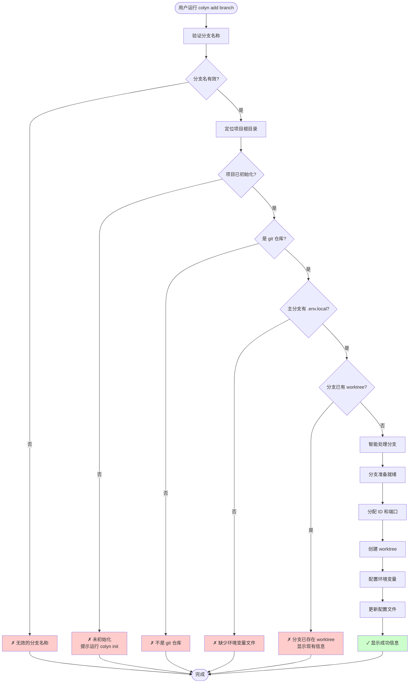
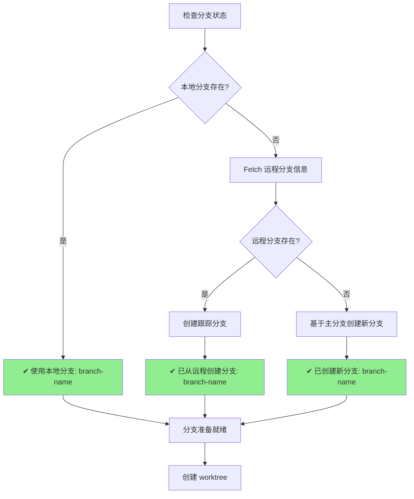
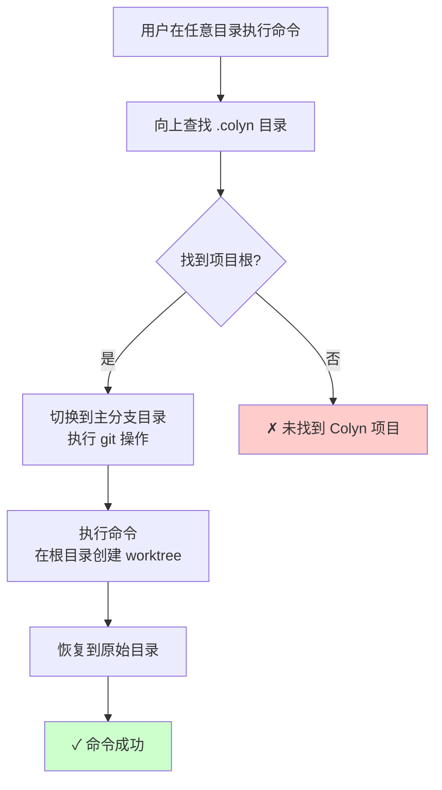
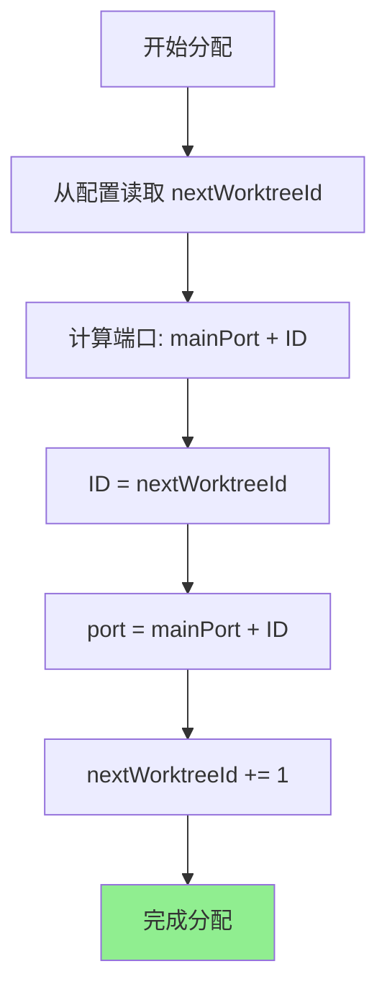
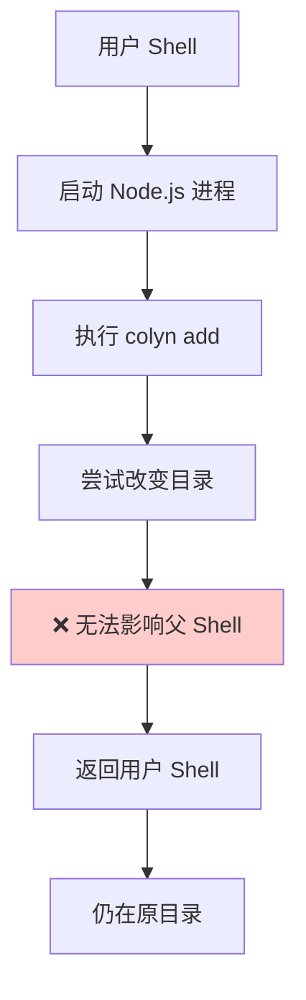
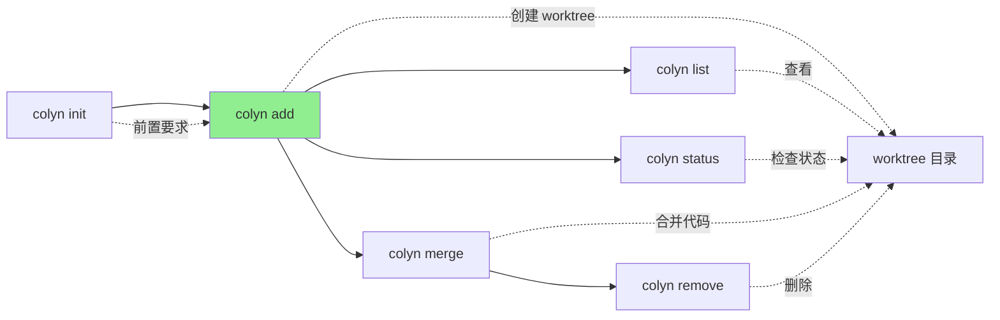

# Add 命令设计文档（用户交互视角）

**创建时间**：2026-01-14
**最后更新**：2026-01-15
**命令名称**：`colyn add`
**状态**：✅ 已实现

---

## 1. 命令概述

### 1.1 用户目标

用户希望为特定功能分支创建独立的开发环境（worktree），以便：
- 在不切换分支的情况下并行开发多个功能
- 每个功能使用独立的端口运行开发服务器
- 保持各个功能的开发状态互不干扰

### 1.2 命令使用

```bash
# 创建新分支的 worktree
colyn add feature/login

# 基于已有分支创建 worktree
colyn add bugfix/auth-error

# 从远程分支创建 worktree（会自动去除 origin/ 前缀）
colyn add origin/feature/payment
```

### 1.3 执行结果

创建一个新的 worktree：
- **目录位置**：`worktrees/task-{id}/`
- **分支**：指定的分支（如果不存在会自动创建）
- **端口**：自动分配（主端口 + worktree ID）
- **环境变量**：从主分支复制并更新 PORT 和 WORKTREE

**示例**：
```bash
$ colyn add feature/login

✔ 使用本地分支: feature/login
✔ Worktree 创建完成: task-1
✔ 环境变量配置完成
✔ 配置文件更新完成

✓ Worktree 创建成功！

Worktree 信息：
  ID: 1
  分支: feature/login
  路径: /Users/user/project/worktrees/task-1
  端口: 10001

后续操作：
  1. 进入 worktree 目录：
     cd /Users/user/project/worktrees/task-1

  2. 启动开发服务器（端口已自动配置）：
     npm run dev

  3. 查看所有 worktree：
     colyn list
```

---

## 2. 用户场景

### 2.1 场景 1：并行开发两个功能

**用户需求**：同时开发登录功能和仪表板功能

**操作流程**：

```bash
# 1. 创建登录功能 worktree
$ colyn add feature/login
✓ Worktree 创建成功！（ID: 1, 端口: 10001）

# 2. 创建仪表板功能 worktree
$ colyn add feature/dashboard
✓ Worktree 创建成功！（ID: 2, 端口: 10002）

# 3. 分别启动开发服务器
$ cd worktrees/task-1 && npm run dev  # 在 10001 端口
$ cd worktrees/task-2 && npm run dev  # 在 10002 端口
```

**结果**：两个功能在不同端口独立运行，可以同时测试。

---

### 2.2 场景 2：从远程分支创建 worktree

**用户需求**：团队成员创建了远程分支 `feature/payment`，我需要基于这个分支开发

**操作流程**：

```bash
$ colyn add feature/payment

检查远程分支...
✔ 已从远程创建分支: feature/payment
✔ Worktree 创建完成: task-3
✔ 环境变量配置完成
✔ 配置文件更新完成

✓ Worktree 创建成功！
```

**系统自动执行**：
1. Fetch 最新远程分支
2. 创建本地跟踪分支
3. 创建 worktree

---

### 2.3 场景 3：在 worktree 中创建新 worktree

**用户需求**：在 `worktrees/task-1` 目录中运行 `colyn add` 命令

**系统行为**：
- 自动定位项目根目录
- 在根目录的 `worktrees/` 中创建新 worktree
- 用户不需要手动切换到根目录

```bash
$ cd worktrees/task-1
$ colyn add feature/new-feature

✓ Worktree 创建成功！（自动在项目根目录的 worktrees/ 中创建）
```

---

## 3. 用户交互流程

### 3.1 整体流程图



### 3.2 分支智能处理流程

系统如何处理不同的分支情况：



**用户看到的消息**：

| 情况 | 用户看到 |
|------|---------|
| 本地分支已存在 | `使用本地分支: feature/login` |
| 远程分支存在 | `检查远程分支...` <br/> `✔ 已从远程创建分支: feature/login` |
| 分支不存在 | `检查远程分支...` <br/> `✔ 已创建新分支: feature/login` |

---

## 4. 从项目任意位置运行

`colyn add` 支持从项目的任意位置运行：



**示例**：
```bash
# 在 worktree 子目录中运行
$ cd worktrees/task-1/src/components
$ colyn add feature/new-button

✓ Worktree 创建成功！  # 在项目根的 worktrees/ 中创建
```

---

## 5. 输入与输出

### 5.1 用户输入

| 输入内容 | 说明 | 验证规则 |
|---------|------|---------|
| 分支名称 | Git 分支名称（位置参数） | - 不能为空<br/>- 只能包含字母、数字、下划线、连字符和斜杠<br/>- 不能以 `/` 开头或结尾<br/>- 不能包含连续的 `//` |

**分支名称处理**：
- `origin/feature/login` → `feature/login`（自动去除 `origin/` 前缀）
- `feature/user-auth` → ✓ 有效
- `feature//invalid` → ✗ 无效（连续斜杠）

### 5.2 系统输出

**进度信息**：
```
✔ 使用本地分支: feature/login
✔ Worktree 创建完成: task-1
✔ 环境变量配置完成
✔ 配置文件更新完成
```

**成功信息**：
```
✓ Worktree 创建成功！

Worktree 信息：
  ID: 1
  分支: feature/login
  路径: /path/to/worktrees/task-1
  端口: 10001

后续操作：
  1. 进入 worktree 目录：
     cd /path/to/worktrees/task-1

  2. 启动开发服务器（端口已自动配置）：
     npm run dev

  3. 查看所有 worktree：
     colyn list
```

---

## 6. 错误处理

### 6.1 常见错误及解决方案

| 错误场景 | 用户看到 | 如何解决 |
|---------|---------|---------|
| **未初始化** | ✗ 当前目录未初始化<br/>提示：请先运行 colyn init 命令初始化项目 | 运行 `colyn init` |
| **不是 git 仓库** | ✗ 当前目录不是 git 仓库<br/>提示：请在 git 仓库中运行此命令 | 在主分支目录中运行 `git init`<br/>或者确保在 git 仓库中运行命令 |
| **缺少环境变量文件** | ✗ 主分支目录缺少 .env.local 文件<br/>提示：请先在主分支目录配置环境变量 | 在主分支目录创建 `.env.local` 文件 |
| **分支名称无效** | ✗ 无效的分支名称<br/>提示：分支名称只能包含字母、数字、下划线、连字符和斜杠 | 使用有效的分支名称 |

### 6.2 分支冲突错误（详细）

#### 6.2.1 当前项目中已有该分支的 worktree

```
✗ 分支 "feature/login" 已关联到现有 worktree
  提示: Worktree 信息：
  ID: 1
  路径: /Users/user/project/worktrees/task-1
  端口: 10001

提示：
  - 如果要切换到该 worktree，请使用: cd /Users/user/project/worktrees/task-1
  - 如果要删除该 worktree，请使用: colyn remove 1
  - 如果要使用不同的分支名，请重新运行 add 命令
```

**解决方案**：
- 切换到已有的 worktree
- 删除旧的 worktree 后重新创建
- 使用不同的分支名

---

#### 6.2.2 分支被其他项目使用

```
✗ 分支 "feature/login" 已被其他 worktree 使用
  提示: 该分支当前被以下 worktree 使用：
  /Users/user/other-project/worktrees/task-1

提示：
  - 这可能是其他 colyn 项目或手动创建的 worktree
  - 如果不再需要，请手动删除: git worktree remove "/Users/user/other-project/worktrees/task-1"
  - 或者使用不同的分支名
```

**解决方案**：
- 删除其他项目的 worktree
- 使用不同的分支名

---

#### 6.2.3 无法确定冲突路径

```
✗ 分支 "feature/login" 已被其他 worktree 使用
  提示：
  - 运行 "git worktree list" 查看所有 worktree
  - 删除不需要的 worktree: git worktree remove <path>
  - 或者使用不同的分支名
```

**解决方案**：
- 运行 `git worktree list` 查看所有 worktree
- 手动删除冲突的 worktree

---

### 6.3 错误处理原则

- **明确指出问题**：告诉用户具体是什么错误
- **提供上下文**：显示相关的信息（路径、ID、端口等）
- **给出解决方案**：提供可直接执行的命令或操作步骤

---

## 7. 成功后的项目状态

### 7.1 目录结构变化

**创建前**：
```
project-root/
├── project-name/        # 主分支
├── worktrees/           # 空目录
└── .colyn/
    └── config.json
```

**创建后**（假设创建了 ID 为 1 的 worktree）：
```
project-root/
├── project-name/        # 主分支
├── worktrees/
│   └── task-1/         # 新创建的 worktree
│       ├── src/
│       ├── .env.local  # PORT=10001, WORKTREE=1
│       └── ...
└── .colyn/
    └── config.json     # 更新了 worktrees 数组
```

### 7.2 配置文件更新

**`.colyn/config.json` 变化**：

创建前：
```json
{
  "version": "1.0.0",
  "mainBranch": "main",
  "mainPort": 10000,
  "nextWorktreeId": 1,
  "worktrees": []
}
```

创建后：
```json
{
  "version": "1.0.0",
  "mainBranch": "main",
  "mainPort": 10000,
  "nextWorktreeId": 2,     // 递增
  "worktrees": [
    {
      "id": 1,
      "branch": "feature/login",
      "path": "/full/path/to/worktrees/task-1",
      "port": 10001,
      "createdAt": "2026-01-15T10:30:00.000Z"
    }
  ]
}
```

### 7.3 环境变量文件

**`worktrees/task-1/.env.local`**：

```env
# Environment variables for this worktree
# Auto-generated by colyn

PORT=10001
WORKTREE=1

# ... 其他从主分支复制的环境变量
```

**规则**：
- 复制主分支 `.env.local` 的所有内容
- 更新 `PORT` 为分配的端口（主端口 + ID）
- 更新 `WORKTREE` 为 worktree ID
- 保留所有注释和其他环境变量

---

## 8. ID 和端口分配规则

### 8.1 自动分配逻辑



**示例**：
- 主端口：10000
- 第一个 worktree：ID=1, port=10001
- 第二个 worktree：ID=2, port=10002
- 第三个 worktree：ID=3, port=10003

### 8.2 ID 不会重用

即使删除了某个 worktree，它的 ID 也不会被重用：

```
删除 worktree 1 后：
- 下一个创建的 worktree 仍然是 ID=4（不是 ID=1）
- 这样避免端口冲突和配置混乱
```

---

## 9. 特殊情况：自动进入 Worktree 目录

### 9.1 用户期望

用户希望 `colyn add` 命令执行后自动切换到新创建的 worktree 目录：

```bash
$ colyn add feature/login
✓ Worktree 创建成功！
$ pwd
/path/to/worktrees/task-1  # 自动切换到这里
```

### 9.2 技术限制

**无法实现**：Node.js 子进程无法改变父 shell 的当前目录。



这是操作系统的基本限制，不是 Colyn 的问题。

### 9.3 解决方案

#### 方案 1：Shell 函数封装（推荐）

在 `~/.bashrc` 或 `~/.zshrc` 中添加：

```bash
colyn-add() {
  # 调用 colyn add 并捕获输出
  local output=$(colyn add "$@" 2>&1)
  local exit_code=$?

  # 显示输出
  echo "$output"

  # 如果成功，提取路径并切换目录
  if [ $exit_code -eq 0 ]; then
    local worktree_path=$(echo "$output" | grep "路径:" | awk '{print $2}')
    if [ -n "$worktree_path" ] && [ -d "$worktree_path" ]; then
      cd "$worktree_path"
      echo "已切换到: $worktree_path"
    fi
  fi

  return $exit_code
}
```

**使用**：
```bash
$ colyn-add feature/login
✓ Worktree 创建成功！
已切换到: /path/to/worktrees/task-1

$ pwd
/path/to/worktrees/task-1
```

---

#### 方案 2：手动复制 cd 命令

用户看到成功信息后，复制并执行 `cd` 命令：

```bash
$ colyn add feature/login
✓ Worktree 创建成功！

后续操作：
  1. 进入 worktree 目录：
     cd /path/to/worktrees/task-1    # 复制这一行

$ cd /path/to/worktrees/task-1  # 粘贴执行
```

---

#### 方案 3：使用别名配合 eval

在 `~/.bashrc` 或 `~/.zshrc` 中添加：

```bash
alias colyn-add='colyn add'
```

然后使用自定义脚本：

```bash
#!/bin/bash
# ~/bin/colyn-cd-add.sh

output=$(colyn add "$@" 2>&1)
echo "$output"

if [ $? -eq 0 ]; then
  path=$(echo "$output" | grep "路径:" | awk '{print $2}')
  [ -n "$path" ] && echo "cd \"$path\""
fi
```

**使用**：
```bash
$ eval $(~/bin/colyn-cd-add.sh feature/login)
✓ Worktree 创建成功！
# 自动切换目录
```

---

### 9.4 推荐实践

1. **使用 Shell 函数**（方案 1）：最方便，一次配置永久使用
2. **提供配置脚本**：在安装时提示用户是否添加 shell 函数
3. **文档说明**：在 README 中明确说明限制和解决方案

---

## 10. 常见问题

### Q1: 创建 worktree 后如何切换到新目录？

A: 复制成功信息中的 `cd` 命令并执行，或者配置 Shell 函数（见第 9 节）。

### Q2: 端口号如何确定？

A: 端口号 = 主端口 + worktree ID。例如主端口 10000，第一个 worktree 端口是 10001。

### Q3: 可以为同一个分支创建多个 worktree 吗？

A: 不可以。Git 的限制是一个分支同时只能被一个 worktree 使用。

### Q4: 删除 worktree 后，ID 会被重用吗？

A: 不会。ID 递增，即使删除了 worktree，下一个 worktree 的 ID 仍然继续递增。

### Q5: 如果远程分支名和本地分支名不同怎么办？

A: 使用本地分支名。系统会检查本地分支是否存在，如果不存在则检查远程分支 `origin/<branch-name>`。

### Q6: 可以在 worktree 目录中运行 `colyn add` 吗？

A: 可以。系统会自动定位项目根目录，在根目录的 `worktrees/` 中创建新 worktree。

### Q7: 环境变量文件是否会覆盖我的自定义配置？

A: 不会。系统复制主分支的 `.env.local` 文件，只更新 `PORT` 和 `WORKTREE` 两个变量，保留所有其他配置。

### Q8: 如何查看我创建了哪些 worktree？

A: 运行 `colyn list` 命令（待实现）或查看 `.colyn/config.json` 文件。

---

## 11. 与其他命令的关系



**说明**：
- `init` 是 `add` 的前置要求
- `add` 创建 worktree
- 其他命令管理和操作已创建的 worktree

---

## 12. 总结

`colyn add` 命令设计重点：

1. **智能分支处理**：自动识别本地、远程、新建三种情况
2. **自动配置**：ID、端口、环境变量全自动处理
3. **从任意位置运行**：自动定位项目根目录
4. **完善的错误处理**：详细的错误信息和解决方案
5. **清晰的成功反馈**：显示所有关键信息和后续操作建议
6. **技术限制说明**：明确自动切换目录的限制并提供替代方案
