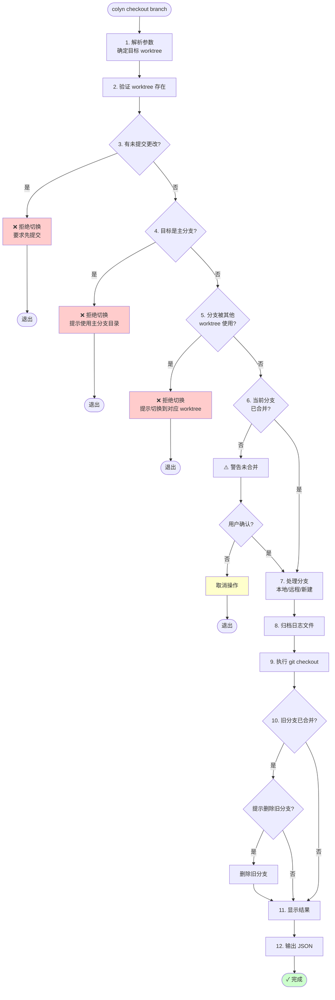

# Checkout 命令设计文档

## 概述

`colyn checkout` 命令用于在 worktree 中切换或创建分支，允许复用已有 worktree 进行不同分支的开发。

## 命令语法

```bash
# 完整命令
colyn checkout <worktree-id> <branch>
colyn checkout <branch>

# 别名
colyn co <worktree-id> <branch>
colyn co <branch>
```

### 参数说明

| 参数 | 必需 | 说明 |
|------|------|------|
| `worktree-id` | 可选 | 目标 worktree 的 ID，省略时使用当前 worktree |
| `branch` | 必需 | 要切换到的分支名 |

## 核心行为

### 前置检查

| 场景 | 行为 |
|------|------|
| 有未提交更改 | **拒绝切换**，要求先提交 |
| 当前分支未合并到主分支 | **警告并要求确认** |
| 目标分支是主分支 | **拒绝切换**，避免误操作 |
| 目标分支已在其他 worktree 使用 | **拒绝切换**，每个分支应只有一个工作目录 |

### 分支处理

| 场景 | 行为 |
|------|------|
| 本地分支存在 | 直接切换 |
| 远程分支存在 | 自动创建本地分支并跟踪远程 |
| 分支不存在 | 自动创建新分支 |

### 日志归档

切换分支成功后，自动归档当前分支的工作日志：

1. 检查 `.claude/logs/` 目录是否存在
2. 将该目录下**除 `archived/` 之外的所有文件和子目录**移动到 `.claude/logs/archived/{旧分支名}/`
3. 如果归档目录已存在，追加内容（不覆盖同名文件/目录）

```
切换前：
.claude/logs/
├── task-20260115.md
├── debug-notes.md
├── session-1/
│   └── trace.log
└── archived/
    └── feature-old/

切换后（从 feature/login 切换走）：
.claude/logs/
└── archived/
    ├── feature-old/
    └── feature-login/
        ├── task-20260115.md
        ├── debug-notes.md
        └── session-1/
            └── trace.log
```

### 旧分支清理

切换成功后，如果旧分支已合并到主分支，会提示用户是否删除旧分支：

```
✓ 分支 feature/old 已合并到主分支
? 是否删除旧分支 feature/old？ (Y/n)
```

### 执行后行为

- 自动切换到目标 worktree 目录（通过 shell 函数）

## 命令流程



## 输出示例

### 成功切换（旧分支已合并）

```
✓ 已切换到分支 feature/new-login

✓ 分支 feature/old 已合并到主分支
? 是否删除旧分支 feature/old？ (Y/n) y
✓ 已删除分支 feature/old

日志已归档到: .claude/logs/archived/feature-old/
旧分支 feature/old 已删除

当前状态：
  Worktree: task-1
  分支: feature/new-login
  路径: /path/to/worktrees/task-1
```

### 成功切换（旧分支未合并）

```
⚠ 当前分支 feature/old 尚未合并到主分支

如果切换分支，这些更改将保留在原分支上。
? 是否继续切换？ (y/N) y

✓ 已切换到分支 feature/new-login

日志已归档到: .claude/logs/archived/feature-old/

当前状态：
  Worktree: task-1
  分支: feature/new-login
  路径: /path/to/worktrees/task-1
```

### 有未提交更改

```
✗ worktree task-1 中有未提交的更改

变更文件 (3 个):
  - src/index.ts
  - src/utils.ts
  - package.json

提示：
  - 查看状态: cd "/path/to/task-1" && git status
  - 提交更改: git add . && git commit -m "..."
  - 或者暂存: git stash
```

### 目标分支已被使用

```
✗ 分支 feature/login 已在 task-2 中使用

提示: 请直接切换到 task-2 目录工作，或使用其他分支名
      cd "/path/to/worktrees/task-2"
```

### 目标是主分支

```
✗ 不能在 worktree 中切换到主分支

提示: 请直接使用主分支目录
      cd "/path/to/main"
```

## 退出码

| 退出码 | 说明 |
|--------|------|
| 0 | 成功 |
| 1 | 有未提交的更改 / Git 操作失败 |
| 2 | 目标分支是主分支 |
| 3 | 目标分支已被其他 worktree 使用 |
| 4 | 用户取消操作 |
