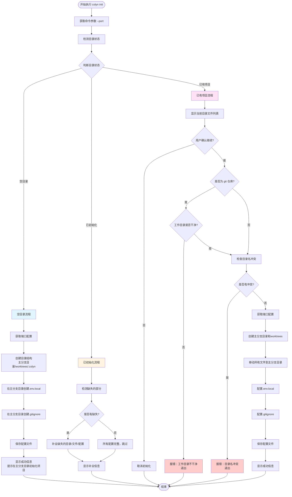

# Init 命令详细设计文档

**创建时间**：2026-01-14
**命令名称**：`colyn init`
**状态**：设计阶段

---

## 1. 命令概述

`colyn init` 命令用于初始化 worktree 管理结构。该命令会根据当前目录的状态采取不同的初始化策略。

**支持的三种目录状态：**

1. **空目录**：目录中完全为空，没有任何文件（包括隐藏文件）
   - 创建基础目录结构
   - 不需要移动文件
   - 提示用户在主分支目录中初始化项目

2. **已初始化目录**：包含主分支目录、worktrees 目录或 .colyn 配置目录
   - 检测缺失的部分并智能补全
   - 不移动任何文件
   - 更新或补全配置

3. **已有项目目录**：包含项目文件，但未初始化 colyn 结构
   - 移动所有文件到主分支目录
   - 创建 worktrees 目录和配置
   - 如果是 git 仓库，检查工作目录是否干净

---

## 2. 命令参数

### 2.1 命令格式

```bash
colyn init [options]
```

### 2.2 选项参数

| 参数 | 类型 | 必填 | 默认值 | 说明 |
|------|------|------|--------|------|
| `-p, --port <port>` | number | 否 | - | 主分支开发服务器端口号 |

### 2.3 参数说明

- **--port**: 如果提供此参数，则直接使用该值作为主分支的 PORT 环境变量
- **无 --port 参数**: 交互式询问用户输入，提供默认值 10000

### 2.4 使用示例

```bash
# 使用默认端口（交互式询问）
colyn init

# 指定端口
colyn init --port 3000

# 使用简写
colyn init -p 8080
```

---

## 3. 目录状态检测与分类

### 3.1 检测逻辑

在执行任何初始化操作前，首先需要准确判断当前目录的状态。

#### 3.1.1 检测步骤

```typescript
enum DirectoryStatus {
  Empty = 'empty',              // 空目录
  Initialized = 'initialized',  // 已初始化
  ExistingProject = 'existing'  // 已有项目
}

interface DirectoryInfo {
  status: DirectoryStatus;
  isEmpty: boolean;
  hasMainDir: boolean;
  hasWorktreesDir: boolean;
  hasConfigDir: boolean;
  hasGitRepo: boolean;
  fileCount: number;
  currentDirName: string;
}

async function detectDirectoryStatus(): Promise<DirectoryInfo> {
  const rootDir = process.cwd();
  const currentDirName = path.basename(rootDir);

  // 检查关键目录是否存在
  const mainDirPath = path.join(rootDir, currentDirName);
  const worktreesDirPath = path.join(rootDir, 'worktrees');
  const configDirPath = path.join(rootDir, '.colyn');

  const [hasMainDir, hasWorktreesDir, hasConfigDir] = await Promise.all([
    fs.access(mainDirPath).then(() => true).catch(() => false),
    fs.access(worktreesDirPath).then(() => true).catch(() => false),
    fs.access(configDirPath).then(() => true).catch(() => false),
  ]);

  // 检查是否为 git 仓库
  const git = simpleGit();
  const hasGitRepo = await git.checkIsRepo();

  // 统计目录中的文件数量（包括隐藏文件）
  const entries = await fs.readdir(rootDir);
  const fileCount = entries.length;

  // 判断是否为空目录（完全空，没有任何文件）
  const isEmpty = fileCount === 0;

  // 判断是否已初始化
  const isInitialized = hasMainDir || hasWorktreesDir || hasConfigDir;

  // 确定状态
  let status: DirectoryStatus;
  if (isEmpty) {
    status = DirectoryStatus.Empty;
  } else if (isInitialized) {
    status = DirectoryStatus.Initialized;
  } else {
    status = DirectoryStatus.ExistingProject;
  }

  return {
    status,
    isEmpty,
    hasMainDir,
    hasWorktreesDir,
    hasConfigDir,
    hasGitRepo,
    fileCount,
    currentDirName
  };
}
```

### 3.2 三种状态的判断标准

| 状态 | 判断条件 | 说明 |
|------|---------|------|
| 空目录 | `fileCount === 0` | 目录中没有任何文件（包括隐藏文件） |
| 已初始化 | 存在主分支目录、worktrees 或 .colyn 目录之一 | 已经执行过 init 命令 |
| 已有项目 | 有文件但不属于以上两种情况 | 包含项目文件的普通目录（包括只有隐藏文件） |

### 3.3 整体流程图



---

## 4. 针对不同状态的前置检查

根据目录状态的不同，需要进行不同的前置检查。

### 4.1 空目录状态的检查

| 检查项 | 说明 |
|--------|------|
| 无需特殊检查 | 空目录不需要检查工作目录状态或文件冲突 |

### 4.2 已初始化状态的检查

| 检查项 | 检查内容 | 失败处理 |
|--------|----------|----------|
| 检测缺失部分 | 检查主分支目录、worktrees、.colyn 目录是否完整 | - |
| 验证配置有效性 | 如果配置文件存在，验证格式是否正确 | 提示配置损坏 |

### 4.3 已有项目状态的检查

| 检查项 | 检查内容 | 失败处理 |
|--------|----------|----------|
| 显示文件列表 | 列出当前目录的所有文件（最多显示10个） | - |
| 用户确认 | 询问用户是否确认继续初始化 | 用户拒绝则退出 |
| 工作目录是否干净 | 仅当是 git 仓库时检查 | 报错退出，提示先提交 |
| 检查目录名冲突 | 检查主分支目录名是否与现有文件冲突 | 报错退出，提示重命名文件 |

### 4.4 检查逻辑详解

#### 4.4.1 工作目录是否干净（仅已有项目）

```typescript
async function checkWorkingDirectoryClean(): Promise<void> {
  const git = simpleGit();
  const status = await git.status();

  if (!status.isClean()) {
    throw new ColynError(
      '工作目录不干净，存在未提交的更改',
      '请先提交或 stash 更改后再运行 init 命令'
    );
  }
}
```

**注意：** 只在"已有项目"且是 git 仓库时才需要检查。

#### 4.4.2 检查目录名冲突（仅已有项目）

```typescript
async function checkDirectoryConflict(rootDir: string, mainDirName: string): Promise<void> {
  const mainDirPath = path.join(rootDir, mainDirName);

  try {
    const stats = await fs.stat(mainDirPath);

    // 如果已存在且是文件（不是目录），则报错
    if (stats.isFile()) {
      throw new ColynError(
        `主分支目录名 "${mainDirName}" 与现有文件冲突`,
        '请重命名该文件后再运行 init 命令'
      );
    }

    // 如果是目录，可能是已初始化的情况，不报错
  } catch (error) {
    // 文件/目录不存在，没有冲突
    if ((error as NodeJS.ErrnoException).code !== 'ENOENT') {
      throw error;
    }
  }
}
```

#### 4.4.3 检测主分支名称

```typescript
async function detectMainBranch(): Promise<string> {
  const git = simpleGit();

  try {
    // 尝试获取当前分支名
    const branchSummary = await git.branch();
    return branchSummary.current;
  } catch (error) {
    // 如果获取失败或不是 git 仓库，默认使用 'main'
    return 'main';
  }
}
```

---

## 5. 三种情况的执行流程

### 5.1 情况一：空目录流程

**适用条件：** 目录完全为空，没有任何文件（包括隐藏文件）

**执行步骤：**

1. 获取端口配置（--port 参数或交互式询问）
2. 创建目录结构
   - 创建主分支目录（与当前目录同名）
   - 创建 worktrees 目录
   - 创建 .colyn 目录
3. 在主分支目录创建 .env.local 文件
4. 在主分支目录创建 .gitignore 文件
5. 保存配置文件到 .colyn/config.json
6. 显示成功信息，提示用户在主分支目录中初始化项目

**代码示例：**

```typescript
async function handleEmptyDirectory(dirInfo: DirectoryInfo, port: number): Promise<void> {
  const rootDir = process.cwd();
  const mainDirName = dirInfo.currentDirName;
  const mainBranch = 'main'; // 空目录默认使用 main

  // 步骤1: 创建目录结构
  const spinner = ora('创建目录结构...').start();

  const mainDirPath = path.join(rootDir, mainDirName);
  const worktreesDirPath = path.join(rootDir, 'worktrees');
  const configDirPath = path.join(rootDir, '.colyn');

  await fs.mkdir(mainDirPath, { recursive: true });
  await fs.mkdir(worktreesDirPath, { recursive: true });
  await fs.mkdir(configDirPath, { recursive: true });

  spinner.succeed('目录结构创建完成');

  // 步骤2: 创建 .env.local
  await configureEnvFile(mainDirPath, port, 'main');

  // 步骤3: 创建 .gitignore
  await configureGitignore(mainDirPath);

  // 步骤4: 保存配置
  await saveConfig(rootDir, mainBranch, port);

  // 步骤5: 显示成功信息
  displayEmptyDirectorySuccess(mainDirName, port, mainBranch);
}

function displayEmptyDirectorySuccess(
  mainDirName: string,
  port: number,
  mainBranch: string
): void {
  console.log('\n');
  console.log(chalk.green('✓ 初始化成功！\n'));

  console.log(chalk.bold('目录结构：'));
  console.log(`  .`);
  console.log(`  ├── ${mainDirName}/          # 主分支目录（请在此目录中初始化项目）`);
  console.log(`  ├── worktrees/             # Worktree 目录`);
  console.log(`  └── .colyn/                # 配置目录`);
  console.log('');

  console.log(chalk.bold('后续操作：'));
  console.log(chalk.cyan(`  1. 进入主分支目录：`));
  console.log(`     cd ${mainDirName}`);
  console.log('');
  console.log(chalk.cyan('  2. 初始化 git 仓库（如果还没有）：'));
  console.log('     git init');
  console.log('');
  console.log(chalk.cyan('  3. 初始化你的项目（例如 npm/yarn init）'));
  console.log('');
  console.log(chalk.cyan('  4. 创建 worktree：'));
  console.log('     colyn add <branch-name>');
  console.log('');
}
```

### 5.2 情况二：已初始化流程

**适用条件：** 已存在主分支目录、worktrees 或 .colyn 目录

**执行步骤：**

1. 检测缺失的部分
2. 补全缺失的目录
3. 补全缺失的配置文件
4. 补全缺失的环境变量
5. 显示补全信息

**代码示例：**

```typescript
async function handleInitializedDirectory(
  dirInfo: DirectoryInfo,
  port: number
): Promise<void> {
  const rootDir = process.cwd();
  const mainDirName = dirInfo.currentDirName;
  const mainBranch = await detectMainBranch();

  console.log(chalk.yellow('⚠ 检测到已初始化，进入补全模式...\n'));

  const tasks: Array<{ name: string; action: () => Promise<void> }> = [];

  // 检查并补全主分支目录
  if (!dirInfo.hasMainDir) {
    tasks.push({
      name: `创建主分支目录: ${mainDirName}`,
      action: async () => {
        const mainDirPath = path.join(rootDir, mainDirName);
        await fs.mkdir(mainDirPath, { recursive: true });
      }
    });
  }

  // 检查并补全 worktrees 目录
  if (!dirInfo.hasWorktreesDir) {
    tasks.push({
      name: '创建 worktrees 目录',
      action: async () => {
        const worktreesDirPath = path.join(rootDir, 'worktrees');
        await fs.mkdir(worktreesDirPath, { recursive: true });
      }
    });
  }

  // 检查并补全配置目录和文件
  if (!dirInfo.hasConfigDir) {
    tasks.push({
      name: '创建配置文件',
      action: async () => {
        await saveConfig(rootDir, mainBranch, port);
      }
    });
  } else {
    // 配置文件存在，检查是否需要更新
    tasks.push({
      name: '检查并更新配置文件',
      action: async () => {
        await updateConfigIfNeeded(rootDir, mainBranch, port);
      }
    });
  }

  // 如果主分支目录存在，检查环境变量配置
  if (dirInfo.hasMainDir) {
    tasks.push({
      name: '检查并配置 .env.local',
      action: async () => {
        const mainDirPath = path.join(rootDir, mainDirName);
        await configureEnvFile(mainDirPath, port, 'main');
      }
    });

    tasks.push({
      name: '检查并配置 .gitignore',
      action: async () => {
        const mainDirPath = path.join(rootDir, mainDirName);
        await configureGitignore(mainDirPath);
      }
    });
  }

  // 执行补全任务
  for (const task of tasks) {
    const spinner = ora(task.name).start();
    try {
      await task.action();
      spinner.succeed();
    } catch (error) {
      spinner.fail();
      throw error;
    }
  }

  console.log(chalk.green('\n✓ 补全完成！\n'));

  if (tasks.length === 0) {
    console.log(chalk.gray('所有配置已完整，无需补全。\n'));
  }
}
```

### 5.3 情况三：已有项目流程

**适用条件：** 目录包含项目文件，但未初始化 colyn 结构

**执行步骤：**

1. 显示当前目录的文件列表
2. 询问用户确认是否继续（说明将移动所有文件到主分支目录）
3. 如果用户取消，则退出
4. 检查是否为 git 仓库，如果是则检查工作目录是否干净
5. 检查目录名冲突
6. 获取端口配置
7. 创建目录结构
8. 移动所有文件到主分支目录
9. 配置 .env.local
10. 配置 .gitignore
11. 保存配置文件
12. 显示成功信息

**代码示例：**

```typescript
async function handleExistingProject(
  dirInfo: DirectoryInfo,
  port: number
): Promise<void> {
  const rootDir = process.cwd();
  const mainDirName = dirInfo.currentDirName;

  // 步骤1: 显示当前目录的文件列表
  console.log(chalk.yellow('\n⚠ 检测到已有文件，将执行以下操作：'));
  console.log(chalk.gray('  1. 创建主分支目录和 worktrees 目录'));
  console.log(chalk.gray(`  2. 将当前目录所有文件移动到 ${mainDirName}/ 目录下\n`));

  const entries = await fs.readdir(rootDir);
  console.log(chalk.bold('当前目录文件列表：'));

  // 显示前10个文件，如果超过10个则显示省略
  const displayEntries = entries.slice(0, 10);
  displayEntries.forEach(entry => {
    console.log(chalk.gray(`  - ${entry}`));
  });

  if (entries.length > 10) {
    console.log(chalk.gray(`  ... 还有 ${entries.length - 10} 个文件`));
  }
  console.log('');

  // 步骤2: 询问用户确认
  const { confirmed } = await prompt<{ confirmed: boolean }>({
    type: 'confirm',
    name: 'confirmed',
    message: '确认继续初始化？',
    initial: false // 默认为否，需要用户主动确认
  });

  // 步骤3: 如果取消，退出
  if (!confirmed) {
    console.log(chalk.gray('已取消初始化'));
    return;
  }

  // 步骤4: 如果是 git 仓库，检查工作目录是否干净
  if (dirInfo.hasGitRepo) {
    await checkWorkingDirectoryClean();
  }

  // 步骤5: 检查目录名冲突
  await checkDirectoryConflict(rootDir, mainDirName);

  // 步骤6: 检测主分支名称
  const mainBranch = await detectMainBranch();

  // 步骤7: 创建目录结构
  await createDirectoryStructure(rootDir, mainDirName);

  // 步骤8: 移动文件
  await moveFilesToMainDir(rootDir, mainDirName);

  // 步骤9: 配置环境变量
  const mainDirPath = path.join(rootDir, mainDirName);
  await configureEnvFile(mainDirPath, port, 'main');

  // 步骤10: 配置 .gitignore
  await configureGitignore(mainDirPath);

  // 步骤11: 保存配置
  await saveConfig(rootDir, mainBranch, port);

  // 步骤12: 显示成功信息
  displaySuccessInfo(mainDirName, port, mainBranch);
}
```

---

## 6. 主命令入口

将三种情况整合到主命令中：

```typescript
async function initCommand(options: { port?: string }): Promise<void> {
  try {
    // 步骤1: 检测目录状态
    const dirInfo = await detectDirectoryStatus();

    // 步骤2: 获取端口配置
    const port = await getPortConfig(options);

    // 步骤3: 根据目录状态执行不同流程
    switch (dirInfo.status) {
      case DirectoryStatus.Empty:
        await handleEmptyDirectory(dirInfo, port);
        break;

      case DirectoryStatus.Initialized:
        await handleInitializedDirectory(dirInfo, port);
        break;

      case DirectoryStatus.ExistingProject:
        await handleExistingProject(dirInfo, port);
        break;
    }

  } catch (error) {
    if (error instanceof ColynError) {
      console.error(chalk.red(`\n✗ ${error.message}`));
      if (error.hint) {
        console.error(chalk.yellow(`  提示: ${error.hint}\n`));
      }
    } else if (error instanceof Error) {
      console.error(chalk.red(`\n✗ 错误: ${error.message}\n`));
    } else {
      console.error(chalk.red('\n✗ 未知错误\n'));
    }
    process.exit(1);
  }
}
```

---

## 7. 原有的执行流程章节（已废弃）

以下内容已被第5章节替代，保留仅供参考。

<details>
<summary>点击查看旧版流程</summary>

### 废弃的流程图

```
开始
  ↓
前置检查
  ├─ 检查工作目录是否干净 → 不干净 → 报错退出
  ├─ 检查是否已初始化 → 已初始化 → 智能补全模式
  ├─ 获取当前目录名
  ├─ 检测主分支名称
  └─ 检查目录名冲突 → 冲突 → 报错退出
  ↓
获取端口配置
  ├─ 有 --port 参数 → 使用参数值
  └─ 无参数 → 交互式询问用户（默认 10000）
  ↓
创建目录结构
  ├─ 创建主分支目录（如果不存在）
  ├─ 创建 worktrees 目录（如果不存在）
  └─ 创建 .colyn 目录（如果不存在）
  ↓
移动文件
  └─ 将当前目录所有内容（除了新创建的目录）移动到主分支目录
  ↓
配置 .env.local
  ├─ 检查主分支目录下是否存在 .env.local
  ├─ 存在 → 智能合并（添加缺失的 PORT 和 WORKTREE）
  └─ 不存在 → 创建新文件
  ↓
配置 .gitignore
  ├─ 检查主分支目录下是否存在 .gitignore
  ├─ 检查是否已有 .env.local 或 *.local 忽略规则
  └─ 无规则 → 添加 .env.local 忽略规则
  ↓
保存配置文件
  └─ 在根目录创建 .colyn/config.json
  ↓
显示成功信息
  ├─ 显示创建的目录结构
  ├─ 显示配置信息（端口等）
  └─ 提示后续操作
  ↓
结束
```

### 4.2 详细步骤

#### 步骤 1: 前置检查

见第 3 节。

#### 步骤 2: 获取端口配置

```typescript
async function getPortConfig(options: { port?: string }): Promise<number> {
  // 如果提供了 --port 参数
  if (options.port) {
    const port = parseInt(options.port);
    if (isNaN(port) || port < 1 || port > 65535) {
      throw new ColynError('无效的端口号', '端口必须在 1-65535 之间');
    }
    return port;
  }

  // 交互式询问
  const { port } = await prompt<{ port: string }>({
    type: 'input',
    name: 'port',
    message: '请输入主分支开发服务器端口',
    initial: '10000',
    validate: (value) => {
      const num = parseInt(value);
      return num > 0 && num < 65536 ? true : '端口必须在 1-65535 之间';
    }
  });

  return parseInt(port);
}
```

#### 步骤 3: 创建目录结构

```typescript
async function createDirectoryStructure(
  rootDir: string,
  mainDirName: string,
  initStatus: InitStatus
): Promise<void> {
  const spinner = ora('创建目录结构...').start();

  try {
    // 创建主分支目录
    if (!initStatus.hasMainDir) {
      const mainDirPath = path.join(rootDir, mainDirName);
      await fs.mkdir(mainDirPath, { recursive: true });
      spinner.text = `✓ 创建主分支目录: ${mainDirName}`;
    }

    // 创建 worktrees 目录
    if (!initStatus.hasWorktreesDir) {
      const worktreesDirPath = path.join(rootDir, 'worktrees');
      await fs.mkdir(worktreesDirPath, { recursive: true });
      spinner.text = '✓ 创建 worktrees 目录';
    }

    // 创建 .colyn 目录
    const colynDirPath = path.join(rootDir, '.colyn');
    await fs.mkdir(colynDirPath, { recursive: true });

    spinner.succeed('目录结构创建完成');
  } catch (error) {
    spinner.fail('创建目录结构失败');
    throw error;
  }
}
```

#### 步骤 4: 移动文件

```typescript
async function moveFilesToMainDir(
  rootDir: string,
  mainDirName: string
): Promise<void> {
  const spinner = ora('移动项目文件...').start();

  try {
    const mainDirPath = path.join(rootDir, mainDirName);
    const entries = await fs.readdir(rootDir, { withFileTypes: true });

    // 需要排除的目录（不移动）
    const excludeDirs = new Set([mainDirName, 'worktrees', '.colyn']);

    for (const entry of entries) {
      // 跳过新创建的目录
      if (excludeDirs.has(entry.name)) {
        continue;
      }

      const sourcePath = path.join(rootDir, entry.name);
      const targetPath = path.join(mainDirPath, entry.name);

      // 移动文件或目录
      await fs.rename(sourcePath, targetPath);
      spinner.text = `移动: ${entry.name}`;
    }

    spinner.succeed('项目文件移动完成');
  } catch (error) {
    spinner.fail('移动文件失败');
    throw new ColynError(
      '移动文件时发生错误',
      '请检查文件权限或手动恢复目录结构'
    );
  }
}
```

**注意事项：**
- 移动所有内容，包括 `.git`、`node_modules`、隐藏文件等
- 排除新创建的主分支目录、worktrees 目录、.colyn 目录
- 使用 `fs.rename()` 进行移动（同一文件系统内是原子操作）

#### 步骤 5: 配置 .env.local

```typescript
async function configureEnvFile(
  mainDirPath: string,
  port: number,
  mainBranch: string
): Promise<void> {
  const spinner = ora('配置环境变量文件...').start();

  try {
    const envFilePath = path.join(mainDirPath, '.env.local');

    // 需要添加的环境变量
    const requiredEnv = {
      PORT: port.toString(),
      WORKTREE: 'main'
    };

    // 智能合并
    await updateEnvFilePreserveComments(envFilePath, requiredEnv);

    spinner.succeed('环境变量配置完成');
  } catch (error) {
    spinner.fail('配置环境变量失败');
    throw error;
  }
}
```

**智能合并逻辑：**
1. 读取现有 .env.local 文件（如果存在）
2. 解析已有的环境变量
3. 检查是否已有 PORT 和 WORKTREE
4. 如果没有，则添加；如果有，则更新
5. 保留原有的注释和其他环境变量

#### 步骤 6: 配置 .gitignore

```typescript
async function configureGitignore(mainDirPath: string): Promise<void> {
  const spinner = ora('配置 .gitignore...').start();

  try {
    const gitignorePath = path.join(mainDirPath, '.gitignore');

    // 读取现有 .gitignore
    let content = '';
    try {
      content = await fs.readFile(gitignorePath, 'utf-8');
    } catch {
      // 文件不存在，创建新的
    }

    // 检查是否已有忽略规则
    const hasEnvLocalRule = content.includes('.env.local');
    const hasLocalRule = content.includes('*.local');

    // 如果都没有，添加 .env.local 规则
    if (!hasEnvLocalRule && !hasLocalRule) {
      const newContent = content.trim()
        ? `${content}\n\n# Environment files\n.env.local\n`
        : '# Environment files\n.env.local\n';

      await fs.writeFile(gitignorePath, newContent, 'utf-8');
      spinner.succeed('.gitignore 配置完成（已添加 .env.local）');
    } else {
      spinner.succeed('.gitignore 已有忽略规则，跳过');
    }
  } catch (error) {
    spinner.fail('配置 .gitignore 失败');
    throw error;
  }
}
```

#### 步骤 7: 保存配置文件

```typescript
async function saveConfig(
  rootDir: string,
  mainBranch: string,
  port: number
): Promise<void> {
  const spinner = ora('保存配置文件...').start();

  try {
    const config: ColynConfig = {
      version: '1.0.0',
      mainBranch,
      mainPort: port,
      nextWorktreeId: 1,
      worktrees: []
    };

    const configDir = path.join(rootDir, '.colyn');
    const configPath = path.join(configDir, 'config.json');

    await fs.writeFile(
      configPath,
      JSON.stringify(config, null, 2),
      'utf-8'
    );

    spinner.succeed('配置文件保存完成');
  } catch (error) {
    spinner.fail('保存配置文件失败');
    throw error;
  }
}
```

#### 步骤 8: 显示成功信息

```typescript
function displaySuccessInfo(
  mainDirName: string,
  port: number,
  mainBranch: string
): void {
  console.log('\n');
  console.log(chalk.green('✓ 初始化成功！\n'));

  // 显示目录结构
  console.log(chalk.bold('目录结构：'));
  console.log(`  ${mainDirName}/`);
  console.log(`  ├── ${mainDirName}/          # 主分支目录`);
  console.log(`  ├── worktrees/             # Worktree 目录`);
  console.log(`  └── .colyn/                # 配置目录`);
  console.log('');

  // 显示配置信息
  console.log(chalk.bold('配置信息：'));
  console.log(`  主分支: ${mainBranch}`);
  console.log(`  端口: ${port}`);
  console.log('');

  // 显示后续操作提示
  console.log(chalk.bold('后续操作：'));
  console.log(chalk.cyan('  1. 创建 worktree:'));
  console.log('     colyn add <branch-name>');
  console.log('');
  console.log(chalk.cyan('  2. 查看 worktree 列表:'));
  console.log('     colyn list');
  console.log('');
}
```

---

## 5. 智能补全模式

当检测到已经初始化过（存在主分支目录或 worktrees 目录）时，进入智能补全模式。

### 5.1 补全逻辑

```typescript
async function smartComplete(
  rootDir: string,
  mainDirName: string,
  port: number,
  mainBranch: string,
  initStatus: InitStatus
): Promise<void> {
  console.log(chalk.yellow('⚠ 检测到已初始化，进入补全模式...\n'));

  const tasks: Array<{ name: string; action: () => Promise<void> }> = [];

  // 检查主分支目录
  if (!initStatus.hasMainDir) {
    tasks.push({
      name: '创建主分支目录',
      action: async () => {
        const mainDirPath = path.join(rootDir, mainDirName);
        await fs.mkdir(mainDirPath, { recursive: true });
      }
    });
  }

  // 检查 worktrees 目录
  if (!initStatus.hasWorktreesDir) {
    tasks.push({
      name: '创建 worktrees 目录',
      action: async () => {
        const worktreesDirPath = path.join(rootDir, 'worktrees');
        await fs.mkdir(worktreesDirPath, { recursive: true });
      }
    });
  }

  // 检查配置文件
  if (!initStatus.hasConfigFile) {
    tasks.push({
      name: '创建配置文件',
      action: async () => {
        await saveConfig(rootDir, mainBranch, port);
      }
    });
  } else {
    // 配置文件存在，检查是否需要更新
    tasks.push({
      name: '检查并更新配置文件',
      action: async () => {
        await updateConfigIfNeeded(rootDir, mainBranch, port);
      }
    });
  }

  // 检查主分支目录的 .env.local
  if (initStatus.hasMainDir) {
    tasks.push({
      name: '检查并配置 .env.local',
      action: async () => {
        const mainDirPath = path.join(rootDir, mainDirName);
        await configureEnvFile(mainDirPath, port, mainBranch);
      }
    });

    tasks.push({
      name: '检查并配置 .gitignore',
      action: async () => {
        const mainDirPath = path.join(rootDir, mainDirName);
        await configureGitignore(mainDirPath);
      }
    });
  }

  // 执行补全任务
  for (const task of tasks) {
    const spinner = ora(task.name).start();
    try {
      await task.action();
      spinner.succeed();
    } catch (error) {
      spinner.fail();
      throw error;
    }
  }

  console.log(chalk.green('\n✓ 补全完成！\n'));
}
```

### 5.2 补全场景示例

**场景 1：只有主分支目录，缺少其他**
- 创建 worktrees 目录
- 创建配置文件
- 检查并配置 .env.local
- 检查并配置 .gitignore

**场景 2：有目录结构，缺少配置文件**
- 创建配置文件
- 检查并配置 .env.local

**场景 3：所有都存在，只是环境变量不完整**
- 检查并补全 .env.local 中的 PORT 和 WORKTREE

---

## 6. 错误处理

### 6.1 错误类型

| 错误类型 | 触发条件 | 错误消息 | 处理方式 |
|---------|---------|---------|---------|
| 工作目录不干净 | git status 不干净 | "工作目录不干净，存在未提交的更改" | 退出，提示用户先提交 |
| 目录名冲突 | 主分支目录名与文件冲突 | "主分支目录名与现有文件冲突" | 退出，提示重命名文件 |
| 无效端口 | 端口不在 1-65535 | "无效的端口号" | 退出，提示正确范围 |
| 文件移动失败 | fs.rename 失败 | "移动文件时发生错误" | 退出，提示检查权限 |
| 配置保存失败 | 写入配置文件失败 | "保存配置文件失败" | 退出，显示错误详情 |

### 6.2 错误处理示例

```typescript
async function initCommand(options: { port?: string }): Promise<void> {
  try {
    // 前置检查
    await checkWorkingDirectoryClean();

    const rootDir = process.cwd();
    const mainDirName = getCurrentDirName();

    await checkDirectoryConflict(rootDir, mainDirName);

    const initStatus = await checkInitStatus(rootDir);
    const mainBranch = await detectMainBranch();
    const port = await getPortConfig(options);

    // 如果已初始化，进入补全模式
    if (initStatus.isInitialized) {
      await smartComplete(rootDir, mainDirName, port, mainBranch, initStatus);
      displaySuccessInfo(mainDirName, port, mainBranch);
      return;
    }

    // 正常初始化流程
    await createDirectoryStructure(rootDir, mainDirName, initStatus);
    await moveFilesToMainDir(rootDir, mainDirName);

    const mainDirPath = path.join(rootDir, mainDirName);
    await configureEnvFile(mainDirPath, port, mainBranch);
    await configureGitignore(mainDirPath);
    await saveConfig(rootDir, mainBranch, port);

    displaySuccessInfo(mainDirName, port, mainBranch);

  } catch (error) {
    if (error instanceof ColynError) {
      console.error(chalk.red(`\n✗ ${error.message}`));
      if (error.hint) {
        console.error(chalk.yellow(`  提示: ${error.hint}\n`));
      }
    } else if (error instanceof Error) {
      console.error(chalk.red(`\n✗ 错误: ${error.message}\n`));
    } else {
      console.error(chalk.red('\n✗ 未知错误\n'));
    }
    process.exit(1);
  }
}
```

### 6.3 失败不回滚

根据需求，如果执行失败，**不进行自动回滚**，只提示错误信息。理由：
1. 回滚逻辑复杂，可能引入新的问题
2. 文件移动失败可能是系统原因，回滚也会失败
3. 用户可以根据提示手动恢复或重新运行

---

## 7. 输出格式

### 7.1 执行过程输出

使用 `ora` spinner 显示每个步骤的进度：

```
✔ 创建目录结构
✔ 移动项目文件
✔ 环境变量配置完成
✔ .gitignore 配置完成
✔ 配置文件保存完成
```

### 7.2 成功输出

```
✓ 初始化成功！

目录结构：
  my-project/
  ├── my-project/          # 主分支目录
  ├── worktrees/           # Worktree 目录
  └── .colyn/              # 配置目录

配置信息：
  主分支: main
  端口: 10000

后续操作：
  1. 创建 worktree:
     colyn add <branch-name>

  2. 查看 worktree 列表:
     colyn list
```

### 7.3 错误输出

```
✗ 工作目录不干净，存在未提交的更改
  提示: 请先提交或 stash 更改后再运行 init 命令
```

---

## 8. 测试用例

### 8.1 单元测试

#### 测试 1: 检查工作目录是否干净

```typescript
describe('checkWorkingDirectoryClean', () => {
  it('应该在工作目录干净时通过', async () => {
    // Mock git status 返回干净状态
    await expect(checkWorkingDirectoryClean()).resolves.not.toThrow();
  });

  it('应该在工作目录不干净时抛出错误', async () => {
    // Mock git status 返回有未提交更改
    await expect(checkWorkingDirectoryClean()).rejects.toThrow(ColynError);
  });
});
```

#### 测试 2: 检查初始化状态

```typescript
describe('checkInitStatus', () => {
  it('应该检测未初始化状态', async () => {
    const status = await checkInitStatus('/test/project');
    expect(status.isInitialized).toBe(false);
  });

  it('应该检测已初始化状态（有主分支目录）', async () => {
    // Mock 主分支目录存在
    const status = await checkInitStatus('/test/project');
    expect(status.isInitialized).toBe(true);
    expect(status.hasMainDir).toBe(true);
  });
});
```

#### 测试 3: 端口验证

```typescript
describe('getPortConfig', () => {
  it('应该接受有效的 --port 参数', async () => {
    const port = await getPortConfig({ port: '3000' });
    expect(port).toBe(3000);
  });

  it('应该拒绝无效的端口号', async () => {
    await expect(getPortConfig({ port: '99999' })).rejects.toThrow();
  });
});
```

#### 测试 4: 环境变量智能合并

```typescript
describe('configureEnvFile', () => {
  it('应该创建新的 .env.local 文件', async () => {
    await configureEnvFile('/test/main', 10000, 'main');
    const content = await fs.readFile('/test/main/.env.local', 'utf-8');
    expect(content).toContain('PORT=10000');
    expect(content).toContain('WORKTREE=main');
  });

  it('应该智能合并现有 .env.local 文件', async () => {
    // 先创建一个有其他变量的 .env.local
    await fs.writeFile('/test/main/.env.local', 'API_URL=http://localhost\n');

    await configureEnvFile('/test/main', 10000, 'main');

    const content = await fs.readFile('/test/main/.env.local', 'utf-8');
    expect(content).toContain('API_URL=http://localhost');
    expect(content).toContain('PORT=10000');
    expect(content).toContain('WORKTREE=main');
  });
});
```

### 8.2 集成测试

#### 测试场景 1: 全新初始化

```typescript
describe('init command - fresh initialization', () => {
  it('应该成功初始化全新项目', async () => {
    // 准备：创建一个空的 git 项目
    // 执行：运行 init 命令
    // 验证：
    // 1. 主分支目录存在
    // 2. worktrees 目录存在
    // 3. 配置文件存在且内容正确
    // 4. .env.local 存在且内容正确
    // 5. .gitignore 包含 .env.local
  });
});
```

#### 测试场景 2: 已初始化的补全

```typescript
describe('init command - smart complete', () => {
  it('应该补全缺失的配置文件', async () => {
    // 准备：创建主分支目录和 worktrees 目录，但缺少配置文件
    // 执行：运行 init 命令
    // 验证：配置文件被创建
  });

  it('应该补全缺失的环境变量', async () => {
    // 准备：已初始化，但 .env.local 缺少 WORKTREE 变量
    // 执行：运行 init 命令
    // 验证：WORKTREE 变量被添加
  });
});
```

#### 测试场景 3: 错误处理

```typescript
describe('init command - error handling', () => {
  it('应该在工作目录不干净时拒绝初始化', async () => {
    // 准备：创建未提交的文件
    // 执行：运行 init 命令
    // 验证：命令失败，显示错误信息
  });

  it('应该在目录名冲突时报错', async () => {
    // 准备：创建一个与主分支目录同名的文件
    // 执行：运行 init 命令
    // 验证：命令失败，提示目录名冲突
  });
});
```

---

## 9. 实现检查清单

- [ ] 实现前置检查函数
  - [ ] checkWorkingDirectoryClean
  - [ ] checkInitStatus
  - [ ] getCurrentDirName
  - [ ] detectMainBranch
  - [ ] checkDirectoryConflict
- [ ] 实现核心逻辑
  - [ ] getPortConfig
  - [ ] createDirectoryStructure
  - [ ] moveFilesToMainDir
  - [ ] configureEnvFile (含智能合并)
  - [ ] configureGitignore
  - [ ] saveConfig
- [ ] 实现智能补全模式
  - [ ] smartComplete
  - [ ] updateConfigIfNeeded
- [ ] 实现错误处理
  - [ ] ColynError 类
  - [ ] formatError 函数
- [ ] 实现输出展示
  - [ ] displaySuccessInfo
  - [ ] 各步骤的 spinner
- [ ] 编写单元测试
- [ ] 编写集成测试
- [ ] 文档更新

---

## 10. 依赖模块

### 10.1 需要实现的工具模块

| 模块 | 文件路径 | 说明 |
|------|---------|------|
| EnvFile | src/core/env.ts | 环境变量文件读写 |
| Config | src/core/config.ts | 配置文件管理 |
| GitUtils | src/core/git.ts | Git 操作封装 |
| Logger | src/utils/logger.ts | 日志输出 |
| Validator | src/utils/validate.ts | 输入验证 |

### 10.2 环境变量模块接口

```typescript
// src/core/env.ts
export async function readEnvFile(filePath: string): Promise<Record<string, string>>;
export async function writeEnvFile(filePath: string, env: Record<string, string>): Promise<void>;
export async function updateEnvFilePreserveComments(
  filePath: string,
  updates: Record<string, string>
): Promise<void>;
```

### 10.3 配置模块接口

```typescript
// src/core/config.ts
export interface ColynConfig {
  version: string;
  mainBranch: string;
  mainPort: number;
  nextWorktreeId: number;
  worktrees: WorktreeInfo[];
}

export interface WorktreeInfo {
  id: number;
  branch: string;
  path: string;
  port: number;
  createdAt: string;
}

export async function loadConfig(rootDir: string): Promise<ColynConfig>;
export async function saveConfig(rootDir: string, config: ColynConfig): Promise<void>;
export async function configExists(rootDir: string): Promise<boolean>;
```

---

## 11. 后续优化

1. **性能优化**：并行执行独立的检查和文件操作
2. **进度展示**：显示文件移动的百分比进度
3. **备份机制**：在移动文件前创建备份（可选）
4. **干运行模式**：添加 `--dry-run` 参数，只显示将要执行的操作
5. **详细日志**：添加 `--verbose` 参数，显示详细的执行日志
6. **配置验证**：在补全模式中验证现有配置的有效性

---

## 12. 总结

本文档详细定义了 `colyn init` 命令的所有实现细节，包括：

- ✅ 完整的前置检查逻辑
- ✅ 详细的执行步骤和顺序
- ✅ 智能补全模式的处理
- ✅ 全面的错误处理
- ✅ 清晰的输出格式
- ✅ 完整的测试用例
- ✅ 需要实现的依赖模块

通过本文档，开发者可以完整实现 `init` 命令的所有功能。
