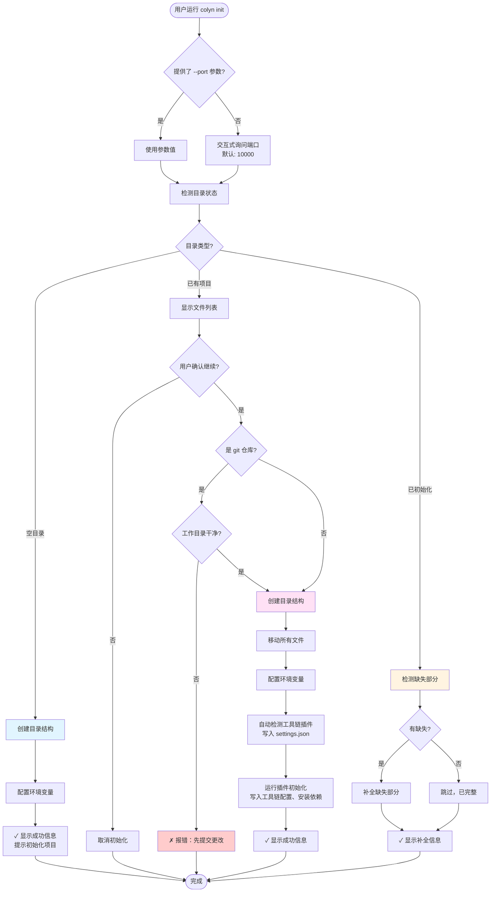
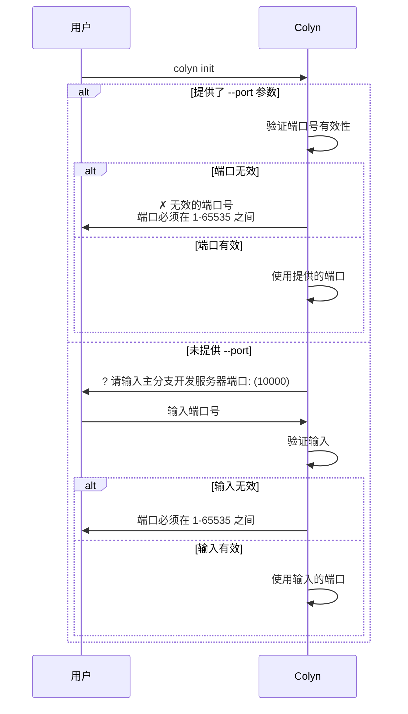
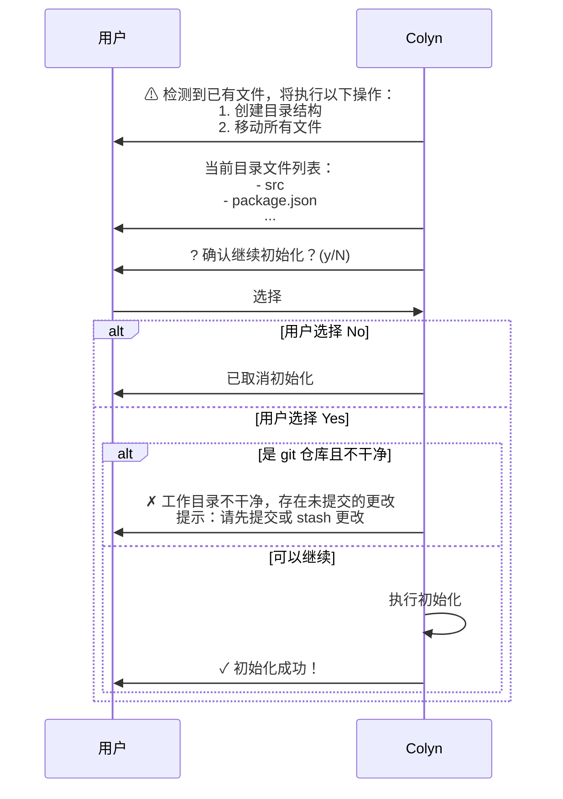
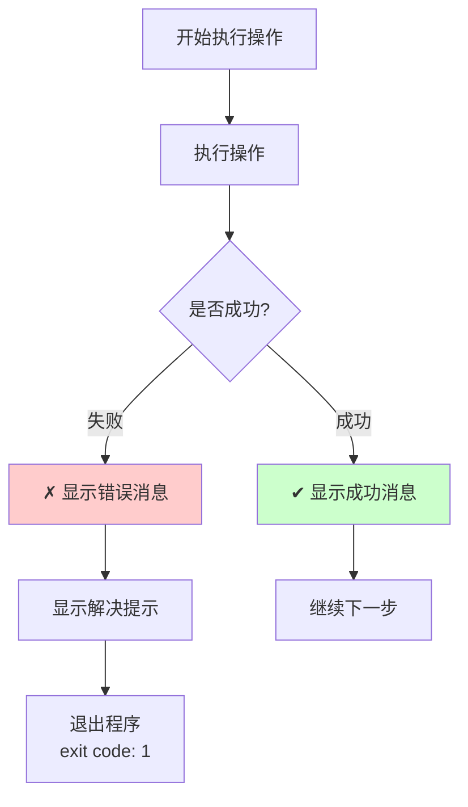
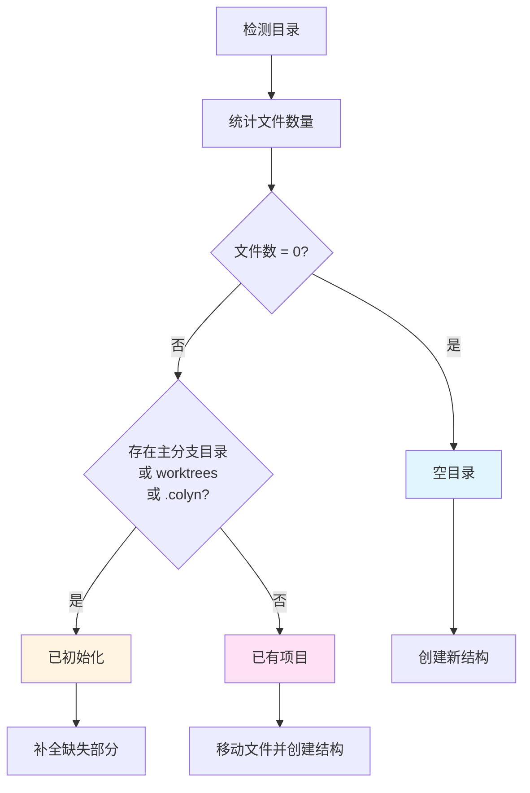
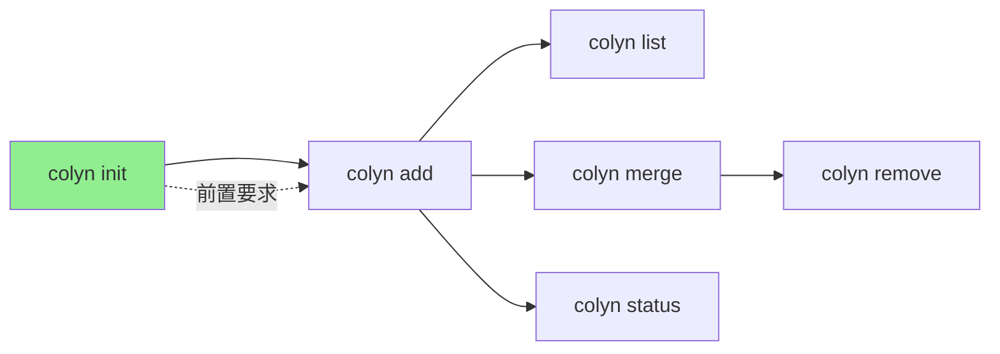

# Init 命令设计文档（用户交互视角）

**创建时间**：2026-01-14
**最后更新**：2026-01-15
**命令名称**：`colyn init`
**状态**：✅ 已实现

---

## 1. 命令概述

### 1.1 用户目标

用户希望将现有项目转换为支持并行开发的 Colyn 项目结构，或者在新目录中创建 Colyn 项目。

### 1.2 命令使用

```bash
# 交互式询问端口（推荐）
colyn init

# 直接指定端口
colyn init --port 10000
colyn init -p 3000
```

### 1.3 执行结果

执行后，项目目录会被重组为以下结构：

```
project-root/
├── project-name/      # 主分支目录（原有文件都在这里）
│   ├── .env.local    # PORT=10000, WORKTREE=main
│   ├── .gitignore    # 包含 .env.local 规则
│   └── ...           # 原有的所有项目文件
├── worktrees/        # 未来的 worktree 目录
└── .colyn/           # Colyn 配置目录
    └── settings.json # 项目配置（含自动检测的工具链插件）
```

---

## 2. 用户场景

`colyn init` 会智能识别三种不同的目录状态，并采取不同的处理方式。

### 2.1 场景 1：空目录

**用户情况**：在一个完全空的目录中运行 `colyn init`

**系统行为**：
1. 创建基础目录结构（主分支目录、worktrees、配置目录）
2. 配置环境变量文件
3. 提示用户在主分支目录中初始化项目

**用户看到**：

```
✔ 创建目录结构
✔ 环境变量配置完成
✔ .gitignore 配置完成
✔ 配置文件保存完成

✓ 初始化成功！

目录结构：
  .
  ├── my-project/          # 主分支目录（请在此目录中初始化项目）
  ├── worktrees/           # Worktree 目录
  └── .colyn/              # 配置目录

后续操作：
  1. 进入主分支目录：
     cd my-project

  2. 初始化 git 仓库（如果还没有）：
     git init

  3. 初始化你的项目（例如 npm/yarn init）

  4. 创建 worktree：
     colyn add <branch-name>
```

---

### 2.2 场景 2：已有项目

**用户情况**：在包含项目文件的目录中运行 `colyn init`

**系统行为**：
1. 显示当前文件列表
2. 询问用户确认（说明将移动所有文件）
3. 如果是 git 仓库，检查工作目录是否干净
4. 创建目录结构并移动文件
5. 配置环境变量

**用户看到**：

```
⚠ 检测到已有文件，将执行以下操作：
  1. 创建主分支目录和 worktrees 目录
  2. 将当前目录所有文件移动到 my-project/ 目录下

当前目录文件列表：
  - src
  - package.json
  - tsconfig.json
  - .git
  - README.md
  ... 还有 15 个文件

? 确认继续初始化？ (y/N) › No
```

**用户选择 Yes 后**：

```
✔ 创建目录结构
✔ 移动项目文件
✔ 环境变量配置完成
✔ .gitignore 配置完成
✔ 配置文件保存完成
✔ 检测到工具链: npm          ← 自动检测并写入 settings.json
✔ 插件初始化完成              ← 写入工具链运行配置、安装依赖等

✓ 初始化成功！

配置信息：
  主分支: main
  端口: 10000
  工具链插件: npm

后续操作：
  1. 创建 worktree:
     colyn add <branch-name>

  2. 查看 worktree 列表:
     colyn list
```

---

### 2.3 场景 3：已初始化（补全模式）

**用户情况**：在已经初始化过的目录中再次运行 `colyn init`

**系统行为**：
1. 检测缺失的部分
2. 补全缺失的目录或配置
3. 如果所有都完整，提示无需操作

**用户看到（有缺失）**：

```
⚠ 检测到已初始化，进入补全模式...

✔ 创建 worktrees 目录
✔ 检查并更新配置文件
✔ 检查并配置 .env.local
✔ 检查并配置 .gitignore

✓ 补全完成！
```

**用户看到（无缺失）**：

```
⚠ 检测到已初始化，进入补全模式...

✓ 补全完成！

所有配置已完整，无需补全。
```

---

## 3. 用户交互流程

### 3.1 整体流程图



### 3.2 端口配置交互



### 3.3 已有项目确认流程



---

## 4. 输入与输出

### 4.1 用户输入

| 输入内容 | 提供方式 | 必填 | 默认值 | 验证规则 |
|---------|---------|------|-------|---------|
| 端口号 | `--port` 参数或交互式输入 | 是 | 10000 | 1-65535 之间的整数 |
| 确认继续（已有项目时） | 交互式选择 | 是 | No | Yes/No |

### 4.2 系统输出

**进度信息**（使用 spinner）：
- ✔ 创建目录结构
- ✔ 移动项目文件
- ✔ 环境变量配置完成
- ✔ .gitignore 配置完成
- ✔ 配置文件保存完成
- ✔ 检测到工具链: {plugin-name}（或：未检测到匹配的工具链）
- ✔ 插件初始化完成（若有插件被激活）

**成功信息**：
- 目录结构说明
- 配置信息（主分支、端口、工具链插件）
- 后续操作建议

**错误信息**（见第 5 节）

---

## 5. 错误处理

### 5.1 常见错误及解决方案

| 错误场景 | 用户看到 | 如何解决 |
|---------|---------|---------|
| 工作目录不干净<br/>（有未提交的更改） | ✗ 工作目录不干净，存在未提交的更改<br/>提示：请先提交或 stash 更改后再运行 init 命令 | 运行 `git add .` 和 `git commit` 提交更改，<br/>或运行 `git stash` 暂存更改 |
| 目录名冲突<br/>（主分支目录名已被文件占用） | ✗ 主分支目录名 "my-project" 与现有文件冲突<br/>提示：请重命名该文件后再运行 init 命令 | 重命名或删除与主分支目录同名的文件 |
| 无效的端口号 | ✗ 无效的端口号<br/>提示：端口必须在 1-65535 之间 | 输入 1-65535 之间的端口号 |
| 文件移动失败 | ✗ 移动文件时发生错误<br/>提示：请检查文件权限或手动恢复目录结构 | 检查文件权限，必要时手动操作 |

### 5.2 错误处理流程



**重要**：操作失败时不会自动回滚，用户需要根据提示手动恢复。

---

## 6. 目录状态检测逻辑

系统如何判断目录属于哪种类型：



### 6.1 检测标准

| 目录类型 | 判断标准 | 说明 |
|---------|---------|------|
| 空目录 | 没有任何文件（包括隐藏文件） | 完全空的目录 |
| 已初始化 | 存在主分支目录、worktrees 或 .colyn 之一 | 已经运行过 `colyn init` |
| 已有项目 | 有文件但不属于以上两种 | 普通项目目录 |

---

## 7. 成功后的项目状态

### 7.1 目录结构

```
my-project/                 # 项目根目录
├── my-project/             # 主分支目录
│   ├── .git/              # Git 仓库（如果是 git 项目）
│   ├── src/               # 源代码
│   ├── .env.local         # 环境变量：PORT=10000, WORKTREE=main
│   ├── .gitignore         # 包含 .env.local 忽略规则
│   └── ...                # 其他项目文件
├── worktrees/             # Worktree 目录（初始为空）
└── .colyn/                # Colyn 配置目录
    └── settings.json      # 项目配置（含自动检测的工具链插件）
```

### 7.2 数据来源

项目大多数信息从文件系统动态获取，只有无法推断的用户选择才写入配置文件：

| 数据 | 来源 |
|------|------|
| 主分支名称 | 主分支目录的 `git branch --show-current` |
| 主端口 | 主分支目录的 `.env.local` 中的 `PORT` |
| 下一个 Worktree ID | 扫描 `worktrees/task-*` 目录，取最大 ID + 1 |
| Worktree 列表 | `git worktree list` + 各目录的 `.env.local` |
| 工具链插件 | 自动检测后**写入** `.colyn/settings.json`（持久化） |

**`my-project/.env.local`**:
```env
# Environment variables for this worktree
# Auto-generated by colyn

PORT=10000
WORKTREE=main
```

### 7.3 用户可以做什么

初始化成功后，用户可以：

1. **创建 worktree**：
   ```bash
   colyn add feature/login
   ```

2. **查看 worktree 列表**：
   ```bash
   colyn list
   ```

3. **在主分支目录开发**：
   ```bash
   cd my-project
   npm run dev  # 端口会是 10000
   ```

---

## 8. 特殊情况处理

### 8.1 主分支名称检测

- 如果是 git 仓库：使用当前分支名作为主分支名
- 如果不是 git 仓库或检测失败：默认使用 "main"

### 8.2 环境变量智能合并

如果主分支目录已有 `.env.local` 文件：

**原有内容**：
```env
# My custom env
API_URL=http://localhost:3000
DEBUG=true
```

**合并后**：
```env
# My custom env
API_URL=http://localhost:3000
DEBUG=true

# Environment variables for this worktree
# Auto-generated by colyn

PORT=10000
WORKTREE=main
```

**规则**：
- 保留原有的所有内容和注释
- 在末尾添加 Colyn 需要的环境变量
- 如果已存在 PORT 或 WORKTREE，则更新其值

### 8.3 .gitignore 智能更新

检查是否已有忽略规则：
- 如果包含 `.env.local`：跳过
- 如果包含 `*.local`：跳过（更宽泛的规则）
- 都没有：添加 `.env.local` 忽略规则

---

## 9. 用户体验要点

### 9.1 清晰的进度提示

使用 spinner 实时显示每个步骤的进度，让用户了解当前在做什么。

### 9.2 安全确认机制

在执行破坏性操作（移动文件）前，必须：
1. 显示将要执行的操作
2. 显示受影响的文件
3. 询问用户确认
4. 默认为"否"，需要用户主动确认

### 9.3 详细的错误提示

错误信息包含：
- 具体是什么错误
- 为什么发生
- 如何解决

### 9.4 后续操作建议

成功后明确告诉用户：
- 可以做什么
- 如何做
- 提供具体的命令示例

---

## 10. 与其他命令的关系



**说明**：
- `init` 是所有其他命令的前置要求
- 只有初始化后才能创建 worktree（`add`）
- 创建 worktree 后才能使用其他管理命令

---

## 11. 常见问题

### Q1: 初始化后，原来的文件在哪里？

A: 所有文件都在主分支目录中（与项目同名的目录）。例如项目叫 "my-project"，文件就在 `my-project/my-project/` 中。

### Q2: 可以在已有项目中初始化吗？

A: 可以。系统会移动所有文件到主分支目录。如果是 git 仓库，必须先提交或 stash 所有更改。

### Q3: 初始化失败了怎么办？

A: 系统不会自动回滚，根据错误提示手动恢复或重新运行。大多数情况下可以直接重新运行 `colyn init`。

### Q4: 可以修改端口配置吗？

A: 可以直接编辑主分支目录下 `.env.local` 中的 `PORT` 值。由于配置信息是从文件系统动态获取的，修改后立即生效。

### Q5: 补全模式会覆盖我的配置吗？

A: 不会。补全模式只会添加缺失的部分，不会覆盖已有的配置。环境变量会智能合并，保留原有内容。

---

## 12. 总结

`colyn init` 命令设计重点：

1. **智能识别**：自动识别三种目录状态，采取不同策略
2. **安全第一**：破坏性操作前必须用户确认
3. **工具链自动配置**：自动检测 npm/Maven/Gradle/pip 并写入 `settings.json`，运行插件初始化
4. **清晰反馈**：每步操作都有明确的进度和结果提示
5. **容错处理**：详细的错误信息和解决建议
6. **用户友好**：提供后续操作建议和常见问题解答
