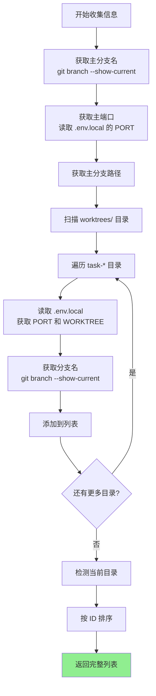
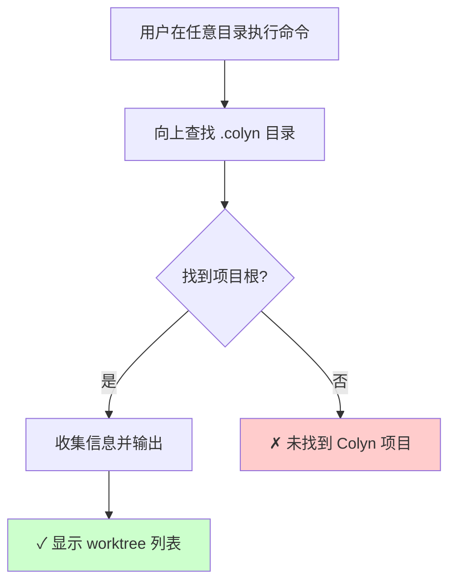
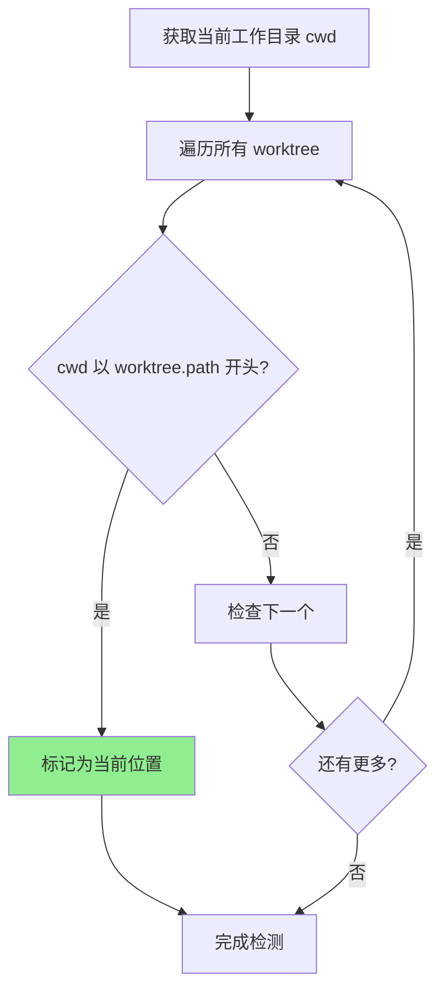
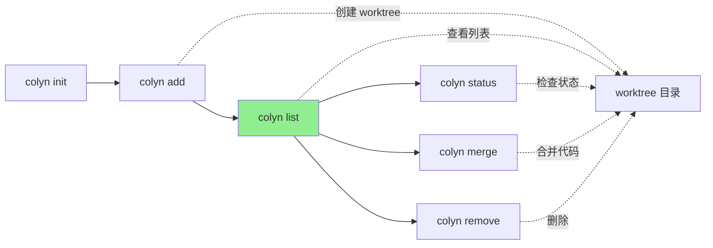

# List 命令设计文档（用户交互视角）

**创建时间**：2026-01-15
**最后更新**：2026-01-15
**命令名称**：`colyn list`
**状态**：📋 待实现

---

## 1. 命令概述

### 1.1 用户目标

用户希望快速查看当前项目中所有的 worktree 信息，以便：
- 了解当前有哪些并行开发环境
- 查看各个 worktree 的分支、端口、路径
- 快速定位到某个 worktree 的目录
- 在脚本中获取 worktree 信息进行自动化处理

### 1.2 命令使用

```bash
# 基本用法：显示所有 worktree（包含主分支）
colyn list

# 不显示主分支
colyn list --no-main

# JSON 格式输出（便于脚本处理）
colyn list --json

# 只输出路径（便于管道操作）
colyn list --paths

# 组合使用
colyn list --paths --no-main
colyn list --json --no-main
```

### 1.3 执行结果

显示项目中所有 worktree 的信息，包括主分支和各个任务 worktree。

**示例输出**（默认表格格式）：

```
ID  Branch            Port   Status      Diff     Path
-   main              10000              -        /path/to/project/my-app
1   feature/login     10001  M:3         ↑2 ↓1   /path/to/project/worktrees/task-1
2   feature/dashboard 10002              ↑5      /path/to/project/worktrees/task-2  ← 当前位置
```

**状态列说明**：
- `Status`: 未提交修改统计，如 `M:3` 表示 3 个文件有修改
- `Diff`: 与主分支的提交差异，`↑` 表示领先，`↓` 表示落后

---

## 2. 用户场景

### 2.1 场景 1：查看所有开发环境

**用户需求**：了解当前项目有哪些 worktree，以及它们的状态

**操作流程**：

```bash
$ colyn list

ID  Branch            Port   Status      Diff     Path
-   main              10000              -        /path/to/project/my-app
1   feature/login     10001  M:3         ↑2 ↓1   /path/to/project/worktrees/task-1
2   feature/dashboard 10002              ↑5      /path/to/project/worktrees/task-2  ← 当前位置
```

**结果**：用户可以清晰看到所有 worktree 的信息、git 状态和与主分支的差异。

---

### 2.2 场景 2：获取 worktree 路径用于脚本

**用户需求**：在脚本中批量处理所有 worktree

**操作流程**：

```bash
# 在所有 worktree 中运行 npm install
$ colyn list --paths --no-main | xargs -I {} sh -c 'cd {} && npm install'

# 获取所有 worktree 路径
$ colyn list --paths
/path/to/project/my-app
/path/to/project/worktrees/task-1
/path/to/project/worktrees/task-2
```

**结果**：简洁的路径输出便于管道操作。

---

### 2.3 场景 3：程序化处理 worktree 信息

**用户需求**：在脚本或工具中获取结构化的 worktree 信息

**操作流程**：

```bash
$ colyn list --json
```

**输出**：
```json
[
  {
    "id": null,
    "branch": "main",
    "port": 10000,
    "path": "/path/to/project/my-app",
    "isMain": true,
    "isCurrent": false
  },
  {
    "id": 1,
    "branch": "feature/login",
    "port": 10001,
    "path": "/path/to/project/worktrees/task-1",
    "isMain": false,
    "isCurrent": false
  },
  {
    "id": 2,
    "branch": "feature/dashboard",
    "port": 10002,
    "path": "/path/to/project/worktrees/task-2",
    "isMain": false,
    "isCurrent": true
  }
]
```

**结果**：JSON 格式便于程序解析和处理。

---

### 2.4 场景 4：只查看任务 worktree

**用户需求**：只关心任务 worktree，不需要看主分支

**操作流程**：

```bash
$ colyn list --no-main

ID  Branch            Port   Path
1   feature/login     10001  /path/to/project/worktrees/task-1
2   feature/dashboard 10002  /path/to/project/worktrees/task-2  ← 当前位置
```

**结果**：输出中不包含主分支信息。

---

## 3. 输入与输出

### 3.1 命令选项

| 选项 | 短选项 | 说明 | 默认值 |
|------|--------|------|--------|
| `--json` | - | 以 JSON 格式输出 | 否 |
| `--paths` | `-p` | 只输出路径（每行一个） | 否 |
| `--no-main` | - | 不显示主分支 | 否（显示主分支） |

**选项互斥规则**：
- `--json` 和 `--paths` 互斥，不能同时使用
- `--no-main` 可以与任何格式选项组合使用

### 3.2 输出格式

#### 3.2.1 表格格式（默认）

**特点**：
- 彩色输出，美观易读
- 当前所在 worktree 有高亮标记
- 主分支 ID 显示为 `-`

**输出示例**：
```
ID  Branch            Port   Path
-   main              10000  /path/to/project/my-app
1   feature/login     10001  /path/to/project/worktrees/task-1
2   feature/dashboard 10002  /path/to/project/worktrees/task-2  ← 当前位置
```

**颜色方案**：
| 元素 | 颜色 |
|------|------|
| 表头 | 白色加粗 |
| 主分支行 | 灰色（dim） |
| 普通行 | 默认颜色 |
| 当前行 | 青色（cyan） |
| 当前位置标记 | 黄色（yellow） |

---

#### 3.2.2 JSON 格式 (`--json`)

**特点**：
- 机器可读，便于脚本处理
- 包含完整信息，包括 `isMain` 和 `isCurrent` 字段
- 包含 git 状态信息
- 数组格式，可直接被 JSON 解析器处理

**输出示例**：
```json
[
  {
    "id": null,
    "branch": "main",
    "port": 10000,
    "path": "/path/to/project/my-app",
    "isMain": true,
    "isCurrent": false,
    "status": {
      "modified": 0,
      "staged": 0,
      "untracked": 0
    },
    "diff": {
      "ahead": 0,
      "behind": 0
    }
  },
  {
    "id": 1,
    "branch": "feature/login",
    "port": 10001,
    "path": "/path/to/project/worktrees/task-1",
    "isMain": false,
    "isCurrent": false,
    "status": {
      "modified": 3,
      "staged": 1,
      "untracked": 2
    },
    "diff": {
      "ahead": 2,
      "behind": 1
    }
  }
]
```

**字段说明**：
| 字段 | 类型 | 说明 |
|------|------|------|
| `id` | `number \| null` | worktree ID，主分支为 `null` |
| `branch` | `string` | 分支名称 |
| `port` | `number` | 端口号 |
| `path` | `string` | 绝对路径 |
| `isMain` | `boolean` | 是否为主分支 |
| `isCurrent` | `boolean` | 是否为当前所在目录 |
| `status.modified` | `number` | 已修改但未暂存的文件数 |
| `status.staged` | `number` | 已暂存的文件数 |
| `status.untracked` | `number` | 未跟踪的文件数 |
| `diff.ahead` | `number` | 领先主分支的提交数 |
| `diff.behind` | `number` | 落后主分支的提交数 |

---

#### 3.2.3 路径格式 (`--paths`)

**特点**：
- 每行一个路径
- 无颜色、无额外信息
- 便于管道操作和脚本处理

**输出示例**：
```
/path/to/project/my-app
/path/to/project/worktrees/task-1
/path/to/project/worktrees/task-2
```

**使用场景**：
```bash
# 在所有 worktree 中执行命令
colyn list --paths | xargs -I {} sh -c 'cd {} && git status'

# 统计 worktree 数量
colyn list --paths --no-main | wc -l

# 查找包含特定文件的 worktree
colyn list --paths | xargs -I {} sh -c '[ -f {}/package.json ] && echo {}'
```

---

## 4. 用户交互流程

### 4.1 整体流程图


### 4.2 信息收集流程



---

## 5. 错误处理

### 5.1 项目未初始化

```
✗ 当前目录未初始化为 Colyn 项目
  提示：请先运行 colyn init 命令初始化项目
```

### 5.2 选项冲突

```
✗ 选项冲突：--json 和 --paths 不能同时使用
  提示：请选择其中一种输出格式
```

### 5.3 无 worktree

当没有任何任务 worktree 且使用了 `--no-main` 时：

```
暂无 worktree

提示：使用 colyn add <branch> 创建新的 worktree
```

---

## 6. 从项目任意位置运行

`colyn list` 支持从项目的任意位置运行：



**示例**：
```bash
# 在 worktree 子目录中运行
$ cd worktrees/task-1/src/components
$ colyn list

ID  Branch            Port   Path
-   main              10000  /path/to/project/my-app
1   feature/login     10001  /path/to/project/worktrees/task-1  ← 当前位置
2   feature/dashboard 10002  /path/to/project/worktrees/task-2
```

---

## 7. 当前位置检测

### 7.1 检测逻辑

系统通过比较当前工作目录与各 worktree 路径来确定用户所在位置：



### 7.2 显示样式

**表格格式**：
- 当前行使用青色（cyan）显示
- 行末添加黄色标记 `← 当前位置`

**JSON 格式**：
- `isCurrent` 字段为 `true`

**路径格式**：
- 无特殊标记（保持简洁）

---

## 8. 空状态处理

### 8.1 只有主分支

```bash
$ colyn list

ID  Branch  Port   Path
-   main    10000  /path/to/project/my-app  ← 当前位置

提示：使用 colyn add <branch> 创建新的 worktree
```

### 8.2 使用 --no-main 且无任务 worktree

```bash
$ colyn list --no-main

暂无 worktree

提示：使用 colyn add <branch> 创建新的 worktree
```

### 8.3 JSON 格式空状态

```bash
$ colyn list --json --no-main
[]
```

### 8.4 路径格式空状态

```bash
$ colyn list --paths --no-main
# 无输出（空）
```

---

## 9. 排序规则

worktree 列表按以下规则排序：

1. **主分支始终在最前**（如果包含）
2. **任务 worktree 按 ID 升序排列**

```
ID  Branch            Port   Path
-   main              10000  /path/to/project/my-app          # 主分支在前
1   feature/login     10001  /path/to/project/worktrees/task-1
2   feature/dashboard 10002  /path/to/project/worktrees/task-2
5   feature/payment   10005  /path/to/project/worktrees/task-5  # 按 ID 排序
```

---

## 10. 常见问题

### Q1: 如何只显示路径以便于脚本使用？

A: 使用 `--paths` 选项：
```bash
colyn list --paths
```

### Q2: 如何在脚本中解析 worktree 信息？

A: 使用 `--json` 选项获取 JSON 格式输出：
```bash
colyn list --json | jq '.[] | select(.isMain == false) | .path'
```

### Q3: 为什么主分支的 ID 显示为 `-`？

A: 主分支不是通过 `colyn add` 创建的任务 worktree，没有分配 ID。使用 `-` 表示"无 ID"。

### Q4: 如何知道我当前在哪个 worktree？

A: 默认表格输出中，当前所在的 worktree 会用青色高亮显示，并在行末标记 `← 当前位置`。

### Q5: --json 和 --paths 可以同时使用吗？

A: 不可以，这两个选项互斥。请选择其中一种输出格式。

### Q6: 输出的路径是相对路径还是绝对路径？

A: 始终输出绝对路径，确保在任何目录下都能正确使用。

---

## 11. 与其他命令的关系



**说明**：
- `list` 是查看命令，不修改任何状态
- `add` 创建 worktree 后建议运行 `list` 确认
- 其他管理命令可能需要先 `list` 获取信息

---

## 12. 实现注意事项

### 12.1 数据来源

利用现有的 `src/core/discovery.ts` 模块：
- `getProjectInfo()` 获取完整的项目信息
- `WorktreeInfo` 接口包含所需的所有字段

### 12.2 依赖库

- `cli-table3`：表格输出
- `chalk`：彩色输出

### 12.3 退出码

| 退出码 | 含义 |
|--------|------|
| 0 | 成功 |
| 1 | 项目未初始化或其他错误 |

---

## 13. 总结

`colyn list` 命令设计重点：

1. **多种输出格式**：表格（默认）、JSON、路径，满足不同使用场景
2. **当前位置高亮**：帮助用户快速定位自己的位置
3. **灵活的过滤**：`--no-main` 可排除主分支
4. **脚本友好**：`--json` 和 `--paths` 便于自动化处理
5. **从任意位置运行**：自动定位项目根目录
6. **清晰的空状态处理**：给出明确提示
