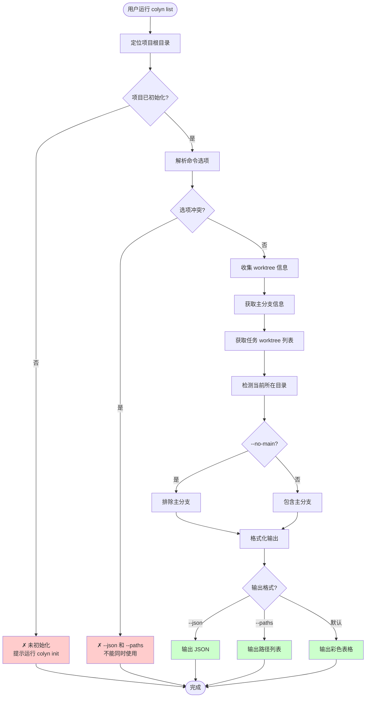
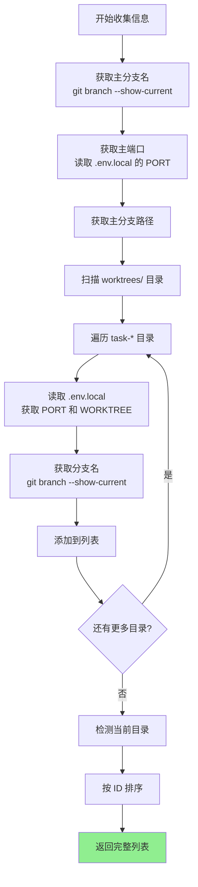
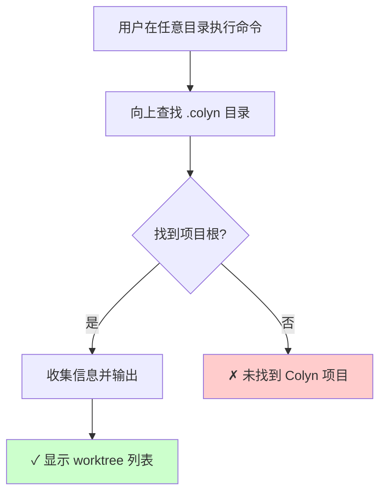
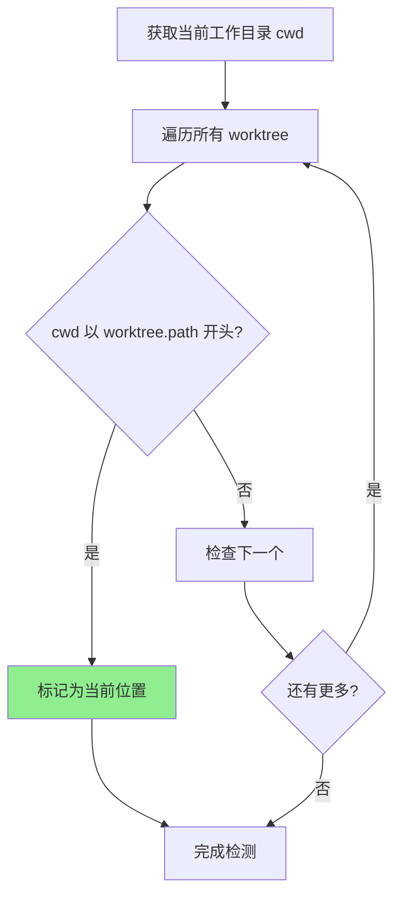
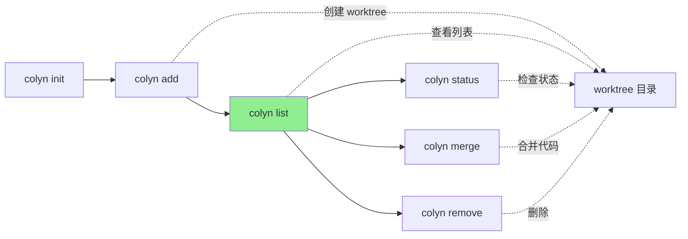

# List 命令设计文档（用户交互视角）

**创建时间**：2026-01-15
**最后更新**：2026-02-09
**命令名称**：`colyn list`
**状态**：✅ 已实现

---

## 1. 命令概述

### 1.1 用户目标

用户希望快速查看当前项目中所有的 worktree 信息，以便：
- 了解当前有哪些并行开发环境
- 查看各个 worktree 的分支、端口、路径
- 快速定位到某个 worktree 的目录
- 在脚本中获取 worktree 信息进行自动化处理

### 1.2 命令使用

```bash
# 基本用法：显示所有 worktree（包含主分支）
colyn list

# 不显示主分支
colyn list --no-main

# JSON 格式输出（便于脚本处理）
colyn list --json

# 只输出路径（便于管道操作）
colyn list --paths

# 自动刷新列表（默认 2 秒）
colyn list -r
colyn list --refresh

# 自定义刷新间隔（5 秒）
colyn list -r 5

# 组合使用
colyn list --paths --no-main
colyn list --json --no-main
```

### 1.3 执行结果

显示项目中所有 worktree 的信息，包括主分支和各个任务 worktree。

**示例输出**（默认表格格式）：

```
ID    Branch            Port   Status      Diff   Path
  -   main              10000              -      my-app
  1   feature/login     10001  M:3         ↑2 ↓1  worktrees/task-1
→ 2   feature/dashboard 10002              ↑5     worktrees/task-2
```

**说明**：
- `→` 箭头标识当前所在的 worktree，整行青色高亮
- `Path` 显示相对于项目根目录的相对路径
- `Status`: 未提交修改统计，`M:3` 表示 3 个文件有修改，`S:` 已暂存，`?:` 未跟踪
- `Diff`: 与主分支的提交差异，`↑` 领先，`↓` 落后，`✓` 已同步

---

## 2. 用户场景

### 2.1 场景 1：查看所有开发环境

**用户需求**：了解当前项目有哪些 worktree，以及它们的状态

**操作流程**：

```bash
$ colyn list

ID    Branch            Port   Status      Diff   Path
  -   main              10000              -      my-app
  1   feature/login     10001  M:3         ↑2 ↓1  worktrees/task-1
→ 2   feature/dashboard 10002              ↑5     worktrees/task-2
```

**结果**：用户可以清晰看到所有 worktree 的信息、git 状态和与主分支的差异。

---

### 2.2 场景 2：获取 worktree 路径用于脚本

**用户需求**：在脚本中批量处理所有 worktree

**操作流程**：

```bash
# 在所有 worktree 中运行 npm install
$ colyn list --paths --no-main | xargs -I {} sh -c 'cd {} && npm install'

# 获取所有 worktree 路径（相对路径）
$ colyn list --paths
my-app
worktrees/task-1
worktrees/task-2
```

**结果**：简洁的相对路径输出便于管道操作。

---

### 2.3 场景 3：程序化处理 worktree 信息

**用户需求**：在脚本或工具中获取结构化的 worktree 信息

**操作流程**：

```bash
$ colyn list --json
```

**输出**：
```json
[
  {
    "id": null,
    "branch": "main",
    "port": 10000,
    "path": "my-app",
    "isMain": true,
    "isCurrent": false,
    "status": { "modified": 0, "staged": 0, "untracked": 0 },
    "diff": { "ahead": 0, "behind": 0 }
  },
  {
    "id": 1,
    "branch": "feature/login",
    "port": 10001,
    "path": "worktrees/task-1",
    "isMain": false,
    "isCurrent": false,
    "status": { "modified": 3, "staged": 1, "untracked": 2 },
    "diff": { "ahead": 2, "behind": 1 }
  }
]
```

**结果**：JSON 格式便于程序解析和处理。

---

### 2.4 场景 4：实时监控 worktree 状态

**用户需求**：在开发过程中实时监控所有 worktree 的状态变化

**操作流程**：

```bash
# 使用默认间隔（2 秒）自动刷新
$ colyn list -r

# 屏幕会自动刷新，显示最新状态
┌──────────┬────────────────┬──────┬────────┬──────┬────────────────┐
│ ID       │ Branch         │ Port │ Status │ Diff │ Path           │
├──────────┼────────────────┼──────┼────────┼──────┼────────────────┤
│   0-main │ main           │ 3000 │        │      │ main           │
│ → 1      │ feature/list-r │ 3001 │ M 1    │ +5   │ worktrees/1    │
│   2      │ feature/tmux   │ 3002 │        │ ✓    │ worktrees/2    │
└──────────┴────────────────┴──────┴────────┴──────┴────────────────┘

每 2 秒自动刷新 (按 Ctrl+C 退出)

# 自定义刷新间隔（5 秒）
$ colyn list -r 5

# 快速监控（1 秒刷新）
$ colyn list -r 1
```

**结果**：列表会自动刷新，用户可以实时看到 git 状态和差异的变化。按 `Ctrl+C` 可以退出刷新模式。

---

### 2.5 场景 5：只查看任务 worktree

**用户需求**：只关心任务 worktree，不需要看主分支

**操作流程**：

```bash
$ colyn list --no-main

ID    Branch            Port   Status      Diff   Path
  1   feature/login     10001  M:3         ↑2 ↓1  worktrees/task-1
→ 2   feature/dashboard 10002              ↑5     worktrees/task-2
```

**结果**：输出中不包含主分支信息。

---

## 3. 输入与输出

### 3.1 命令选项

| 选项 | 短选项 | 说明 | 默认值 |
|------|--------|------|--------|
| `--json` | - | 以 JSON 格式输出 | 否 |
| `--paths` | `-p` | 只输出路径（每行一个） | 否 |
| `--no-main` | - | 不显示主分支 | 否（显示主分支） |
| `--refresh [interval]` | `-r` | 自动刷新列表（可选：刷新间隔秒数，默认 2） | 否 |

**选项互斥规则**：
- `--json` 和 `--paths` 互斥，不能同时使用
- `--refresh` 不能与 `--json` 或 `--paths` 同时使用（刷新模式只支持表格输出）
- `--no-main` 可以与任何格式选项组合使用

### 3.2 输出格式

#### 3.2.1 表格格式（默认）

**特点**：
- 彩色输出，美观易读
- 当前所在 worktree 用 `→` 箭头标识，整行高亮
- 主分支 ID 显示为 `-`
- 路径显示为相对于项目根目录的相对路径
- **响应式布局**：根据终端宽度自动调整显示列

**输出示例**：
```
ID    Branch            Port   Status      Diff   Path
  -   main              10000              -      my-app
  1   feature/login     10001  M:3         ↑2 ↓1  worktrees/task-1
→ 2   feature/dashboard 10002              ↑5     worktrees/task-2
```

**颜色方案**：
| 元素 | 颜色 |
|------|------|
| 表头 | 白色加粗 |
| 主分支行 | 灰色（dim） |
| 普通行 | 默认颜色 |
| 当前行 | 青色（cyan） |
| Status 有修改 | 黄色（yellow） |
| Diff 已同步 (✓) | 绿色（green） |
| Diff 有差异 | 青色（cyan） |

**响应式布局**：

当终端宽度不足时，按以下顺序依次隐藏列，确保不折行：

| 模式 | 显示的列 | 适用宽度 |
|------|----------|----------|
| full | ID, Branch, Port, Status, Diff, Path | 宽屏 |
| no-port | ID, Branch, Status, Diff, Path | 较宽 |
| no-path | ID, Branch, Status, Diff | 中等 |
| simple-status | ID, Branch, S(●), Diff | 较窄 |
| no-status | ID, Branch, Diff | 窄屏 |
| minimal | ID, Branch | 极窄 |

---

#### 3.2.2 JSON 格式 (`--json`)

**特点**：
- 机器可读，便于脚本处理
- 包含完整信息，包括 `isMain` 和 `isCurrent` 字段
- 包含 git 状态信息
- 数组格式，可直接被 JSON 解析器处理

**输出示例**：
```json
[
  {
    "id": null,
    "branch": "main",
    "port": 10000,
    "path": "my-app",
    "isMain": true,
    "isCurrent": false,
    "status": {
      "modified": 0,
      "staged": 0,
      "untracked": 0
    },
    "diff": {
      "ahead": 0,
      "behind": 0
    }
  },
  {
    "id": 1,
    "branch": "feature/login",
    "port": 10001,
    "path": "worktrees/task-1",
    "isMain": false,
    "isCurrent": false,
    "status": {
      "modified": 3,
      "staged": 1,
      "untracked": 2
    },
    "diff": {
      "ahead": 2,
      "behind": 1
    }
  }
]
```

**字段说明**：
| 字段 | 类型 | 说明 |
|------|------|------|
| `id` | `number \| null` | worktree ID，主分支为 `null` |
| `branch` | `string` | 分支名称 |
| `port` | `number` | 端口号 |
| `path` | `string` | 相对于项目根目录的相对路径 |
| `isMain` | `boolean` | 是否为主分支 |
| `isCurrent` | `boolean` | 是否为当前所在目录 |
| `status.modified` | `number` | 已修改但未暂存的文件数 |
| `status.staged` | `number` | 已暂存的文件数 |
| `status.untracked` | `number` | 未跟踪的文件数 |
| `diff.ahead` | `number` | 领先主分支的提交数 |
| `diff.behind` | `number` | 落后主分支的提交数 |

---

#### 3.2.3 路径格式 (`--paths`)

**特点**：
- 每行一个路径（相对路径）
- 无颜色、无额外信息
- 便于管道操作和脚本处理

**输出示例**：
```
my-app
worktrees/task-1
worktrees/task-2
```

**使用场景**：
```bash
# 在所有 worktree 中执行命令
colyn list --paths | xargs -I {} sh -c 'cd {} && git status'

# 统计 worktree 数量
colyn list --paths --no-main | wc -l

# 查找包含特定文件的 worktree
colyn list --paths | xargs -I {} sh -c '[ -f {}/package.json ] && echo {}'
```

---

## 4. 用户交互流程

### 4.1 整体流程图



### 4.2 信息收集流程



---

## 5. 错误处理

### 5.1 项目未初始化

```
✗ 当前目录未初始化为 Colyn 项目
  提示：请先运行 colyn init 命令初始化项目
```

### 5.2 选项冲突（JSON 和 Paths）

```
✗ 选项冲突：--json 和 --paths 不能同时使用
  提示：请选择其中一种输出格式
```

### 5.3 选项冲突（Refresh 和其他输出格式）

```
✗ 选项冲突：--refresh 不能与 --json 或 --paths 同时使用
  提示：刷新模式只支持表格输出
```

### 5.4 无效的刷新间隔

```
✗ 无效的刷新间隔
  提示：刷新间隔必须是大于 0 的整数（秒）
```

### 5.5 无 worktree

当没有任何任务 worktree 且使用了 `--no-main` 时：

```
暂无 worktree

提示：使用 colyn add <branch> 创建新的 worktree
```

---

## 6. 从项目任意位置运行

`colyn list` 支持从项目的任意位置运行：



**示例**：
```bash
# 在 worktree 子目录中运行
$ cd worktrees/task-1/src/components
$ colyn list

ID    Branch            Port   Status   Diff   Path
  -   main              10000           -      my-app
→ 1   feature/login     10001           ✓      worktrees/task-1
  2   feature/dashboard 10002           ↑5     worktrees/task-2
```

---

## 7. 当前位置检测

### 7.1 检测逻辑

系统通过比较当前工作目录与各 worktree 路径来确定用户所在位置：



### 7.2 显示样式

**表格格式**：
- 当前行 ID 前显示 `→` 箭头标识
- 整行使用青色（cyan）高亮显示

**JSON 格式**：
- `isCurrent` 字段为 `true`

**路径格式**：
- 无特殊标记（保持简洁）

---

## 8. 空状态处理

### 8.1 只有主分支

```bash
$ colyn list

ID    Branch  Port   Status   Diff   Path
→ -   main    10000           -      my-app

提示：使用 colyn add <branch> 创建新的 worktree
```

### 8.2 使用 --no-main 且无任务 worktree

```bash
$ colyn list --no-main

暂无 worktree

提示：使用 colyn add <branch> 创建新的 worktree
```

### 8.3 JSON 格式空状态

```bash
$ colyn list --json --no-main
[]
```

### 8.4 路径格式空状态

```bash
$ colyn list --paths --no-main
# 无输出（空）
```

---

## 9. 排序规则

worktree 列表按以下规则排序：

1. **主分支始终在最前**（如果包含）
2. **任务 worktree 按 ID 升序排列**

```
ID    Branch            Port   Status   Diff   Path
  -   main              10000           -      my-app              # 主分支在前
  1   feature/login     10001           ✓      worktrees/task-1
  2   feature/dashboard 10002  M:2      ↑3     worktrees/task-2
  5   feature/payment   10005           ↑1     worktrees/task-5    # 按 ID 排序
```

---

## 10. 常见问题

### Q1: 如何只显示路径以便于脚本使用？

A: 使用 `--paths` 选项：
```bash
colyn list --paths
```

### Q2: 如何在脚本中解析 worktree 信息？

A: 使用 `--json` 选项获取 JSON 格式输出：
```bash
colyn list --json | jq '.[] | select(.isMain == false) | .path'
```

### Q3: 为什么主分支的 ID 显示为 `-`？

A: 主分支不是通过 `colyn add` 创建的任务 worktree，没有分配 ID。使用 `-` 表示"无 ID"。

### Q4: 如何知道我当前在哪个 worktree？

A: 默认表格输出中，当前所在的 worktree 的 ID 前会显示 `→` 箭头，整行用青色高亮显示。

### Q5: --json 和 --paths 可以同时使用吗？

A: 不可以，这两个选项互斥。请选择其中一种输出格式。

### Q6: 输出的路径是相对路径还是绝对路径？

A: 输出相对于项目根目录的相对路径，更加简洁易读。

### Q7: 终端窄时表格显示不全怎么办？

A: list 命令支持响应式布局，会根据终端宽度自动隐藏不重要的列（按 Port → Path → Status → Diff 的顺序），确保内容不折行。

### Q8: 如何实时监控 worktree 状态变化？

A: 使用 `-r` 或 `--refresh` 选项启用自动刷新：
```bash
# 默认 2 秒刷新
colyn list -r

# 自定义刷新间隔
colyn list -r 5    # 5 秒刷新
colyn list -r 1    # 1 秒快速刷新
```

### Q9: 如何退出刷新模式？

A: 按 `Ctrl+C` 即可退出刷新模式。系统会显示"已停止刷新"提示。

### Q10: 刷新模式可以与 --json 或 --paths 一起使用吗？

A: 不可以。刷新模式只支持表格输出，不能与 `--json` 或 `--paths` 同时使用。这是因为刷新需要清屏和重新渲染，只适合表格格式。

---

## 11. 与其他命令的关系



**说明**：
- `list` 是查看命令，不修改任何状态
- `add` 创建 worktree 后建议运行 `list` 确认
- 其他管理命令可能需要先 `list` 获取信息

---

## 12. 实现注意事项

### 12.1 数据来源

利用现有的 `src/core/discovery.ts` 模块：
- `getProjectInfo()` 获取完整的项目信息
- `WorktreeInfo` 接口包含所需的所有字段

### 12.2 依赖库

- `cli-table3`：表格输出
- `chalk`：彩色输出

### 12.3 退出码

| 退出码 | 含义 |
|--------|------|
| 0 | 成功 |
| 1 | 项目未初始化或其他错误 |

---

## 13. 自动刷新功能（-r / --refresh）

### 13.1 功能概述

**更新时间**：2026-02-09

自动刷新功能允许用户实时监控所有 worktree 的状态变化，无需手动重复执行命令。

**核心特性**：
- 定时轮询刷新（默认 2 秒）
- 可自定义刷新间隔
- 清屏后重新渲染，保持界面整洁
- 按 `Ctrl+C` 优雅退出

### 13.2 使用方式

```bash
# 使用默认间隔（2 秒）
colyn list -r
colyn list --refresh

# 自定义刷新间隔
colyn list -r 5      # 5 秒刷新
colyn list -r 1      # 1 秒快速刷新
colyn list -r 10     # 10 秒低频刷新
```

### 13.3 技术实现

**方案选择**：定时轮询

| 特性 | 定时轮询 | File Watch |
|------|---------|------------|
| 实现复杂度 | ⭐ 简单 | ⭐⭐⭐ 复杂 |
| 可靠性 | ⭐⭐⭐ 高 | ⭐⭐ 中等 |
| 跨平台兼容性 | ⭐⭐⭐ 完美 | ⭐⭐ 一般 |
| 外部依赖 | 无 | 需要 chokidar |

**选择理由**：
1. ✅ 实现简单，代码量少
2. ✅ 零依赖，不需要新的 npm 包
3. ✅ 跨平台兼容性好
4. ✅ 2-3 秒延迟对用户完全可接受
5. ✅ 参考业界标准（watch、k9s、htop 都使用轮询）

**核心逻辑**：
```typescript
// 清屏
process.stdout.write('\x1b[2J\x1b[0;0H');

// 定时刷新
setInterval(async () => {
  clearScreen();
  await renderList(options);
}, interval);

// 优雅退出
process.on('SIGINT', () => {
  clearInterval(timer);
  process.exit(0);
});
```

### 13.4 与其他选项的关系

**兼容性**：
- ✅ `--refresh` + `--no-main` - 可以组合使用
- ❌ `--refresh` + `--json` - 不兼容（显示错误提示）
- ❌ `--refresh` + `--paths` - 不兼容（显示错误提示）

**原因**：刷新模式需要清屏和重新渲染，只适合表格输出格式。

### 13.5 错误处理

**无效的刷新间隔**：
```bash
$ colyn list -r abc
✗ 无效的刷新间隔
  刷新间隔必须是大于 0 的整数（秒）
```

**与其他格式选项冲突**：
```bash
$ colyn list -r --json
✗ 选项冲突：--refresh 不能与 --json 或 --paths 同时使用
  刷新模式只支持表格输出
```

### 13.6 用户体验

**显示内容**：
```
┌──────────┬────────────────┬──────┬────────┬──────┬────────────────┐
│ ID       │ Branch         │ Port │ Status │ Diff │ Path           │
├──────────┼────────────────┼──────┼────────┼──────┼────────────────┤
│   0-main │ main           │ 3000 │        │      │ main           │
│ → 1      │ feature/list-r │ 3001 │ M 1    │ +5   │ worktrees/1    │
│   2      │ feature/tmux   │ 3002 │        │ ✓    │ worktrees/2    │
└──────────┴────────────────┴──────┴────────┴──────┴────────────────┘

每 2 秒自动刷新 (按 Ctrl+C 退出)
```

**退出提示**：
```bash
# 按 Ctrl+C 后
已停止刷新
```

### 13.7 使用场景

1. **并行开发监控**
   - 在多个 worktree 并行开发时，监控各分支的状态

2. **代码审查**
   - 审查代码时，实时查看提交差异的变化

3. **团队协作**
   - 监控团队成员在不同分支的工作进度

4. **CI/CD 调试**
   - 监控本地测试对各分支的影响

### 13.8 性能考虑

**资源消耗**：
- 每次刷新会执行 `git status` 和 `git diff` 命令
- 建议刷新间隔不要低于 1 秒
- 对于大型仓库，可以适当增加刷新间隔（如 5-10 秒）

**优化建议**：
- 当前实现采用定时轮询，即使数据没有变化也会刷新
- 未来可以考虑缓存上次状态，只在数据变化时刷新
- 但这会增加实现复杂度，当前暂不实现

---

## 14. 总结

`colyn list` 命令设计重点：

1. **多种输出格式**：表格（默认）、JSON、路径，满足不同使用场景
2. **当前位置高亮**：帮助用户快速定位自己的位置
3. **灵活的过滤**：`--no-main` 可排除主分支
4. **脚本友好**：`--json` 和 `--paths` 便于自动化处理
5. **从任意位置运行**：自动定位项目根目录
6. **清晰的空状态处理**：给出明确提示
7. **实时监控**：`-r` 自动刷新功能，实时查看状态变化（2026-02-09 新增）
