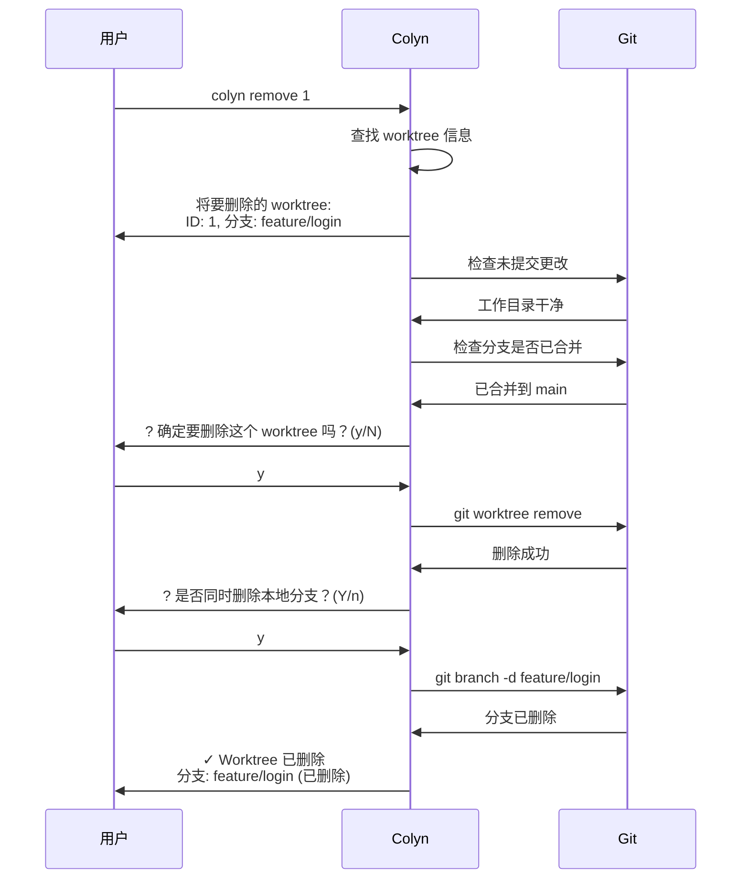
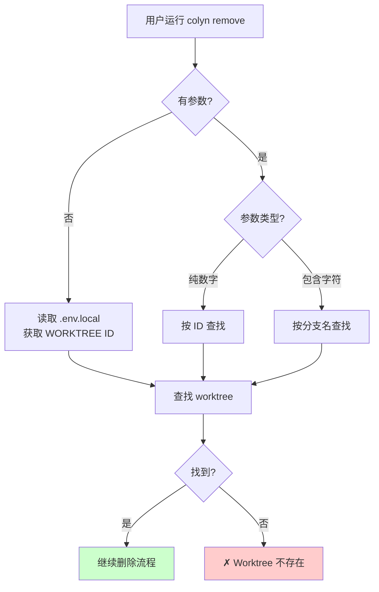
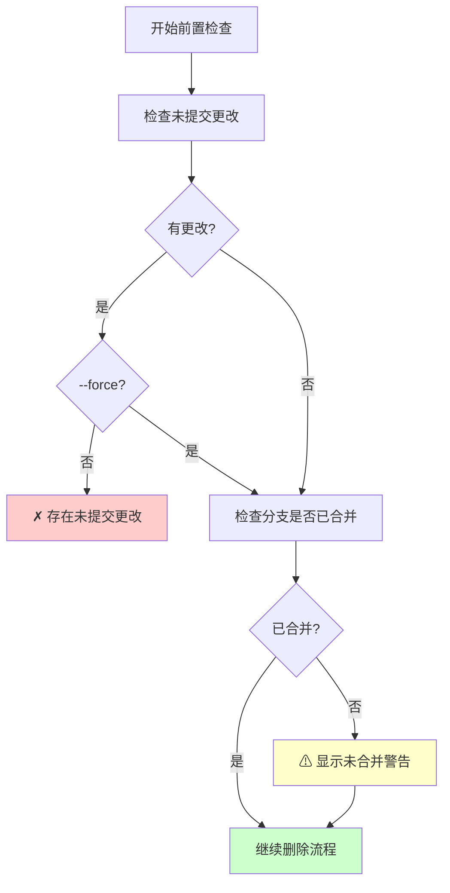
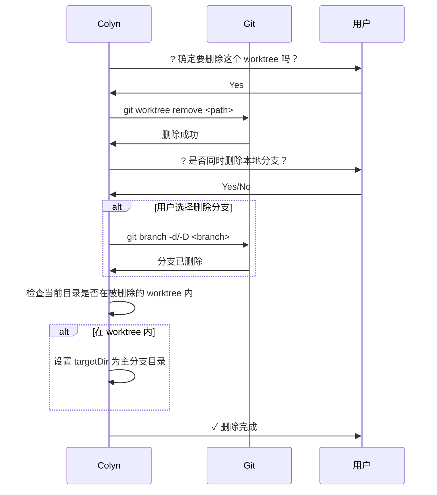
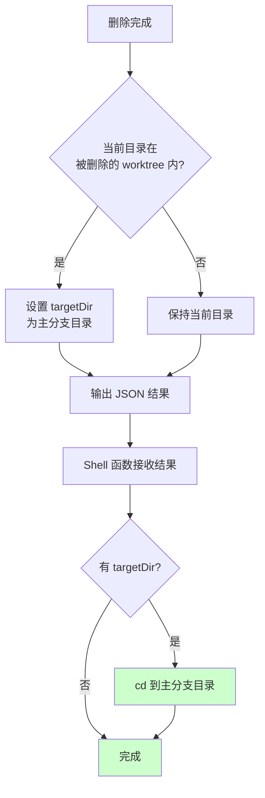

# Remove 命令设计文档（用户交互视角）

**创建时间**：2026-01-15
**最后更新**：2026-01-15
**命令名称**：`colyn remove`
**状态**：✅ 已实现

---

## 1. 需求概述

### 1.1 背景

用户在完成功能开发并合并后，需要清理不再使用的 worktree。传统流程需要：
1. 检查 worktree 是否有未提交的更改
2. 执行 `git worktree remove` 命令
3. 可选删除对应的本地分支
4. 如果当前目录在被删除的 worktree 中，需要手动切换目录

这个过程繁琐且容易遗漏步骤。

### 1.2 用户目标

提供一条简单的命令，安全地删除不再需要的 worktree，自动处理目录切换和分支清理。

### 1.3 核心价值

- ✅ **安全检查**：删除前检查未提交更改，避免数据丢失
- ✅ **合并警告**：未合并分支给出警告，但允许继续
- ✅ **智能识别**：支持 ID、分支名、自动识别
- ✅ **分支清理**：可选删除对应的本地分支
- ✅ **目录切换**：如果在被删除的 worktree 中，自动切换到主分支目录
- ✅ **确认机制**：默认需要确认，支持 `--yes` 跳过

---

## 2. 用户使用场景

### 2.1 场景 1：基本删除流程

**用户情况**：完成功能开发，已合并，想清理 worktree



**用户看到**：
```bash
$ colyn remove 1

将要删除的 worktree:
  ID: 1
  分支: feature/login
  路径: /path/to/worktrees/task-1
  端口: 10001

? 确定要删除这个 worktree 吗？(y/N) › Yes
✔ Worktree 已删除

? 是否同时删除本地分支 "feature/login"？(Y/n) › Yes
✔ 分支 "feature/login" 已删除

✓ Worktree 已删除

删除信息:
  ID: 1
  分支: feature/login (已删除)
  路径: /path/to/worktrees/task-1
```

---

### 2.2 场景 2：在 worktree 目录中删除（自动切换目录）

**用户情况**：当前在 worktree 目录中，删除后需要切换到主分支

```bash
$ cd worktrees/task-1
$ colyn remove

将要删除的 worktree:
  ID: 1
  分支: feature/login
  路径: /path/to/worktrees/task-1
  端口: 10001

? 确定要删除这个 worktree 吗？(y/N) › Yes
✔ Worktree 已删除

? 是否同时删除本地分支 "feature/login"？(Y/n) › Yes
✔ 分支 "feature/login" 已删除

✓ Worktree 已删除

删除信息:
  ID: 1
  分支: feature/login (已删除)
  路径: /path/to/worktrees/task-1

已自动切换到主分支目录:
  /path/to/my-project

📂 已切换到: /path/to/my-project
```

**系统行为**：
1. 检测到当前目录在被删除的 worktree 内
2. 删除完成后，返回 `targetDir` 指向主分支目录
3. shell 函数自动执行 `cd` 切换目录

---

### 2.3 场景 3：删除未合并的分支

**用户情况**：分支尚未合并，但用户确定要删除

```bash
$ colyn remove feature/experimental

将要删除的 worktree:
  ID: 2
  分支: feature/experimental
  路径: /path/to/worktrees/task-2
  端口: 10002

⚠ 分支 "feature/experimental" 尚未合并到 main
  删除后可能丢失未合并的更改

? 确定要删除这个 worktree 吗？(y/N) › Yes
✔ Worktree 已删除

? 是否同时删除本地分支 "feature/experimental"？(y/N) › Yes
✔ 分支 "feature/experimental" 已删除

✓ Worktree 已删除
```

**注意**：
- 未合并时显示警告，但允许继续
- 删除分支时默认选择 No（因为未合并）
- 如果用户选择删除，使用 `git branch -D` 强制删除

---

### 2.4 场景 4：有未提交更改时删除

**用户情况**：worktree 有未提交的更改

```bash
$ colyn remove 1

将要删除的 worktree:
  ID: 1
  分支: feature/login
  路径: /path/to/worktrees/task-1
  端口: 10001

⚠ 检测到未提交的更改

变更文件:
  - src/login.ts
  - src/auth.ts
  ... 以及其他 3 个文件

✗ 无法删除：存在未提交的更改
  提示: 请先提交或暂存更改，或使用 --force 强制删除：
  cd "/path/to/worktrees/task-1"
  git add . && git commit -m "..."

或者强制删除：
  colyn remove 1 --force
```

**使用 --force 强制删除**：
```bash
$ colyn remove 1 --force

将要删除的 worktree:
  ID: 1
  分支: feature/login
  ...

? 确定要删除这个 worktree 吗？(y/N) › Yes
✔ Worktree 已删除
```

---

### 2.5 场景 5：快速删除（跳过确认）

**用户情况**：确定要删除，不想被询问确认

```bash
$ colyn remove 1 -y

将要删除的 worktree:
  ID: 1
  分支: feature/login
  ...

✔ Worktree 已删除

? 是否同时删除本地分支 "feature/login"？(Y/n) ›
```

**注意**：`-y` 只跳过删除确认，分支删除询问仍然会显示。

---

## 3. 功能需求

### 3.1 参数识别

支持三种调用方式：



**示例**：
| 命令 | 识别方式 | 说明 |
|------|---------|------|
| `colyn remove 1` | 按 ID | 删除 ID 为 1 的 worktree |
| `colyn remove feature/login` | 按分支名 | 删除分支为 feature/login 的 worktree |
| `colyn remove`（在 worktree 中） | 自动识别 | 读取 .env.local 中的 WORKTREE 值 |

---

### 3.2 前置检查



**检查项**：

| 检查项 | 检查内容 | 失败行为 |
|--------|----------|----------|
| 未提交更改 | `git status` 是否干净 | 拒绝删除（除非 --force） |
| 分支合并状态 | `git branch --merged` | 显示警告，允许继续 |

---

### 3.3 删除执行



---

### 3.4 目录切换处理



---

## 4. 输入与输出

### 4.1 用户输入

| 输入内容 | 必填 | 说明 | 验证规则 |
|---------|------|------|---------|
| ID 或分支名 | 否 | 指定要删除的 worktree<br/>无参数时自动识别 | - 数字视为 ID<br/>- 其他视为分支名 |
| `-f, --force` | 否 | 强制删除（忽略未提交更改） | - |
| `-y, --yes` | 否 | 跳过删除确认 | - |

### 4.2 系统输出

**进度信息**：
```
将要删除的 worktree:
  ID: 1
  分支: feature/login
  路径: /path/to/worktrees/task-1
  端口: 10001

? 确定要删除这个 worktree 吗？(y/N)
✔ Worktree 已删除
? 是否同时删除本地分支 "feature/login"？(Y/n)
✔ 分支 "feature/login" 已删除
```

**成功信息**：
```
✓ Worktree 已删除

删除信息:
  ID: 1
  分支: feature/login (已删除)
  路径: /path/to/worktrees/task-1

已自动切换到主分支目录:
  /path/to/my-project
```

---

## 5. 错误处理

### 5.1 常见错误

| 错误场景 | 用户看到 | 如何解决 |
|---------|---------|---------|
| **未初始化** | ✗ 当前目录未初始化<br/>提示：请先运行 colyn init | 运行 `colyn init` |
| **Worktree 不存在** | ✗ 找不到 ID 为 1 的 worktree<br/>查看所有 worktree: colyn list | 检查 ID 或分支名是否正确 |
| **有未提交更改** | ✗ 无法删除：存在未提交的更改<br/>提示：提交更改或使用 --force | 提交更改或使用 `--force` |
| **用户取消** | 已取消删除 | - |

---

## 6. 非功能需求

### 6.1 性能要求

- 前置检查应在 1 秒内完成
- 删除操作的性能取决于 git

### 6.2 可用性要求

- 错误信息清晰明确，包含解决建议
- 支持在任意目录调用
- 支持在 worktree 目录内自动识别
- 删除后自动切换目录（如果需要）

### 6.3 兼容性要求

- 支持 macOS、Linux、Windows
- 兼容 git 2.5+（worktree 功能最低版本）

---

## 7. 验收标准

### 7.1 基本功能

- [x] 支持通过 ID 指定 worktree
- [x] 支持通过分支名指定 worktree
- [x] 支持在 worktree 目录无参数调用（自动识别）
- [x] 使用 `git worktree remove` 执行删除

### 7.2 前置检查

- [x] 检查未提交更改，有更改时拒绝（除非 --force）
- [x] 检查分支合并状态，未合并时显示警告

### 7.3 确认机制

- [x] 默认需要用户确认
- [x] `--yes` 参数跳过确认
- [x] 询问是否删除本地分支

### 7.4 目录切换

- [x] 检测当前目录是否在被删除的 worktree 内
- [x] 如果在内部，返回 targetDir 切换到主分支

### 7.5 用户体验

- [x] 显示清晰的进度信息（使用 spinner）
- [x] 成功时显示删除信息
- [x] 错误信息包含具体的解决建议
- [x] 支持彩色输出

---

## 8. 范围外

以下功能不在本次需求范围内：

- ❌ 批量删除多个 worktree
- ❌ 自动删除远程分支
- ❌ 删除恢复功能
- ❌ 与 merge 命令联动（合并后自动删除）

---

## 9. 常见问题

### Q1: 为什么删除前要检查未提交更改？

A: 防止用户意外丢失工作。如果用户确定要删除，可以使用 `--force` 跳过检查。

### Q2: 为什么未合并分支只是警告而不是阻止？

A: 有些分支可能是实验性的，用户可能决定不合并直接删除。警告足以提醒用户注意。

### Q3: 分支删除使用 -d 还是 -D？

A: 取决于分支是否已合并：
- 已合并：使用 `git branch -d`（安全删除）
- 未合并：使用 `git branch -D`（强制删除）

### Q4: 如果当前在 worktree 目录中，删除后会发生什么？

A: 系统会自动切换到主分支目录，避免用户停留在已删除的目录中。

### Q5: 可以同时使用 --force 和 --yes 吗？

A: 可以。`colyn remove 1 -f -y` 会跳过所有检查和确认，直接删除。但分支删除的询问仍然会显示。

---

## 10. 总结

`colyn remove` 命令核心价值：

✅ **安全检查**：删除前检查未提交更改
✅ **合并警告**：未合并分支给出警告
✅ **智能识别**：支持三种识别方式
✅ **分支清理**：可选删除对应的本地分支
✅ **目录切换**：自动切换到主分支目录
✅ **确认机制**：避免误操作
✅ **友好提示**：清晰的错误信息和解决建议

通过本命令，用户可以安全、便捷地清理不再需要的 worktree。
