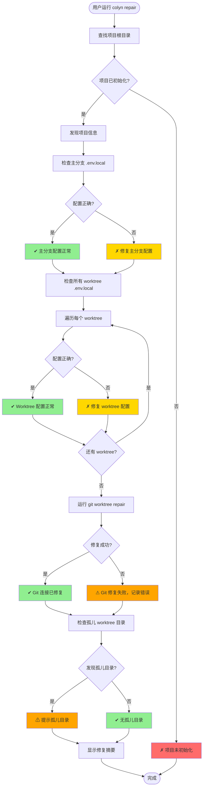
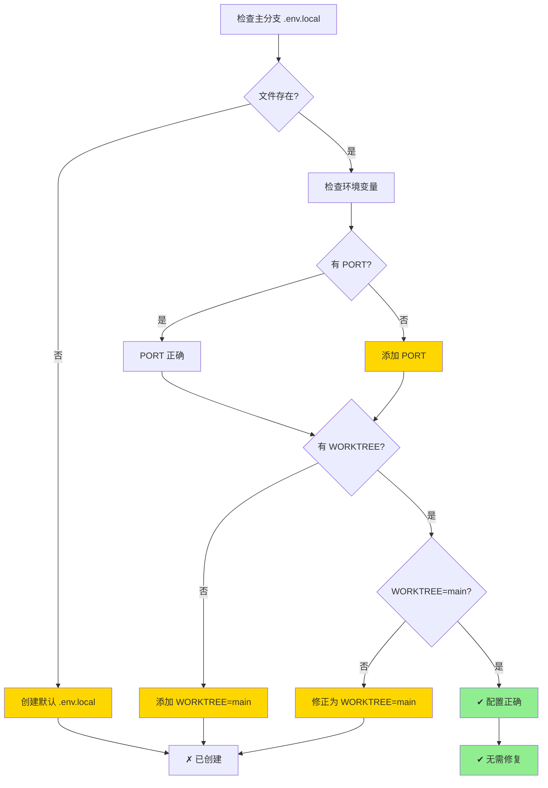
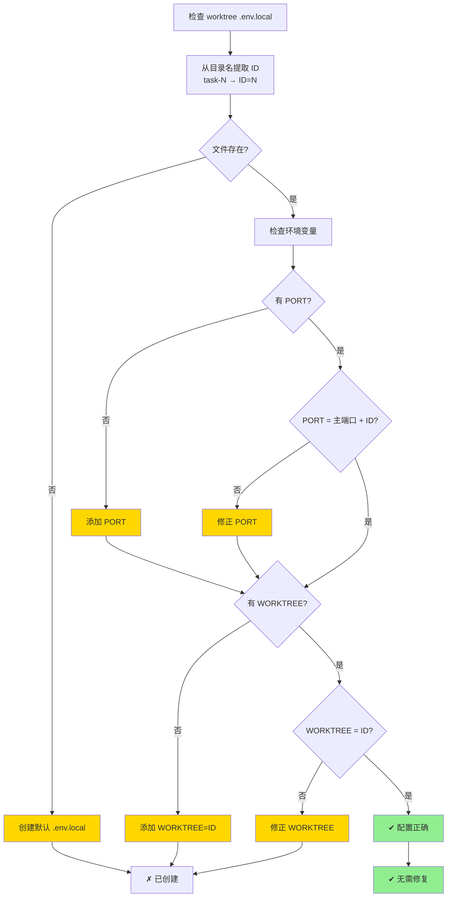
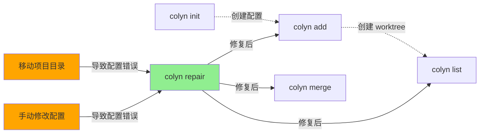

# Repair 命令设计文档（用户交互视角）

**创建时间**：2026-01-17
**最后更新**：2026-01-17
**命令名称**：`colyn repair`
**状态**：🚧 设计中

---

## 1. 命令概述

### 1.1 用户目标

用户希望在移动整个项目目录后，快速检查并修复项目配置中的错误，确保所有 worktree 能够正常工作。

### 1.2 命令使用

```bash
# 基本用法（自动修复所有问题）
colyn repair
```

### 1.3 执行结果

执行后，系统会：
1. 检查并修复主分支目录的 `.env.local` 文件
2. 检查并修复所有 worktree 的 `.env.local` 文件
3. 运行 `git worktree repair` 修复 git 连接
4. 检测并报告孤儿 worktree 目录（目录存在但 git 不识别）

---

## 2. 用户场景

### 2.1 场景 1：移动项目目录后修复

**用户情况**：将整个项目从 `/Users/user/project` 移动到 `/Users/user/Desktop/project`

**问题表现**：
- Git worktree 无法识别各个 worktree
- 运行 git 命令时报错找不到 worktree

**操作流程**：

```bash
# 移动目录后
$ cd /Users/user/Desktop/project

# 运行修复命令
$ colyn repair

✔ 检查主分支 .env.local
✔ 检查 worktree task-1 .env.local
✔ 检查 worktree task-2 .env.local
✔ 修复 git worktree 连接
✔ 检查孤儿 worktree 目录

✓ 修复完成！

修复摘要：
  ✓ Git worktree 连接已修复
  ✓ 检查了 3 个 .env.local 文件，无问题
  ✓ 未发现孤儿 worktree 目录
```

**结果**：所有 worktree 恢复正常工作

---

### 2.2 场景 2：.env.local 文件被误修改

**用户情况**：手动修改了某些 worktree 的 `.env.local`，导致配置不一致

**问题表现**：
- task-1 的 PORT=10005，但应该是 10001
- task-2 的 WORKTREE=3，但目录名是 task-2

**操作流程**：

```bash
$ colyn repair

✔ 检查主分支 .env.local
✗ 修复 worktree task-1 .env.local
  - PORT: 10005 → 10001
✗ 修复 worktree task-2 .env.local
  - WORKTREE: 3 → 2
✔ 修复 git worktree 连接
✔ 检查孤儿 worktree 目录

✓ 修复完成！

修复摘要：
  ✓ 修复了 2 个 .env.local 文件
  ✓ Git worktree 连接正常
  ✓ 未发现孤儿 worktree 目录
```

**结果**：所有配置恢复正确

---

### 2.3 场景 3：存在孤儿 worktree 目录

**用户情况**：手动删除了 git worktree 但目录还在

**问题表现**：
- `worktrees/task-3` 目录存在
- 但 `git worktree list` 中没有这个 worktree

**操作流程**：

```bash
$ colyn repair

✔ 检查主分支 .env.local
✔ 检查 worktree task-1 .env.local
✔ 检查 worktree task-2 .env.local
✔ 修复 git worktree 连接
⚠ 发现孤儿 worktree 目录

✓ 修复完成！

修复摘要：
  ✓ 检查了 3 个 .env.local 文件，无问题
  ✓ Git worktree 连接正常
  ⚠ 发现 1 个孤儿 worktree 目录：
    - worktrees/task-3 (目录存在但 git 不识别)

建议操作：
  运行 colyn remove 命令清理，或手动删除目录
```

**结果**：提示用户存在孤儿目录，需要手动清理

---

## 3. 用户交互流程

### 3.1 整体流程图



### 3.2 检查和修复逻辑

#### 主分支 .env.local 检查



#### Worktree .env.local 检查



---

## 4. 输入与输出

### 4.1 用户输入

| 输入内容 | 说明 | 是否必需 |
|---------|------|---------|
| 无 | repair 命令无需参数，自动检查并修复 | - |

### 4.2 系统输出

**检查进度**（使用 spinner）：
```
✔ 检查主分支 .env.local
✔ 检查 worktree task-1 .env.local
✗ 修复 worktree task-2 .env.local
  - PORT: 10005 → 10002
  - WORKTREE: 3 → 2
✔ 修复 git worktree 连接
✔ 检查孤儿 worktree 目录
```

**修复摘要**：
```
✓ 修复完成！

修复摘要：
  ✓ 修复了 1 个 .env.local 文件
  ✓ Git worktree 连接已修复
  ✓ 未发现孤儿 worktree 目录

详细信息：
  主分支：
    ✓ .env.local 配置正确

  Worktree task-1：
    ✓ .env.local 配置正确

  Worktree task-2：
    ✗ PORT 错误：10005 → 10002
    ✗ WORKTREE 错误：3 → 2
```

---

## 5. 错误处理

### 5.1 常见错误及处理

| 错误场景 | 系统行为 | 用户看到 |
|---------|---------|---------|
| **项目未初始化** | 报错退出 | ✗ 项目未初始化<br/>提示：请先运行 colyn init |
| **不是 git 仓库** | 报错退出 | ✗ 主分支目录不是 git 仓库<br/>提示：请确保在 git 项目中运行 |
| **git worktree repair 失败** | 记录错误，继续其他检查 | ⚠ Git worktree 修复失败<br/>错误信息：[git 错误]<br/>建议：手动运行 git worktree repair |
| **无法读取 .env.local** | 尝试创建新文件 | ⚠ 无法读取 .env.local，已创建新文件 |
| **无法写入 .env.local** | 记录错误，继续其他检查 | ⚠ 无法修复 worktree task-1 .env.local<br/>错误：权限不足 |

### 5.2 错误处理原则

- **尽力而为**：遇到单个错误不停止，继续检查其他项
- **详细记录**：所有错误都记录并在摘要中显示
- **提供建议**：告知用户如何手动解决无法自动修复的问题

---

## 6. 检查规则详解

### 6.1 主分支 .env.local 检查规则

**必需环境变量**：
- `PORT`：保持现有值（不修改）
- `WORKTREE`：必须为 `"main"`

**修复策略**：
- 如果文件不存在：创建文件，使用默认 PORT（从用户配置获取）
- 如果缺少变量：添加缺失的变量
- 如果 WORKTREE 不是 "main"：修正为 "main"

### 6.2 Worktree .env.local 检查规则

**目录名解析**：
- 从目录名提取 ID：`task-1` → ID = 1

**必需环境变量**：
- `PORT`：必须为 `主端口 + ID`
- `WORKTREE`：必须为 `ID`（数字字符串）

**修复策略**：
- 如果文件不存在：从主分支复制 `.env.local` 并更新 PORT 和 WORKTREE
- 如果 PORT 错误：修正为 `主端口 + ID`
- 如果 WORKTREE 错误：修正为 `ID`

**示例**：
```
主端口 = 10000
worktrees/task-1/.env.local:
  PORT=10001  ✓ 正确（10000 + 1）
  WORKTREE=1  ✓ 正确

worktrees/task-2/.env.local:
  PORT=10005  ✗ 错误 → 修正为 10002（10000 + 2）
  WORKTREE=3  ✗ 错误 → 修正为 2
```

### 6.3 Git worktree 连接修复

**执行命令**：
```bash
cd <主分支目录>
git worktree repair
```

**Git 会自动修复**：
- 主分支与 worktree 的双向连接
- Worktree 的 `.git` 文件中的路径
- `.git/worktrees/` 中的管理文件

### 6.4 孤儿 worktree 目录检测与修复

**检测逻辑**：
1. 使用 `git worktree list --porcelain` 获取所有 worktree（包括路径已失效的）
2. 扫描 `worktrees/` 下所有 `task-*` 目录
3. 智能匹配：通过分支名匹配 git 记录和实际目录

**孤儿目录的类型**：

1. **路径失效型**（可修复）：
   - 原因：项目目录被移动或改名
   - 表现：git worktree list 中路径不存在，但分支名匹配
   - 处理：使用 `git worktree repair <new-path>` 修复路径

2. **真孤儿型**（仅报告）：
   - 原因：手动删除了 worktree，或 git 数据损坏
   - 表现：目录存在但 git 完全不识别
   - 处理：仅报告，建议用户手动清理

**修复策略**：
```bash
# 对于路径失效的 worktree
git worktree repair /new/path/to/worktrees/task-1

# 会更新 git 中记录的 worktree 路径
```

**匹配逻辑**：
- 从实际目录的 `.git` 文件或 `.env.local` 读取分支名
- 与 git worktree list 中的分支名匹配
- 匹配成功则认为是路径失效型，可以修复

---

## 7. 成功后的项目状态

### 7.1 修复前后对比

**修复前（移动目录后）**：
```
# Git worktree 状态
$ git worktree list
fatal: 'worktree' does not point back to '/old/path/project'

# task-1 .env.local
PORT=10005      # 错误
WORKTREE=3      # 错误
```

**修复后**：
```
# Git worktree 状态
$ git worktree list
/new/path/project/my-project         (main)
/new/path/project/worktrees/task-1   (feature/login)
/new/path/project/worktrees/task-2   (feature/dashboard)

# task-1 .env.local
PORT=10001      # 正确
WORKTREE=1      # 正确
```

---

## 8. 与其他命令的关系



**说明**：
- `repair` 是维护性命令，用于修复配置错误
- 通常在移动目录或手动修改配置后运行
- 修复后其他命令可以正常使用

---

## 9. 特殊情况处理

### 9.1 主端口无法确定

**场景**：主分支 `.env.local` 文件不存在或 PORT 缺失

**处理**：
- 尝试从 `git worktree list` 推断（如果有 worktree）
- 否则使用默认值 10000

### 9.2 Worktree 目录名不规范

**场景**：`worktrees/` 下有非 `task-*` 格式的目录

**处理**：
- 跳过不符合格式的目录
- 在摘要中警告

### 9.3 Git worktree repair 不可用

**场景**：Git 版本过低，不支持 `repair` 子命令

**处理**：
- 检测 git 版本
- 如果不支持，跳过 git 修复，提示用户升级 git

---

## 10. 常见问题

### Q1: 什么时候需要运行 repair 命令？

A: 以下情况需要运行：
- 移动了整个项目目录
- 手动修改了 `.env.local` 文件导致配置错误
- Git worktree 出现连接问题
- 怀疑配置不一致时

### Q2: repair 会修改哪些文件？

A: 只会修改 `.env.local` 文件中的 PORT 和 WORKTREE 变量，不会修改其他环境变量或项目文件。

### Q3: repair 会删除文件吗？

A: 不会。即使发现孤儿 worktree 目录，也只会报告，不会自动删除。

### Q4: repair 失败了怎么办？

A: repair 采用"尽力而为"策略，单个错误不会导致整个命令失败。查看摘要中的错误信息，根据建议手动处理。

### Q5: 需要在哪里运行 repair 命令？

A: 可以在项目的任意位置运行，系统会自动查找项目根目录。

### Q6: repair 会影响 git 历史吗？

A: 不会。repair 只修复管理文件和环境变量配置，不涉及 git 提交历史。

---

## 11. 实现要点

### 11.1 技术要求

- 从项目任意位置运行（使用 `findProjectRoot`）
- 使用 ora spinner 显示每个检查项的进度
- 错误不中断流程，记录后继续
- 最后汇总显示所有修复和错误

### 11.2 关键函数

| 函数名 | 功能 | 输入 | 输出 |
|-------|------|------|------|
| `repairProject` | 主函数 | 无 | void |
| `checkMainEnv` | 检查主分支 .env.local | mainDir, mainPort | RepairResult |
| `checkWorktreeEnv` | 检查 worktree .env.local | wtPath, wtId, mainPort | RepairResult |
| `repairGitWorktree` | 修复 git worktree 连接 | mainDir | RepairResult |
| `findOrphanWorktrees` | 查找孤儿 worktree 目录 | worktreesDir, gitWorktrees | string[] |
| `displayRepairSummary` | 显示修复摘要 | results[] | void |

### 11.3 数据结构

```typescript
interface RepairResult {
  /** 检查项名称 */
  item: string;
  /** 是否成功 */
  success: boolean;
  /** 是否有修复 */
  fixed: boolean;
  /** 修复详情 */
  details?: string[];
  /** 错误信息 */
  error?: string;
}
```

---

## 12. 总结

`colyn repair` 命令设计重点：

1. **自动化**：无需参数，自动检查并修复所有问题
2. **容错性**：单个错误不中断流程，尽可能修复更多问题
3. **安全性**：只修复明确的配置错误，不删除文件
4. **透明性**：详细显示每个检查项和修复结果
5. **实用性**：解决移动目录后的常见问题

**最佳实践**：
- 移动项目目录后立即运行 `colyn repair`
- 定期运行检查配置一致性
- 出现 git worktree 问题时运行
