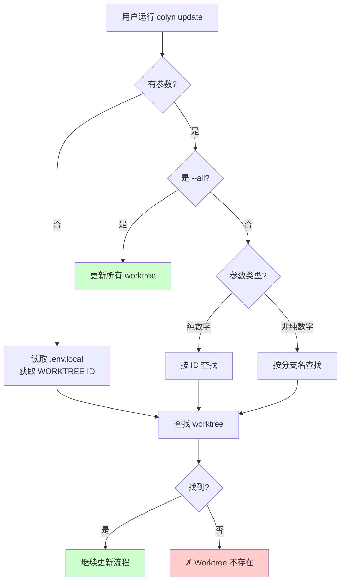
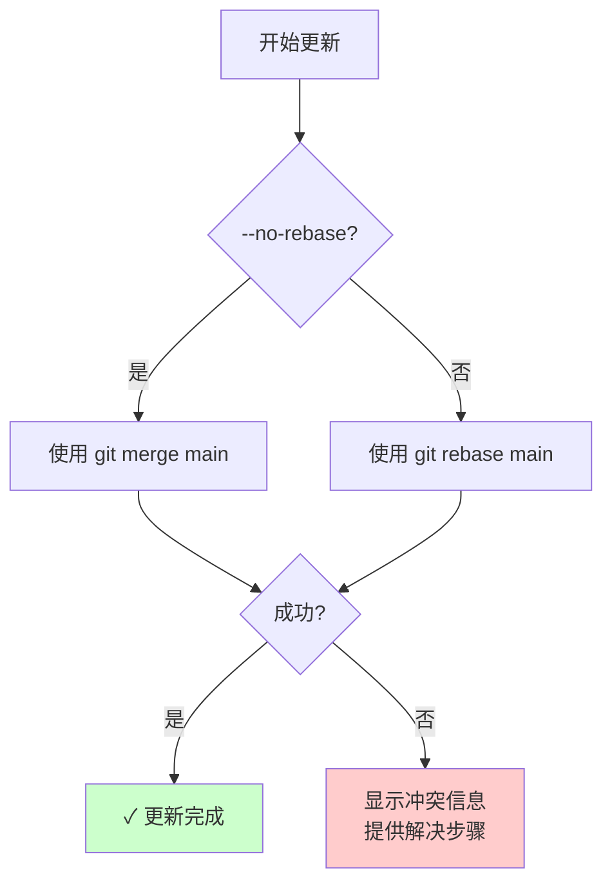
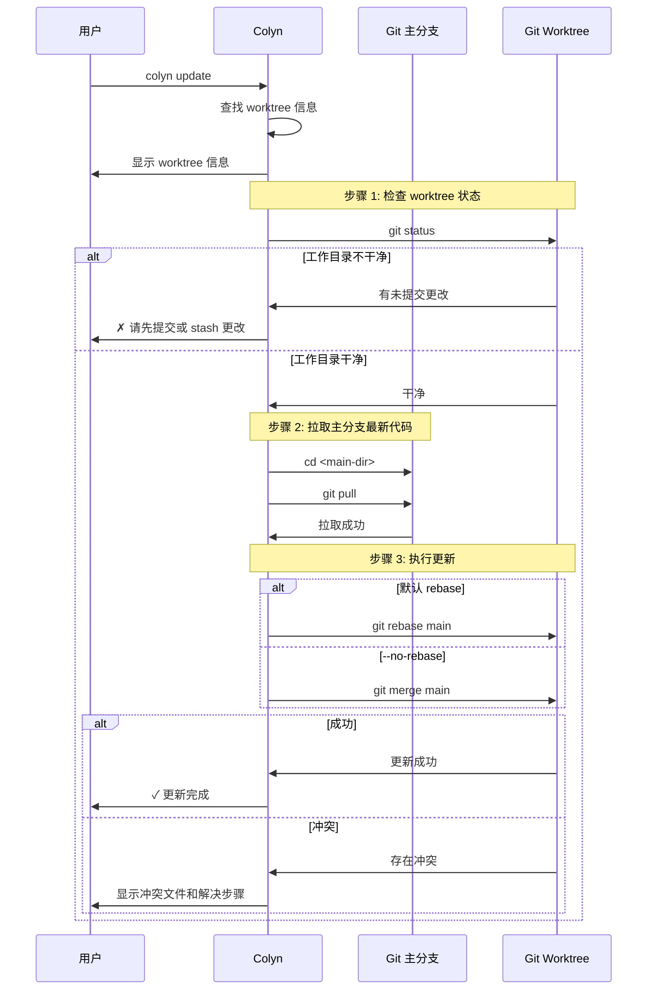
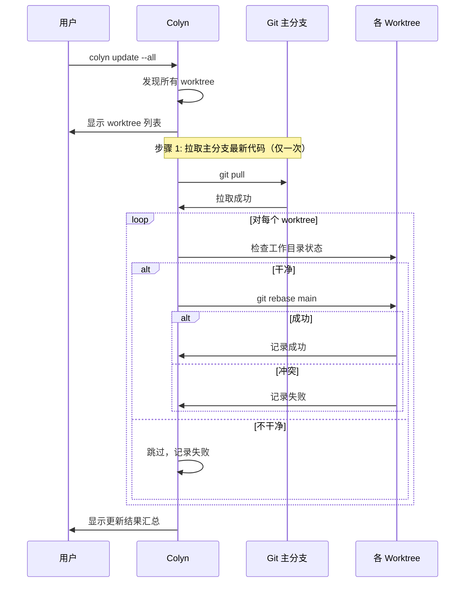

# Update 命令设计文档（用户交互视角）

**创建时间**：2026-01-28
**最后更新**：2026-01-28
**命令名称**：`colyn update`
**状态**：📝 设计中

---

## 1. 需求概述

### 1.1 背景

用户在 worktree 中开发功能时，主分支可能会有新的提交（其他同事的代码、bug 修复等）。为了保持代码同步，用户需要定期将主分支的最新代码更新到当前分支。传统流程需要：
1. 确保当前工作目录干净
2. 切换到主分支目录执行 `git pull`
3. 回到 worktree 目录
4. 执行 `git rebase main` 或 `git merge main`
5. 处理可能的冲突

这个过程繁琐，尤其是有多个 worktree 时。

### 1.2 用户目标

提供一条简单的命令，自动将主分支的最新代码更新到 worktree 分支，让用户专注于开发而非 git 操作。

### 1.3 核心价值

- ✅ **简化操作**：一条命令完成更新流程
- ✅ **智能识别**：支持自动识别当前 worktree
- ✅ **默认 rebase**：产生线性提交历史，更整洁
- ✅ **可选 merge**：通过 `--no-rebase` 保留完整历史
- ✅ **自动同步**：自动拉取主分支最新代码
- ✅ **批量更新**：支持 `--all` 一次性更新所有 worktree

---

## 2. 用户使用场景

### 2.1 场景 1：更新当前 worktree

**用户情况**：正在 worktree 中开发，想要同步主分支的最新代码

```bash
$ cd worktrees/task-1
$ colyn update

✓ 检测到当前 worktree:
  ID: 1
  分支: feature/login
  路径: /path/to/worktrees/task-1

步骤 1/3: 检查工作目录状态
✔ Worktree 工作目录干净

步骤 2/3: 拉取主分支最新代码
  目录: /path/to/my-project
  执行: git pull
✔ 主分支已更新

步骤 3/3: 将主分支变基到当前分支
  目录: /path/to/worktrees/task-1
  执行: git rebase main
✔ 变基成功

✓ 更新完成！
  主分支 (main) → feature/login
  策略: rebase
```

---

### 2.2 场景 2：指定 worktree 进行更新

**用户情况**：在任意目录，想要更新指定的 worktree

```bash
# 通过 ID 指定
$ colyn update 1

# 通过分支名指定
$ colyn update feature/login
```

---

### 2.3 场景 3：使用 merge 策略

**用户情况**：不想使用 rebase，想保留完整的分支历史

```bash
$ colyn update --no-rebase

步骤 3/3: 将主分支合并到当前分支
  目录: /path/to/worktrees/task-1
  执行: git merge main
✔ 合并成功

✓ 更新完成！
  主分支 (main) → feature/login
  策略: merge
```

---

### 2.4 场景 4：批量更新所有 worktree

**用户情况**：想要一次性更新所有 worktree

```bash
$ colyn update --all

发现 3 个 worktree:
  1. task-1 (feature/login)
  2. task-2 (feature/signup)
  3. task-3 (bugfix/header)

步骤 1/4: 拉取主分支最新代码
✔ 主分支已更新

步骤 2/4: 更新 task-1 (feature/login)
✔ 变基成功

步骤 3/4: 更新 task-2 (feature/signup)
✔ 变基成功

步骤 4/4: 更新 task-3 (bugfix/header)
⚠ 变基失败，存在冲突

更新结果:
  ✓ 2 个 worktree 更新成功
  ✗ 1 个 worktree 更新失败

失败详情:
  task-3 (bugfix/header): 存在冲突，请手动解决
    cd worktrees/task-3
    git rebase --continue  # 解决冲突后
    # 或
    git rebase --abort     # 放弃变基
```

---

### 2.5 场景 5：处理冲突

**用户情况**：rebase 过程中发生冲突

```bash
$ colyn update

步骤 3/3: 将主分支变基到当前分支
✗ 变基失败，存在冲突

冲突文件：
  src/app.ts
  src/config.ts

解决步骤：
  1. 编辑冲突文件，解决冲突标记
  2. 添加已解决的文件：
     git add <file>
  3. 继续变基：
     git rebase --continue
  4. 如需放弃变基：
     git rebase --abort
```

---

## 3. 功能需求

### 3.1 参数识别

支持三种调用方式：



**示例**：
| 命令 | 识别方式 | 说明 |
|------|---------|------|
| `colyn update` | 自动识别 | 读取 .env.local 中的 WORKTREE 值 |
| `colyn update 1` | 按 ID | 查找 ID 为 1 的 worktree |
| `colyn update feature/login` | 按分支名 | 查找分支为 feature/login 的 worktree |
| `colyn update bugfix-header` | 按分支名 | 查找分支为 bugfix-header 的 worktree |
| `colyn update --all` | 批量 | 更新所有 worktree |

---

### 3.2 更新策略



**两种策略对比**：

| 策略 | 命令 | 优点 | 缺点 |
|------|------|------|------|
| **rebase（默认）** | `colyn update` | 线性历史，整洁 | 重写提交历史 |
| **merge** | `colyn update --no-rebase` | 保留完整历史 | 产生合并提交 |

---

### 3.3 执行流程



---

### 3.4 批量更新流程



**批量更新特性**：
- 只执行一次 `git pull`，避免重复拉取
- 遇到失败不中断，继续更新其他 worktree
- 最后显示汇总结果

---

### 3.5 前置检查

| 检查项 | 检查内容 | 失败提示 |
|--------|----------|----------|
| 是否已初始化 | 检查 `.colyn` 目录 | 请先运行 `colyn init` |
| Worktree 是否存在 | 通过 discovery 模块查找 | ID 或分支名不存在，运行 `colyn list` 查看 |
| Worktree 目录状态 | `git status` 是否干净 | 请先提交或 stash 更改 |
| 主分支 pull 是否成功 | `git pull` 返回值 | 拉取失败，请检查网络或远程仓库配置 |

---

## 4. 输入与输出

### 4.1 用户输入

| 输入内容 | 必填 | 说明 | 验证规则 |
|---------|------|------|---------|
| ID 或分支名 | 否 | 指定要更新的 worktree<br/>无参数时自动识别 | - 纯数字视为 ID<br/>- 非纯数字视为分支名 |
| `--no-rebase` | 否 | 使用 merge 策略而非 rebase | 默认使用 rebase |
| `--all` | 否 | 更新所有 worktree | 与指定 ID/分支名互斥 |

### 4.2 系统输出

**成功输出**：
```
✓ 更新完成！
  主分支 (main) → feature/login
  策略: rebase
```

**冲突输出**：
```
✗ 变基失败，存在冲突

冲突文件：
  src/app.ts

解决步骤：
  1. 编辑冲突文件，解决冲突标记
  2. git add <file>
  3. git rebase --continue
  4. 如需放弃：git rebase --abort
```

**批量更新输出**：
```
更新结果:
  ✓ 2 个 worktree 更新成功
  ✗ 1 个 worktree 更新失败

失败详情:
  task-3 (bugfix/header): 存在冲突
```

---

## 5. 错误处理

### 5.1 常见错误

| 错误场景 | 用户看到 | 如何解决 |
|---------|---------|---------|
| **未初始化** | ✗ 当前目录未初始化<br/>提示：请先运行 colyn init | 运行 `colyn init` |
| **不在 worktree 中** | ✗ 当前目录不是 worktree<br/>请指定 worktree ID 或分支名 | 使用 `colyn update <id>` |
| **Worktree 不存在** | ✗ 找不到 worktree<br/>ID "1" 或分支 "feature/login" 不存在 | 运行 `colyn list` 查看 |
| **Worktree 不干净** | ✗ Worktree 有未提交的更改<br/>请先提交或 stash 更改 | 提交或 stash |
| **Pull 失败** | ✗ 拉取主分支失败<br/>请检查网络或远程仓库配置 | 检查网络，手动 pull |
| **Rebase/Merge 冲突** | ✗ 存在冲突<br/>冲突文件: ... | 手动解决冲突 |

---

## 6. 与其他命令的关系

| 命令 | 关系 | 说明 |
|------|------|------|
| `colyn merge` | 互补 | merge 是将 worktree 合并回主分支<br/>update 是将主分支更新到 worktree |
| `colyn add` | 前置 | add 创建 worktree 后，可用 update 保持同步 |
| `colyn list` | 辅助 | 查看所有 worktree，确定要更新哪个 |

```
主分支 ─────────────────────────────────────────►
         │                    ▲
         │ colyn add          │ colyn merge
         ▼                    │
worktree ─────────────────────┘
              ◄───────────────
              colyn update
```

---

## 7. 验收标准

### 7.1 基本功能

- [ ] 支持无参数调用（自动识别当前 worktree）
- [ ] 支持通过 ID 指定 worktree
- [ ] 支持通过分支名指定 worktree
- [ ] 默认使用 `git rebase main`
- [ ] `--no-rebase` 使用 `git merge main`
- [ ] 更新前自动执行 `git pull` 拉取主分支

### 7.2 批量更新

- [ ] `--all` 支持更新所有 worktree
- [ ] 只执行一次 `git pull`
- [ ] 遇到失败不中断，继续更新其他 worktree
- [ ] 显示汇总结果

### 7.3 前置检查

- [ ] 检查是否已初始化
- [ ] 检查 worktree 是否存在
- [ ] 检查 worktree 工作目录是否干净
- [ ] 检查 git pull 是否成功

### 7.4 错误处理

- [ ] 冲突时显示冲突文件列表
- [ ] 提供详细的冲突解决步骤
- [ ] rebase 和 merge 冲突提示不同（rebase --continue vs commit）

### 7.5 用户体验

- [ ] 显示清晰的进度信息（使用 spinner）
- [ ] 成功时显示更新策略和结果
- [ ] 错误信息包含具体的解决建议
- [ ] 支持 i18n 多语言

---

## 8. 范围外

以下功能不在本次需求范围内：

- ❌ 自动解决合并冲突
- ❌ 支持指定 rebase 到特定提交
- ❌ 支持 --force 强制更新
- ❌ 更新后自动 push
- ❌ 支持 --dry-run 预览模式

---

## 9. 常见问题

### Q1: 为什么默认使用 rebase 而不是 merge？

A: Rebase 产生线性的提交历史，更加整洁：
- 代码审查更容易
- `git log` 更清晰
- 符合大多数团队的工作流

如果需要保留完整的分支历史，可以使用 `--no-rebase`。

### Q2: update 和 merge 有什么区别？

A: 方向不同：
- `colyn update`：主分支 → worktree（同步最新代码）
- `colyn merge`：worktree → 主分支（合并功能代码）

### Q3: 批量更新时，一个失败会影响其他吗？

A: 不会。失败的会被记录，但不中断其他 worktree 的更新。最后会显示汇总结果。

### Q4: 冲突后如何继续？

A: 根据使用的策略：
- **rebase**：解决冲突后 `git rebase --continue`
- **merge**：解决冲突后 `git add` + `git commit`

如需放弃：
- **rebase**：`git rebase --abort`
- **merge**：`git merge --abort`

### Q5: 为什么要先 pull 主分支？

A: 确保更新到最新代码。如果主分支本地有落后的提交，更新后仍然不是最新状态。

---

## 10. 实现建议

### 10.1 文件结构

```
src/commands/
├── update.ts           # 命令注册
└── update.helpers.ts   # 辅助函数
```

### 10.2 主要函数

```typescript
// update.helpers.ts

/**
 * 更新单个 worktree
 */
async function updateWorktree(
  worktree: WorktreeInfo,
  mainDir: string,
  mainBranch: string,
  useRebase: boolean
): Promise<UpdateResult>

/**
 * 批量更新所有 worktree
 */
async function updateAllWorktrees(
  worktrees: WorktreeInfo[],
  mainDir: string,
  mainBranch: string,
  useRebase: boolean
): Promise<BatchUpdateResult>

/**
 * 拉取主分支最新代码
 */
async function pullMainBranch(mainDir: string): Promise<void>

/**
 * 检查 worktree 工作目录状态
 */
async function checkWorktreeClean(worktreePath: string): Promise<boolean>
```

### 10.3 i18n 键

```typescript
// 需要添加的翻译键
commands.update.description
commands.update.detectedWorktree
commands.update.pullingMain
commands.update.pullSuccess
commands.update.checkingStatus
commands.update.statusClean
commands.update.rebasing
commands.update.merging
commands.update.success
commands.update.conflict
commands.update.conflictFiles
commands.update.rebaseConflictSteps
commands.update.mergeConflictSteps
commands.update.batchResult
commands.update.notInWorktree
// ... 更多
```

---

## 11. 总结

`colyn update` 命令核心价值：

✅ **简化操作**：一条命令完成更新流程
✅ **默认 rebase**：产生整洁的线性历史
✅ **可选 merge**：通过 `--no-rebase` 灵活选择
✅ **自动同步**：自动拉取主分支最新代码
✅ **批量更新**：`--all` 一次性更新所有 worktree
✅ **智能识别**：支持自动识别当前 worktree
✅ **友好提示**：清晰的错误信息和冲突解决步骤

通过本命令，用户可以轻松保持 worktree 与主分支同步，专注于功能开发。
