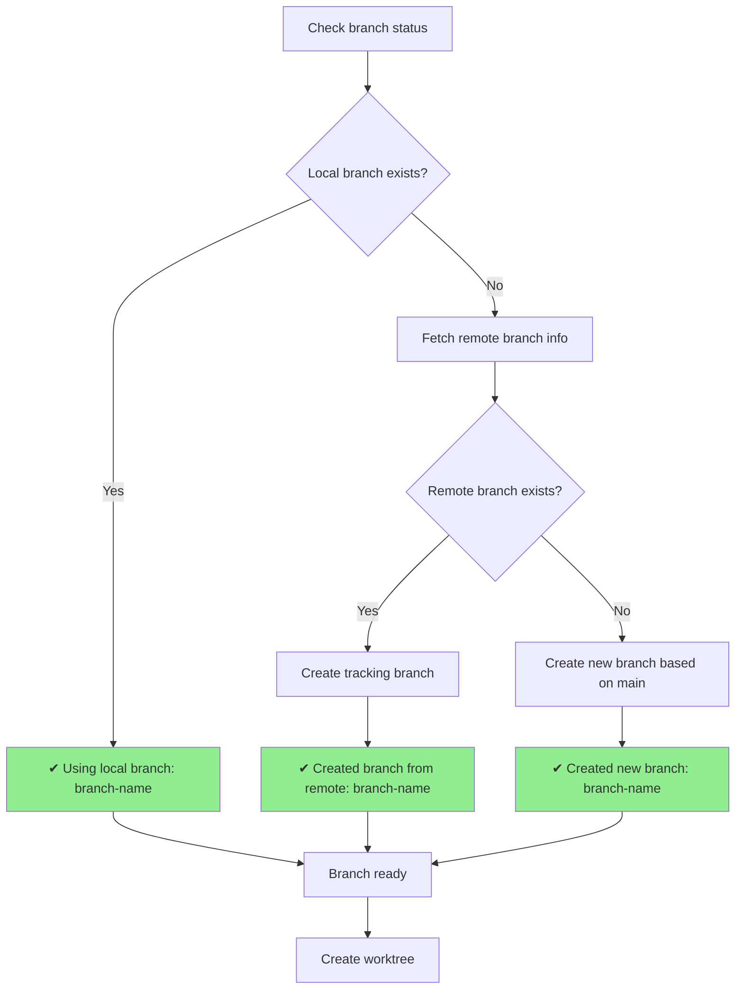
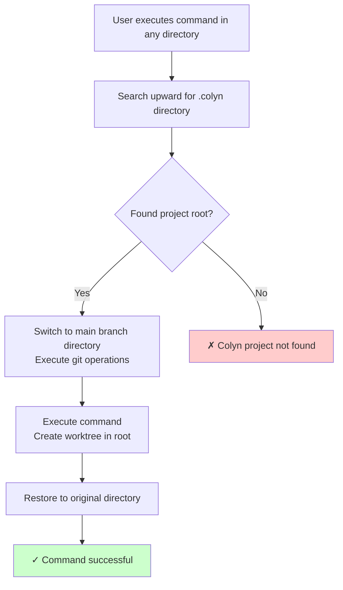
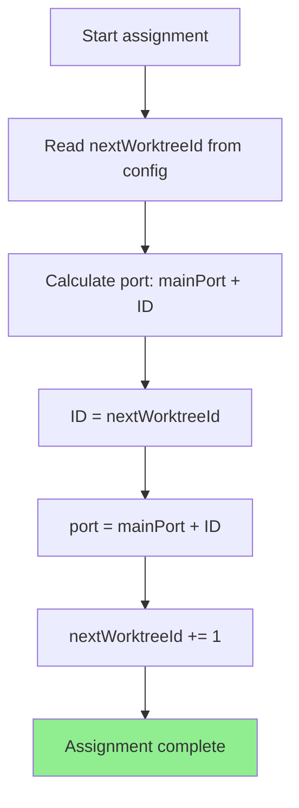
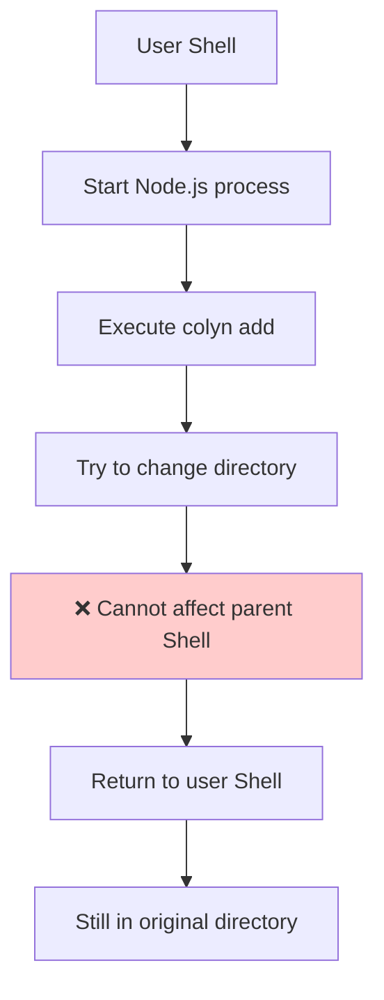
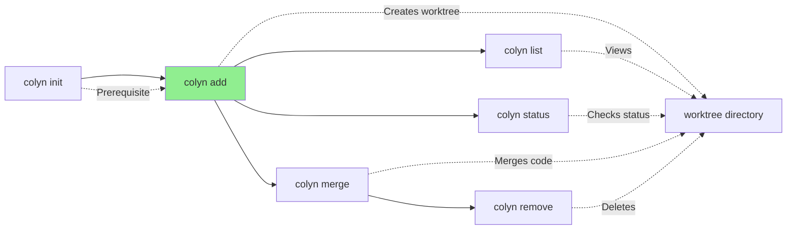

# Add Command Design Document (User Interaction Perspective)

**Created**: 2026-01-14
**Last Updated**: 2026-02-23 (updated: support no-arg interactive branch selection)
**Command Name**: `colyn add`
**Status**: Implemented

---

## 1. Command Overview

### 1.1 User Goal

Users want to create an independent development environment (worktree) for a specific feature branch to:
- Develop multiple features in parallel without switching branches
- Run development servers on independent ports for each feature
- Keep development states of different features isolated

### 1.2 Command Usage

```bash
# Interactive branch selection (no argument)
colyn add

# Create worktree for new branch
colyn add feature/login

# Create worktree based on existing branch
colyn add bugfix/auth-error

# Create worktree from remote branch (will auto-remove origin/ prefix)
colyn add origin/feature/payment
```

### 1.3 Execution Result

Creates a new worktree:
- **Directory Location**: `worktrees/task-{id}/`
- **Branch**: Specified branch (auto-created if doesn't exist)
- **Port**: Auto-assigned (main port + worktree ID)
- **Environment Variables**: Copied from main branch and updated PORT and WORKTREE

**Example**:
```bash
$ colyn add feature/login

✔ Using local branch: feature/login
✔ Worktree created: task-1
✔ Environment variables configured
✔ Dependencies installed
✔ Configuration file updated

✓ Worktree created successfully!

Worktree info:
  ID: 1
  Branch: feature/login
  Path: /Users/user/project/worktrees/task-1
  Port: 10001

Next steps:
  1. Enter worktree directory:
     cd /Users/user/project/worktrees/task-1

  2. Start development server (port auto-configured):
     npm run dev

  3. View all worktrees:
     colyn list
```

---

## 2. User Scenarios

### 2.1 Scenario 1: Parallel Development of Two Features

**User Need**: Develop login and dashboard features simultaneously

**Workflow**:

```bash
# 1. Create login feature worktree
$ colyn add feature/login
✓ Worktree created successfully! (ID: 1, Port: 10001)

# 2. Create dashboard feature worktree
$ colyn add feature/dashboard
✓ Worktree created successfully! (ID: 2, Port: 10002)

# 3. Start development servers separately
$ cd worktrees/task-1 && npm run dev  # On port 10001
$ cd worktrees/task-2 && npm run dev  # On port 10002
```

**Result**: Two features run independently on different ports, can be tested simultaneously.

---

### 2.2 Scenario 2: Create Worktree from Remote Branch

**User Need**: Team member created remote branch `feature/payment`, I need to develop based on this branch

**Workflow**:

```bash
$ colyn add feature/payment

Checking remote branches...
✔ Created branch from remote: feature/payment
✔ Worktree created: task-3
✔ Environment variables configured
✔ Configuration file updated

✓ Worktree created successfully!
```

**System Auto-executes**:
1. Fetch latest remote branches
2. Create local tracking branch
3. Create worktree

---

### 2.3 Scenario 3: Create New Worktree from Within a Worktree

**User Need**: Run `colyn add` command while in `worktrees/task-1` directory

**System Behavior**:
- Auto-locate project root directory
- Create new worktree in root's `worktrees/`
- User doesn't need to manually switch to root directory

```bash
$ cd worktrees/task-1
$ colyn add feature/new-feature

✓ Worktree created successfully! (Auto-created in project root's worktrees/)
```

---

### 2.4 Scenario 4: No-argument Interactive Branch Selection

**User Need**: choose or create a branch from a list instead of typing branch name manually.

**Workflow**:

```bash
$ colyn add
? Select target branch (or create a new branch) ›
❯ [Create new branch]      Create a new branch using type/name
  feature/login            Todo: implement login flow
  bugfix/fix-crash         Todo: fix app crash
  refactor/auth-module     Local branch

# After selecting [Create new branch]
? Select task type › feature
? Enter task name › user-profile

# Final branch: feature/user-profile
```

**Order and rules**:

1. The first item is always `[Create new branch]` and is selected by default
2. Then branches from `pending` todos
3. Then existing local branches (excluding the current branch in the main-branch directory)
4. For local branches:
   - if branch contains `/`: `type` = prefix before last `/`, `name` = last segment
   - if branch does not contain `/`: `type` is empty, full branch name is used as `name`

---

## 3. User Interaction Flow

### 3.1 Overall Flow Diagram

```mermaid
graph TD
    Start([User runs colyn add [branch]]) --> Choose{branch argument provided?}

    Choose -->|No| Select[Interactive branch selector<br/>default: create new branch]
    Select --> Validate
    Choose -->|Yes| Validate[Validate branch name]

    Validate --> Valid{Branch name valid?}
    Valid -->|No| ErrorInvalid[✗ Invalid branch name]
    Valid -->|Yes| FindRoot[Locate project root]

    FindRoot --> CheckInit{Project initialized?}
    CheckInit -->|No| ErrorNotInit[✗ Not initialized<br/>Prompt to run colyn init]
    CheckInit -->|Yes| CheckGit{Is git repository?}

    CheckGit -->|No| ErrorNotGit[✗ Not a git repository]
    CheckGit -->|Yes| CheckEnv{Main branch has .env.local?}

    CheckEnv -->|No| ErrorNoEnv[✗ Missing environment variable file]
    CheckEnv -->|Yes| CheckConflict{Branch already has worktree?}

    CheckConflict -->|Yes| ErrorConflict[✗ Branch already has worktree<br/>Show existing info]
    CheckConflict -->|No| HandleBranch[Intelligently handle branch]

    HandleBranch --> BranchReady[Branch ready]
    BranchReady --> AssignId[Assign ID and port]
    AssignId --> CreateWT[Create worktree]
    CreateWT --> ConfigEnv[Configure environment variables]
    ConfigEnv --> RunInstall[Plugin installs dependencies<br/>npm install / mvn install / etc.]
    RunInstall --> UpdateConfig[Update configuration file]
    UpdateConfig --> Success[✓ Show success message]

    Success --> End([Complete])
    ErrorInvalid --> End
    ErrorNotInit --> End
    ErrorNotGit --> End
    ErrorNoEnv --> End
    ErrorConflict --> End

    style ErrorInvalid fill:#ffcccc
    style ErrorNotInit fill:#ffcccc
    style ErrorNotGit fill:#ffcccc
    style ErrorNoEnv fill:#ffcccc
    style ErrorConflict fill:#ffcccc
    style Success fill:#ccffcc
```

### 3.2 Branch Intelligent Handling Flow

How system handles different branch situations:



**Messages User Sees**:

| Situation | User Sees |
|-----------|-----------|
| Local branch exists | `Using local branch: feature/login` |
| Remote branch exists | `Checking remote branches...` <br/> `✔ Created branch from remote: feature/login` |
| Branch doesn't exist | `Checking remote branches...` <br/> `✔ Created new branch: feature/login` |

---

## 4. Running from Anywhere in Project

`colyn add` supports running from anywhere in the project:



**Example**:
```bash
# Run from worktree subdirectory
$ cd worktrees/task-1/src/components
$ colyn add feature/new-button

✓ Worktree created successfully!  # Created in project root's worktrees/
```

---

## 5. Input and Output

### 5.1 User Input

| Input | Description | Validation Rules |
|-------|-------------|------------------|
| Branch name | Git branch name (positional argument) | - Cannot be empty<br/>- Can only contain letters, numbers, underscores, hyphens, and slashes<br/>- Cannot start or end with `/`<br/>- Cannot contain consecutive `//` |

**Branch Name Processing**:
- `origin/feature/login` → `feature/login` (auto-remove `origin/` prefix)
- `feature/user-auth` → ✓ Valid
- `feature//invalid` → ✗ Invalid (consecutive slashes)

### 5.2 System Output

**Progress Info**:
```
✔ Using local branch: feature/login
✔ Worktree created: task-1
✔ Environment variables configured
✔ Dependencies installed
✔ Configuration file updated
```

> Note: The dependency installation step is driven by the toolchain plugin. If no plugin is configured (`plugins: []`), this step is skipped.

**Success Info**:
```
✓ Worktree created successfully!

Worktree info:
  ID: 1
  Branch: feature/login
  Path: /path/to/worktrees/task-1
  Port: 10001

Next steps:
  1. Enter worktree directory:
     cd /path/to/worktrees/task-1

  2. Start development server (port auto-configured):
     npm run dev

  3. View all worktrees:
     colyn list
```

---

## 6. Error Handling

### 6.1 Common Errors and Solutions

| Error Scenario | User Sees | How to Resolve |
|----------------|-----------|----------------|
| **Not initialized** | ✗ Current directory not initialized<br/>Hint: Please run colyn init command first | Run `colyn init` |
| **Not a git repository** | ✗ Current directory is not a git repository<br/>Hint: Please run this command in a git repository | Run `git init` in main branch directory<br/>or ensure running in git repository |
| **Missing environment variable file** | ✗ Main branch directory missing .env.local file<br/>Hint: Please configure environment variables in main branch directory first | Create `.env.local` file in main branch directory |
| **Invalid branch name** | ✗ Invalid branch name<br/>Hint: Branch name can only contain letters, numbers, underscores, hyphens, and slashes | Use valid branch name |

### 6.2 Branch Conflict Errors (Detailed)

#### 6.2.1 Branch Already Has Worktree in Current Project

```
✗ Branch "feature/login" already associated with existing worktree
  Hint: Worktree info:
  ID: 1
  Path: /Users/user/project/worktrees/task-1
  Port: 10001

Hints:
  - To switch to that worktree, use: cd /Users/user/project/worktrees/task-1
  - To delete that worktree, use: colyn remove 1
  - To use a different branch name, re-run add command
```

**Solutions**:
- Switch to existing worktree
- Delete old worktree then recreate
- Use different branch name

---

#### 6.2.2 Branch Used by Another Project

```
✗ Branch "feature/login" already used by another worktree
  Hint: This branch is currently used by the following worktree:
  /Users/user/other-project/worktrees/task-1

Hints:
  - This may be another colyn project or manually created worktree
  - If no longer needed, manually delete: git worktree remove "/Users/user/other-project/worktrees/task-1"
  - Or use a different branch name
```

**Solutions**:
- Delete other project's worktree
- Use different branch name

---

#### 6.2.3 Cannot Determine Conflict Path

```
✗ Branch "feature/login" already used by another worktree
  Hints:
  - Run "git worktree list" to view all worktrees
  - Delete unneeded worktree: git worktree remove <path>
  - Or use a different branch name
```

**Solutions**:
- Run `git worktree list` to view all worktrees
- Manually delete conflicting worktree

---

### 6.3 Error Handling Principles

- **Clearly identify the problem**: Tell user exactly what the error is
- **Provide context**: Show relevant info (path, ID, port, etc.)
- **Give solutions**: Provide directly executable commands or operation steps

---

## 7. Project State After Success

### 7.1 Directory Structure Changes

**Before Creation**:
```
project-root/
├── project-name/        # Main branch
├── worktrees/           # Empty directory
└── .colyn/
    └── settings.json    # Project config (plugins, language, etc.)
```

**After Creation** (assuming worktree with ID 1 created):
```
project-root/
├── project-name/        # Main branch
├── worktrees/
│   └── task-1/         # Newly created worktree
│       ├── src/
│       ├── .env.local  # PORT=10001, WORKTREE=1 (npm/pip projects)
│       └── ...          # Java projects: src/main/resources/application-local.properties
└── .colyn/
    └── settings.json    # Project config (plugins, language, etc.)
```

### 7.2 Data Sources

Project info is preferentially inferred from the filesystem; only necessary config is persisted to `settings.json`:

| Data | How Obtained |
|------|--------------|
| Main branch name | `git branch --show-current` in main branch directory |
| Main port | `PORT` in main branch directory's `.env.local` |
| Next Worktree ID | Scan `worktrees/task-*` directories, take max ID + 1 |
| Worktree list | `git worktree list` + `.env.local` in each directory |
| Toolchain plugins | `plugins` field in `.colyn/settings.json` |

**Design Advantages**:
- Infer-first, minimal configuration
- Even manual git worktree operations won't break state

### 7.3 Runtime Configuration Files

The format and location of the runtime config file is determined by the toolchain plugin:

**npm / pip projects — `worktrees/task-1/.env.local`**:

```env
# Environment variables for this worktree
# Auto-generated by colyn

PORT=10001
WORKTREE=1

# ... other environment variables copied from main branch
```

**Java (Maven / Gradle) projects — `worktrees/task-1/src/main/resources/application-local.properties`**:

```properties
# Auto-generated by colyn
server.port=10001
```

**Rules**:
- Prefer using plugin's `writeRuntimeConfig()` to write the runtime config
- Falls back to copying main branch `.env.local` and updating `PORT`/`WORKTREE` if no plugin is configured
- Preserves all comments and other config values

---

## 8. ID and Port Assignment Rules

### 8.1 Auto-assignment Logic



**Example**:
- Main port: 10000
- First worktree: ID=1, port=10001
- Second worktree: ID=2, port=10002
- Third worktree: ID=3, port=10003

### 8.2 IDs Are Not Reused

Even if a worktree is deleted, its ID won't be reused:

```
After deleting worktree 1:
- Next created worktree will still be ID=4 (not ID=1)
- This avoids port conflicts and configuration confusion
```

---

## 9. Special Case: Auto-enter Worktree Directory

### 9.1 User Expectation

Users want `colyn add` command to automatically switch to newly created worktree directory after execution:

```bash
$ colyn add feature/login
✓ Worktree created successfully!
$ pwd
/path/to/worktrees/task-1  # Auto-switched here
```

### 9.2 Technical Limitation

**Cannot be implemented**: Node.js subprocess cannot change parent shell's current directory.



This is a fundamental operating system limitation, not a Colyn issue.

### 9.3 Solutions

#### Solution 1: Shell Function Wrapper (Recommended)

Add to `~/.bashrc` or `~/.zshrc`:

```bash
colyn-add() {
  # Call colyn add and capture output
  local output=$(colyn add "$@" 2>&1)
  local exit_code=$?

  # Display output
  echo "$output"

  # If successful, extract path and switch directory
  if [ $exit_code -eq 0 ]; then
    local worktree_path=$(echo "$output" | grep "Path:" | awk '{print $2}')
    if [ -n "$worktree_path" ] && [ -d "$worktree_path" ]; then
      cd "$worktree_path"
      echo "Switched to: $worktree_path"
    fi
  fi

  return $exit_code
}
```

**Usage**:
```bash
$ colyn-add feature/login
✓ Worktree created successfully!
Switched to: /path/to/worktrees/task-1

$ pwd
/path/to/worktrees/task-1
```

---

#### Solution 2: Manually Copy cd Command

After seeing success message, copy and execute `cd` command:

```bash
$ colyn add feature/login
✓ Worktree created successfully!

Next steps:
  1. Enter worktree directory:
     cd /path/to/worktrees/task-1    # Copy this line

$ cd /path/to/worktrees/task-1  # Paste and execute
```

---

#### Solution 3: Use Alias with eval

Add to `~/.bashrc` or `~/.zshrc`:

```bash
alias colyn-add='colyn add'
```

Then use custom script:

```bash
#!/bin/bash
# ~/bin/colyn-cd-add.sh

output=$(colyn add "$@" 2>&1)
echo "$output"

if [ $? -eq 0 ]; then
  path=$(echo "$output" | grep "Path:" | awk '{print $2}')
  [ -n "$path" ] && echo "cd \"$path\""
fi
```

**Usage**:
```bash
$ eval $(~/bin/colyn-cd-add.sh feature/login)
✓ Worktree created successfully!
# Auto-switches directory
```

---

### 9.4 Recommended Practices

1. **Use Shell Function** (Solution 1): Most convenient, configure once and use forever
2. **Provide Configuration Script**: Prompt user whether to add shell function during installation
3. **Documentation**: Clearly explain limitation and solutions in README

---

## 10. FAQ

### Q1: How to switch to new directory after creating worktree?

A: Copy the `cd` command from success message and execute, or configure Shell function (see Section 9).

### Q2: How is port number determined?

A: Port number = main port + worktree ID. For example, main port 10000, first worktree port is 10001.

### Q3: Can I create multiple worktrees for the same branch?

A: No. Git's limitation is that one branch can only be used by one worktree at a time.

### Q4: Will ID be reused after deleting worktree?

A: No. IDs increment, even if worktree is deleted, next worktree's ID continues to increment.

### Q5: What if remote branch name differs from local branch name?

A: Use local branch name. System checks if local branch exists, if not, checks remote branch `origin/<branch-name>`.

### Q6: Can I run `colyn add` from within a worktree directory?

A: Yes. System auto-locates project root and creates new worktree in root's `worktrees/`.

### Q7: Will environment variable file overwrite my custom configuration?

A: No. System copies main branch's `.env.local` file, only updates `PORT` and `WORKTREE` variables, preserves all other configuration.

### Q8: How to see which worktrees I've created?

A: Run `colyn list` command or run `git worktree list` command.

---

## 11. Relationship with Other Commands



**Notes**:
- `init` is prerequisite for `add`
- `add` creates worktree
- Other commands manage and operate on created worktrees

---

## 12. Summary

`colyn add` command design highlights:

1. **Intelligent Branch Handling**: Auto-recognize local, remote, and new branch situations
2. **Auto Configuration**: ID, port, environment variables all handled automatically
3. **Plugin-driven**: Runtime config writing and dependency installation handled by toolchain plugins (npm / Maven / Gradle / pip)
4. **Run from Anywhere**: Auto-locate project root
5. **Complete Error Handling**: Detailed error messages and solutions
6. **Clear Success Feedback**: Show all key info and next step suggestions
7. **Technical Limitation Explanation**: Clearly explain auto-switch directory limitation and provide alternatives
