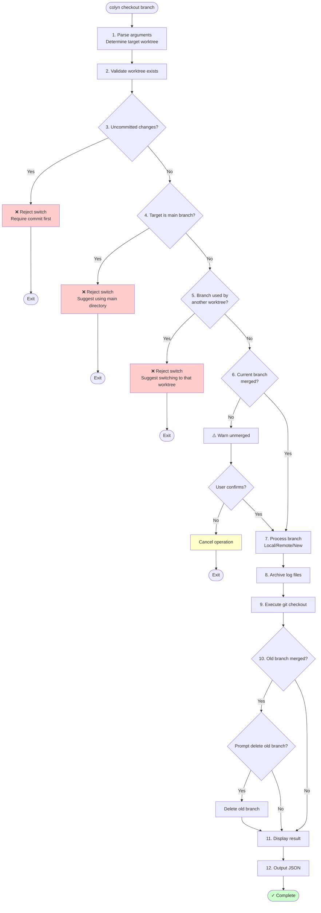

# Checkout Command Design Document

## Overview

The `colyn checkout` command is used to switch or create branches within a worktree, allowing reuse of existing worktrees for different branch development.

Relationship with `colyn add [branch]`:
- `add` creates a new worktree (can run without `branch` and choose interactively)
- `checkout` reuses an existing worktree to switch branch (still requires a target branch)

## Command Syntax

```bash
# Full command
colyn checkout <worktree-id> <branch>
colyn checkout <branch>

# Alias
colyn co <worktree-id> <branch>
colyn co <branch>
```

### Parameters

| Parameter | Required | Description |
|-----------|----------|-------------|
| `worktree-id` | Optional | Target worktree ID, uses current worktree if omitted |
| `branch` | Required | Branch name to switch to |

## Core Behavior

### Pre-checks

| Scenario | Behavior |
|----------|----------|
| Uncommitted changes | **Reject switch**, require commit first |
| Current branch not merged to main | **Warn and require confirmation** |
| Target branch is main branch | **Reject switch**, prevent accidental operation |
| Target branch already used by another worktree | **Reject switch**, each branch should have only one working directory |

### Branch Handling

| Scenario | Behavior |
|----------|----------|
| Local branch exists | Switch directly |
| Remote branch exists | Auto-create local branch tracking remote |
| Branch doesn't exist | Auto-create new branch |

### Log Archival

After successful branch switch, automatically archive the current branch's work logs:

1. Check if `.claude/logs/` directory exists
2. Move **all files and subdirectories except `archived/`** to `.claude/logs/archived/{old-branch-name}/`
3. If archive directory already exists, append content (don't overwrite same-named files/directories)

```
Before switch:
.claude/logs/
├── task-20260115.md
├── debug-notes.md
├── session-1/
│   └── trace.log
└── archived/
    └── feature-old/

After switch (switching from feature/login):
.claude/logs/
└── archived/
    ├── feature-old/
    └── feature-login/
        ├── task-20260115.md
        ├── debug-notes.md
        └── session-1/
            └── trace.log
```

### Old Branch Cleanup

After successful switch, if the old branch has been merged to main, prompt user whether to delete:

```
✓ Branch feature/old has been merged to main branch
? Delete old branch feature/old? (Y/n)
```

### Post-execution Behavior

- Automatically switch to target worktree directory (via shell function)

## Command Flow



## Output Examples

### Successful Switch (Old Branch Merged)

```
✓ Switched to branch feature/new-login

✓ Branch feature/old has been merged to main branch
? Delete old branch feature/old? (Y/n) y
✓ Deleted branch feature/old

Logs archived to: .claude/logs/archived/feature-old/
Old branch feature/old deleted

Current status:
  Worktree: task-1
  Branch: feature/new-login
  Path: /path/to/worktrees/task-1
```

### Successful Switch (Old Branch Not Merged)

```
⚠ Current branch feature/old has not been merged to main branch

If you switch branches, these changes will remain on the original branch.
? Continue switching? (y/N) y

✓ Switched to branch feature/new-login

Logs archived to: .claude/logs/archived/feature-old/

Current status:
  Worktree: task-1
  Branch: feature/new-login
  Path: /path/to/worktrees/task-1
```

### Uncommitted Changes

```
✗ Worktree task-1 has uncommitted changes

Changed files (3):
  - src/index.ts
  - src/utils.ts
  - package.json

Hint:
  - Check status: cd "/path/to/task-1" && git status
  - Commit changes: git add . && git commit -m "..."
  - Or stash: git stash
```

### Target Branch Already Used

```
✗ Branch feature/login is already used in task-2

Hint: Please switch directly to task-2 directory, or use a different branch name
      cd "/path/to/worktrees/task-2"
```

### Target is Main Branch

```
✗ Cannot switch to main branch in a worktree

Hint: Please use the main branch directory directly
      cd "/path/to/main"
```

## Exit Codes

| Exit Code | Description |
|-----------|-------------|
| 0 | Success |
| 1 | Uncommitted changes / Git operation failed |
| 2 | Target branch is main branch |
| 3 | Target branch already used by another worktree |
| 4 | User cancelled operation |
