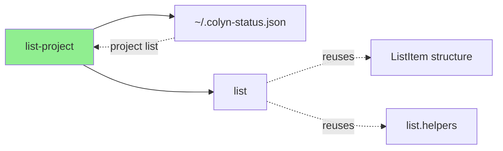

# List-Project Command Design Document

**Created**: 2026-02-15
**Command Name**: `colyn list-project`
**Alias**: `lsp`
**Status**: ✅ Implemented

---

## 1. Command Overview

### 1.1 User Goals

Users want to quickly view all colyn projects and their worktrees from the global status index to:
- See which colyn projects are currently running
- View all worktrees (including main branch) for each project
- Check git status and diff with main branch for each worktree
- Batch process worktrees across multiple projects in scripts

### 1.2 Command Usage

```bash
# Basic usage: show all projects and worktrees in global status index
colyn list-project
colyn lsp    # Using alias

# JSON format output (for scripting)
colyn list-project --json
colyn lsp --json

# Output paths only (for piping)
colyn list-project --paths
colyn lsp -p
```

**Alias Note**:
- `colyn lsp` is an alias for `colyn list-project`
- More concise for quick typing

### 1.3 Execution Result

Shows all colyn projects in global status index, each project includes:
- Project overview (Project, Path, Worktree count, Updated)
- Detailed worktree list (reuses `colyn list` format)

**Example Output** (default table format):

```
┌─────────┬──────────────────┬───────────┬─────────────────────┐
│ Project │ Path             │ Worktrees │ Updated             │
├─────────┼──────────────────┼───────────┼─────────────────────┤
│ backend │ /path/to/backend │ 2         │ 2026/02/23 20:30:00 │
│ colyn   │ /path/to/colyn   │ 4         │ 2026/02/23 20:28:11 │
└─────────┴──────────────────┴───────────┴─────────────────────┘

Worktrees for backend:
┌──────────┬──────────────┬──────┬────────┬──────┬──────────────────┐
│ ID       │ Branch       │ Port │ Status │ Diff │ Path             │
├──────────┼──────────────┼──────┼────────┼──────┼──────────────────┤
│   0-main │ develop      │ 3010 │        │ -    │ backend          │
│   1      │ feature/auth │ 3011 │        │ ✓    │ worktrees/task-1 │
└──────────┴──────────────┴──────┴────────┴──────┴──────────────────┘

Worktrees for colyn:
┌──────────┬────────────────┬───────┬─────────┬──────┬──────────────────┐
│ ID       │ Branch         │ Port  │ Status  │ Diff │ Path             │
├──────────┼────────────────┼───────┼─────────┼──────┼──────────────────┤
│   0-main │ main           │ 10000 │         │ -    │ colyn            │
│   1      │ feature/login  │ 10001 │         │ ✓    │ worktrees/task-1 │
│ → 2      │ feature/ui     │ 10002 │ M:2 S:1 │ ✓    │ worktrees/task-2 │
│   3      │ feature/api    │ 10003 │         │ ↑1   │ worktrees/task-3 │
└──────────┴────────────────┴───────┴─────────┴──────┴──────────────────┘
```

**Legend**:
- `→` arrow marks current worktree with cyan highlight
- `Status`: git status, `M:2` means 2 modified files, `S:1` means 1 staged file
- `Diff`: diff with main branch, `↑` ahead, `↓` behind, `✓` synced

---

## 2. Design Principles

### 2.1 Reuse Existing Implementation

**Key Decision**: Fully reuse `colyn list` command's implementation and data structure

**Reused Components**:
1. **Data Structure** - `ListItem` interface
2. **Helper Functions** - `getGitStatus()`, `getGitDiff()`, `formatStatus()`, `formatDiff()`
3. **Table Format** - column definitions, color scheme, highlight logic
4. **JSON Structure** - identical to `list --json`
5. **Translation Text** - reuse `commands.list.*` translations

**Advantages**:
- Consistent user experience
- High code quality, reduced duplication
- Automatically sync bug fixes and new features from list command

### 2.2 Global Status Index Integration

Get project information through `~/.colyn-status.json`:
1. Read projectPath entries from global index
2. Validate project directory layout (`.colyn/`, `{project}/{project}`, `worktrees/`)
3. Skip stale paths and keep valid projects

### 2.3 Data Consistency

Ensure data consistency with other commands:
- Project path - consistent with `info -f project-path`
- Project name - consistent with `info -f project`
- Worktree data - consistent with `list --json`

---

## 3. User Scenarios

### 3.1 Scenario 1: View All Projects Overview

**User Need**: Quickly see which projects are running

**Workflow**:

```bash
$ colyn list-project

┌─────────┬──────────────────┬───────────┬─────────────────────┐
│ Project │ Path             │ Worktrees │ Updated             │
├─────────┼──────────────────┼───────────┼─────────────────────┤
│ backend │ /path/to/backend │ 2         │ 2026/02/23 20:30:00 │
│ colyn   │ /path/to/colyn   │ 4         │ 2026/02/23 20:28:11 │
│ website │ /path/to/website │ 1         │ 2026/02/23 19:59:02 │
└─────────┴──────────────────┴───────────┴─────────────────────┘
...
```

**Result**: User can see all projects and their worktree counts at a glance.

---

### 3.2 Scenario 2: View Detailed Worktree Information

**User Need**: See all worktree status for a specific project

**Workflow**:

```bash
$ colyn list-project | grep -A 10 "Worktrees for colyn"

Worktrees for colyn:
┌──────────┬────────────────┬───────┬─────────┬──────┬──────────────────┐
│ ID       │ Branch         │ Port  │ Status  │ Diff │ Path             │
├──────────┼────────────────┼───────┼─────────┼──────┼──────────────────┤
│   0-main │ main           │ 10000 │         │ -    │ colyn            │
│   1      │ feature/login  │ 10001 │         │ ✓    │ worktrees/task-1 │
│ → 2      │ feature/ui     │ 10002 │ M:2 S:1 │ ✓    │ worktrees/task-2 │
│   3      │ feature/api    │ 10003 │         │ ↑1   │ worktrees/task-3 │
└──────────┴────────────────┴───────┴─────────┴──────┴──────────────────┘
```

**Result**: User can see detailed information for all worktrees including git status.

---

### 3.3 Scenario 3: Batch Process All Projects in Scripts

**User Need**: Execute commands across all worktrees in all projects

**Workflow**:

```bash
# Get all worktree paths
$ colyn list-project --paths
/path/to/backend/backend
/path/to/backend/worktrees/task-1
/path/to/colyn/colyn
/path/to/colyn/worktrees/task-1
/path/to/colyn/worktrees/task-2
/path/to/colyn/worktrees/task-3

# Run git status in all worktrees
$ colyn list-project --paths | xargs -I {} sh -c 'echo "=== {} ===" && cd {} && git status'

# Update dependencies in all worktrees
$ colyn list-project --paths | xargs -I {} sh -c 'cd {} && npm install'
```

**Result**: Clean path output for easy piping and scripting.

---

### 3.4 Scenario 4: Programmatic Processing

**User Need**: Get structured project information in scripts or tools

**Workflow**:

```bash
$ colyn list-project --json | jq '.'
```

**Output**:

```json
[
  {
    "projectPath": "/path/to/colyn",
    "projectName": "colyn",
    "mainBranchPath": "/path/to/colyn/colyn",
    "updatedAt": "2026-02-23T12:28:11.000Z",
    "worktrees": [
      {
        "id": null,
        "branch": "main",
        "port": 10000,
        "path": "colyn",
        "isMain": true,
        "isCurrent": false,
        "status": {
          "modified": 0,
          "staged": 0,
          "untracked": 0
        },
        "diff": {
          "ahead": 0,
          "behind": 0
        }
      },
      {
        "id": 1,
        "branch": "feature/login",
        "port": 10001,
        "path": "worktrees/task-1",
        "isMain": false,
        "isCurrent": false,
        "status": {
          "modified": 0,
          "staged": 0,
          "untracked": 0
        },
        "diff": {
          "ahead": 0,
          "behind": 0
        }
      }
    ]
  }
]
```

**Result**: JSON format for easy parsing, worktrees array structure identical to `list --json`.

---

## 4. Input and Output

### 4.1 Command Options

| Option | Short | Description | Default |
|--------|-------|-------------|---------|
| `--json` | - | Output in JSON format | No |
| `--paths` | `-p` | Output paths only (one per line) | No |

**Option Exclusivity**:
- `--json` and `--paths` are mutually exclusive

### 4.2 Output Formats

#### 4.2.1 Table Format (Default)

**Features**:
- Main table shows project overview
- Detailed tables show worktrees for each project (reuses list format)
- Colored output, visually appealing
- Current worktree marked with `→` arrow and highlighted
- Main branch displayed in gray

**Color Scheme**:
| Element | Color |
|---------|-------|
| Header | Bold white |
| Main branch row | Gray (dim) |
| Normal row | Default |
| Current row | Cyan |
| Status with changes | Yellow |
| Diff synced (✓) | Green |
| Diff with changes | Cyan |

#### 4.2.2 JSON Format (`--json`)

**Features**:
- Machine-readable for scripting
- worktrees array uses identical structure as `list --json`
- Includes complete git status and diff information

**Field Descriptions**:

**ProjectInfo Fields**:
| Field | Type | Description |
|-------|------|-------------|
| `projectPath` | `string` | Project root path (consistent with `info -f project-path`) |
| `projectName` | `string` | Project name (consistent with `info -f project`) |
| `mainBranchPath` | `string` | Main branch directory path |
| `updatedAt` | `string` | Last status update time in global index (ISO 8601) |
| `worktrees` | `ListItem[]` | Worktree list (identical structure as `list --json`) |

**ListItem Fields** (identical to `list --json`):
| Field | Type | Description |
|-------|------|-------------|
| `id` | `number \| null` | Worktree ID, `null` for main branch |
| `branch` | `string` | Branch name |
| `port` | `number` | Port number |
| `path` | `string` | Path relative to project root |
| `isMain` | `boolean` | Is main branch |
| `isCurrent` | `boolean` | Is current directory |
| `status.modified` | `number` | Number of modified but unstaged files |
| `status.staged` | `number` | Number of staged files |
| `status.untracked` | `number` | Number of untracked files |
| `diff.ahead` | `number` | Commits ahead of main branch |
| `diff.behind` | `number` | Commits behind main branch |

#### 4.2.3 Path Format (`--paths`)

**Features**:
- One absolute path per line
- Includes main branch and all worktrees
- No color, no extra information
- Easy for piping and scripting

**Use Cases**:
```bash
# Execute command in all worktrees
colyn list-project --paths | xargs -I {} sh -c 'cd {} && git status'

# Count total worktrees
colyn list-project --paths | wc -l

# Find worktrees with specific file
colyn list-project --paths | xargs -I {} sh -c '[ -f {}/package.json ] && echo {}'
```

---

## 5. Technical Implementation

### 5.1 Core Functions

```typescript
// Get project list from global status index
export async function listGlobalStatusProjects(): Promise<{
  projectPath: string;
  updatedAt: string;
}[]>

// Get all worktrees for project (reuses list logic)
async function getProjectWorktrees(
  projectPath: string,
  mainBranchPath: string
): Promise<ListItem[]>

// Get all project information
async function getAllProjects(): Promise<ProjectInfo[]>
```

### 5.2 Data Flow

```
~/.colyn-status.json
  ↓
Read projectPath list
  ↓
Validate project directory layout
  ↓
Use getProjectWorktrees() to get worktree list
  ↓
Output (table/JSON/paths)
```

### 5.3 Dependencies

- `worktree-status.ts` - read global index `~/.colyn-status.json`
- `discovery.ts` - `discoverProjectInfo()` to get worktrees
- `list.helpers.ts` - git status and diff handling
- `list.ts` - reuse data structure and formatting logic

---

## 6. Error Handling

### 6.1 No Colyn Projects

```
No projects found

Hint: Run colyn status set in a project first so it appears in ~/.colyn-status.json
```

### 6.2 Option Conflict

```
✗ Option conflict: --json and --paths cannot be used together
  Hint: Please choose one output format
```

---

## 7. Relationship with Other Commands



**Notes**:
- `list-project` is cross-project `list` command
- Fully reuses `list` data structure and formatting logic
- Gets all projects through global status index instead of current project only

---

## 8. FAQ

### Q1: What's the difference between list-project and list?

A:
- `list` - View all worktrees in **current project**
- `list-project` - View all worktrees in **all projects in global status index**

### Q2: Why is worktree data structure identical to list --json?

A: This is intentional design to ensure:
- Consistent user experience
- Scripts can handle both commands uniformly
- Automatically sync improvements from list command

### Q3: How to view worktrees for a specific project only?

A: Use grep or jq to filter:

```bash
# Table format
colyn list-project | grep -A 10 "Worktrees for colyn"

# JSON format
colyn list-project --json | jq '.[] | select(.projectName == "colyn")'
```

### Q4: Does path output include main branch?

A: Yes, `--paths` outputs paths for both main branch and all worktrees.

### Q5: How to execute commands across all projects?

A: Use `--paths` with xargs:

```bash
colyn list-project --paths | xargs -I {} sh -c 'cd {} && <your-command>'
```

---

## 9. Implementation Notes

### 9.1 Index Requirements

- `~/.colyn-status.json` must contain project entries
- Project directory layout must be valid (`.colyn/`, main directory, `worktrees/`)

### 9.2 Performance Considerations

- Use concurrent fetching for project information
- Cache git status query results
- Avoid scanning same project repeatedly

### 9.3 Exit Codes

| Code | Meaning |
|------|---------|
| 0 | Success |
| 1 | Option conflict or other errors |

---

## 10. Summary

`colyn list-project` command design highlights:

1. **Cross-project View** - Get all project info through global status index
2. **Full Reuse** - Reuse `list` command implementation and data structure
3. **Consistency** - Keep data consistent with `info` and `list` commands
4. **Multiple Outputs** - Table, JSON, paths for different needs
5. **Script Friendly** - Easy to batch process multiple projects
