# Remove Command Design Document (User Interaction Perspective)

**Created**: 2026-01-15
**Last Updated**: 2026-01-15
**Command Name**: `colyn remove`
**Status**: ✅ Implemented

---

## 1. Requirements Overview

### 1.1 Background

After completing feature development and merging, users need to clean up unused worktrees. The traditional process requires:
1. Check if worktree has uncommitted changes
2. Execute `git worktree remove` command
3. Optionally delete the corresponding local branch
4. If current directory is in the deleted worktree, manually switch directories

This process is tedious and easy to miss steps.

### 1.2 User Goals

Provide a simple command to safely delete unneeded worktrees, automatically handling directory switching and branch cleanup.

### 1.3 Core Value

- ✅ **Safety checks**: Check uncommitted changes before deletion to prevent data loss
- ✅ **Merge warning**: Warn about unmerged branches but allow continuation
- ✅ **Smart identification**: Support ID, branch name, auto-detection
- ✅ **Branch cleanup**: Optionally delete corresponding local branch
- ✅ **Directory switching**: Auto-switch to main branch directory if inside deleted worktree
- ✅ **Confirmation mechanism**: Confirmation required by default, skip with `--yes`

---

## 2. User Scenarios

### 2.1 Scenario 1: Basic Deletion Flow

**User situation**: Completed feature development, merged, wants to clean up worktree


**User sees**:
```bash
$ colyn remove 1

Worktree to delete:
  ID: 1
  Branch: feature/login
  Path: /path/to/worktrees/task-1
  Port: 10001

? Are you sure you want to delete this worktree? (y/N) › Yes
✔ Worktree deleted

? Also delete local branch "feature/login"? (Y/n) › Yes
✔ Branch "feature/login" deleted

✓ Worktree deleted

Deletion info:
  ID: 1
  Branch: feature/login (deleted)
  Path: /path/to/worktrees/task-1
```

---

### 2.2 Scenario 2: Delete from Worktree Directory (Auto-switch Directory)

**User situation**: Currently in worktree directory, need to switch to main branch after deletion

```bash
$ cd worktrees/task-1
$ colyn remove

Worktree to delete:
  ID: 1
  Branch: feature/login
  Path: /path/to/worktrees/task-1
  Port: 10001

? Are you sure you want to delete this worktree? (y/N) › Yes
✔ Worktree deleted

? Also delete local branch "feature/login"? (Y/n) › Yes
✔ Branch "feature/login" deleted

✓ Worktree deleted

Deletion info:
  ID: 1
  Branch: feature/login (deleted)
  Path: /path/to/worktrees/task-1

Auto-switched to main branch directory:
  /path/to/my-project

📂 Switched to: /path/to/my-project
```

**System behavior**:
1. Detect current directory is inside deleted worktree
2. After deletion, return `targetDir` pointing to main branch directory
3. Shell function auto-executes `cd` to switch directory

---

### 2.3 Scenario 3: Delete Unmerged Branch

**User situation**: Branch not yet merged, but user is sure they want to delete

```bash
$ colyn remove feature/experimental

Worktree to delete:
  ID: 2
  Branch: feature/experimental
  Path: /path/to/worktrees/task-2
  Port: 10002

⚠ Branch "feature/experimental" has not been merged to main
  Deleting may lose unmerged changes

? Are you sure you want to delete this worktree? (y/N) › Yes
✔ Worktree deleted

? Also delete local branch "feature/experimental"? (y/N) › Yes
✔ Branch "feature/experimental" deleted

✓ Worktree deleted
```

**Note**:
- Show warning when unmerged, but allow continuation
- Default to No for branch deletion (because unmerged)
- If user chooses to delete, use `git branch -D` for force deletion

---

### 2.4 Scenario 4: Delete with Uncommitted Changes

**User situation**: Worktree has uncommitted changes

```bash
$ colyn remove 1

Worktree to delete:
  ID: 1
  Branch: feature/login
  Path: /path/to/worktrees/task-1
  Port: 10001

⚠ Uncommitted changes detected

Changed files:
  - src/login.ts
  - src/auth.ts
  ... and 3 other files

✗ Cannot delete: uncommitted changes exist
  Hint: Please commit or stash changes first, or use --force to force delete:
  cd "/path/to/worktrees/task-1"
  git add . && git commit -m "..."

Or force delete:
  colyn remove 1 --force
```

**Using --force to force delete**:
```bash
$ colyn remove 1 --force

Worktree to delete:
  ID: 1
  Branch: feature/login
  ...

? Are you sure you want to delete this worktree? (y/N) › Yes
✔ Worktree deleted
```

---

### 2.5 Scenario 5: Quick Delete (Skip Confirmation)

**User situation**: Sure they want to delete, don't want confirmation prompt

```bash
$ colyn remove 1 -y

Worktree to delete:
  ID: 1
  Branch: feature/login
  ...

✔ Worktree deleted

? Also delete local branch "feature/login"? (Y/n) ›
```

**Note**: `-y` only skips deletion confirmation, branch deletion prompt still shows.

---

## 3. Feature Requirements

### 3.1 Parameter Identification

Support three invocation methods:

```mermaid
graph TD
    Start[User runs colyn remove] --> HasParam{Has parameter?}

    HasParam -->|No| ReadEnv[Read .env.local<br/>Get WORKTREE ID]
    HasParam -->|Yes| CheckType{Parameter type?}

    CheckType -->|Numbers only| UseId[Find by ID]
    CheckType -->|Contains letters| UseBranch[Find by branch name]

    ReadEnv --> FindWT[Find worktree]
    UseId --> FindWT
    UseBranch --> FindWT

    FindWT --> Found{Found?}
    Found -->|Yes| Continue[Continue deletion flow]
    Found -->|No| Error[✗ Worktree not found]

    style Error fill:#ffcccc
    style Continue fill:#ccffcc
```



**Examples**:
| Command | Identification | Description |
|---------|---------------|-------------|
| `colyn remove 1` | By ID | Delete worktree with ID 1 |
| `colyn remove feature/login` | By branch name | Delete worktree with branch feature/login |
| `colyn remove` (in worktree) | Auto-detect | Read WORKTREE value from .env.local |

---

### 3.2 Pre-checks


**Check items**:

| Check Item | Check Content | Failure Behavior |
|------------|---------------|-----------------|
| Uncommitted changes | Is `git status` clean | Reject deletion (unless --force) |
| Branch merge status | `git branch --merged` | Show warning, allow continuation |

---

### 3.3 Deletion Execution


---

### 3.4 Directory Switching Handling


---

## 4. Input and Output

### 4.1 User Input

| Input | Required | Description | Validation Rules |
|-------|----------|-------------|-----------------|
| ID or branch name | No | Specify worktree to delete<br/>Auto-detect when no parameter | - Numbers treated as ID<br/>- Others treated as branch name |
| `-f, --force` | No | Force delete (ignore uncommitted changes) | - |
| `-y, --yes` | No | Skip deletion confirmation | - |

### 4.2 System Output

**Progress information**:
```
Worktree to delete:
  ID: 1
  Branch: feature/login
  Path: /path/to/worktrees/task-1
  Port: 10001

? Are you sure you want to delete this worktree? (y/N)
✔ Worktree deleted
? Also delete local branch "feature/login"? (Y/n)
✔ Branch "feature/login" deleted
```

**Success information**:
```
✓ Worktree deleted

Deletion info:
  ID: 1
  Branch: feature/login (deleted)
  Path: /path/to/worktrees/task-1

Auto-switched to main branch directory:
  /path/to/my-project
```

---

## 5. Error Handling

### 5.1 Common Errors

| Error Scenario | User Sees | How to Resolve |
|---------------|-----------|----------------|
| **Not initialized** | ✗ Current directory not initialized<br/>Hint: Please run colyn init first | Run `colyn init` |
| **Worktree not found** | ✗ Cannot find worktree with ID 1<br/>View all worktrees: colyn list | Check if ID or branch name is correct |
| **Uncommitted changes** | ✗ Cannot delete: uncommitted changes exist<br/>Hint: Commit changes or use --force | Commit changes or use `--force` |
| **User cancels** | Deletion cancelled | - |

---

## 6. Non-functional Requirements

### 6.1 Performance Requirements

- Pre-checks should complete within 1 second
- Deletion operation performance depends on git

### 6.2 Usability Requirements

- Clear and specific error messages with resolution suggestions
- Support calling from any directory
- Support auto-detection in worktree directory
- Auto-switch directory after deletion (if needed)

### 6.3 Compatibility Requirements

- Support macOS, Linux, Windows
- Compatible with git 2.5+ (minimum worktree feature version)

---

## 7. Acceptance Criteria

### 7.1 Basic Functionality

- [x] Support specifying worktree by ID
- [x] Support specifying worktree by branch name
- [x] Support calling without parameters in worktree directory (auto-detect)
- [x] Use `git worktree remove` for deletion

### 7.2 Pre-checks

- [x] Check uncommitted changes, reject when changes exist (unless --force)
- [x] Check branch merge status, show warning when unmerged

### 7.3 Confirmation Mechanism

- [x] Require user confirmation by default
- [x] `--yes` parameter skips confirmation
- [x] Ask whether to delete local branch

### 7.4 Directory Switching

- [x] Detect if current directory is inside deleted worktree
- [x] If inside, return targetDir to switch to main branch

### 7.5 User Experience

- [x] Show clear progress information (using spinner)
- [x] Show deletion info on success
- [x] Error messages include specific resolution suggestions
- [x] Support colored output

---

## 8. Out of Scope

The following features are not included in this requirement:

- ❌ Batch delete multiple worktrees
- ❌ Auto-delete remote branch
- ❌ Deletion recovery feature
- ❌ Integration with merge command (auto-delete after merge)

---

## 9. FAQ

### Q1: Why check uncommitted changes before deletion?

A: To prevent users from accidentally losing work. If users are sure they want to delete, they can use `--force` to skip the check.

### Q2: Why is unmerged branch only a warning and not blocking?

A: Some branches may be experimental, and users may decide not to merge and just delete. Warning is sufficient to alert users.

### Q3: Does branch deletion use -d or -D?

A: Depends on whether branch is merged:
- Merged: Use `git branch -d` (safe delete)
- Unmerged: Use `git branch -D` (force delete)

### Q4: What happens if currently in worktree directory when deleted?

A: System automatically switches to main branch directory, preventing user from staying in a deleted directory.

### Q5: Can I use --force and --yes together?

A: Yes. `colyn remove 1 -f -y` skips all checks and confirmations, deleting directly. But branch deletion prompt still shows.

---

## 10. Summary

`colyn remove` command core values:

✅ **Safety checks**: Check uncommitted changes before deletion
✅ **Merge warning**: Warn about unmerged branches
✅ **Smart identification**: Support three identification methods
✅ **Branch cleanup**: Optionally delete corresponding local branch
✅ **Directory switching**: Auto-switch to main branch directory
✅ **Confirmation mechanism**: Prevent accidental operations
✅ **Friendly prompts**: Clear error messages and resolution suggestions

Through this command, users can safely and conveniently clean up unneeded worktrees.
