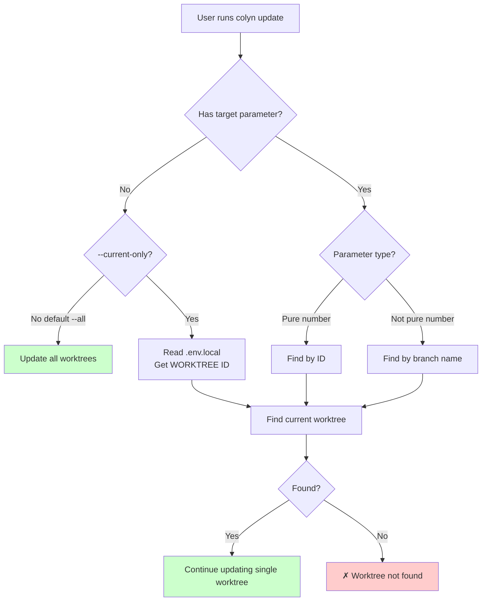
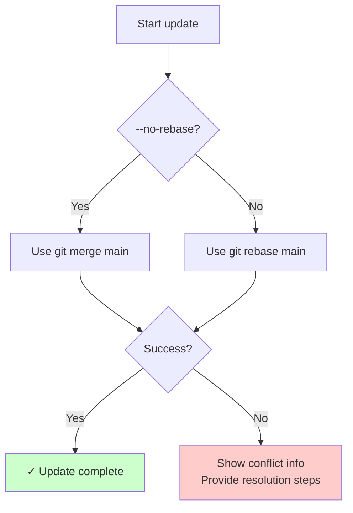
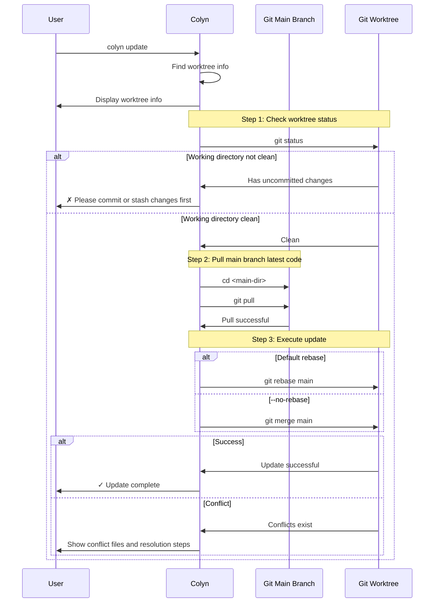
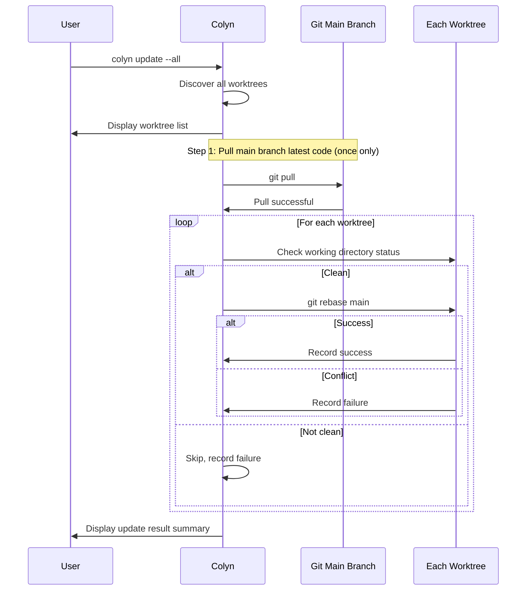

# Update Command Design Document (User Interaction Perspective)

**Created**: 2026-01-28
**Last Updated**: 2026-06-01
**Command Name**: `colyn update`
**Status**: Implemented

---

## 1. Requirements Overview

### 1.1 Background

When users develop features in a worktree, the main branch may have new commits (code from other colleagues, bug fixes, etc.). To keep code synchronized, users need to periodically update the main branch's latest code to the current branch. The traditional process requires:
1. Ensure the current working directory is clean
2. Switch to the main branch directory and execute `git pull`
3. Return to the worktree directory
4. Execute `git rebase main` or `git merge main`
5. Handle possible conflicts

This process is cumbersome, especially when there are multiple worktrees.

### 1.2 User Goal

Provide a simple command that automatically updates the main branch's latest code to the worktree branch, allowing users to focus on development rather than git operations.

### 1.3 Core Value

- **Simplify Operations**: One command completes the update process
- **Update All by Default**: Updates all worktrees when no parameter is given
- **Precise Update**: Specify an ID/branch name to update a single worktree, or `--current-only` to update just the current one
- **Default Rebase**: Produces linear commit history, cleaner
- **Optional Merge**: Use `--no-rebase` to preserve complete history
- **Auto Sync**: Automatically pulls main branch's latest code (can skip with `--no-fetch`)

---

## 2. User Scenarios

### 2.1 Scenario 1: Update All Worktrees (Default)

**User Situation**: Wants to sync the main branch's latest code to all worktrees at once

```bash
$ colyn update

Found 3 worktrees:
  1. task-1 (feature/login)
  2. task-2 (feature/signup)
  3. task-3 (bugfix/header)

Step 1/4: Pull main branch latest code
✔ Main branch updated

Step 2/4: Update task-1 (feature/login)
✔ Rebase successful

Step 3/4: Update task-2 (feature/signup)
✔ Rebase successful

Step 4/4: Update task-3 (bugfix/header)
✔ Rebase successful

Update results:
  ✓ 3 worktrees updated successfully
```

> Note: With no parameter, `colyn update` is equivalent to `colyn update --all`, i.e. it updates all worktrees.

---

### 2.2 Scenario 2: Update Specified Worktree

**User Situation**: In any directory, wants to update only a specific worktree

```bash
# Specify by ID
$ colyn update 1

# Specify by branch name
$ colyn update feature/login

✓ Detected worktree:
  ID: 1
  Branch: feature/login
  Path: /path/to/worktrees/task-1

Step 1/3: Check working directory status
✔ Worktree working directory clean

Step 2/3: Pull main branch latest code
  Directory: /path/to/my-project
  Execute: git pull
✔ Main branch updated

Step 3/3: Rebase main branch onto current branch
  Directory: /path/to/worktrees/task-1
  Execute: git rebase main
✔ Rebase successful

✓ Update complete!
  Main branch (main) → feature/login
  Strategy: rebase
```

---

### 2.3 Scenario 3: Update Only the Current Worktree (`--current-only`)

**User Situation**: Developing inside a worktree directory, wants to sync only this one worktree

```bash
$ cd worktrees/task-1
$ colyn update --current-only

✓ Detected current worktree:
  ID: 1
  Branch: feature/login
  Path: /path/to/worktrees/task-1

Step 1/3: Check working directory status
✔ Worktree working directory clean

Step 2/3: Pull main branch latest code
✔ Main branch updated

Step 3/3: Rebase main branch onto current branch
✔ Rebase successful

✓ Update complete!
  Main branch (main) → feature/login
  Strategy: rebase
```

> Note: `--current-only` is an alias of `--no-all` and must be run inside a worktree directory — it auto-detects the current worktree by reading the `WORKTREE` value from `.env.local`.

---

### 2.4 Scenario 4: Use Merge Strategy

**User Situation**: Doesn't want to use rebase, wants to preserve complete branch history

```bash
$ colyn update --no-rebase

Step 3/3: Merge main branch into current branch
  Directory: /path/to/worktrees/task-1
  Execute: git merge main
✔ Merge successful

✓ Update complete!
  Main branch (main) → feature/login
  Strategy: merge
```

---

### 2.5 Scenario 5: Batch Update (Partial Failure)

**User Situation**: Explicitly passes `--all` (equivalent to no parameter), and one of the worktrees fails to update

```bash
$ colyn update --all

Found 3 worktrees:
  1. task-1 (feature/login)
  2. task-2 (feature/signup)
  3. task-3 (bugfix/header)

Step 1/4: Pull main branch latest code
✔ Main branch updated

Step 2/4: Update task-1 (feature/login)
✔ Rebase successful

Step 3/4: Update task-2 (feature/signup)
✔ Rebase successful

Step 4/4: Update task-3 (bugfix/header)
⚠ Rebase failed, conflicts exist

Update results:
  ✓ 2 worktrees updated successfully
  ✗ 1 worktree failed to update

Failed details:
  task-3 (bugfix/header): Conflicts exist, please resolve manually
    cd worktrees/task-3
    git rebase --continue  # After resolving conflicts
    # or
    git rebase --abort     # To abort rebase
```

---

### 2.6 Scenario 6: Handle Conflicts

**User Situation**: Conflicts occur during rebase process

```bash
$ colyn update 1

Step 3/3: Rebase main branch onto current branch
✗ Rebase failed, conflicts exist

Conflict files:
  src/app.ts
  src/config.ts

Resolution steps:
  1. Edit conflict files, resolve conflict markers
  2. Add resolved files:
     git add <file>
  3. Continue rebase:
     git rebase --continue
  4. To abort rebase:
     git rebase --abort
```

---

## 3. Functional Requirements

### 3.1 Parameter Recognition

Supports three calling methods:


```mermaid
graph TD
    Start[User runs colyn update] --> HasTarget{Has target parameter?}

    HasTarget -->|Yes| CheckType{Parameter type?}
    HasTarget -->|No| CheckCurrent{--current-only?}

    CheckCurrent -->|No default --all| AllWorktrees[Update all worktrees]
    CheckCurrent -->|Yes| ReadEnv[Read .env.local<br/>Get WORKTREE ID]

    CheckType -->|Pure number| UseId[Find by ID]
    CheckType -->|Not pure number| UseBranch[Find by branch name]

    ReadEnv --> FindWT[Find current worktree]
    UseId --> FindWT
    UseBranch --> FindWT

    FindWT --> Found{Found?}
    Found -->|Yes| Continue[Continue updating single worktree]
    Found -->|No| Error[✗ Worktree not found]

    style Error fill:#ffcccc
    style Continue fill:#ccffcc
    style AllWorktrees fill:#ccffcc
```

**Examples**:
| Command | Detection Method | Description |
|---------|-----------------|-------------|
| `colyn update` | Update all (default) | Update all worktrees (equivalent to `--all`) |
| `colyn update --all` | Update all | Explicit form, equivalent to no parameter |
| `colyn update 1` | By ID | Update only the worktree with ID 1 |
| `colyn update feature/login` | By branch name | Update only the worktree with branch feature/login |
| `colyn update bugfix-header` | By branch name | Update only the worktree with branch bugfix-header |
| `colyn update --current-only` | Current worktree | Read WORKTREE value from .env.local, update only the current one (`--no-all` alias) |

---

### 3.2 Update Strategy


```mermaid
graph TD
    Start[Start update] --> CheckFlag{--no-rebase?}

    CheckFlag -->|Yes| Merge[Use git merge main]
    CheckFlag -->|No| Rebase[Use git rebase main]

    Merge --> Result{Success?}
    Rebase --> Result

    Result -->|Yes| Success[✓ Update complete]
    Result -->|No| Conflict[Show conflict info<br/>Provide resolution steps]

    style Success fill:#ccffcc
    style Conflict fill:#ffcccc
```

**Strategy Comparison**:

| Strategy | Command | Pros | Cons |
|----------|---------|------|------|
| **rebase (default)** | `colyn update` | Linear history, clean | Rewrites commit history |
| **merge** | `colyn update --no-rebase` | Preserves complete history | Creates merge commits |

---

### 3.3 Execution Flow


```mermaid
sequenceDiagram
    participant U as User
    participant C as Colyn
    participant M as Git Main Branch
    participant WT as Git Worktree

    U->>C: colyn update

    C->>C: Find worktree info
    C->>U: Display worktree info

    Note over C,WT: Step 1: Check worktree status
    C->>WT: git status

    alt Working directory not clean
        WT->>C: Has uncommitted changes
        C->>U: ✗ Please commit or stash changes first
    else Working directory clean
        WT->>C: Clean

        Note over C,M: Step 2: Pull main branch latest code
        C->>M: cd <main-dir>
        C->>M: git pull
        M->>C: Pull successful

        Note over C,WT: Step 3: Execute update
        alt Default rebase
            C->>WT: git rebase main
        else --no-rebase
            C->>WT: git merge main
        end

        alt Success
            WT->>C: Update successful
            C->>U: ✓ Update complete
        else Conflict
            WT->>C: Conflicts exist
            C->>U: Show conflict files and resolution steps
        end
    end
```

---

### 3.4 Batch Update Flow


```mermaid
sequenceDiagram
    participant U as User
    participant C as Colyn
    participant M as Git Main Branch
    participant WT as Each Worktree

    U->>C: colyn update --all

    C->>C: Discover all worktrees
    C->>U: Display worktree list

    Note over C,M: Step 1: Pull main branch latest code (once only)
    C->>M: git pull
    M->>C: Pull successful

    loop For each worktree
        C->>WT: Check working directory status
        alt Clean
            C->>WT: git rebase main
            alt Success
                WT->>C: Record success
            else Conflict
                WT->>C: Record failure
            end
        else Not clean
            C->>C: Skip, record failure
        end
    end

    C->>U: Display update result summary
```

**Batch Update Features**:
- Execute `git pull` only once, avoid repeated pulling
- On failure, don't interrupt, continue updating other worktrees
- Display summary results at the end

---

### 3.5 Pre-checks

| Check Item | Content | Failure Message |
|------------|---------|-----------------|
| Initialized | Check `.colyn` directory | Please run `colyn init` first |
| Worktree exists | Find via discovery module | ID or branch name doesn't exist, run `colyn list` to view |
| Worktree directory status | `git status` is clean | Please commit or stash changes first |
| Main branch pull success | `git pull` return value | Pull failed, please check network or remote repository configuration |

---

## 4. Input and Output

### 4.1 User Input

| Input | Required | Description | Validation / Default |
|-------|----------|-------------|------------|
| `target` (ID or branch name) | No | Update only a specific worktree<br/>Updates all worktrees when no parameter | - Pure number treated as ID<br/>- Non-pure number treated as branch name |
| `--rebase` / `--no-rebase` | No | Choose update strategy: rebase or merge | Default `--rebase` |
| `--fetch` / `--no-fetch` | No | Whether to pull the main branch's latest code from remote; use `--no-fetch` when offline or with no upstream | Default `--fetch` |
| `--all` / `--no-all` (`--current-only`) | No | `--all` (default) updates all worktrees; `--no-all`/`--current-only` updates only the current worktree | Default `--all` (i.e. `all=true`) |

> Relationship: with no `target` and without `--current-only`, all worktrees are updated; with a `target`, only that single worktree is updated; with `--current-only` (`--no-all`), only the current worktree is updated. All defaults can be overridden via `commands.update.*` in `.colyn/settings.json`.

### 4.2 System Output

**Success Output**:
```
✓ Update complete!
  Main branch (main) → feature/login
  Strategy: rebase
```

**Conflict Output**:
```
✗ Rebase failed, conflicts exist

Conflict files:
  src/app.ts

Resolution steps:
  1. Edit conflict files, resolve conflict markers
  2. git add <file>
  3. git rebase --continue
  4. To abort: git rebase --abort
```

**Batch Update Output**:
```
Update results:
  ✓ 2 worktrees updated successfully
  ✗ 1 worktree failed to update

Failed details:
  task-3 (bugfix/header): Conflicts exist
```

---

## 5. Error Handling

### 5.1 Common Errors

| Error Scenario | User Sees | How to Resolve |
|----------------|-----------|----------------|
| **Not initialized** | ✗ Current directory not initialized<br/>Hint: Please run colyn init first | Run `colyn init` |
| **Not in worktree** | ✗ Current directory is not a worktree<br/>Please specify worktree ID or branch name | Use `colyn update <id>` |
| **Worktree not found** | ✗ Cannot find worktree<br/>ID "1" or branch "feature/login" doesn't exist | Run `colyn list` to view |
| **Worktree not clean** | ✗ Worktree has uncommitted changes<br/>Please commit or stash changes first | Commit or stash |
| **Pull failed** | ✗ Failed to pull main branch<br/>Please check network or remote repository configuration | Check network, manually pull |
| **Rebase/Merge conflict** | ✗ Conflicts exist<br/>Conflict files: ... | Manually resolve conflicts |

---

## 6. Relationship with Other Commands

| Command | Relationship | Description |
|---------|--------------|-------------|
| `colyn merge` | Complementary | merge is merging worktree back to main branch<br/>update is updating main branch to worktree |
| `colyn add` | Prerequisite | After add creates worktree, use update to keep in sync |
| `colyn list` | Helper | View all worktrees to determine which to update |

```
Main branch ─────────────────────────────────────────►
         │                    ▲
         │ colyn add          │ colyn merge
         ▼                    │
worktree ─────────────────────┘
              ◄───────────────
              colyn update
```

---

## 7. Acceptance Criteria

### 7.1 Basic Functions

- [x] Update all worktrees on parameter-less call (default `--all`)
- [x] Support specifying a single worktree by ID
- [x] Support specifying a single worktree by branch name
- [x] `--current-only` (`--no-all`) updates only the current worktree (detected via .env.local)
- [x] Default use `git rebase main`
- [x] `--no-rebase` uses `git merge main`
- [x] Auto execute `git pull` to pull main branch before update (can skip with `--no-fetch`)

### 7.2 Batch Update

- [x] Both no parameter and `--all` update all worktrees
- [x] Execute `git pull` only once
- [x] On failure, don't interrupt, continue updating other worktrees
- [x] Display summary results

### 7.3 Pre-checks

- [x] Check if initialized
- [x] Check if worktree exists
- [x] Check if worktree working directory is clean
- [x] Check if git pull is successful

### 7.4 Error Handling

- [x] Show conflict file list on conflict
- [x] Provide detailed conflict resolution steps
- [x] Different prompts for rebase and merge conflicts (rebase --continue vs commit)

### 7.5 User Experience

- [x] Display clear progress info (using spinner)
- [x] Show update strategy and result on success
- [x] Error messages include specific resolution suggestions
- [x] Support i18n multi-language

---

## 8. Out of Scope

The following features are not in scope for this requirement:

- Auto-resolve merge conflicts
- Support specifying rebase to specific commit
- Support --force for forced update
- Auto push after update
- Support --dry-run preview mode

---

## 9. FAQ

### Q1: Why use rebase by default instead of merge?

A: Rebase produces linear commit history, which is cleaner:
- Code review is easier
- `git log` is clearer
- Aligns with most teams' workflow

Use `--no-rebase` if you need to preserve complete branch history.

### Q2: What's the difference between update and merge?

A: Different directions:
- `colyn update`: Main branch → worktree (sync latest code)
- `colyn merge`: Worktree → main branch (merge feature code)

### Q3: During batch update, will one failure affect others?

A: No. Failed ones will be recorded, but won't interrupt other worktrees' updates. Summary results will be shown at the end.

### Q4: How to continue after conflicts?

A: Depends on the strategy used:
- **rebase**: After resolving conflicts `git rebase --continue`
- **merge**: After resolving conflicts `git add` + `git commit`

To abort:
- **rebase**: `git rebase --abort`
- **merge**: `git merge --abort`

### Q5: Why pull main branch first?

A: To ensure update to the latest code. If the local main branch has outdated commits, after update it's still not the latest state.

---

## 10. Implementation Notes

### 10.1 File Structure

```
src/commands/
├── update.ts           # Command registration
└── update.helpers.ts   # Helper functions
```

### 10.2 Main Functions

```typescript
// update.helpers.ts

/**
 * Update single worktree
 */
async function updateSingleWorktree(
  worktree: WorktreeInfo,
  mainBranch: string,
  useRebase: boolean
): Promise<UpdateResult>

/**
 * Batch update all worktrees
 */
async function updateAllWorktrees(
  worktrees: WorktreeInfo[],
  mainBranch: string,
  useRebase: boolean
): Promise<BatchUpdateResult>

/**
 * Pull main branch latest code
 */
async function pullMainBranch(mainDir: string): Promise<void>

/**
 * Check worktree working directory status
 */
async function checkGitWorkingDirectory(
  dirPath: string,
  dirName: string
): Promise<void>
```

### 10.3 i18n Keys

```typescript
// Translation keys added
commands.update.description
commands.update.detectedWorktree
commands.update.pullingMain
commands.update.pullSuccess
commands.update.checkingStatus
commands.update.statusClean
commands.update.updating
commands.update.updateSuccess
commands.update.updateComplete
commands.update.rebaseConflictTitle
commands.update.mergeConflictTitle
commands.update.conflictFiles
commands.update.resolveSteps
commands.update.batchResult
// ... and more
```

---

## 11. Summary

`colyn update` command core values:

- **Simplify Operations**: One command completes update process
- **Update All by Default**: Updates all worktrees when no parameter is given
- **Precise Update**: Specify an ID/branch name to update a single worktree, or `--current-only` to update just the current one
- **Default Rebase**: Produces clean linear history
- **Optional Merge**: Flexible choice via `--no-rebase`
- **Auto Sync**: Automatically pulls main branch's latest code (can skip with `--no-fetch`)
- **Friendly Prompts**: Clear error messages and conflict resolution steps

Through this command, users can easily keep worktrees synchronized with the main branch and focus on feature development.
