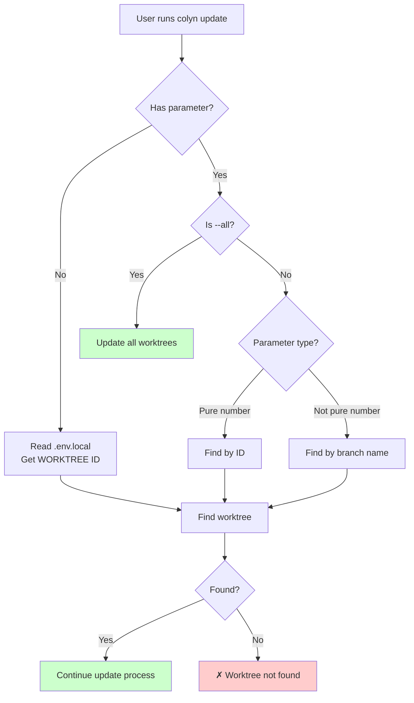
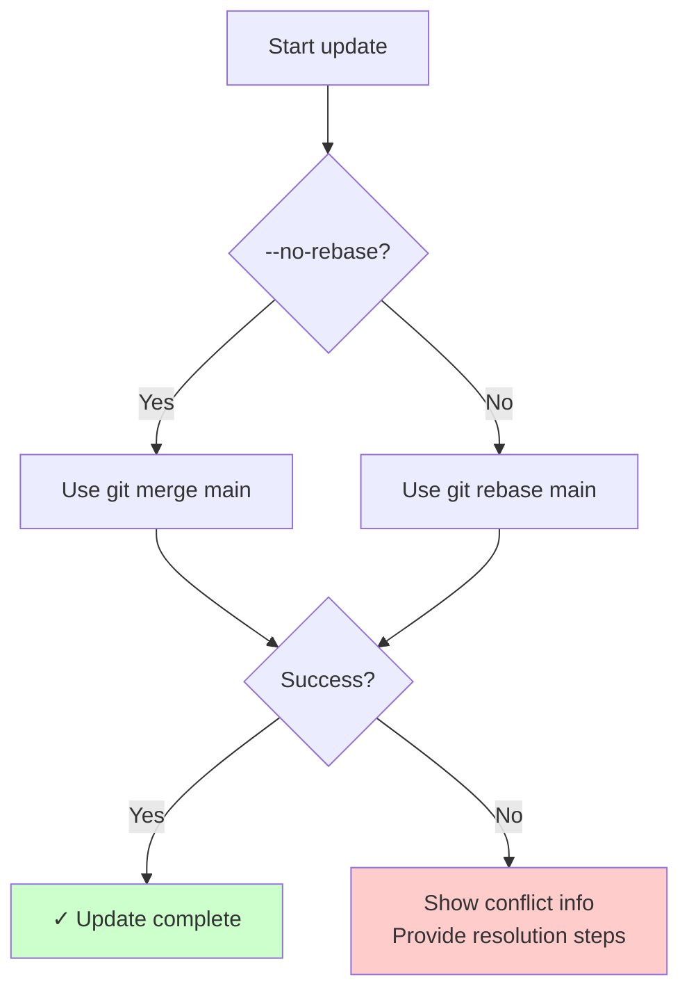
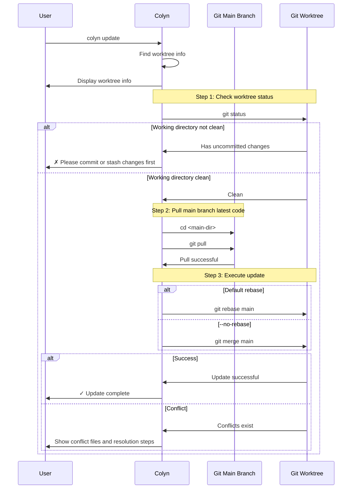
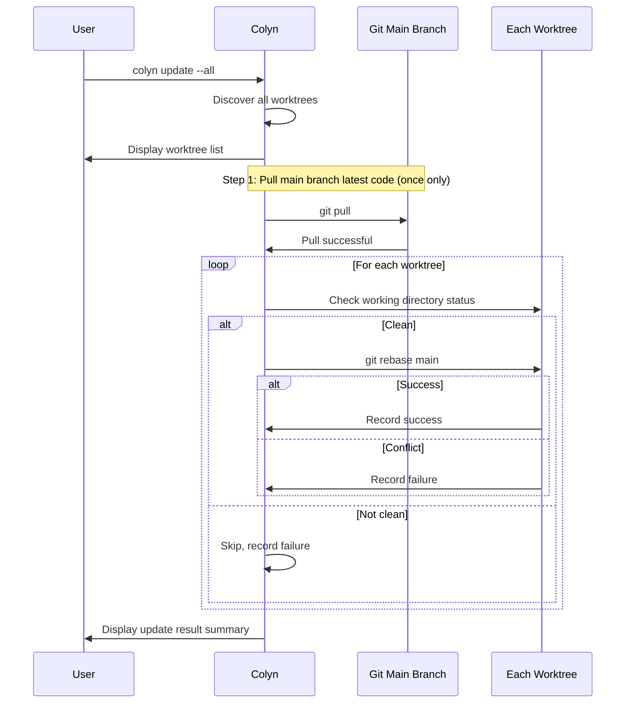

# Update Command Design Document (User Interaction Perspective)

**Created**: 2026-01-28
**Last Updated**: 2026-01-28
**Command Name**: `colyn update`
**Status**: Implemented

---

## 1. Requirements Overview

### 1.1 Background

When users develop features in a worktree, the main branch may have new commits (code from other colleagues, bug fixes, etc.). To keep code synchronized, users need to periodically update the main branch's latest code to the current branch. The traditional process requires:
1. Ensure the current working directory is clean
2. Switch to the main branch directory and execute `git pull`
3. Return to the worktree directory
4. Execute `git rebase main` or `git merge main`
5. Handle possible conflicts

This process is cumbersome, especially when there are multiple worktrees.

### 1.2 User Goal

Provide a simple command that automatically updates the main branch's latest code to the worktree branch, allowing users to focus on development rather than git operations.

### 1.3 Core Value

- **Simplify Operations**: One command completes the update process
- **Smart Detection**: Supports auto-detection of current worktree
- **Default Rebase**: Produces linear commit history, cleaner
- **Optional Merge**: Use `--no-rebase` to preserve complete history
- **Auto Sync**: Automatically pulls main branch's latest code
- **Batch Update**: Supports `--all` to update all worktrees at once

---

## 2. User Scenarios

### 2.1 Scenario 1: Update Current Worktree

**User Situation**: Developing in worktree, wants to sync main branch's latest code

```bash
$ cd worktrees/task-1
$ colyn update

✓ Detected worktree:
  ID: 1
  Branch: feature/login
  Path: /path/to/worktrees/task-1

Step 1/3: Check working directory status
✔ Worktree working directory clean

Step 2/3: Pull main branch latest code
  Directory: /path/to/my-project
  Execute: git pull
✔ Main branch updated

Step 3/3: Rebase main branch onto current branch
  Directory: /path/to/worktrees/task-1
  Execute: git rebase main
✔ Rebase successful

✓ Update complete!
  Main branch (main) → feature/login
  Strategy: rebase
```

---

### 2.2 Scenario 2: Update Specified Worktree

**User Situation**: In any directory, wants to update a specific worktree

```bash
# Specify by ID
$ colyn update 1

# Specify by branch name
$ colyn update feature/login
```

---

### 2.3 Scenario 3: Use Merge Strategy

**User Situation**: Doesn't want to use rebase, wants to preserve complete branch history

```bash
$ colyn update --no-rebase

Step 3/3: Merge main branch into current branch
  Directory: /path/to/worktrees/task-1
  Execute: git merge main
✔ Merge successful

✓ Update complete!
  Main branch (main) → feature/login
  Strategy: merge
```

---

### 2.4 Scenario 4: Batch Update All Worktrees

**User Situation**: Wants to update all worktrees at once

```bash
$ colyn update --all

Found 3 worktrees:
  1. task-1 (feature/login)
  2. task-2 (feature/signup)
  3. task-3 (bugfix/header)

Step 1/4: Pull main branch latest code
✔ Main branch updated

Step 2/4: Update task-1 (feature/login)
✔ Rebase successful

Step 3/4: Update task-2 (feature/signup)
✔ Rebase successful

Step 4/4: Update task-3 (bugfix/header)
⚠ Rebase failed, conflicts exist

Update results:
  ✓ 2 worktrees updated successfully
  ✗ 1 worktree failed to update

Failed details:
  task-3 (bugfix/header): Conflicts exist, please resolve manually
    cd worktrees/task-3
    git rebase --continue  # After resolving conflicts
    # or
    git rebase --abort     # To abort rebase
```

---

### 2.5 Scenario 5: Handle Conflicts

**User Situation**: Conflicts occur during rebase process

```bash
$ colyn update

Step 3/3: Rebase main branch onto current branch
✗ Rebase failed, conflicts exist

Conflict files:
  src/app.ts
  src/config.ts

Resolution steps:
  1. Edit conflict files, resolve conflict markers
  2. Add resolved files:
     git add <file>
  3. Continue rebase:
     git rebase --continue
  4. To abort rebase:
     git rebase --abort
```

---

## 3. Functional Requirements

### 3.1 Parameter Recognition

Supports three calling methods:



**Examples**:
| Command | Detection Method | Description |
|---------|-----------------|-------------|
| `colyn update` | Auto-detect | Read WORKTREE value from .env.local |
| `colyn update 1` | By ID | Find worktree with ID 1 |
| `colyn update feature/login` | By branch name | Find worktree with branch feature/login |
| `colyn update bugfix-header` | By branch name | Find worktree with branch bugfix-header |
| `colyn update --all` | Batch | Update all worktrees |

---

### 3.2 Update Strategy



**Strategy Comparison**:

| Strategy | Command | Pros | Cons |
|----------|---------|------|------|
| **rebase (default)** | `colyn update` | Linear history, clean | Rewrites commit history |
| **merge** | `colyn update --no-rebase` | Preserves complete history | Creates merge commits |

---

### 3.3 Execution Flow



---

### 3.4 Batch Update Flow



**Batch Update Features**:
- Execute `git pull` only once, avoid repeated pulling
- On failure, don't interrupt, continue updating other worktrees
- Display summary results at the end

---

### 3.5 Pre-checks

| Check Item | Content | Failure Message |
|------------|---------|-----------------|
| Initialized | Check `.colyn` directory | Please run `colyn init` first |
| Worktree exists | Find via discovery module | ID or branch name doesn't exist, run `colyn list` to view |
| Worktree directory status | `git status` is clean | Please commit or stash changes first |
| Main branch pull success | `git pull` return value | Pull failed, please check network or remote repository configuration |

---

## 4. Input and Output

### 4.1 User Input

| Input | Required | Description | Validation |
|-------|----------|-------------|------------|
| ID or branch name | No | Specify worktree to update<br/>Auto-detect when no parameter | - Pure number treated as ID<br/>- Non-pure number treated as branch name |
| `--no-rebase` | No | Use merge strategy instead of rebase | Default uses rebase |
| `--all` | No | Update all worktrees | Mutually exclusive with ID/branch name |

### 4.2 System Output

**Success Output**:
```
✓ Update complete!
  Main branch (main) → feature/login
  Strategy: rebase
```

**Conflict Output**:
```
✗ Rebase failed, conflicts exist

Conflict files:
  src/app.ts

Resolution steps:
  1. Edit conflict files, resolve conflict markers
  2. git add <file>
  3. git rebase --continue
  4. To abort: git rebase --abort
```

**Batch Update Output**:
```
Update results:
  ✓ 2 worktrees updated successfully
  ✗ 1 worktree failed to update

Failed details:
  task-3 (bugfix/header): Conflicts exist
```

---

## 5. Error Handling

### 5.1 Common Errors

| Error Scenario | User Sees | How to Resolve |
|----------------|-----------|----------------|
| **Not initialized** | ✗ Current directory not initialized<br/>Hint: Please run colyn init first | Run `colyn init` |
| **Not in worktree** | ✗ Current directory is not a worktree<br/>Please specify worktree ID or branch name | Use `colyn update <id>` |
| **Worktree not found** | ✗ Cannot find worktree<br/>ID "1" or branch "feature/login" doesn't exist | Run `colyn list` to view |
| **Worktree not clean** | ✗ Worktree has uncommitted changes<br/>Please commit or stash changes first | Commit or stash |
| **Pull failed** | ✗ Failed to pull main branch<br/>Please check network or remote repository configuration | Check network, manually pull |
| **Rebase/Merge conflict** | ✗ Conflicts exist<br/>Conflict files: ... | Manually resolve conflicts |

---

## 6. Relationship with Other Commands

| Command | Relationship | Description |
|---------|--------------|-------------|
| `colyn merge` | Complementary | merge is merging worktree back to main branch<br/>update is updating main branch to worktree |
| `colyn add` | Prerequisite | After add creates worktree, use update to keep in sync |
| `colyn list` | Helper | View all worktrees to determine which to update |

```
Main branch ─────────────────────────────────────────►
         │                    ▲
         │ colyn add          │ colyn merge
         ▼                    │
worktree ─────────────────────┘
              ◄───────────────
              colyn update
```

---

## 7. Acceptance Criteria

### 7.1 Basic Functions

- [x] Support parameter-less call (auto-detect current worktree)
- [x] Support specifying worktree by ID
- [x] Support specifying worktree by branch name
- [x] Default use `git rebase main`
- [x] `--no-rebase` uses `git merge main`
- [x] Auto execute `git pull` to pull main branch before update

### 7.2 Batch Update

- [x] `--all` supports updating all worktrees
- [x] Execute `git pull` only once
- [x] On failure, don't interrupt, continue updating other worktrees
- [x] Display summary results

### 7.3 Pre-checks

- [x] Check if initialized
- [x] Check if worktree exists
- [x] Check if worktree working directory is clean
- [x] Check if git pull is successful

### 7.4 Error Handling

- [x] Show conflict file list on conflict
- [x] Provide detailed conflict resolution steps
- [x] Different prompts for rebase and merge conflicts (rebase --continue vs commit)

### 7.5 User Experience

- [x] Display clear progress info (using spinner)
- [x] Show update strategy and result on success
- [x] Error messages include specific resolution suggestions
- [x] Support i18n multi-language

---

## 8. Out of Scope

The following features are not in scope for this requirement:

- Auto-resolve merge conflicts
- Support specifying rebase to specific commit
- Support --force for forced update
- Auto push after update
- Support --dry-run preview mode

---

## 9. FAQ

### Q1: Why use rebase by default instead of merge?

A: Rebase produces linear commit history, which is cleaner:
- Code review is easier
- `git log` is clearer
- Aligns with most teams' workflow

Use `--no-rebase` if you need to preserve complete branch history.

### Q2: What's the difference between update and merge?

A: Different directions:
- `colyn update`: Main branch → worktree (sync latest code)
- `colyn merge`: Worktree → main branch (merge feature code)

### Q3: During batch update, will one failure affect others?

A: No. Failed ones will be recorded, but won't interrupt other worktrees' updates. Summary results will be shown at the end.

### Q4: How to continue after conflicts?

A: Depends on the strategy used:
- **rebase**: After resolving conflicts `git rebase --continue`
- **merge**: After resolving conflicts `git add` + `git commit`

To abort:
- **rebase**: `git rebase --abort`
- **merge**: `git merge --abort`

### Q5: Why pull main branch first?

A: To ensure update to the latest code. If the local main branch has outdated commits, after update it's still not the latest state.

---

## 10. Implementation Notes

### 10.1 File Structure

```
src/commands/
├── update.ts           # Command registration
└── update.helpers.ts   # Helper functions
```

### 10.2 Main Functions

```typescript
// update.helpers.ts

/**
 * Update single worktree
 */
async function updateSingleWorktree(
  worktree: WorktreeInfo,
  mainBranch: string,
  useRebase: boolean
): Promise<UpdateResult>

/**
 * Batch update all worktrees
 */
async function updateAllWorktrees(
  worktrees: WorktreeInfo[],
  mainBranch: string,
  useRebase: boolean
): Promise<BatchUpdateResult>

/**
 * Pull main branch latest code
 */
async function pullMainBranch(mainDir: string): Promise<void>

/**
 * Check worktree working directory status
 */
async function checkGitWorkingDirectory(
  dirPath: string,
  dirName: string
): Promise<void>
```

### 10.3 i18n Keys

```typescript
// Translation keys added
commands.update.description
commands.update.detectedWorktree
commands.update.pullingMain
commands.update.pullSuccess
commands.update.checkingStatus
commands.update.statusClean
commands.update.updating
commands.update.updateSuccess
commands.update.updateComplete
commands.update.rebaseConflictTitle
commands.update.mergeConflictTitle
commands.update.conflictFiles
commands.update.resolveSteps
commands.update.batchResult
// ... and more
```

---

## 11. Summary

`colyn update` command core values:

- **Simplify Operations**: One command completes update process
- **Default Rebase**: Produces clean linear history
- **Optional Merge**: Flexible choice via `--no-rebase`
- **Auto Sync**: Automatically pulls main branch's latest code
- **Batch Update**: `--all` updates all worktrees at once
- **Smart Detection**: Supports auto-detection of current worktree
- **Friendly Prompts**: Clear error messages and conflict resolution steps

Through this command, users can easily keep worktrees synchronized with the main branch and focus on feature development.
