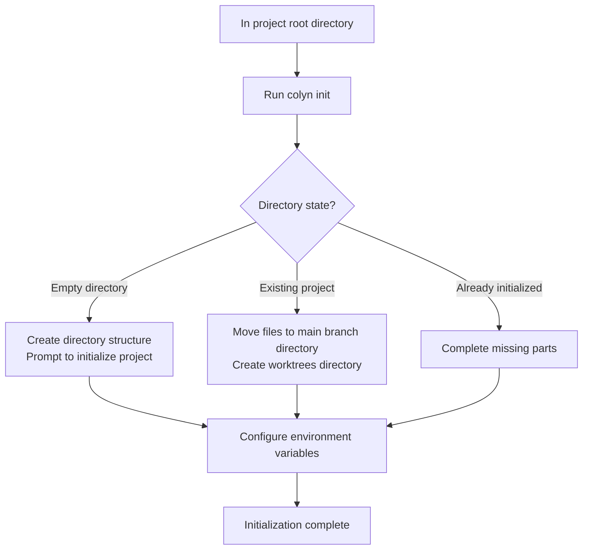
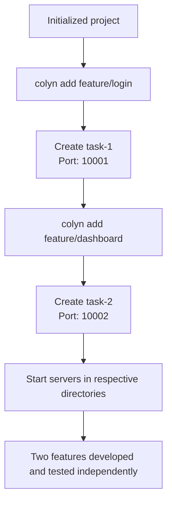
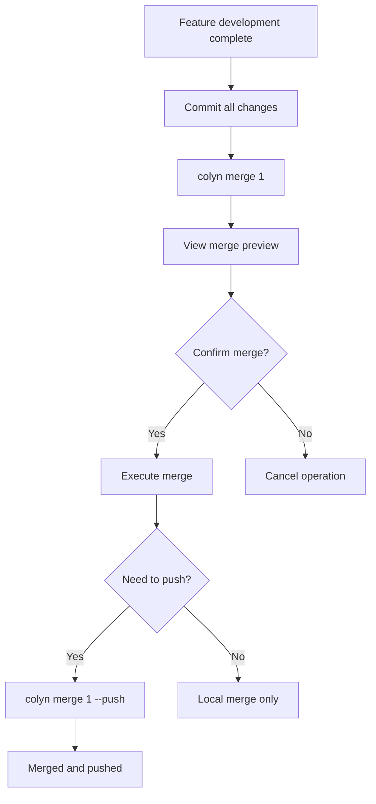
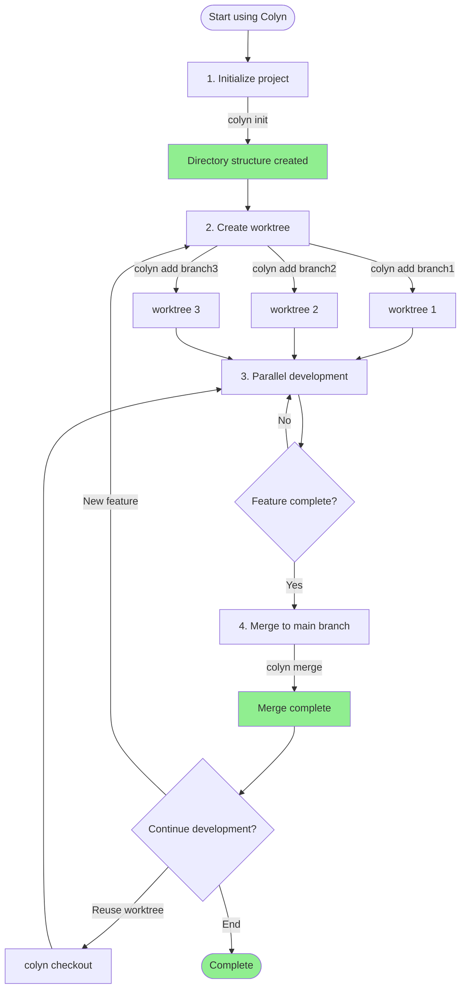

# Requirements Document - Git Worktree Management Tool (Colyn)

**Created**: 2026-01-14
**Last Updated**: 2026-01-15
**Owner**: kejinghan
**Status**: In Progress

---

## 1. Requirements Overview

### 1.1 Background

When doing parallel development of web applications, developers often need to work on multiple feature branches simultaneously. Traditional git branch switching has the following pain points:

1. **Context Loss**: When switching between different tasks, frequent stash or commit operations are needed, making it easy to lose work state
2. **Server Conflicts**: Only one development server can be started, unable to test multiple feature branches simultaneously
3. **Low Efficiency**: Switching branches requires waiting for dependency reinstallation, compilation, etc.

While git worktree can solve these problems, the native commands are complex to use and lack convenient tools for web development scenarios.

### 1.2 Goals

Develop a command-line tool `colyn` to:

1. Simplify the creation and management of git worktrees
2. Automatically handle port configuration for multiple development servers to avoid port conflicts
3. Provide an intuitive command interface for daily development use
4. Support cross-platform usage (macOS, Linux, Windows)

### 1.3 Target Users

- Frontend/full-stack developers who need to develop and test multiple features simultaneously
- Web application development teams using git for version control
- Developers who need to frequently switch between multiple branches

---

## 2. Functional Requirements

### 2.1 Core Features

#### 1. Initialization (init) - Implemented
   - **Description**: Initialize worktree management structure in an existing project
   - **User Value**: Quickly convert existing projects to support parallel development structure
   - **Main Features**:
     - Automatically detect directory state (empty directory, initialized, existing project)
     - Create main branch directory and worktrees directory
     - Configure environment variables (PORT and WORKTREE)
     - Configure .gitignore to ignore .env.local
   - **Special Handling**: Intelligently recognize existing structures and complete missing parts

#### 2. Create Worktree (add) - Implemented
   - **Description**: Create a new worktree working directory for a specified branch
   - **User Value**: Quickly create independent development environments to support parallel development
   - **Main Features**:
     - Automatically assign worktree ID and port number
     - Intelligently handle branches (local, remote, new)
     - Copy main branch environment variables and update
     - Execute commands from anywhere in the project
   - **Error Handling**:
     - Branch already has worktree: Display existing worktree info and operation suggestions
     - Branch used by another project: Display conflict path and delete command

#### 3. Merge Worktree (merge) - Implemented
   - **Description**: Merge worktree changes back to main branch
   - **User Value**: Simplify feature branch merge process, avoid manual operation errors
   - **Main Features**:
     - Support identification by ID, branch name, or auto-detection (in worktree directory)
     - Automatically check working directory status (both main branch and worktree must be clean)
     - Two-step merge strategy: first merge main branch in worktree, then merge worktree in main branch
     - Use --no-ff merge to maintain clear commit history
     - Optional push to remote (--push)
   - **Special Handling**:
     - Keep worktree after merge (don't auto-delete)
     - Conflicts occur in worktree, convenient to resolve in development environment

#### 4. Checkout Branch (checkout) - Implemented
   - **Description**: Switch or create branches in a specified worktree
   - **User Value**: Reuse existing worktrees, avoid creating too many directories
   - **Main Features**:
     - Support specifying worktree by ID or auto-detection in worktree directory
     - Intelligently handle branches (local, remote tracking, new)
     - Check if current branch is merged
     - Automatically archive logs to archived directory
     - Optional deletion of merged old branches

### 2.2 Auxiliary Features

#### 1. List View (list) - Implemented
   - **Description**: Display information about all worktrees
   - **User Value**: Quickly understand what parallel development environments exist
   - **Display Info**: ID, branch name, port, path, status

#### 2. Delete Worktree (remove) - Implemented
   - **Description**: Delete worktrees that are no longer needed
   - **User Value**: Clean up workspace, free disk space
   - **Main Features**:
     - Support identification by ID, branch name, or auto-detection
     - Check for uncommitted changes (--force to force delete)
     - Check if branch is merged (warn if not merged)
     - Optional deletion of corresponding local branch
     - If currently in the deleted worktree, automatically switch to main branch directory

#### 3. View Project Info (info) - Implemented
   - **Description**: Display colyn project information for current directory
   - **User Value**: Quickly understand current location and project status
   - **Main Features**:
     - Display project name, path, worktree ID, branch, etc.
     - Support outputting specific fields
     - Support template string formatting

#### 4. Auto-completion (completion) - Implemented
   - **Description**: Generate shell auto-completion scripts
   - **User Value**: Improve command-line experience, quickly complete commands and parameters
   - **Main Features**:
     - Support Bash and Zsh
     - Complete commands, options, and parameters
     - Real-time query worktree list for dynamic completion
     - Installation script auto-configuration

### 2.3 Feature Scope

**Included:**
- Git worktree creation, merge, and switch management
- Automatic environment variable configuration (PORT, WORKTREE)
- Cross-platform support (macOS, Linux, Windows)
- Basic status query and information display

**Not Included:**
- Automatic startup and management of development servers
- Automation of dependency installation and compilation processes
- Project management features beyond Git operations
- Remote collaboration and team synchronization features

---

## 3. User Scenarios and Workflows

### 3.1 Typical Usage Scenarios

#### Scenario 1: First Time Using the Tool
**User**: New user
**Goal**: Convert existing project to support parallel development structure
**Prerequisites**: Have an existing git project



**Steps**:
1. Run `colyn init` in project root directory
2. Enter main branch port (e.g., 10000)
3. Tool automatically creates directory structure and configures environment variables

**Expected Result**: Project structure reorganization complete, ready to create worktrees

---

#### Scenario 2: Parallel Development of Multiple Features
**User**: Developer
**Goal**: Develop login and dashboard features simultaneously
**Prerequisites**: Initialization complete



**Steps**:
1. Run `colyn add feature/login` to create login feature branch
2. Run `colyn add feature/dashboard` to create dashboard feature branch
3. Start development servers in respective worktree directories
4. Test both features simultaneously in browser

**Expected Result**: Two features can be developed and tested independently without interference

---

#### Scenario 3: Merge After Feature Completion
**User**: Developer
**Goal**: Merge completed feature back to main branch
**Prerequisites**: Feature development complete in worktree



**Steps**:
1. Commit all changes in worktree
2. Run `colyn merge 1` or `colyn merge feature/login`
3. View merge preview information
4. Confirm merge
5. (Optional) Run `colyn merge feature/login --push` to push to remote

**Expected Result**: Feature branch merged to main branch, worktree retained for future use

---

### 3.2 Overall Workflow



---

### 3.3 Running Commands from Anywhere in Project

Colyn supports running commands from anywhere in the project, automatically locating the project root:

```mermaid
graph TD
    A[User in any directory] --> B{Run colyn command}
    B --> C[Search upward for .colyn directory]
    C --> D{Found project root?}
    D -->|Yes| E[Execute command in correct directory]
    D -->|No| F[Error: Project not found]
    E --> G[Command executed successfully]

    H[Example path] --> I[/project/worktrees/task-1/src]
    I --> J[colyn add feature/new]
    J --> C
```

**User Value**:
- No need to remember where commands must be run
- Can create new worktrees from within a worktree
- Improved development efficiency

---

## 4. User Data Interaction

### 4.1 User Input

| Input | When Needed | Description | Example |
|-------|-------------|-------------|---------|
| Branch name | Create/checkout worktree | Feature branch name to develop | `feature/login` |
| Main port | Initialize project | Main branch development server port | `10000` |
| Worktree ID | Merge/delete/query | Identify specific worktree | `1`, `2` |
| Push option | When merging (optional) | Whether to push to remote | `--push`, `--no-push` |

### 4.2 Tool Output

**List Display** (`colyn list`):
- Worktree ID
- Associated branch name
- Port number
- File path

**Operation Feedback**:
- Success message (green checkmark)
- Error prompt (red X, with solution suggestions)
- Warning info (yellow warning sign)

### 4.3 Data Persistence

**Project Identifier**: `.colyn/` directory
- The existence of this directory identifies this as a colyn project
- No longer needs config.json configuration file

**Data Sources** (dynamically obtained from filesystem):
- **Main branch name**: Get current branch from main branch directory's git
- **Port configuration**: Read from `.env.local` files in each directory
- **Worktree list**: Obtained via `git worktree list` command and scanning `worktrees/` directory
- **Next Worktree ID**: Scan `worktrees/task-*` directories to calculate max ID + 1

**Environment Variables**: Each worktree's `.env.local`
- `PORT`: Development server port
- `WORKTREE`: Worktree ID or "main"

**Design Advantages**:
- Single source of truth, avoiding data inconsistency
- No need to manually sync configuration files
- Even manual git worktree operations won't break state

---

## 5. User Experience Requirements

### 5.1 Interaction Methods

- **Trigger Method**: Via command-line subcommands, e.g., `colyn init`, `colyn add <branch>`
- **Main Interactions**:
  - Command-line parameter input
  - Key operations (like merge) require user confirmation
  - Clear progress prompts and result feedback
- **Feedback Mechanism**:
  - Successful operations show green checkmark and concise message
  - Failed operations show red X and detailed error info
  - Warning operations show yellow warning sign and hint info

### 5.2 Interface Requirements

- **Command-line Output Format**:
  - Use tables to display list information (using cli-table3 or similar library)
  - Use colors to distinguish different types of information (chalk library)
  - Progress operations use spinner or progress bar

- **Key Elements**:
  - Clear command usage instructions (--help)
  - Intuitive error prompts
  - Clear information hierarchy

### 5.3 Accessibility

- Support `--no-color` option to disable color output
- Support `--verbose` option to show detailed logs
- Support `--quiet` option to reduce output

---

## 6. Non-functional Requirements

### 6.1 Performance Requirements

- **Response Time**: Regular commands (like list, info) should complete within 1 second
- **Concurrency**: Not involved, single user single process usage
- **Data Volume**: Support managing at least 20 worktrees

### 6.2 Security Requirements

- **Authentication**: Not involved
- **Authorization**: Depends on system file permissions
- **Data Protection**:
  - Don't automatically commit or push code
  - Key operations (like merge) require user confirmation
  - Don't delete user data on operation failure

### 6.3 Reliability Requirements

- **Availability**: Tool crashes should not affect git repository integrity
- **Fault Tolerance**:
  - When inconsistent state detected, should prompt repair solution
  - Operation failures should provide rollback or recovery guidance
- **Data Consistency**:
  - `.env.local` file port configuration should be consistent with worktree id
  - Worktree list should sync with actual git worktree state

---

## 7. Acceptance Criteria

### 7.1 Functional Acceptance

**Implemented**:
- [x] Initialization feature (`init`): Correctly reorganize project structure and configure environment variables
- [x] Create worktree (`add`): Auto-assign id and port, intelligently handle branches
- [x] List view (`list`): Display all worktree information
- [x] Merge worktree (`merge`): Two-step merge strategy, support push option
- [x] Delete worktree (`remove`): Safe deletion, automatic directory switching
- [x] Checkout branch (`checkout`): Switch branches in worktree, auto-archive logs
- [x] View project info (`info`): Display current directory's project info
- [x] Auto-completion (`completion`): Support Bash/Zsh auto-completion
- [x] Run commands from anywhere: Auto-locate project root
- [x] Complete error handling: Provide detailed solutions for branch conflicts
- [x] Cross-platform support: macOS, Linux, Windows

### 7.2 Quality Acceptance

**Achieved**:
- [x] Code passes TypeScript type checking (no `any` types)
- [x] Complete error handling with actionable solutions
- [x] Follow project git commit conventions (don't use `--no-verify`)

**To Be Improved**:
- [ ] All commands have `--help` instructions
- [ ] Key operations (like merge) have confirmation mechanism

### 7.3 Test Scenarios

1. **Scenario**: Initialize in a brand new git project
   - **Expected**: Successfully create directory structure, correct configuration
   - **Verification**: Check directory structure and `.env.local` content

2. **Scenario**: Create multiple worktrees and start development servers simultaneously
   - **Expected**: No port conflicts, each worktree runs independently
   - **Verification**: Check PORT environment variable in each worktree, manually start servers to verify

3. **Scenario**: Merge worktree with uncommitted files
   - **Expected**: Error exit, prompt user to commit first
   - **Verification**: Create uncommitted files in worktree, run merge command

4. **Scenario**: Initialize when partial directory structure exists
   - **Expected**: Intelligently complete missing parts, don't break existing structure
   - **Verification**: Manually create main branch directory, then run initialization

5. **Scenario**: Create worktree for existing branch
   - **Expected**: Error exit, prompt branch already has corresponding worktree
   - **Verification**: Create two worktrees for the same branch

---

## 8. Dependencies and Constraints

### 8.1 Dependencies

- **Technical Dependencies**:
  - Node.js >= 18 (managed with volta)
  - Git >= 2.15 (supports worktree feature)
  - Yarn as package manager

- **Data Dependencies**:
  - Project must be a git repository
  - Need project structure that supports `.env.local` files

- **Team Dependencies**: None

### 8.2 Technical Constraints

- **Tech Stack**:
  - TypeScript (no `any` types)
  - Node.js command-line tool
  - Use Commander.js or similar library for command-line handling

- **Compatibility**:
  - Cross-platform support (macOS, Linux, Windows)
  - Path handling needs to consider differences between operating systems

- **Limitations**:
  - Only supports git version control system
  - Environment variable configuration depends on `.env.local` file format

### 8.3 Prerequisites

- User has installed Node.js and Git
- User has basic understanding of git and command-line tools
- Project uses git for version control

---

## 9. Additional Notes

### 9.1 References

- [Git Worktree Official Documentation](https://git-scm.com/docs/git-worktree)
- [Commander.js](https://github.com/tj/commander.js) - Node.js command-line framework
- [Enquirer](https://github.com/enquirer/enquirer) - User interaction prompt library

### 9.2 Resolved Design Decisions

1. **Project Identifier**: Use `.colyn/` directory to identify project, no config file needed (info obtained dynamically from filesystem)
2. **Worktree Directory Naming**: Use `task-{id}` format, keep it simple and consistent
3. **Command Execution Location**: Support running commands from anywhere in project (auto-locate root)
4. **Branch Conflict Errors**: Provide detailed conflict info and solutions

### 9.3 Items to Be Determined

1. **Delete Command Behavior**: Should deleting worktree check if merged?
2. **Environment Variable Extension**: Need to support more placeholders (like `{{BRANCH_NAME}}`)?
3. **Auto-enter Directory**: Provide shell function auto-configuration script?

### 9.4 Update History

| Date | Author | Changes |
|------|--------|---------|
| 2026-01-14 | Claude | Initial version, generated based on requirements clarification |
| 2026-01-15 | Claude | BA perspective update: Added status indicators, Mermaid flowcharts, simplified technical details |

---

## Appendix

### A. Directory Structure Example

Before initialization:
```
my-project/
├── .git/
├── src/
├── package.json
└── ...
```

After initialization:
```
my-project/                    # Root directory
├── my-project/                # Main branch directory
│   ├── .git/
│   ├── src/
│   ├── .env.local            # PORT=10000, WORKTREE=main
│   └── ...
└── worktrees/                 # worktrees directory
    ├── task-1/               # worktree 1
    │   ├── src/
    │   ├── .env.local        # PORT=10001, WORKTREE=1
    │   └── ...
    └── task-2/               # worktree 2
        ├── src/
        ├── .env.local        # PORT=10002, WORKTREE=2
        └── ...
```

### B. Command Examples

```bash
# Initialize
colyn init

# Create worktree
colyn add feature-login       # Create task-1
colyn add feature-dashboard   # Create task-2

# List view
colyn list
# Example output:
# ID  Branch            Port   Path
# 1   feature-login     10001  /path/to/worktrees/task-1
# 2   feature-dashboard 10002  /path/to/worktrees/task-2

# Merge
colyn merge 1                 # Merge to local only
colyn merge feature-login     # Use branch name
colyn merge 1 --push          # Merge and push

# Delete
colyn remove 1                # Delete worktree
colyn remove feature-login    # Use branch name
colyn remove 1 -y             # Skip confirmation

# Checkout branch
colyn checkout 1 bugfix-issue-123

# View project info
colyn info

# Generate completion script
colyn completion bash
colyn completion zsh --install
```
