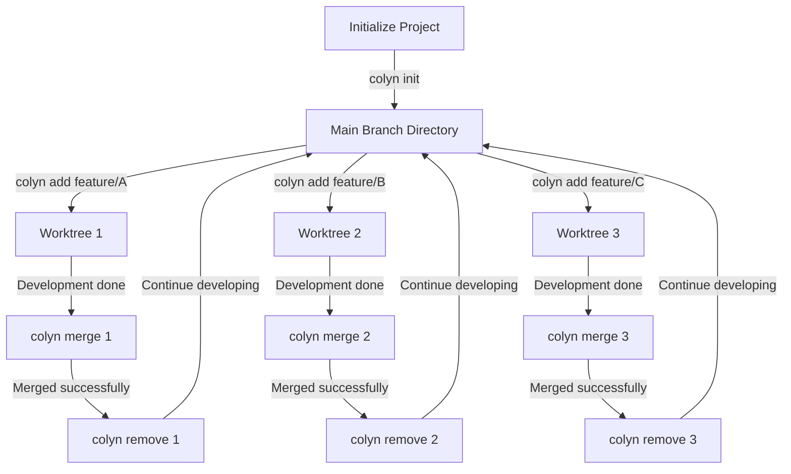

# Core Concepts

This chapter will help you deeply understand how Colyn works and its core concepts.

---

## Introduction to Git Worktree

### What is a Git Worktree?

Git Worktree is a feature introduced in Git 2.5+ that allows you to check out multiple branches from the same Git repository into different directories simultaneously.

**Problems with the traditional approach**:

```bash
# Traditional approach: requires frequent branch switching
git checkout feature/login
# Edit code...
git stash  # Save current work

git checkout feature/dashboard
# Edit code...
git stash  # Save again

git checkout feature/login
git stash pop  # Restore work
```

**Advantages of using Worktree**:

```bash
# Using worktree: parallel development
cd ~/project/login-branch
# Develop login feature here

cd ~/project/dashboard-branch
# Develop dashboard feature here

# No switching needed, all context preserved
```

### Native Git Worktree Commands

```bash
# Create a worktree
git worktree add ../feature-branch feature/login

# List worktrees
git worktree list

# Remove a worktree
git worktree remove ../feature-branch
```

### The Value of Colyn

Colyn builds on top of native Git Worktree to provide:

1. **Simpler commands**: `colyn add feature/login` vs `git worktree add ...`
2. **Automatic port management**: Avoids dev server port conflicts
3. **Automatic directory switching**: Automatically enters target directory after command
4. **Smart branch handling**: Automatically detects local/remote branches
5. **Project structure management**: Unified directory organization
6. **tmux integration**: Efficient multi-worktree switching

---

## Colyn Project Structure

### Standard Directory Layout

Colyn uses the following directory structure:

```
my-project/                    # Project root directory
├── .colyn/                    # Colyn marker directory (empty dir)
├── my-project/                # Main branch directory
│   ├── .git/                  # Git repository (actual .git)
│   │   └── worktrees/         # Git worktree metadata
│   ├── src/
│   ├── .env.local             # PORT=3000, WORKTREE=main
│   └── ...
└── worktrees/                 # Worktrees container directory
    ├── task-1/                # Worktree 1 (PORT=3001)
    │   ├── .git -> ...        # Symbolic link to main repository
    │   ├── src/
    │   ├── .env.local
    │   └── ...
    ├── task-2/                # Worktree 2 (PORT=3002)
    └── task-3/                # Worktree 3 (PORT=3003)
```

### Key Directory Descriptions

#### 1. Project Root Directory

```
my-project/                    # Root dir name = project name
```

- The outermost directory containing everything
- Directory name is the **Project Name**
- In tmux integration, project name is also the **Session name**

#### 2. .colyn/ Directory

```
.colyn/                        # Colyn config directory
└── settings.json              # Project config (plugins, language, tmux, etc.)
```

- Marks this as a Colyn-managed project
- Stores project-level configuration (`settings.json`)
- Used by commands to automatically locate the project root

#### 3. Main Branch Directory

```
my-project/my-project/         # Main branch directory
```

- Contains the actual `.git/` repository
- Holds the main branch (main/master) code
- All other worktrees connect to the Git repository here

#### 4. worktrees/ Directory

```
worktrees/                     # Worktrees container directory
└── task-{id}/                 # Worktrees named by ID
```

- Stores all worktree subdirectories
- Subdirectory naming convention: `task-{id}`
- IDs start from 1 and increment

---

## Worktree ID System

### ID Assignment Rules

Colyn assigns a unique numeric ID to each worktree:

| Worktree | ID | Directory Name | Port |
|----------|----|----------------|------|
| Main branch | 0 | `{project-name}/` | Base Port |
| First worktree | 1 | `worktrees/task-1/` | Base Port + 1 |
| Second worktree | 2 | `worktrees/task-2/` | Base Port + 2 |
| Third worktree | 3 | `worktrees/task-3/` | Base Port + 3 |

### Uses of the ID

1. **Directory naming**: `task-{id}`
2. **Port assignment**: `base_port + id`
3. **Environment variable**: `WORKTREE={id}`
4. **Command argument**: `colyn merge 1`
5. **tmux Window Index**: window index = worktree id

### ID Display Format

In `colyn list` output:

```
┌────────┬─────────────┐
│ ID     │ Branch      │
├────────┼─────────────┤
│ 0-main │ main        │  ← Main branch shown as "0-main"
│ 1      │ feature/a   │  ← Other worktrees show only number
│ 2      │ feature/b   │
└────────┴─────────────┘
```

---

## Port Management

### Automatic Port Assignment

Colyn automatically assigns independent ports to each worktree, avoiding dev server conflicts.

### Base Port

**Definition**: The port used by the main branch, also the base for calculating other ports.

**Configuration**:
```bash
colyn init -p 3000  # Set base port to 3000
```

**Storage location**: Main branch's `.env.local` file
```
PORT=3000
WORKTREE=main
```

### Port Calculation Rule

```
worktree_port = base_port + worktree_id
```

**Example**:

| Worktree | ID | Calculation | Port |
|----------|----|-------------|------|
| main | 0 | 3000 + 0 | 3000 |
| task-1 | 1 | 3000 + 1 | 3001 |
| task-2 | 2 | 3000 + 2 | 3002 |
| task-3 | 3 | 3000 + 3 | 3003 |

### Environment Variable Files

Each worktree has its own `.env.local` file:

**Main branch `.env.local`**:
```bash
PORT=3000
WORKTREE=main
```

**task-1 `.env.local`**:
```bash
PORT=3001
WORKTREE=1
```

### Using Ports

Most modern development frameworks automatically read the `PORT` environment variable:

```javascript
// Next.js, Vite, Create React App, etc. read this automatically
const port = process.env.PORT || 3000;
```

Manual usage:

```bash
# Start dev server
cd worktrees/task-1
npm run dev  # Automatically uses PORT=3001
```

---

## Branch Handling

### Smart Branch Detection

Colyn automatically detects three types of branches:

#### 1. Local Branch

```bash
# If branch already exists locally
git branch
# * main
#   feature/login

colyn add feature/login
# ✓ Using existing local branch feature/login
```

#### 2. Remote Branch

```bash
# If branch only exists remotely
git branch -r
# origin/main
# origin/feature/dashboard

colyn add feature/dashboard
# ✓ Created from remote branch origin/feature/dashboard
```

#### 3. New Branch

```bash
# If branch doesn't exist locally or remotely
colyn add feature/new-feature
# ✓ Created new branch feature/new-feature (based on current main)
```

### Branch Naming Suggestions

Recommended descriptive branch naming:

```bash
# Feature development
feature/user-authentication
feature/dark-mode
feature/dashboard

# Bug fixes
bugfix/login-error
bugfix/memory-leak

# Performance optimization
perf/database-query
perf/image-loading

# Documentation
docs/api-reference
docs/user-guide
```

---

## Configuration Management

### Minimal Configuration Principle

Colyn follows the "minimal configuration principle":

> **Configuration that can be automatically inferred should not be stored in config files**

### Auto-inference First

Colyn follows a "minimal configuration" principle — information that can be inferred automatically is not manually configured:

| Information | Inference Source | Method |
|-------------|-----------------|--------|
| Project name | Root directory name | `path.basename(projectRoot)` |
| Main branch name | Git repository | `git branch --show-current` |
| Base Port | .env.local | Read PORT variable |
| Worktree list | Filesystem + Git | `git worktree list` + directory scan |
| Next ID | worktrees/ directory | Scan existing task-* and calculate max ID + 1 |

### Data Persistence

**Environment variables** (`.env.local`):
```bash
# In each worktree directory
PORT=3001
WORKTREE=1
```

**Git metadata** (`.git/worktrees/`):
```bash
# Automatically maintained by Git
.git/
└── worktrees/
    ├── task-1/
    ├── task-2/
    └── task-3/
```

**Project config** (`.colyn/settings.json`):
```json
{
  "plugins": ["npm"],
  "lang": "en"
}
```

> **Note**: `.colyn/settings.json` is automatically generated by `colyn init` and stores user choices that cannot be inferred (such as which toolchain plugins to enable, interface language, tmux layout, etc.).

### Advantages

1. **Single source of truth**: Avoids data inconsistency
2. **Auto-inference**: Project name, ports, etc. need no manual configuration
3. **Compatible with manual operations**: Manually using `git worktree` won't break the state
4. **Minimal configuration**: Only stores explicit user choices

---

## Dual-Layer Architecture

### Why a Dual-Layer Architecture?

**Technical limitation**: Child processes cannot modify the working directory of the parent process

```javascript
// This doesn't work in Node.js
process.chdir('/new/path');  // Only changes the Node.js process directory
// Parent shell directory does not change
```

### Architecture Design

```
┌──────────────────────────────────────────┐
│  Shell Layer (shell/colyn.sh)            │
│  - Enables JSON output mode as needed    │
│  - Captures stdout (JSON mode)           │
│  - Parses JSON                           │
│  - Executes cd command                   │
└──────────────────────────────────────────┘
                  ↑
                  │ stdout: JSON (JSON mode only)
                  │ stderr: user information
                  ↓
┌──────────────────────────────────────────┐
│  Node.js Layer (dist/index.js)           │
│  - Business logic                        │
│  - Git operations                        │
│  - File operations                       │
│  - No machine JSON output by default     │
│  - Outputs result to stdout in JSON mode │
│  - Outputs prompts to stderr             │
└──────────────────────────────────────────┘
```

### Output Stream Separation

**stderr**: Information for users (colored output)
```bash
✓ Worktree created successfully
✓ Port assigned: 3001
📂 Path: /path/to/worktrees/task-1
```

**stdout**: JSON for shell script parsing (JSON mode only)
```json
{
  "action": "cd",
  "path": "/path/to/worktrees/task-1"
}
```

### Shell Function Wrapper

```bash
# shell/colyn.sh
function colyn() {
  local result
  result=$(COLYN_OUTPUT_JSON=1 "$COLYN_BIN" "$@")  # Enable JSON mode and capture stdout

  # Parse JSON, extract target path
  local target_path
  target_path=$(echo "$result" | jq -r '.path // empty')

  # Execute directory switch
  if [ -n "$target_path" ]; then
    cd "$target_path" || return
  fi
}
```

### User Perspective

```bash
# User runs
colyn add feature/login

# Output seen (stderr)
✓ Creating worktree for branch: feature/login
✓ Assigned ID: 1
✓ Port: 3001
✓ Created at: worktrees/task-1
📂 Switched to: /path/to/worktrees/task-1

# What actually happens:
# 1. Node.js creates worktree
# 2. Shell calls Node.js in JSON mode
# 3. Node.js outputs JSON to stdout
# 4. Shell function parses JSON
# 5. Shell function executes cd command
# 6. User automatically enters new directory
```

---

## Workflow

### Typical Development Flow



### Parallel Development Mode

```
Timeline:
├── Main branch (main)
│   ├── Commit A
│   ├── Commit B
│   └── Commit C
│
├── Worktree 1 (feature/login)
│   ├── Developing login feature...
│   └── Merged back to main →
│
├── Worktree 2 (feature/dashboard)
│   ├── Developing dashboard...
│   └── Merged back to main →
│
└── Worktree 3 (bugfix/memory-leak)
    ├── Fixing memory leak...
    └── Merged back to main →
```

---

## Integration with tmux

### Mapping Relationships

```
Colyn Concept      tmux Concept
─────────────────────────────────
Project Name   →   Session Name
Worktree ID    →   Window Index
Branch Name    →   Window Name (last segment)
```

### Layout Structure

```
Session: my-project
├── Window 0: main (main branch)
│   ├── Pane 0: Claude Code (60%)
│   ├── Pane 1: Dev Server (12%)
│   └── Pane 2: Bash (28%)
│
├── Window 1: login (feature/login)
│   ├── Pane 0: Claude Code
│   ├── Pane 1: Dev Server
│   └── Pane 2: Bash
│
└── Window 2: dashboard (feature/dashboard)
    ├── Pane 0: Claude Code
    ├── Pane 1: Dev Server
    └── Pane 2: Bash
```

For details, see [tmux Integration](06-tmux-integration.md).

---

## Next Steps

Now that you understand Colyn's core concepts, continue reading:

- [Command Reference](04-command-reference/README.md) - Learn detailed usage of all commands
- [Advanced Usage](05-advanced-usage.md) - Master advanced techniques
- [tmux Integration](06-tmux-integration.md) - Learn about tmux integration features
