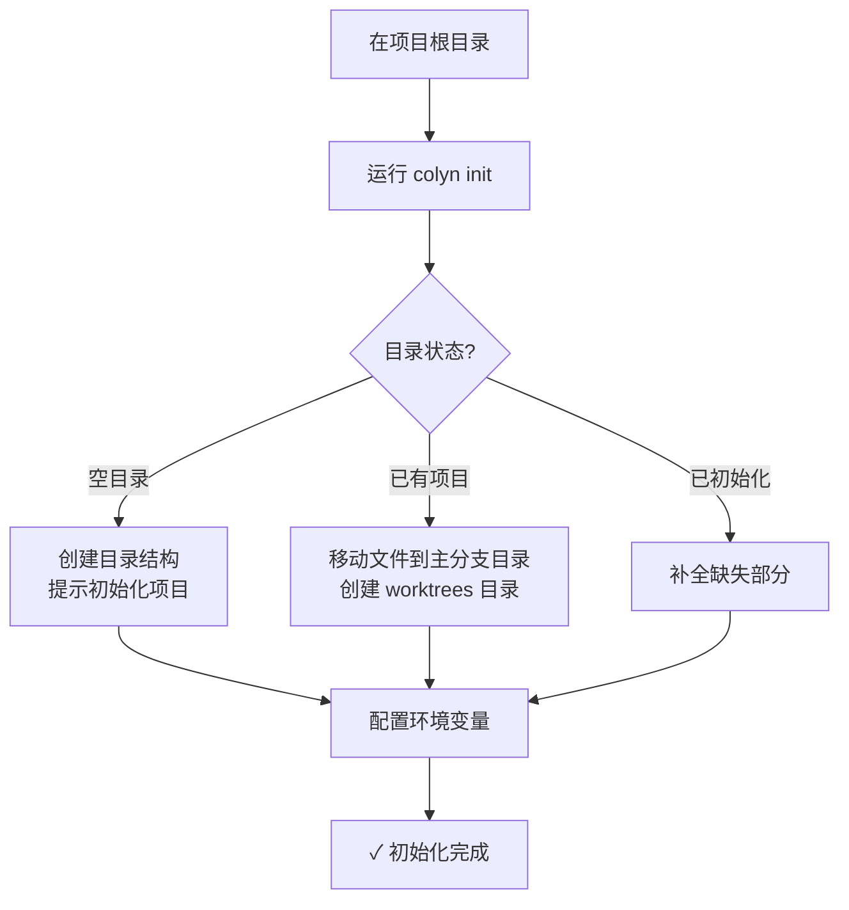
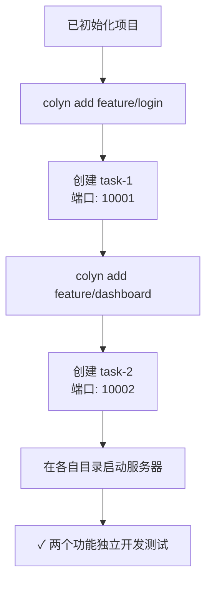
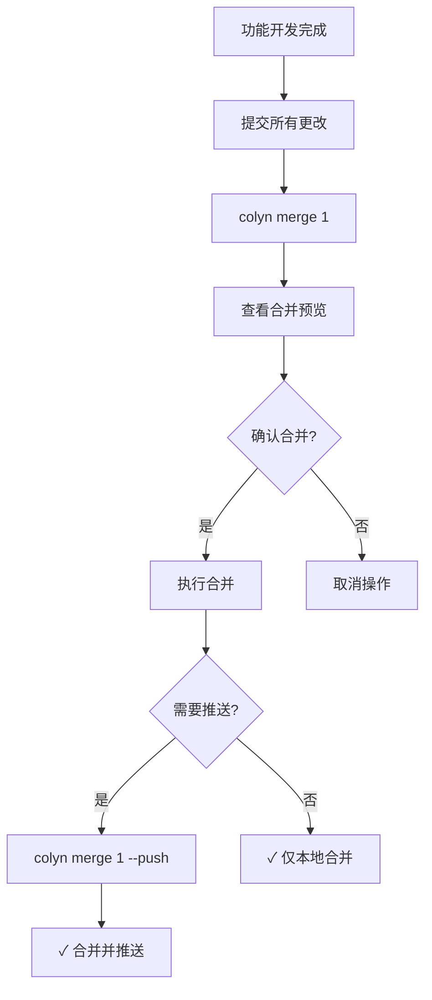
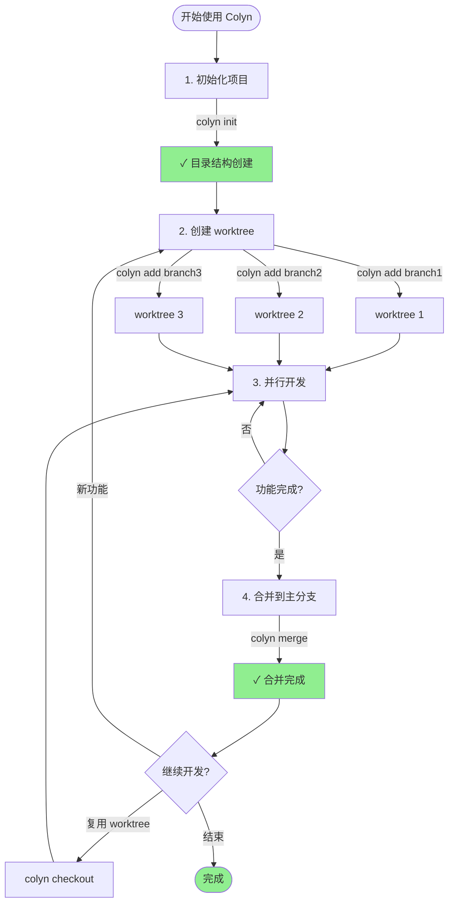

# 需求文档 - Git Worktree 管理工具（Colyn）

**创建时间**：2026-01-14
**最后更新**：2026-01-15
**负责人**：kejinghan
**状态**：进行中

---

## 1. 需求概述

### 1.1 需求背景

在进行 Web 应用并行开发时，开发者经常需要同时处理多个功能分支。传统的 git 分支切换方式存在以下痛点：

1. **上下文丢失**：在不同任务间切换时，需要频繁 stash 或 commit，容易丢失工作状态
2. **服务器冲突**：只能启动一个开发服务器，无法同时测试多个功能分支
3. **效率低下**：切换分支需要等待依赖重新安装、编译等过程

虽然 git worktree 可以解决这些问题，但原生命令使用复杂，缺乏针对 Web 开发场景的便捷工具。

### 1.2 需求目标

开发一个命令行工具 `colyn`，用于：

1. 简化 git worktree 的创建和管理流程
2. 自动处理多个开发服务器的端口配置，避免端口冲突
3. 提供直观的命令接口，方便日常开发使用
4. 支持跨平台使用（macOS、Linux、Windows）

### 1.3 目标用户

- 需要同时开发和测试多个功能的前端/全栈开发者
- 使用 git 进行版本控制的 Web 应用开发团队
- 需要频繁在多个分支间切换的开发者

---

## 2. 功能需求

### 2.1 核心功能

#### ✅ 1. 初始化（init）- 已实现
   - **描述**：在现有项目中初始化 worktree 管理结构
   - **用户价值**：快速将现有项目转换为支持并行开发的结构
   - **主要功能**：
     - 自动检测目录状态（空目录、已初始化、现有项目）
     - 创建主分支目录和 worktrees 目录
     - 配置环境变量（PORT 和 WORKTREE）
     - 配置 .gitignore 忽略 .env.local
   - **特殊处理**：智能识别已存在的结构，补全缺失部分

#### ✅ 2. 创建 worktree（add）- 已实现
   - **描述**：为指定分支创建新的 worktree 工作目录
   - **用户价值**：快速创建独立的开发环境，支持并行开发
   - **主要功能**：
     - 自动分配 worktree ID 和端口号
     - 智能处理分支（本地、远程、新建）
     - 复制主分支环境变量并更新
     - 从项目任意位置执行命令
   - **错误处理**：
     - 分支已有 worktree：显示现有 worktree 信息和操作建议
     - 分支被其他项目使用：显示冲突路径和删除命令

#### 📋 3. 合并 worktree（merge）- 设计中
   - **描述**：将 worktree 的更改合并回主分支
   - **用户价值**：简化功能分支的合并流程，避免手动操作错误
   - **主要功能**：
     - 支持通过 ID、分支名或自动识别（在 worktree 目录中）
     - 自动检查工作目录状态（主分支和 worktree 都需干净）
     - 使用 --no-ff 合并保持清晰的提交历史
     - 可选推送到远程（--push / --no-push）
   - **特殊处理**：
     - 合并后保留 worktree（不自动删除）
     - 冲突时提供明确的解决指引

#### 📋 4. 签出分支（checkout）- 待设计
   - **描述**：在指定的 worktree 中切换或创建分支
   - **用户价值**：复用已有 worktree，避免创建过多目录
   - **主要功能**：
     - 在 worktree 中切换到其他分支
     - 检查当前分支是否已合并
     - 更新 .env.local 中的分支信息

### 2.2 辅助功能

#### 📋 1. 列表查看（list）- 待实现
   - **描述**：显示所有 worktree 的信息
   - **用户价值**：快速了解当前有哪些并行开发环境
   - **显示信息**：ID、分支名、端口、路径、状态

#### 📋 2. 查看状态（status）- 待实现
   - **描述**：显示指定 worktree 相对于主分支的修改
   - **用户价值**：快速了解分支的开发进度
   - **显示信息**：变更文件数、新增/删除行数、提交数

#### 📋 3. 删除 worktree（remove）- 待设计
   - **描述**：删除不再需要的 worktree
   - **用户价值**：清理工作空间，释放磁盘空间
   - **主要功能**：
     - 检查是否有未提交的更改
     - 删除 worktree 目录
     - 更新配置文件

### 2.3 功能范围

**包含：**
- Git worktree 的创建、合并、切换管理
- 环境变量自动配置（PORT、WORKTREE）
- 跨平台支持（macOS、Linux、Windows）
- 基本的状态查询和信息展示

**不包含：**
- 开发服务器的自动启动和管理
- 依赖安装和编译流程的自动化
- Git 操作之外的项目管理功能
- 远程协作和团队同步功能

---

## 3. 用户场景与流程

### 3.1 典型使用场景

#### 场景 1：初次使用工具
**用户**：新用户
**目标**：将现有项目转换为支持并行开发的结构
**前置条件**：已有一个 git 项目



**操作步骤**：
1. 在项目根目录运行 `colyn init`
2. 输入主分支端口（例如：10000）
3. 工具自动创建目录结构并配置环境变量

**预期结果**：项目结构重组完成，可以开始创建 worktree

---

#### 场景 2：并行开发多个功能
**用户**：开发者
**目标**：同时开发登录和仪表板功能
**前置条件**：已完成初始化



**操作步骤**：
1. 运行 `colyn add feature/login` 创建登录功能分支
2. 运行 `colyn add feature/dashboard` 创建仪表板功能分支
3. 在各自的 worktree 目录中启动开发服务器
4. 同时在浏览器中测试两个功能

**预期结果**：两个功能可以独立开发和测试，互不干扰

---

#### 场景 3：完成功能后合并
**用户**：开发者
**目标**：将完成的功能合并回主分支
**前置条件**：已在 worktree 中完成功能开发



**操作步骤**：
1. 在 worktree 中提交所有更改
2. 运行 `colyn merge 1` 或 `colyn merge feature/login`
3. 查看合并预览信息
4. 确认合并
5. （可选）运行 `colyn merge feature/login --push` 推送到远程

**预期结果**：功能分支合并到主分支，worktree 保留供后续使用

---

### 3.2 整体工作流程



---

### 3.3 从项目任意位置运行命令

Colyn 支持从项目的任意位置运行命令，自动定位项目根目录：

```mermaid
graph TD
    A[用户在任意目录] --> B{运行 colyn 命令}
    B --> C[向上查找 .colyn 目录]
    C --> D{找到项目根?}
    D -->|是| E[在正确目录执行命令]
    D -->|否| F[报错: 未找到项目]
    E --> G[✓ 命令执行成功]

    H[示例路径] --> I[/project/worktrees/task-1/src]
    I --> J[colyn add feature/new]
    J --> C
```

**用户价值**：
- 不需要记住命令必须在哪里运行
- 在 worktree 中也能创建新的 worktree
- 提高开发效率

---

## 4. 用户数据交互

### 4.1 用户输入

| 输入内容 | 何时需要 | 说明 | 示例 |
|---------|---------|------|------|
| 分支名称 | 创建/签出 worktree | 要开发的功能分支名 | `feature/login` |
| 主端口号 | 初始化项目 | 主分支开发服务器的端口 | `10000` |
| Worktree ID | 合并/删除/查询 | 识别特定的 worktree | `1`, `2` |
| 推送选项 | 合并时（可选） | 是否推送到远程 | `--push`, `--no-push` |

### 4.2 工具提供的信息

**列表展示**（`colyn list`）：
- Worktree ID
- 关联的分支名
- 端口号
- 文件路径

**状态展示**（`colyn status`）：
- 修改的文件数
- 新增/删除的代码行数
- 相对主分支的提交数

**操作反馈**：
- 成功消息（✓ 绿色）
- 错误提示（✗ 红色，包含解决建议）
- 警告信息（⚠ 黄色）

### 4.3 数据持久化

**项目标识**：`.colyn/` 目录
- 该目录的存在标识这是一个 colyn 项目
- 不再需要 config.json 配置文件

**数据来源**（从文件系统动态获取）：
- **主分支名称**：从主分支目录的 git 获取当前分支
- **端口配置**：从各目录的 `.env.local` 文件读取
- **Worktree 列表**：通过 `git worktree list` 命令和扫描 `worktrees/` 目录获取
- **下一个 Worktree ID**：扫描 `worktrees/task-*` 目录计算最大 ID + 1

**环境变量**：每个 worktree 的 `.env.local`
- `PORT`: 开发服务器端口
- `WORKTREE`: Worktree ID 或 "main"

**设计优势**：
- 单一数据源，避免数据不一致
- 无需手动同步配置文件
- 即使手动操作 git worktree 也不会破坏状态

---

## 5. 用户体验要求

### 5.1 交互方式

- **触发方式**：通过命令行子命令触发，如 `colyn init`、`colyn add <branch>`
- **主要交互**：
  - 命令行参数输入
  - 关键操作（如合并）需要用户确认
  - 清晰的进度提示和结果反馈
- **反馈机制**：
  - 成功操作显示绿色 ✓ 标记和简洁消息
  - 错误操作显示红色 ✗ 标记和详细错误信息
  - 警告操作显示黄色 ⚠ 标记和提示信息

### 5.2 界面要求

- **命令行输出格式**：
  - 使用表格展示列表信息（使用 cli-table3 等库）
  - 使用颜色区分不同类型的信息（chalk 库）
  - 进度操作使用 spinner 或进度条

- **关键元素**：
  - 清晰的命令使用说明（--help）
  - 直观的错误提示
  - 信息层次分明

### 5.3 可访问性

- 支持 `--no-color` 选项，禁用颜色输出
- 支持 `--verbose` 选项，显示详细日志
- 支持 `--quiet` 选项，减少输出信息

---

## 6. 非功能性需求

### 6.1 性能要求

- **响应时间**：常规命令（如 list、status）应在 1 秒内完成
- **并发处理**：不涉及并发，单用户单进程使用
- **数据量**：支持管理至少 20 个 worktree

### 6.2 安全要求

- **认证**：不涉及
- **授权**：依赖系统文件权限
- **数据保护**：
  - 不自动提交或推送代码
  - 关键操作（如合并）需要用户确认
  - 操作失败时不删除用户数据

### 6.3 可靠性要求

- **可用性**：工具崩溃不应影响 git 仓库完整性
- **容错性**：
  - 检测到不一致状态时应提示修复方案
  - 操作失败应提供回滚或恢复指引
- **数据一致性**：
  - `.env.local` 文件的端口配置应与 worktree id 保持一致
  - Worktree 列表应与 git worktree 实际状态同步

---

## 7. 验收标准

### 7.1 功能验收

**已实现**：
- [x] 初始化功能（`init`）：正确重组项目结构并配置环境变量
- [x] 创建 worktree（`add`）：自动分配 id 和端口，智能处理分支
- [x] 从任意位置运行命令：自动定位项目根目录
- [x] 完善的错误处理：分支冲突时提供详细的解决方案
- [x] 跨平台支持：macOS、Linux、Windows

**待实现**：
- [ ] 合并 worktree（`merge`）：检查状态、预览变化、支持推送选项
- [ ] 签出分支（`checkout`）：在 worktree 中切换分支
- [ ] 列表查看（`list`）：展示所有 worktree 信息
- [ ] 查看状态（`status`）：显示变更统计
- [ ] 删除 worktree（`remove`）：安全删除并更新配置

### 7.2 质量验收

**已达标**：
- [x] 代码通过 TypeScript 类型检查（无 `any` 类型）
- [x] 错误处理完善，提供可操作的解决方案
- [x] 遵循项目 git commit 规范（不使用 `--no-verify`）

**待完善**：
- [ ] 所有命令都有 `--help` 说明
- [ ] 关键操作（如合并）有确认机制

### 7.3 测试场景

1. **场景**：在全新的 git 项目中初始化
   - **预期**：成功创建目录结构，配置正确
   - **验证方式**：检查目录结构和 `.env.local` 内容

2. **场景**：创建多个 worktree 并同时启动开发服务器
   - **预期**：端口不冲突，各 worktree 独立运行
   - **验证方式**：检查各 worktree 的 PORT 环境变量，手动启动服务器验证

3. **场景**：合并 worktree，但存在未提交的文件
   - **预期**：报错退出，提示用户先提交
   - **验证方式**：在 worktree 中创建未提交文件，运行合并命令

4. **场景**：初始化时已存在部分目录结构
   - **预期**：智能补全缺失部分，不破坏现有结构
   - **验证方式**：手动创建主分支目录，再运行初始化

5. **场景**：创建已存在分支的 worktree
   - **预期**：报错退出，提示分支已有对应的 worktree
   - **验证方式**：创建两个相同分支的 worktree

---

## 8. 依赖与约束

### 8.1 依赖项

- **技术依赖**：
  - Node.js >= 18（使用 volta 管理）
  - Git >= 2.15（支持 worktree 功能）
  - Yarn 作为包管理器

- **数据依赖**：
  - 项目必须是 git 仓库
  - 需要有 `.env.local` 文件支持的项目结构

- **团队依赖**：无

### 8.2 技术约束

- **技术栈**：
  - TypeScript（不使用 `any` 类型）
  - Node.js 命令行工具
  - 使用 Commander.js 或类似库处理命令行

- **兼容性**：
  - 跨平台支持（macOS、Linux、Windows）
  - 路径处理需考虑不同操作系统的差异

- **限制条件**：
  - 只支持 git 版本控制系统
  - 环境变量配置依赖 `.env.local` 文件格式

### 8.3 前置条件

- 用户已安装 Node.js 和 Git
- 用户对 git 和命令行工具有基本了解
- 项目使用 git 进行版本控制

---

## 9. 补充说明

### 9.1 参考资料

- [Git Worktree 官方文档](https://git-scm.com/docs/git-worktree)
- [Commander.js](https://github.com/tj/commander.js) - Node.js 命令行框架
- [Enquirer](https://github.com/enquirer/enquirer) - 用户交互提示库

### 9.2 已解决的设计决策

1. ✅ **项目标识**：使用 `.colyn/` 目录标识项目，无需配置文件（从文件系统动态获取信息）
2. ✅ **Worktree 目录命名**：采用 `task-{id}` 格式，保持简洁一致
3. ✅ **命令执行位置**：支持从项目任意位置运行命令（自动定位根目录）
4. ✅ **分支冲突错误**：提供详细的冲突信息和解决方案

### 9.3 待确定事项

1. **删除命令行为**：删除 worktree 时是否需要检查是否已合并？
2. **环境变量扩展**：是否需要支持更多占位符（如 `{{BRANCH_NAME}}`）？
3. **自动进入目录**：是否提供 shell 函数自动配置脚本？

### 9.4 更新记录

| 日期 | 修改人 | 修改内容 |
|------|--------|----------|
| 2026-01-14 | Claude | 初始版本，基于需求澄清生成 |
| 2026-01-15 | Claude | BA视角更新：添加状态指示器、Mermaid流程图、简化技术细节 |

---

## 附录

### A. 目录结构示例

初始化前：
```
my-project/
├── .git/
├── src/
├── package.json
└── ...
```

初始化后：
```
my-project/                    # 根目录
├── my-project/                # 主分支目录
│   ├── .git/
│   ├── src/
│   ├── .env.local            # PORT=10000, WORKTREE=main
│   └── ...
└── worktrees/                 # worktrees 目录
    ├── task-1/               # worktree 1
    │   ├── src/
    │   ├── .env.local        # PORT=10001, WORKTREE=1
    │   └── ...
    └── task-2/               # worktree 2
        ├── src/
        ├── .env.local        # PORT=10002, WORKTREE=2
        └── ...
```

### B. 命令示例

```bash
# 初始化
colyn init

# 创建 worktree
colyn add feature-login       # 创建 task-1
colyn add feature-dashboard   # 创建 task-2

# 列表查看
colyn list
# 输出示例：
# ID  Branch            Port   Path
# 1   feature-login     10001  /path/to/worktrees/task-1
# 2   feature-dashboard 10002  /path/to/worktrees/task-2

# 查看状态
colyn status 1
# 输出示例：
# Branch: feature-login
# Changed files: 5 (+120, -30)
# Commits ahead: 3

# 合并
colyn merge 1                 # 仅合并到本地
colyn merge feature-login     # 使用分支名
colyn merge 1 --push          # 合并并推送

# 签出分支
colyn checkout 1 bugfix-issue-123
```
