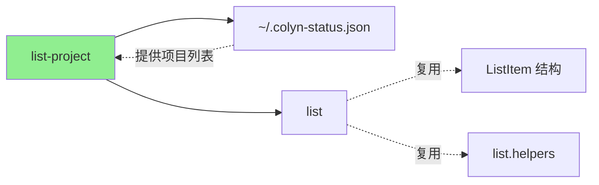

# List-Project 命令设计文档

**创建时间**：2026-02-15
**命令名称**：`colyn list-project`
**别名**：`lsp`
**状态**：✅ 已实现

---

## 1. 命令概述

### 1.1 用户目标

用户希望快速查看全局状态索引中的 colyn 项目及其 worktree 信息，以便：
- 了解当前有哪些正在运行的 colyn 项目
- 查看每个项目下的所有 worktree（包括主分支）
- 了解每个 worktree 的 git 状态和与主分支的差异
- 在脚本中批量处理多个项目的 worktree

### 1.2 命令使用

```bash
# 基本用法：显示全局状态索引中的项目和 worktree
colyn list-project
colyn lsp    # 使用别名

# JSON 格式输出（便于脚本处理）
colyn list-project --json
colyn lsp --json

# 只输出路径（便于管道操作）
colyn list-project --paths
colyn lsp -p
```

**别名说明**：
- `colyn lsp` 是 `colyn list-project` 的别名
- 更加简洁，便于快速输入

### 1.3 执行结果

显示全局状态索引中的 colyn 项目，每个项目包含：
- 项目概览（Project、Path、Worktree 数量、Updated）
- 详细的 worktree 列表（复用 `colyn list` 的格式）

**示例输出**（默认表格格式）：

```
┌─────────┬──────────────────┬───────────┬─────────────────────┐
│ Project │ Path             │ Worktrees │ Updated             │
├─────────┼──────────────────┼───────────┼─────────────────────┤
│ backend │ /path/to/backend │ 2         │ 2026/02/23 20:30:00 │
│ colyn   │ /path/to/colyn   │ 4         │ 2026/02/23 20:28:11 │
└─────────┴──────────────────┴───────────┴─────────────────────┘

backend 的 Worktrees:
┌──────────┬──────────────┬──────┬────────┬──────┬──────────────────┐
│ ID       │ Branch       │ Port │ Status │ Diff │ Path             │
├──────────┼──────────────┼──────┼────────┼──────┼──────────────────┤
│   0-main │ develop      │ 3010 │        │ -    │ backend          │
│   1      │ feature/auth │ 3011 │        │ ✓    │ worktrees/task-1 │
└──────────┴──────────────┴──────┴────────┴──────┴──────────────────┘

colyn 的 Worktrees:
┌──────────┬────────────────┬───────┬─────────┬──────┬──────────────────┐
│ ID       │ Branch         │ Port  │ Status  │ Diff │ Path             │
├──────────┼────────────────┼───────┼─────────┼──────┼──────────────────┤
│   0-main │ main           │ 10000 │         │ -    │ colyn            │
│   1      │ feature/login  │ 10001 │         │ ✓    │ worktrees/task-1 │
│ → 2      │ feature/ui     │ 10002 │ M:2 S:1 │ ✓    │ worktrees/task-2 │
│   3      │ feature/api    │ 10003 │         │ ↑1   │ worktrees/task-3 │
└──────────┴────────────────┴───────┴─────────┴──────┴──────────────────┘
```

**说明**：
- `→` 箭头标识当前所在的 worktree，整行青色高亮
- `Status`: git 状态，`M:2` 表示 2 个文件已修改，`S:1` 表示 1 个文件已暂存
- `Diff`: 与主分支的差异，`↑` 领先，`↓` 落后，`✓` 已同步

---

## 2. 设计原则

### 2.1 复用现有实现

**关键决策**：完全复用 `colyn list` 命令的实现和数据结构

**复用的组件**：
1. **数据结构** - `ListItem` 接口
2. **辅助函数** - `getGitStatus()`, `getGitDiff()`, `formatStatus()`, `formatDiff()`
3. **表格格式** - 列定义、颜色方案、高亮逻辑
4. **JSON 结构** - 与 `list --json` 完全一致
5. **翻译文本** - 复用 `commands.list.*` 的翻译

**优势**：
- 用户体验一致
- 代码质量高，减少重复
- 自动同步 list 命令的 bug 修复和新功能

### 2.2 全局状态索引集成

通过 `~/.colyn-status.json` 获取项目信息：
1. 读取全局索引中的 projectPath 列表
2. 校验项目目录结构（`.colyn/`、`{project}/{project}`、`worktrees/`）
3. 跳过失效路径，保留有效项目

### 2.3 数据一致性

确保与其他命令的数据一致：
- 项目路径 - 与 `info -f project-path` 一致
- 项目名称 - 与 `info -f project` 一致
- Worktree 数据 - 与 `list --json` 一致

---

## 3. 用户场景

### 3.1 场景 1：查看所有项目概览

**用户需求**：快速了解当前有哪些项目在运行

**操作流程**：

```bash
$ colyn list-project

┌─────────┬──────────────────┬───────────┬─────────────────────┐
│ Project │ Path             │ Worktrees │ Updated             │
├─────────┼──────────────────┼───────────┼─────────────────────┤
│ backend │ /path/to/backend │ 2         │ 2026/02/23 20:30:00 │
│ colyn   │ /path/to/colyn   │ 4         │ 2026/02/23 20:28:11 │
│ website │ /path/to/website │ 1         │ 2026/02/23 19:59:02 │
└─────────┴──────────────────┴───────────┴─────────────────────┘
...
```

**结果**：用户可以一目了然地看到所有项目及其 worktree 数量。

---

### 3.2 场景 2：查看项目的详细 worktree 信息

**用户需求**：了解某个项目的所有 worktree 状态

**操作流程**：

```bash
$ colyn list-project | grep -A 10 "colyn 的 Worktrees"

colyn 的 Worktrees:
┌──────────┬────────────────┬───────┬─────────┬──────┬──────────────────┐
│ ID       │ Branch         │ Port  │ Status  │ Diff │ Path             │
├──────────┼────────────────┼───────┼─────────┼──────┼──────────────────┤
│   0-main │ main           │ 10000 │         │ -    │ colyn            │
│   1      │ feature/login  │ 10001 │         │ ✓    │ worktrees/task-1 │
│ → 2      │ feature/ui     │ 10002 │ M:2 S:1 │ ✓    │ worktrees/task-2 │
│   3      │ feature/api    │ 10003 │         │ ↑1   │ worktrees/task-3 │
└──────────┴────────────────┴───────┴─────────┴──────┴──────────────────┘
```

**结果**：用户可以看到该项目所有 worktree 的详细信息，包括 git 状态。

---

### 3.3 场景 3：在脚本中批量处理所有项目

**用户需求**：在所有项目的所有 worktree 中执行命令

**操作流程**：

```bash
# 获取所有 worktree 路径
$ colyn list-project --paths
/path/to/backend/backend
/path/to/backend/worktrees/task-1
/path/to/colyn/colyn
/path/to/colyn/worktrees/task-1
/path/to/colyn/worktrees/task-2
/path/to/colyn/worktrees/task-3

# 在所有 worktree 中运行 git status
$ colyn list-project --paths | xargs -I {} sh -c 'echo "=== {} ===" && cd {} && git status'

# 在所有 worktree 中更新依赖
$ colyn list-project --paths | xargs -I {} sh -c 'cd {} && npm install'
```

**结果**：简洁的路径输出便于管道操作和脚本处理。

---

### 3.4 场景 4：程序化处理项目信息

**用户需求**：在脚本或工具中获取结构化的项目信息

**操作流程**：

```bash
$ colyn list-project --json | jq '.'
```

**输出**：

```json
[
  {
    "projectPath": "/path/to/colyn",
    "projectName": "colyn",
    "mainBranchPath": "/path/to/colyn/colyn",
    "updatedAt": "2026-02-23T12:28:11.000Z",
    "worktrees": [
      {
        "id": null,
        "branch": "main",
        "port": 10000,
        "path": "colyn",
        "isMain": true,
        "isCurrent": false,
        "status": {
          "modified": 0,
          "staged": 0,
          "untracked": 0
        },
        "diff": {
          "ahead": 0,
          "behind": 0
        }
      },
      {
        "id": 1,
        "branch": "feature/login",
        "port": 10001,
        "path": "worktrees/task-1",
        "isMain": false,
        "isCurrent": false,
        "status": {
          "modified": 0,
          "staged": 0,
          "untracked": 0
        },
        "diff": {
          "ahead": 0,
          "behind": 0
        }
      }
    ]
  }
]
```

**结果**：JSON 格式便于程序解析，worktrees 数组的结构与 `list --json` 完全一致。

---

## 4. 输入与输出

### 4.1 命令选项

| 选项 | 短选项 | 说明 | 默认值 |
|------|--------|------|--------|
| `--json` | - | 以 JSON 格式输出 | 否 |
| `--paths` | `-p` | 只输出路径（每行一个） | 否 |

**选项互斥规则**：
- `--json` 和 `--paths` 互斥，不能同时使用

### 4.2 输出格式

#### 4.2.1 表格格式（默认）

**特点**：
- 主表格显示项目概览
- 详细表格显示每个项目的 worktree（复用 list 命令格式）
- 彩色输出，美观易读
- 当前 worktree 用 `→` 箭头标识，整行高亮
- 主分支用灰色显示

**颜色方案**：
| 元素 | 颜色 |
|------|------|
| 表头 | 白色加粗 |
| 主分支行 | 灰色（dim） |
| 普通行 | 默认颜色 |
| 当前行 | 青色（cyan） |
| Status 有修改 | 黄色（yellow） |
| Diff 已同步 (✓) | 绿色（green） |
| Diff 有差异 | 青色（cyan） |

#### 4.2.2 JSON 格式 (`--json`)

**特点**：
- 机器可读，便于脚本处理
- worktrees 数组使用与 `list --json` 完全相同的结构
- 包含完整的 git 状态和差异信息

**字段说明**：

**ProjectInfo 字段**：
| 字段 | 类型 | 说明 |
|------|------|------|
| `projectPath` | `string` | 项目根目录路径（与 `info -f project-path` 一致）|
| `projectName` | `string` | 项目名称（与 `info -f project` 一致）|
| `mainBranchPath` | `string` | 主分支目录路径 |
| `updatedAt` | `string` | 全局索引中的最后状态更新时间（ISO 8601） |
| `worktrees` | `ListItem[]` | worktree 列表（与 `list --json` 结构一致）|

**ListItem 字段**（与 `list --json` 完全相同）：
| 字段 | 类型 | 说明 |
|------|------|------|
| `id` | `number \| null` | worktree ID，主分支为 `null` |
| `branch` | `string` | 分支名称 |
| `port` | `number` | 端口号 |
| `path` | `string` | 相对于项目根目录的相对路径 |
| `isMain` | `boolean` | 是否为主分支 |
| `isCurrent` | `boolean` | 是否为当前所在目录 |
| `status.modified` | `number` | 已修改但未暂存的文件数 |
| `status.staged` | `number` | 已暂存的文件数 |
| `status.untracked` | `number` | 未跟踪的文件数 |
| `diff.ahead` | `number` | 领先主分支的提交数 |
| `diff.behind` | `number` | 落后主分支的提交数 |

#### 4.2.3 路径格式 (`--paths`)

**特点**：
- 每行一个绝对路径
- 包含主分支和所有 worktree
- 无颜色、无额外信息
- 便于管道操作和脚本处理

**使用场景**：
```bash
# 在所有 worktree 中执行命令
colyn list-project --paths | xargs -I {} sh -c 'cd {} && git status'

# 统计总的 worktree 数量
colyn list-project --paths | wc -l

# 查找包含特定文件的 worktree
colyn list-project --paths | xargs -I {} sh -c '[ -f {}/package.json ] && echo {}'
```

---

## 5. 技术实现

### 5.1 核心函数

```typescript
// 获取全局状态索引中的项目列表
export async function listGlobalStatusProjects(): Promise<{
  projectPath: string;
  updatedAt: string;
}[]>

// 获取项目的所有 worktree（复用 list 逻辑）
async function getProjectWorktrees(
  projectPath: string,
  mainBranchPath: string
): Promise<ListItem[]>

// 获取所有项目信息
async function getAllProjects(): Promise<ProjectInfo[]>
```

### 5.2 数据流

```
~/.colyn-status.json
  ↓
读取 projectPath 列表
  ↓
校验项目目录结构
  ↓
使用 getProjectWorktrees() 获取 worktree 列表
  ↓
输出（表格/JSON/路径）
```

### 5.3 依赖关系

- `worktree-status.ts` - 读取全局索引 `~/.colyn-status.json`
- `discovery.ts` - `discoverProjectInfo()` 获取 worktree
- `list.helpers.ts` - git 状态和差异处理
- `list.ts` - 复用数据结构和格式化逻辑

---

## 6. 错误处理

### 6.1 无 colyn 项目

```
暂无项目

提示：先在项目中执行 colyn status set 更新状态，让项目进入 ~/.colyn-status.json
```

### 6.2 选项冲突

```
✗ 选项冲突：--json 和 --paths 不能同时使用
  提示：请选择其中一种输出格式
```

---

## 7. 与其他命令的关系



**说明**：
- `list-project` 是跨项目的 `list` 命令
- 完全复用 `list` 的数据结构和格式化逻辑
- 通过全局状态索引获取所有项目，而不是只查看当前项目

---

## 8. 常见问题

### Q1: list-project 和 list 有什么区别？

A:
- `list` - 查看**当前项目**的所有 worktree
- `list-project` - 查看**全局状态索引中项目**的所有 worktree

### Q2: 为什么 worktree 数据结构与 list --json 一致？

A: 这是有意设计的，确保：
- 用户体验一致
- 脚本可以统一处理两个命令的输出
- 自动同步 list 命令的改进

### Q3: 如何只查看某个项目的 worktree？

A: 可以使用 grep 或 jq 过滤：

```bash
# 表格格式
colyn list-project | grep -A 10 "colyn 的 Worktrees"

# JSON 格式
colyn list-project --json | jq '.[] | select(.projectName == "colyn")'
```

### Q4: 路径输出包含主分支吗？

A: 是的，`--paths` 输出包含主分支和所有 worktree 的路径。

### Q5: 如何在所有项目中执行命令？

A: 使用 `--paths` 配合 xargs：

```bash
colyn list-project --paths | xargs -I {} sh -c 'cd {} && <your-command>'
```

---

## 9. 实现注意事项

### 9.1 索引要求

- `~/.colyn-status.json` 中存在项目记录
- 项目目录结构有效（`.colyn/`、主分支目录、`worktrees/`）

### 9.2 性能考虑

- 使用并发获取项目信息
- 缓存 git 状态查询结果
- 避免重复扫描同一项目

### 9.3 退出码

| 退出码 | 含义 |
|--------|------|
| 0 | 成功 |
| 1 | 选项冲突或其他错误 |

---

## 10. 总结

`colyn list-project` 命令设计重点：

1. **跨项目查看** - 通过全局状态索引获取所有项目信息
2. **完全复用** - 复用 `list` 命令的实现和数据结构
3. **一致性** - 与 `info` 和 `list` 命令保持数据一致
4. **多种输出** - 表格、JSON、路径，满足不同需求
5. **脚本友好** - 便于批量处理多个项目
