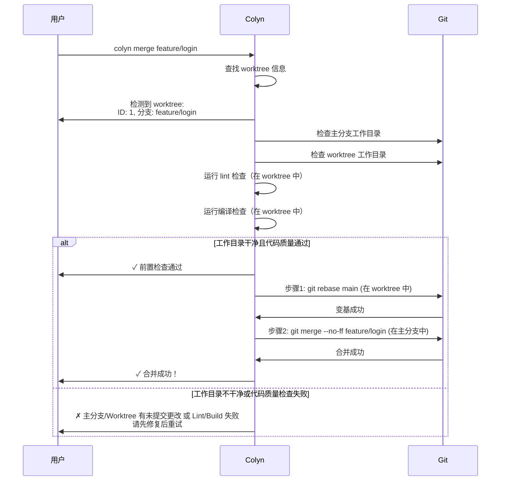
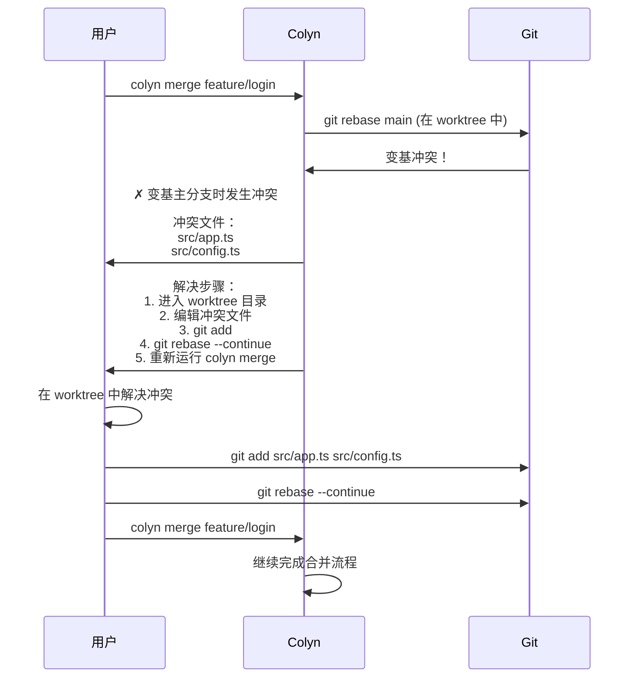
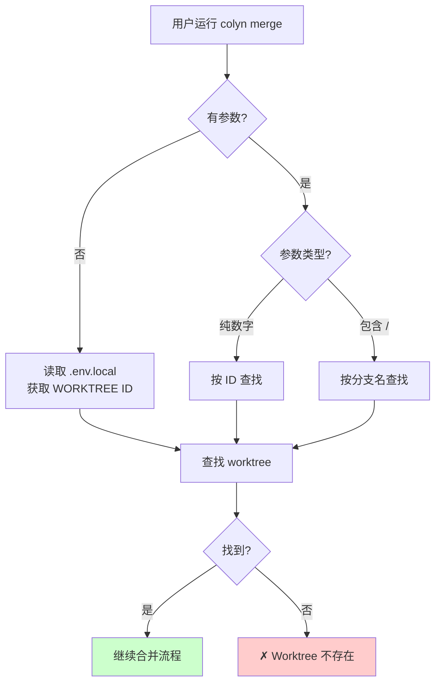
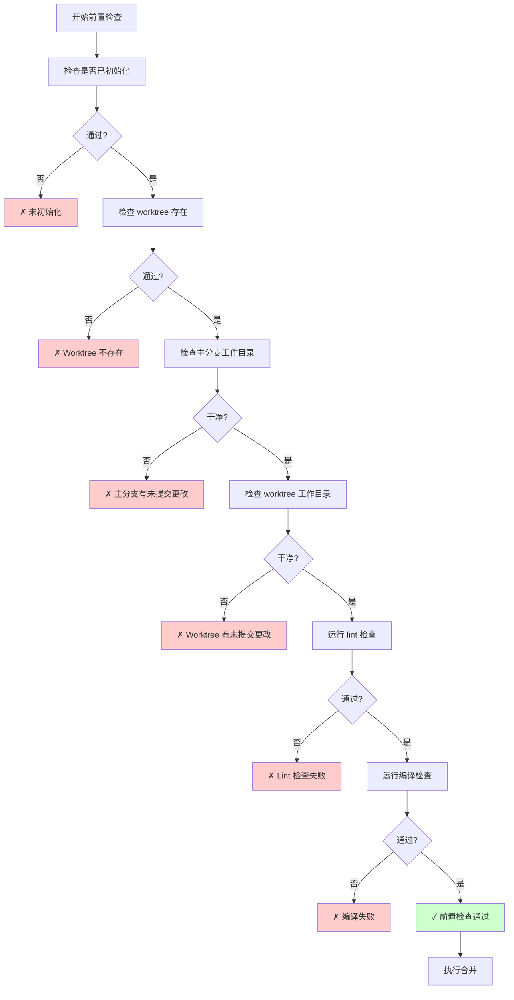
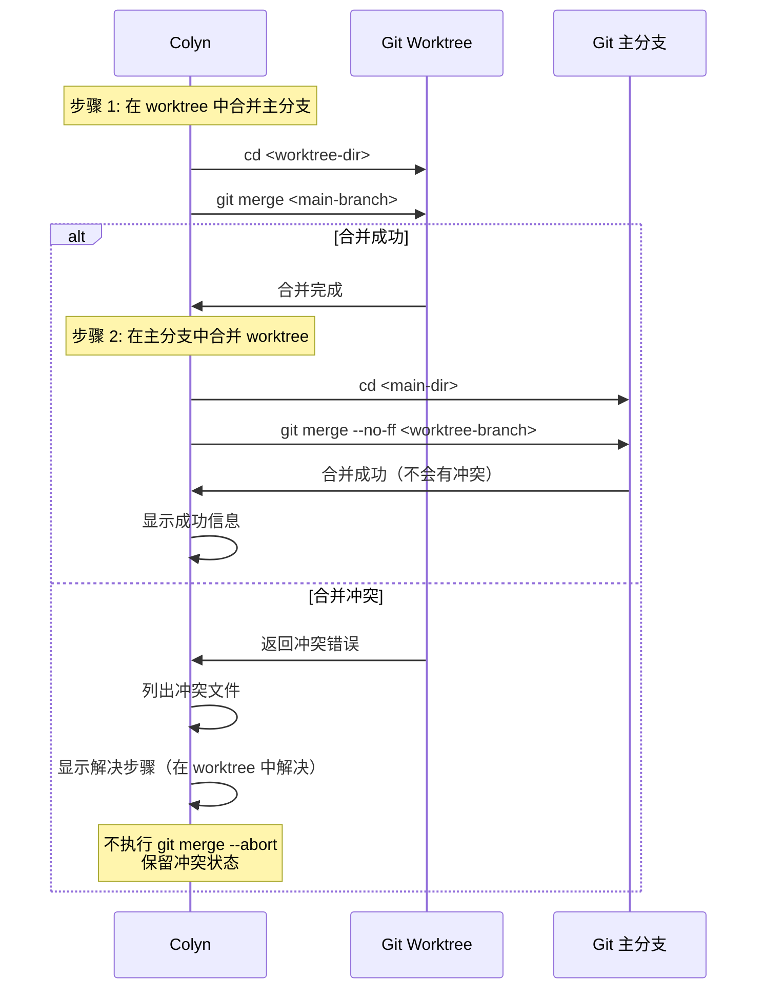
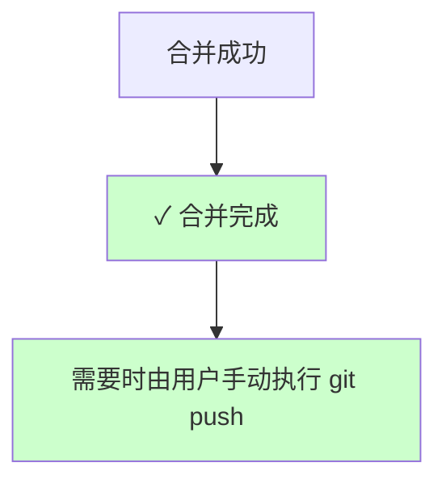

# Merge 命令设计文档（用户交互视角）

**创建时间**：2026-01-15
**最后更新**：2026-02-23（更新：移除 merge 命令中的远程推送环节）
**命令名称**：`colyn merge`
**状态**：✅ 已实现

---

## 1. 需求概述

### 1.1 背景

用户在 worktree 中完成功能开发后，需要将代码合并回主分支。传统流程需要：
1. 手动切换到主分支目录
2. 执行 git merge 命令
3. 处理可能的冲突
4. 手动清理 worktree

这个过程繁琐且容易出错。

### 1.2 用户目标

提供一条简单的命令，自动完成 worktree 合并的所有步骤，让用户专注于开发而非 git 操作。

### 1.3 核心价值

- ✅ **简化操作**：一条命令完成合并流程
- ✅ **智能识别**：支持 ID、分支名、自动识别
- ✅ **安全检查**：避免错误操作
- ✅ **代码质量检查**：合并前自动运行 lint 和编译检查，确保代码质量
- ✅ **线性历史**：默认使用 rebase 产生线性提交历史
- ✅ **清晰历史**：使用 --no-ff 保持清晰的分支历史
- ✅ **远端解耦**：合并命令只处理本地合并，不触发推送
- ✅ **保留 worktree**：合并后保留，由用户决定是否删除

---

## 2. 用户使用场景

### 2.1 场景 1：基本合并流程

**用户情况**：完成 `feature/login` 功能开发，想要合并回主分支



**用户看到**：
```bash
$ colyn merge feature/login

检测到 worktree:
  ID: 1
  分支: feature/login
  路径: /path/to/worktrees/task-1

✓ 前置检查通过
✓ 主分支工作目录干净
✓ Worktree 工作目录干净
✔ Lint 检查通过
✔ 编译成功

步骤 1/2: 在 worktree 中更新主分支代码
  目录: /path/to/worktrees/task-1
  执行: git rebase main
✔ 主分支已变基到 worktree

步骤 2/2: 在主分支中合并 worktree 分支
  目录: /path/to/my-project
  执行: git merge --no-ff feature/login
✔ worktree 已合并到主分支
✓ 合并完成！

合并信息：
  主分支: main
  合并分支: feature/login
  提交: a1b2c3d Merge branch 'feature/login'

后续操作：
  1. 查看合并后的代码：
     cd my-project

  2. 如需继续使用 worktree：
     cd worktrees/task-1

  3. 如需删除 worktree：
     colyn remove 1  (待实现)
```

---

### 2.2 场景 2：在 worktree 目录中合并

**用户情况**：当前在 worktree 目录中，想快速合并

```bash
$ cd worktrees/task-1
$ colyn merge

# 自动识别当前 worktree（读取 .env.local）
检测到 worktree:
  ID: 1
  分支: feature/login
  ...

# 后续流程同场景 1
```

**系统行为**：
1. 读取当前目录的 `.env.local` 文件
2. 从 `WORKTREE` 变量获取 ID
3. 查找对应的 worktree 信息
4. 执行合并流程

---

### 2.3 场景 3：快速合并（仅本地）

**用户情况**：希望快速完成本地合并，远端推送稍后手动执行

```bash
$ colyn merge feature/login

# 命令只执行本地合并，不会触发 git push
✓ 合并完成！
```

---

### 2.4 场景 4：处理合并冲突

**用户情况**：主分支和 worktree 修改了相同文件



**用户看到**：
```bash
$ colyn merge feature/login

✗ 变基主分支时发生冲突

冲突文件：
  src/app.ts
  src/config.ts

解决步骤：
  1. 进入 worktree 目录解决冲突：
     cd worktrees/task-1
  2. 编辑冲突文件，解决冲突标记
  3. 添加已解决的文件：
     git add <file>
  4. 继续变基：
     git rebase --continue
  5. 如需放弃变基：
     git rebase --abort
  5. 重新运行合并命令：
     colyn merge feature/login
```

**优势**：冲突在 worktree 目录中解决，用户可以在开发环境中处理，不影响主分支。

---

### 2.5 场景 5：使用 merge 策略

**用户情况**：不想使用 rebase，想保留完整的分支历史

```bash
$ colyn merge feature/login --no-rebase

步骤 1/2: 在 worktree 中更新主分支代码
  目录: /path/to/worktrees/task-1
  执行: git merge main
✔ 主分支已合并到 worktree

# 后续流程同场景 1
```

---

## 3. 功能需求

### 3.1 参数识别

支持三种调用方式：



**示例**：
| 命令 | 识别方式 | 说明 |
|------|---------|------|
| `colyn merge 1` | 按 ID | 查找 ID 为 1 的 worktree |
| `colyn merge feature/login` | 按分支名 | 查找分支为 feature/login 的 worktree |
| `colyn merge`（在 worktree 中） | 自动识别 | 读取 .env.local 中的 WORKTREE 值 |

---

### 3.2 前置检查



**检查项**：

| 检查项 | 检查内容 | 失败提示 |
|--------|----------|----------|
| 是否已初始化 | 检查 `.colyn` 目录 | 请先运行 `colyn init` |
| Worktree 是否存在 | 通过 discovery 模块查找 | ID 或分支名不存在，运行 `colyn list` 查看 |
| 主分支目录状态 | `git status` 是否干净 | 请先提交或 stash 主分支的更改 |
| Worktree 目录状态 | `git status` 是否干净 | 请先提交 worktree 的更改 |
| Lint 检查（插件驱动） | 根据 `.colyn/settings.json` 中配置的工具链插件运行 lint；使用 `--skip-build` 可跳过 | 请先修复 lint 错误后再合并（使用 `-v` 查看完整输出） |
| 编译检查（插件驱动） | 根据配置的工具链插件运行 build；使用 `--skip-build` 可跳过 | 请先修复编译错误后再合并（使用 `-v` 查看完整输出） |

---

### 3.3 合并执行

采用两步合并策略，确保冲突在 worktree 中解决：



**步骤 1：在 worktree 中合并主分支**（允许 fast-forward）
```bash
cd <worktree-dir>
git merge <main-branch>
```

**步骤 2：在主分支中合并 worktree 分支**（使用 --no-ff）
```bash
cd <main-dir>
git merge --no-ff <worktree-branch> -m "Merge branch '<worktree-branch>'"
```

**为什么采用两步合并**：
- 如果有冲突，冲突发生在 worktree 目录中，用户可以在开发环境中解决
- 解决冲突后重新运行 `colyn merge` 即可完成合并
- 避免在主分支中处理冲突，保持主分支的稳定性

**为什么使用 `--no-ff`**：
- 强制创建合并提交，即使可以 fast-forward
- 保持清晰的分支历史
- 便于追踪功能的完整开发周期

---

### 3.4 远端推送策略



**设计规则**：

| 规则 | 行为 |
|------|------|
| `colyn merge` | 仅执行本地合并 |
| 远程推送 | 由用户在主分支目录手动执行 `git push` |

---

### 3.5 Worktree 保留

合并成功后**不删除** worktree：

**原因**：
- ✅ 用户可能需要继续在该分支上工作
- ✅ 用户可能需要参考 worktree 中的文件
- ✅ 删除是不可逆操作，由用户决定更安全
- ✅ 删除功能留给单独的 `colyn remove` 命令

**用户后续选择**：
1. 继续使用 worktree 开发
2. 稍后运行 `colyn remove <id>` 删除
3. 保留 worktree 供参考

---

## 4. 输入与输出

### 4.1 用户输入

| 输入内容 | 必填 | 说明 | 验证规则 |
|---------|------|------|---------|
| ID 或分支名 | 否 | 指定要合并的 worktree<br/>无参数时自动识别 | - 数字视为 ID<br/>- 包含 `/` 视为分支名 |
| `--no-rebase` | 否 | 使用 merge 而非 rebase 更新 worktree | 默认使用 rebase |
| `--no-update` | 否 | 合并后不自动更新当前 worktree | 默认会更新 |
| `--update-all` | 否 | 合并后更新所有 worktrees | 与 `--no-update` 互斥 |
| `--no-fetch` | 否 | 跳过从远程拉取主分支最新代码 | 离线工作或无上游时使用 |
| `--skip-build` | 否 | 跳过 lint 和 build 检查 | 紧急合并或确认代码已检查时使用 |
| `--verbose` / `-v` | 否 | lint/build 失败时显示完整命令输出 | 调试 lint/build 错误时使用 |

### 4.2 系统输出

**进度信息**：
```
检测到 worktree: ...
✓ 前置检查通过
✓ 主分支工作目录干净
✓ Worktree 工作目录干净
✔ Lint 检查通过
✔ 编译成功
切换到主分支目录: ...
执行合并: git merge --no-ff ...
✓ 合并成功！
```

**成功信息**：
```
✓ 合并成功！

后续操作：
  1. 查看合并后的代码：cd my-project
  2. 如需继续使用 worktree：cd worktrees/task-1
  3. 如需删除 worktree：colyn remove 1
```

---

## 5. 错误处理

### 5.1 常见错误

| 错误场景 | 用户看到 | 如何解决 |
|---------|---------|---------|
| **未初始化** | ✗ 当前目录未初始化<br/>提示：请先运行 colyn init | 运行 `colyn init` |
| **Worktree 不存在** | ✗ 找不到 worktree<br/>ID "1" 或分支 "feature/login" 不存在<br/>查看已有 worktree: colyn list | 检查 ID 或分支名是否正确<br/>运行 `colyn list` 查看 |
| **主分支不干净** | ✗ 主分支目录有未提交的更改<br/>主分支目录: /path/to/my-project<br/>查看状态: cd my-project && git status | 提交或 stash 主分支的更改 |
| **Worktree 不干净** | ✗ Worktree 目录有未提交的更改<br/>Worktree 目录: /path/to/worktrees/task-1<br/>查看状态: cd worktrees/task-1 && git status | 提交 worktree 的更改 |
| **Lint 检查失败** | ✗ Lint 检查失败<br/>错误: ... | 修复 lint 错误后重试<br/>cd worktrees/task-1 && yarn lint |
| **编译失败** | ✗ 编译失败<br/>错误: ... | 修复编译错误后重试<br/>cd worktrees/task-1 && yarn build |
| **合并冲突** | ✗ 合并时发生冲突<br/>冲突文件: ...<br/>解决步骤: ... | 手动解决冲突<br/>不会自动回滚 |

---

## 6. 非功能需求

### 6.1 性能要求

- 前置检查应在 1 秒内完成
- 合并操作的性能取决于 git

### 6.2 可用性要求

- 错误信息清晰明确，包含解决建议
- 支持在任意目录调用
- 支持在 worktree 目录内自动识别

### 6.3 兼容性要求

- 支持 macOS、Linux、Windows
- 兼容 git 2.5+（worktree 功能最低版本）

---

## 7. 验收标准

### 7.1 基本功能

- [ ] 支持通过 ID 指定 worktree 进行合并
- [ ] 支持通过分支名指定 worktree 进行合并
- [ ] 支持在 worktree 目录无参数调用（自动识别）
- [ ] 使用 `git merge --no-ff` 执行合并
- [ ] 合并后保留 worktree（不删除）

### 7.2 前置检查

- [ ] 检查是否已初始化，失败时给出清晰提示
- [ ] 检查 worktree 是否存在，失败时给出清晰提示
- [ ] 检查主分支工作目录状态，不干净时拒绝合并
- [ ] 检查 worktree 工作目录状态，不干净时拒绝合并
- [x] 运行 lint 检查，失败时拒绝合并并显示错误详情
- [x] 运行编译检查，失败时拒绝合并并显示错误详情

### 7.3 远端推送职责

- [x] `colyn merge` 不执行 `git push`
- [x] 不提供 `--push` / `--no-push` 参数
- [x] 合并成功后提示用户可按需手动推送

### 7.4 冲突处理

- [ ] 检测到冲突时停止并显示冲突文件列表
- [ ] 给出详细的冲突解决步骤
- [ ] 不自动回滚合并（保留冲突状态）

### 7.5 用户体验

- [ ] 显示清晰的进度信息（使用 spinner）
- [ ] 成功时显示合并信息和后续操作建议
- [ ] 错误信息包含具体的解决建议
- [ ] 支持彩色输出（成功、错误、提示）

---

## 8. 范围外

以下功能不在本次需求范围内：

- ❌ 自动删除 worktree（保留给 `remove` 命令）
- ❌ 自动解决合并冲突
- ❌ 支持其他合并策略（只使用 `--no-ff`）
- ❌ 合并前自动更新主分支
- ❌ 合并后自动删除远程分支
- ❌ 合并回滚功能（冲突时由用户手动处理）
- ❌ 批量合并多个 worktree

---

## 9. 常见问题

### Q1: 为什么合并后不自动删除 worktree？

A: 删除是不可逆操作。用户可能还需要：
- 继续在该分支上工作
- 参考 worktree 中的文件
- 自行决定删除时机

删除功能由单独的 `colyn remove` 命令提供。

### Q2: 为什么使用 `--no-ff` 合并？

A: 保持清晰的分支历史。即使可以 fast-forward，也会创建合并提交，便于：
- 追踪功能的完整开发周期
- 理解分支的用途
- 回滚整个功能

### Q3: 如果忘记提交 worktree 的更改怎么办？

A: 系统会检测并拒绝合并，提示：
```
✗ Worktree 目录有未提交的更改
  请先提交 worktree 的更改
```

### Q4: 合并冲突后如何继续？

A: 系统会保留冲突状态，用户需要：
1. 进入发生冲突的 worktree 目录
2. 手动解决冲突文件
3. `git add <file>`
4. 若使用默认 rebase：执行 `git rebase --continue`
5. 若需要放弃：执行 `git rebase --abort`
6. 回到 Colyn 流程，重新运行 `colyn merge`

### Q5: merge 会自动推送到远程吗？

A: 不会。`colyn merge` 只负责本地合并流程。需要推送时，请在主分支目录手动执行：
```bash
git push origin <main-branch>
```

---

## 10. 后续工作

相关命令（待实现）：

1. **`colyn remove <id|branch>`** - 删除 worktree
2. **`colyn checkout <id> <branch>`** - 在 worktree 中切换分支
3. **`colyn list`** - 列出所有 worktree
4. **`colyn status <id>`** - 查看 worktree 状态

---

## 11. 总结

`colyn merge` 命令核心价值：

✅ **简化操作**：一条命令完成合并
✅ **智能识别**：支持三种识别方式
✅ **安全检查**：避免错误操作
✅ **代码质量**：合并前自动运行 lint 和编译检查
✅ **清晰历史**：使用 --no-ff 保持分支历史
✅ **远端解耦**：合并流程不包含远程推送
✅ **保留 worktree**：由用户决定删除时机
✅ **友好提示**：清晰的错误信息和解决建议

通过本命令，用户可以专注于开发，而不是繁琐的 git 操作。
