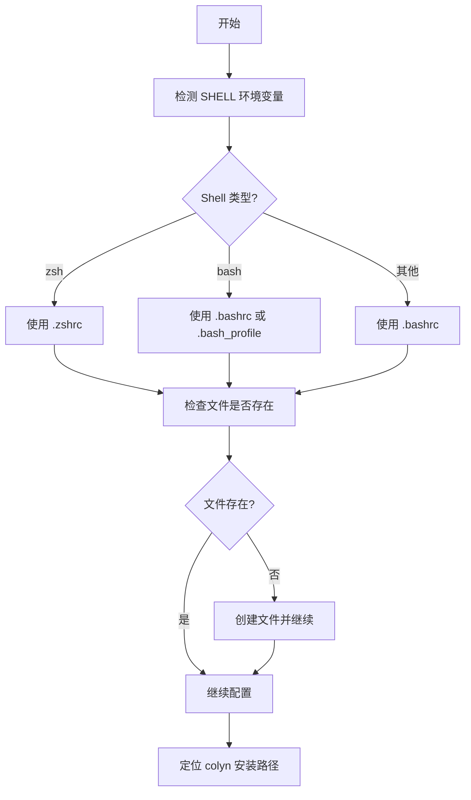
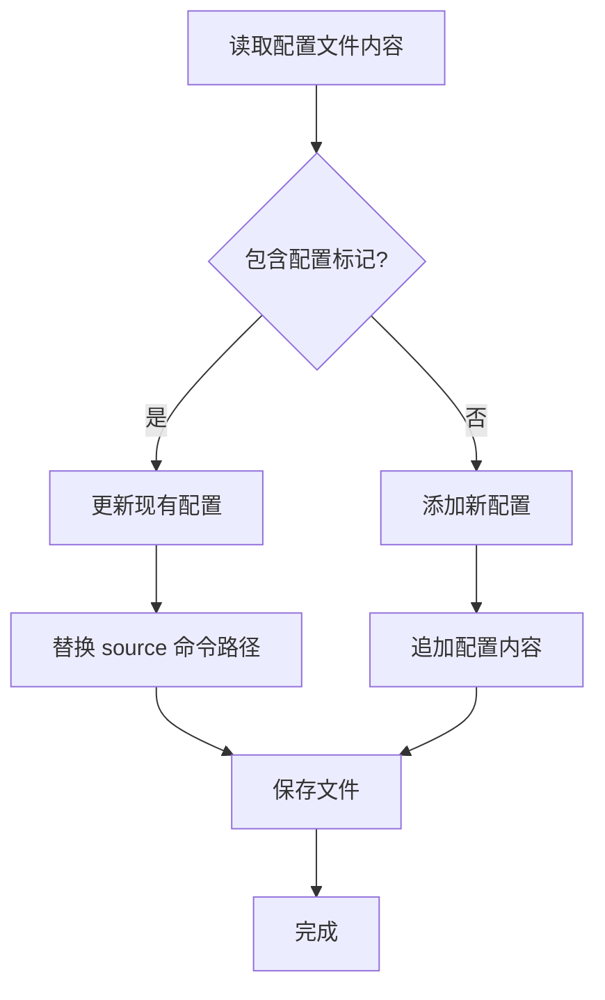

# System Integration 命令设计文档

**创建时间**：2026-01-24
**最后更新**：2026-01-24
**命令名称**：`colyn setup`
**状态**：✅ 已实现（含补全脚本支持）

---

## 1. 需求概述

### 1.1 背景

用户通过 `npm install -g colyn` 全局安装后，colyn 命令虽然可用，但缺少以下功能：
- Shell 函数封装（支持 `cd` 目录切换）
- 命令自动完成（Tab 键补全）

需要用户手动配置 shell 才能使用完整功能，过程繁琐。

### 1.2 用户目标

提供一条简单的命令，自动完成 shell 集成和补全脚本配置，让用户快速开始使用 colyn 的完整功能。

### 1.3 核心价值

- ✅ **一键配置**：无需手动编辑 shell 配置文件
- ✅ **智能检测**：自动检测 shell 类型和配置文件
- ✅ **补全支持**：自动配置对应的补全脚本（bash/zsh）
- ✅ **安全更新**：不会重复添加配置，支持更新已有配置
- ✅ **清晰提示**：告知用户配置结果和后续操作

---

## 2. 用户使用场景

### 2.1 场景 1：首次安装配置

**用户情况**：刚通过 npm 全局安装 colyn

```bash
# 安装 colyn
$ npm install -g colyn

# 配置 shell 集成
$ colyn setup

检测系统环境...
✓ Shell 类型: zsh
✓ 配置文件: /Users/username/.zshrc
✓ Colyn 安装路径: /Users/username/.volta/tools/image/packages/colyn/lib/node_modules/colyn

配置 shell 集成...
✓ 已添加 shell 集成到 ~/.zshrc
✓ 已添加补全脚本到 ~/.zshrc

✓ 安装完成！

生效配置：
  方式 1（推荐）：重新打开终端
  方式 2：运行命令：source ~/.zshrc

功能说明：
  ✓ colyn 命令支持自动目录切换
  ✓ 使用 Tab 键可自动完成命令和参数
```

### 2.2 场景 2：更新已有配置

**用户情况**：之前已经配置过，colyn 升级后需要更新配置

```bash
$ colyn setup

检测系统环境...
✓ Shell 类型: zsh
✓ 配置文件: /Users/username/.zshrc
✓ Colyn 安装路径: /Users/username/.volta/tools/image/packages/colyn/lib/node_modules/colyn

配置 shell 集成...
✓ 已更新 ~/.zshrc 中的 shell 集成配置
✓ 已更新补全脚本配置

✓ 更新完成！

生效配置：
  运行命令：source ~/.zshrc
```

### 2.3 场景 3：检测到配置文件不存在

**用户情况**：首次使用 shell，配置文件还不存在

```bash
$ colyn setup

检测系统环境...
✓ Shell 类型: bash
⚠ 配置文件不存在: /Users/username/.bashrc

配置 shell 集成...
✓ 已创建 ~/.bashrc
✓ 已添加 shell 集成到 ~/.bashrc

✓ 安装完成！

生效配置：
  运行命令：source ~/.bashrc
```

---

## 3. 功能需求

### 3.1 环境检测



**检测逻辑**：

1. **Shell 类型检测**：
   - 读取 `process.env.SHELL`
   - 如果包含 `zsh` → `.zshrc`
   - 如果包含 `bash` → `.bashrc` 或 `.bash_profile`（按优先级检测）
   - 默认 → `.bashrc`

2. **配置文件检测**：
   - 按优先级检测多个候选文件
   - 使用第一个存在的文件
   - 如果都不存在，创建默认文件

3. **Colyn 路径检测**：
   - 通过 `__dirname` 或 `import.meta.url` 获取当前模块路径
   - 定位到 `shell/colyn.sh` 文件

### 3.2 配置更新逻辑



**配置标记**：`# Colyn shell integration`

**配置内容**：
```bash
# Colyn shell integration
source "/path/to/colyn/shell/colyn.sh"
```

**更新策略**：
- 如果包含标记：更新 `source` 行的路径
- 如果不包含标记：追加新配置到文件末尾
- 保持其他内容不变

### 3.3 输出信息

分为三个阶段：

1. **检测阶段**：
   ```
   检测系统环境...
   ✓ Shell 类型: zsh
   ✓ 配置文件: ~/.zshrc
   ✓ Colyn 安装路径: /path/to/colyn
   ```

2. **配置阶段**：
   ```
   配置 shell 集成...
   ✓ 已添加 shell 集成到 ~/.zshrc
   ```

3. **完成阶段**：
   ```
   ✓ 安装完成！

   生效配置：
     运行命令：source ~/.zshrc

   功能说明：
     ✓ colyn 命令支持自动目录切换
     ✓ 使用 Tab 键可自动完成命令和参数
   ```

---

## 4. 输入与输出

### 4.1 用户输入

| 输入内容 | 必填 | 说明 |
|---------|------|------|
| 无参数 | - | 命令不接受任何参数和选项 |

### 4.2 系统输出

**标准输出（stderr）**：
- 检测信息
- 配置进度
- 成功/错误提示
- 后续操作指引

**JSON 输出（stdout）**：
```json
{
  "success": true
}
```

---

## 5. 错误处理

### 5.1 常见错误

| 错误场景 | 用户看到 | 如何解决 |
|---------|---------|---------|
| **找不到 colyn.sh** | ✗ 找不到 shell 集成脚本<br/>路径: /path/to/shell/colyn.sh | 检查 colyn 安装是否完整<br/>重新安装：npm install -g colyn |
| **无法写入配置文件** | ✗ 无法写入配置文件<br/>文件: ~/.zshrc<br/>错误: Permission denied | 检查文件权限<br/>或手动添加配置 |
| **Windows 平台** | ⚠ Windows 平台暂不支持自动配置<br/>请参考文档手动配置 | 查看 README.md 中的 Windows 配置说明 |

---

## 6. 非功能需求

### 6.1 性能要求

- 配置过程应在 1 秒内完成
- 不应修改配置文件的原有格式（保持换行符、缩进）

### 6.2 兼容性要求

- 支持 macOS、Linux
- 支持 bash、zsh
- Windows 平台给出提示，暂不支持自动配置

### 6.3 安全性要求

- 不覆盖用户配置文件的其他内容
- 更新时只修改 colyn 相关的配置
- 备份机制（可选）：配置前创建 `.bak` 备份

---

## 7. 验收标准

### 7.1 基本功能

- [x] 检测用户的 shell 类型（bash/zsh）
- [x] 检测 shell 配置文件路径
- [x] 定位 colyn.sh 文件路径
- [x] 首次配置：添加 source 命令到配置文件
- [x] 更新配置：替换现有的 source 命令路径
- [x] 配置文件不存在时自动创建

### 7.2 输出信息

- [x] 显示检测到的环境信息
- [x] 显示配置进度（使用 ✓/✗ 图标）
- [x] 成功时给出生效配置的指引
- [x] 错误时给出清晰的错误信息和解决建议

### 7.3 错误处理

- [x] 找不到 colyn.sh 时给出错误提示
- [x] 无法写入配置文件时给出错误提示
- [x] Windows 平台给出暂不支持的提示

---

## 8. 范围外

以下功能不在本次需求范围内：

- ❌ Windows 平台的自动配置
- ❌ Fish shell 的支持
- ❌ 卸载功能（从配置文件中移除配置）
- ❌ 自定义配置文件路径
- ❌ 交互式选择配置文件

---

## 9. 常见问题

### Q1: 为什么不支持 Windows？

A: Windows 的 shell 环境（PowerShell/CMD）与 Unix shell 差异较大，需要单独设计配置方案。当前版本先支持 macOS 和 Linux。

### Q2: 如果我有多个 shell 配置文件怎么办？

A: 命令会按优先级选择第一个存在的配置文件。如果你使用多个 shell，可以多次运行 `colyn install`，或手动添加配置到其他文件。

### Q3: 配置会不会破坏我现有的 shell 配置？

A: 不会。命令只会：
- 添加 colyn 相关的配置（如果不存在）
- 更新 colyn 配置的路径（如果已存在）
- 不会修改其他任何配置

### Q4: 如何卸载配置？

A: 当前版本不提供自动卸载。你可以手动编辑配置文件，删除包含 `# Colyn shell integration` 标记的行。

### Q5: 配置后为什么还不能用？

A: 需要重新加载配置文件。可以：
1. 重新打开终端（推荐）
2. 运行 `source ~/.zshrc`（或对应的配置文件）

---

## 10. 实现细节

### 10.1 文件结构

```
src/commands/
  install.ts              # install 命令主文件
  install.helpers.ts      # 辅助函数
```

### 10.2 核心函数

```typescript
// 检测 shell 配置文件
async function detectShellConfig(): Promise<string>

// 定位 colyn.sh 路径
function getColynShellPath(): string

// 添加/更新配置
async function updateShellConfig(
  configPath: string,
  colynShellPath: string
): Promise<'added' | 'updated'>
```

---

## 11. 总结

`colyn install` 命令核心价值：

✅ **一键配置**：自动完成 shell 集成
✅ **智能检测**：自动识别 shell 类型和配置文件
✅ **安全更新**：支持更新配置，不影响其他内容
✅ **清晰提示**：给出明确的后续操作指引

通过本命令，用户可以快速开始使用 colyn 的完整功能，无需手动配置。
