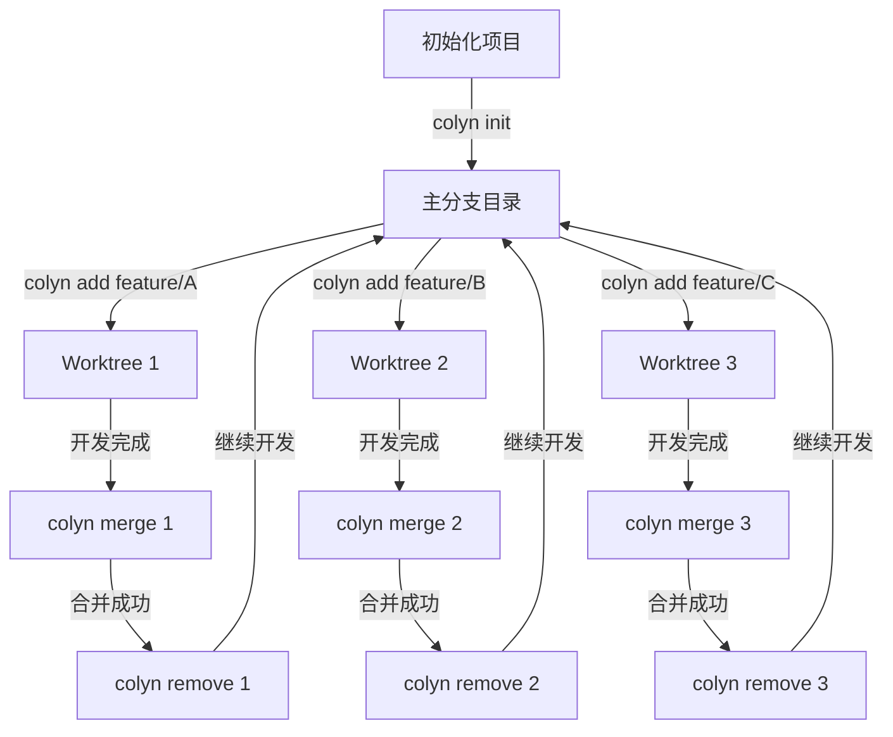

# 核心概念

本章将帮助你深入理解 Colyn 的工作原理和核心概念。

---

## Git Worktree 简介

### 什么是 Git Worktree？

Git Worktree 是 Git 2.5+ 引入的功能，允许你从同一个 Git 仓库同时检出多个分支到不同的目录。

**传统方式的问题**：

```bash
# 传统方式：需要频繁切换分支
git checkout feature/login
# 修改代码...
git stash  # 保存当前工作

git checkout feature/dashboard
# 修改代码...
git stash  # 又要保存

git checkout feature/login
git stash pop  # 恢复工作
```

**使用 Worktree 的优势**：

```bash
# 使用 worktree：并行开发
cd ~/project/login-branch
# 在这里开发登录功能

cd ~/project/dashboard-branch
# 在这里开发仪表板功能

# 无需切换，保持所有上下文
```

### 原生 Git Worktree 命令

```bash
# 创建 worktree
git worktree add ../feature-branch feature/login

# 列出 worktree
git worktree list

# 删除 worktree
git worktree remove ../feature-branch
```

### Colyn 的价值

Colyn 在原生 Git Worktree 基础上提供：

1. **更简单的命令**: `colyn add feature/login` vs `git worktree add ...`
2. **自动端口管理**: 避免开发服务器端口冲突
3. **自动目录切换**: 命令执行后自动进入目标目录
4. **智能分支处理**: 自动识别本地/远程分支
5. **项目结构管理**: 统一的目录组织
6. **tmux 集成**: 高效的多 worktree 切换

---

## Colyn 项目结构

### 标准目录布局

Colyn 采用以下目录结构：

```
my-project/                    # 项目根目录
├── .colyn/                    # Colyn 标识目录（空目录）
├── my-project/                # 主分支目录
│   ├── .git/                  # Git 仓库（真正的 .git）
│   │   └── worktrees/         # Git worktree 元数据
│   ├── src/
│   ├── .env.local             # PORT=3000, WORKTREE=main
│   └── ...
└── worktrees/                 # Worktrees 目录
    ├── task-1/                # Worktree 1 (PORT=3001)
    │   ├── .git -> ...        # 指向主仓库的符号链接
    │   ├── src/
    │   ├── .env.local
    │   └── ...
    ├── task-2/                # Worktree 2 (PORT=3002)
    └── task-3/                # Worktree 3 (PORT=3003)
```

### 关键目录说明

#### 1. 项目根目录

```
my-project/                    # 根目录名 = 项目名
```

- 包含所有内容的最外层目录
- 目录名即为**项目名**（Project Name）
- 在 tmux 集成中，项目名也是 **Session 名称**

#### 2. .colyn/ 目录

```
.colyn/                        # Colyn 项目标识
```

- 标识这是一个 Colyn 管理的项目
- 通常是空目录
- 用于命令自动定位项目根目录

#### 3. 主分支目录

```
my-project/my-project/         # 主分支目录
```

- 包含真正的 `.git/` 仓库
- 存放主分支（main/master）的代码
- 其他 worktree 都连接到这里的 Git 仓库

#### 4. worktrees/ 目录

```
worktrees/                     # Worktrees 容器目录
└── task-{id}/                 # 按 ID 命名的 worktree
```

- 存放所有 worktree 子目录
- 子目录命名规则：`task-{id}`
- ID 从 1 开始递增

---

## Worktree ID 系统

### ID 分配规则

Colyn 为每个 worktree 分配唯一的数字 ID：

| Worktree | ID | 目录名 | 端口 |
|----------|-------|--------|------|
| 主分支 | 0 | `{project-name}/` | Base Port |
| 第一个 worktree | 1 | `worktrees/task-1/` | Base Port + 1 |
| 第二个 worktree | 2 | `worktrees/task-2/` | Base Port + 2 |
| 第三个 worktree | 3 | `worktrees/task-3/` | Base Port + 3 |

### ID 的用途

1. **目录命名**: `task-{id}`
2. **端口分配**: `base_port + id`
3. **环境变量**: `WORKTREE={id}`
4. **命令参数**: `colyn merge 1`
5. **tmux Window Index**: window index = worktree id

### ID 显示格式

在 `colyn list` 输出中：

```
┌────────┬─────────────┐
│ ID     │ 分支        │
├────────┼─────────────┤
│ 0-main │ main        │  ← 主分支显示为 "0-main"
│ 1      │ feature/a   │  ← 其他 worktree 只显示数字
│ 2      │ feature/b   │
└────────┴─────────────┘
```

---

## 端口管理

### 自动端口分配

Colyn 自动为每个 worktree 分配独立的端口，避免开发服务器冲突。

### Base Port（基础端口）

**定义**: 主分支使用的端口，也是计算其他端口的基础。

**配置方式**:
```bash
colyn init -p 3000  # 设置 base port 为 3000
```

**存储位置**: 主分支的 `.env.local` 文件
```
PORT=3000
WORKTREE=main
```

### 端口计算规则

```
worktree_port = base_port + worktree_id
```

**示例**：

| Worktree | ID | 计算 | 端口 |
|----------|----|------|------|
| main | 0 | 3000 + 0 | 3000 |
| task-1 | 1 | 3000 + 1 | 3001 |
| task-2 | 2 | 3000 + 2 | 3002 |
| task-3 | 3 | 3000 + 3 | 3003 |

### 环境变量文件

每个 worktree 都有独立的 `.env.local` 文件：

**主分支 `.env.local`**:
```bash
PORT=3000
WORKTREE=main
```

**task-1 `.env.local`**:
```bash
PORT=3001
WORKTREE=1
```

### 使用端口

大多数现代开发框架会自动读取 `PORT` 环境变量：

```javascript
// Next.js、Vite、Create React App 等自动读取
const port = process.env.PORT || 3000;
```

手动使用：

```bash
# 启动开发服务器
cd worktrees/task-1
npm run dev  # 自动使用 PORT=3001
```

---

## 分支处理

### 智能分支识别

Colyn 自动识别三种分支类型：

#### 1. 本地分支

```bash
# 如果本地已存在分支
git branch
# * main
#   feature/login

colyn add feature/login
# ✓ 使用现有本地分支 feature/login
```

#### 2. 远程分支

```bash
# 如果只在远程存在
git branch -r
# origin/main
# origin/feature/dashboard

colyn add feature/dashboard
# ✓ 从远程分支 origin/feature/dashboard 创建
```

#### 3. 新建分支

```bash
# 如果本地和远程都不存在
colyn add feature/new-feature
# ✓ 创建新分支 feature/new-feature（基于当前主分支）
```

### 分支命名建议

推荐使用描述性的分支命名：

```bash
# 功能开发
feature/user-authentication
feature/dark-mode
feature/dashboard

# Bug 修复
bugfix/login-error
bugfix/memory-leak

# 性能优化
perf/database-query
perf/image-loading

# 文档
docs/api-reference
docs/user-guide
```

---

## 配置管理

### 最小配置原则

Colyn 遵循"最小配置原则"：

> **能够自动推断的配置，就不在配置文件中存储**

### 无需配置文件

Colyn **不需要** `config.json` 配置文件。所有信息都从文件系统动态获取：

| 信息 | 推断来源 | 方法 |
|------|---------|------|
| 项目名 | 根目录名 | `path.basename(projectRoot)` |
| 主分支名 | Git 仓库 | `git branch --show-current` |
| Base Port | .env.local | 读取 PORT 变量 |
| Worktree 列表 | 文件系统 + Git | `git worktree list` + 目录扫描 |
| 下一个 ID | worktrees/ 目录 | 扫描现有 task-* 计算最大 ID + 1 |

### 数据持久化

**环境变量** (`.env.local`):
```bash
# 每个 worktree 目录中
PORT=3001
WORKTREE=1
```

**Git 元数据** (`.git/worktrees/`):
```bash
# Git 自动维护
.git/
└── worktrees/
    ├── task-1/
    ├── task-2/
    └── task-3/
```

**项目标识** (`.colyn/`):
```bash
# 空目录，仅用于标识
.colyn/
```

### 优势

1. **单一数据源**: 避免数据不一致
2. **无需同步**: 不会出现配置文件过期
3. **兼容手动操作**: 即使手动使用 `git worktree` 也不会破坏状态
4. **零配置**: 用户无需维护配置文件

---

## 双层架构

### 为什么需要双层架构？

**技术限制**: 子进程无法修改父进程的工作目录

```javascript
// 这个在 Node.js 中不起作用
process.chdir('/new/path');  // 只改变 Node.js 进程的目录
// 父 shell 的目录不会改变
```

### 架构设计

```
┌──────────────────────────────────────────┐
│  Shell 层 (shell/colyn.sh)              │
│  - 捕获 stdout                           │
│  - 解析 JSON                             │
│  - 执行 cd 命令                          │
└──────────────────────────────────────────┘
                  ↑
                  │ stdout: JSON
                  │ stderr: 用户信息
                  ↓
┌──────────────────────────────────────────┐
│  Node.js 层 (dist/index.js)              │
│  - 业务逻辑                              │
│  - Git 操作                              │
│  - 文件操作                              │
│  - 输出结果到 stdout                     │
│  - 输出提示到 stderr                     │
└──────────────────────────────────────────┘
```

### 输出流分离

**stderr**: 给用户看的信息（彩色输出）
```bash
✓ Worktree created successfully
✓ Port assigned: 3001
📂 Path: /path/to/worktrees/task-1
```

**stdout**: 给 shell 脚本解析的 JSON
```json
{
  "action": "cd",
  "path": "/path/to/worktrees/task-1"
}
```

### Shell 函数包装

```bash
# shell/colyn.sh
function colyn() {
  local result
  result=$("$COLYN_BIN" "$@")  # 捕获 stdout

  # 解析 JSON，提取目标路径
  local target_path
  target_path=$(echo "$result" | jq -r '.path // empty')

  # 执行目录切换
  if [ -n "$target_path" ]; then
    cd "$target_path" || return
  fi
}
```

### 用户视角

```bash
# 用户执行
colyn add feature/login

# 看到的输出（stderr）
✓ Creating worktree for branch: feature/login
✓ Assigned ID: 1
✓ Port: 3001
✓ Created at: worktrees/task-1
📂 已切换到: /path/to/worktrees/task-1

# 实际发生了什么
# 1. Node.js 创建 worktree
# 2. Node.js 输出 JSON 到 stdout
# 3. Shell 函数解析 JSON
# 4. Shell 函数执行 cd 命令
# 5. 用户自动进入新目录
```

---

## 工作流程

### 典型的开发流程



### 并行开发模式

```
时间线：
├── 主分支 (main)
│   ├── 提交 A
│   ├── 提交 B
│   └── 提交 C
│
├── Worktree 1 (feature/login)
│   ├── 开发登录功能...
│   └── 合并回 main →
│
├── Worktree 2 (feature/dashboard)
│   ├── 开发仪表板...
│   └── 合并回 main →
│
└── Worktree 3 (bugfix/memory-leak)
    ├── 修复内存泄漏...
    └── 合并回 main →
```

---

## 与 tmux 的集成

### 映射关系

```
Colyn 概念         tmux 概念
─────────────────────────────────
Project Name   →   Session Name
Worktree ID    →   Window Index
Branch Name    →   Window Name (最后一段)
```

### 布局结构

```
Session: my-project
├── Window 0: main (主分支)
│   ├── Pane 0: Claude Code (60%)
│   ├── Pane 1: Dev Server (12%)
│   └── Pane 2: Bash (28%)
│
├── Window 1: login (feature/login)
│   ├── Pane 0: Claude Code
│   ├── Pane 1: Dev Server
│   └── Pane 2: Bash
│
└── Window 2: dashboard (feature/dashboard)
    ├── Pane 0: Claude Code
    ├── Pane 1: Dev Server
    └── Pane 2: Bash
```

详细说明请参考 [tmux 集成](06-tmux-integration.md)。

---

## 下一步

现在你已经理解了 Colyn 的核心概念，继续阅读：

- [命令参考](04-command-reference.md) - 学习所有命令的详细用法
- [高级用法](05-advanced-usage.md) - 掌握高级技巧
- [tmux 集成](06-tmux-integration.md) - 了解 tmux 集成功能

